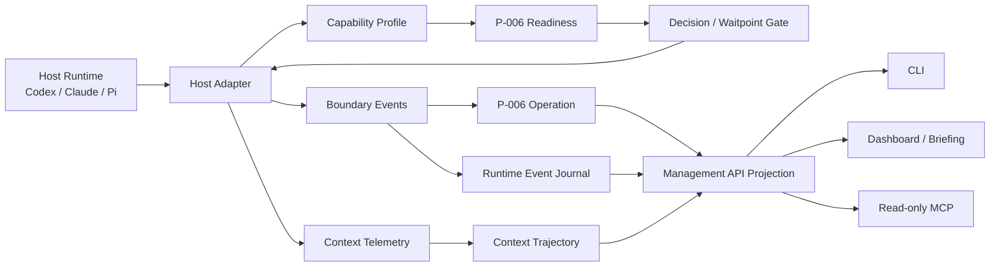

# Agent Runtime Interoperability

> **Project Slug**: `agent-runtime-interoperability`  
> **Status**: `implementation-complete / production-pilot-blocked`  
> **Owner**: `architecture-coordinator`  
> **Created**: `2026-07-28`  
> **Related Projects**: `cortex-agent`, `earendil-works/pi`  
> **Approved Scope**: `M-001 done；M-002 done；M-003～M-012 implemented under D-ARI-ALL-febe5400`  
> **Approved By**: `interactive-user, 2026-07-28, D-ARI-001-2ab9375a`（M-001）；`D-ARI-002-e2f4e5d3`（M-002）；`D-ARI-ALL-febe5400`（P-001～P-004, M-003～M-012 full revision）  
> **Execution Carrier**: `T-ARI-001`

## 1. 目标

在不自建 LLM Provider、Agent Loop、TUI 或完整对话存储的前提下，为 Cortex Agent 建立跨宿主的能力协商、标准边界事件、可观测上下文流水线和参考适配验证，使 Codex、Claude Code、Pi 等执行宿主能以不同能力等级接入同一套治理、证据与决策体系。

核心结果不是“让所有宿主行为完全一样”，而是让 Cortex 能可靠回答：

1. 当前宿主真实支持哪些能力，哪些只能降级。
2. 一次会话、轮次、工具和上下文边界产生了哪些可审计事件。
3. 哪些上下文被发现、选择、渲染和实际消费，成本与效果如何。
4. Decision / Waitpoint 能否在宿主执行边界被真正阻断，而不只是写在 Markdown 中。

## 2. 范围

### In Scope

- 版本化 `HostCapabilityDescriptor` 与能力协商规则。
- session / turn / message / tool / context 的标准边界事件词汇。
- 不同宿主的 capability profile、降级路径与 evidence quality。
- 复用 Workspace P-005 Runtime State Integration 与 Workspace P-006 Operation/Readiness，不建立第二套状态机。
- 将 `context-budget` 演进为 discover → rank → select → transform → render → measure 的可观测流水线。
- Management API focused projection、CLI 查询与 Dashboard 摘要。
- Pi 作为参考宿主的可选适配试点，用于验证事件与 gate 契约。
- Codex / Claude 现有 adapter 的兼容迁移。
- 基于任务需求、宿主实时能力、治理门禁与 lease 的可解释执行面选择。
- 跨 Codex、Claude Code、Cursor、Pi 的标准 context package、handoff 与恢复策略。
- 双语模板、零依赖核心和下游项目升级策略。

### Out of Scope

- 不在 Cortex Agent 内实现模型 Provider SDK。
- 不实现或代理宿主的 LLM/tool agent loop。
- 不建设新的 TUI、聊天 UI 或 IDE。
- 不复制 Pi 的完整 transcript、JSONL session tree 或 compaction engine。
- 不要求所有宿主暴露消息内容、思维过程、私有对话或凭证。
- 不把 Pi 或任何第三方 runtime 变成 Cortex 的必选依赖。
- 不在本提案阶段启用 daemon、自动 dispatch 或未经批准的工具阻断。
- 不新建第二套 Dispatch、Operation、Queue、Lease、Decision 或 Waitpoint 状态机。

## 3. 子提案

| ID | 提案 | 状态 | 说明 |
| :--- | :--- | :--- | :--- |
| P-001 | [Host Capability 与 Runtime Event Contract](./proposals/P-001-host-capability-runtime-event-contract-proposal.md) | implementation complete；M-001～M-006 | 统一能力、事件、降级和投影语义 |
| P-002 | [Observable Context Pipeline](./proposals/P-002-observable-context-pipeline-proposal.md) | implementation complete；M-003/M-006 | 把 context-budget 扩展为可测量的跨宿主上下文链路 |
| P-003 | [Pi Reference Adapter Pilot](./proposals/P-003-pi-reference-adapter-pilot-proposal.md) | contract pilot complete；live extension receipt pending | 用 Pi extension 验证 tool gate、事件和证据映射 |
| P-004 | [Capability-aware Execution Surface Dispatch](./proposals/P-004-capability-aware-execution-surface-dispatch-proposal.md) | manual production pilot complete；automatic dispatch disabled | 按任务需求、实时能力、治理与 lease 选择和交接执行面 |
| P-005 | [Governed Agent Semantic Progress Supervision](./proposals/P-005-governed-agent-semantic-progress-supervision-proposal.md) | draft | 区分 alive/active/productive/verified，接入宿主流、worktree 证据与可纠偏监督 |
| P-006 | [DSH Host Adapter (first-class)](./proposals/P-006-dsh-host-adapter-proposal.md) | in-progress（M-029，MS-001 done） | 把 DeepSeek Harness 从 shadow usage 提升为与 Pi / Claude Code / Codex CLI 同等的 first-class dispatch adapter，补齐 5 方法契约、模板、文档、测试与注册 |

## 4. 关联项目

| 项目 | 路径 / 仓库 | 关系 | 状态 |
| :--- | :--- | :--- | :--- |
| cortex-agent | 当前仓库 | 主设计与实现范围 | active |
| Pi | `https://github.com/earendil-works/pi` | 参考执行宿主和可选试点 | research-verified |
| agent-workspace-orchestration | `../agent-workspace-orchestration/` | 提供 P-005/P-006 状态、Operation 与 Readiness 基线 | dependency |
| agent-coordination-notification | `../agent-coordination-notification/` | 复用现有 Codex/Claude adapter 与 notification delivery | dependency |
| skill-dispatch | `../skill-dispatch/` | 消费 capability precondition 与降级信息 | downstream |

## 5. 架构总览



调用方向必须保持单向：

```text
host adapter -> normalized boundary/event evidence
runtime owner -> state/event writers
Management API -> read-only projections
CLI/Dashboard/MCP -> projection consumers
```

Adapter 不得直接修改 Task、Run、Decision 或 Waitpoint 文件；它只能调用已有 owning service/workflow。

## 6. 关键架构决策

| ID | 决策 | 推荐 | 状态 |
| :--- | :--- | :--- | :--- |
| D-001 | Cortex 是否实现自己的 agent loop | Reject：保持治理控制面 | proposed |
| D-002 | 是否要求所有宿主统一完整事件 | Reject：能力协商 + 分级降级 | proposed |
| D-003 | 是否保存完整宿主 transcript | Reject：只保存脱敏摘要、计量和 evidence refs | proposed |
| D-004 | Pi adapter 放置位置 | 可选 integration/extension，不进入核心 runtime | proposed |
| D-005 | Cortex 如何选择不同执行面 | required capability hard filter + governance/readiness + deterministic scoring | proposed |
| D-006 | Matcher 是否拥有执行权 | Reject：只输出只读 plan，由既有 dispatch/operation owner 执行 | proposed |
| D-007 | 是否自动启用 daemon/跨宿主 fallback | Reject：默认关闭，必须按 frozen revision 单独批准 | proposed |
| D-008 | heartbeat 是否可代表任务正在有效推进 | Reject：必须区分 alive、active、productive、verified | proposed |

实际架构审批记录：`D-ARI-001-2ab9375a` 已批准 M-001；`D-ARI-002-e2f4e5d3` 已批准 M-002；`D-ARI-ALL-febe5400` 已批准 P-001～P-004 与 M-003～M-012 全部实施修订。

## 7. 里程碑

| Milestone | 目标 | 子提案 | 状态 |
| :--- | :--- | :--- | :--- |
| M-001 | 冻结 capability vocabulary、事件 envelope 与降级语义 | P-001 | done；`T-ARI-001` |
| M-002 | Codex/Claude 现有 adapter 迁移并通过兼容测试 | P-001 | done；2026-07-28 |
| M-003 | Context pipeline 轨迹、指标与 projection 闭环 | P-002 | done；2026-07-28（Mission M-009） |
| M-004 | Pi 参考适配器完成只读事件采集 | P-003 | done；2026-07-28（Mission M-009） |
| M-005 | Decision/Waitpoint 工具阻断试点及安全验证 | P-001、P-003 | done；2026-07-28（Mission M-009） |
| M-006 | 双语模板、升级、Dashboard 与跨宿主回归 | P-001～P-003 | done；2026-07-28（Mission M-009） |
| M-007 | 冻结 execution requirement、runtime snapshot 与 deterministic matcher | P-004 | done；2026-07-28（Mission M-009） |
| M-008 | Read-only dispatch dry-run 与 Readiness 投影 | P-004 | done；2026-07-28（Mission M-009） |
| M-009 | 人工触发 capability-aware dispatch | P-004 | done；2026-07-28（Mission M-009） |
| M-010 | 跨宿主 context package、handoff 与恢复 | P-004 | done；2026-07-28（Mission M-009） |
| M-011 | Cursor/Pi 可选 adapter 接入 | P-003、P-004 | done；2026-07-28（Mission M-009） |
| M-012 | 可审计策略学习与受控自动化评估 | P-004 | done；2026-07-28（Mission M-009） |
| M-013 | 冻结受管 Agent 语义进展、脱敏、worktree evidence 与监督控制契约 | P-005 | proposed；待独立评审与批准 |
| M-014 | DSH capability snapshot + discover/health/report 落地 | P-006 | done（M-029 MS-001，commit `7d877a8`） |
| M-015 | DSH registry / `_seed()` / `adapter-core.js` 注册路径 | P-006 | done（M-029 MS-002，commit `005b59e`） |
| M-016 | DSH dispatch evidence sink + 6 类失败模式覆盖 | P-006 | done（M-029 MS-003，commit `8c94bdf`） |
| M-017 | DSH 双语模板 + `cortex-agent add dsh` CLI + 文档同步 | P-006 | done（M-029 MS-004，commit `0f65bd1`） |
| M-018 | DSH tool gate 与 context pilot（可选，依赖 DSH 真实 hook 能力） | P-006 | proposed（M-029 MS-005，可推迟到 follow-up） |

建议执行路径为 `/mission`：本项目包含 4 个子提案、12 个里程碑，涉及 adapter、runtime evidence、Management API、context-budget、dispatch、handoff、Dashboard 和模板同步。

## 8. 成功指标

### 契约覆盖

- Codex、Claude、Pi 三种 profile 均能输出稳定 capability descriptor。
- 不支持能力时 100% 返回 `unsupported` 或明确 fallback，不静默伪装成功。
- 标准事件 envelope 通过 schema、脱敏、幂等和乱序测试。

### 上下文可观测性

- 每次非 trivial 任务可关联 context trajectory 与 Run/Session。
- 能区分 discovered、selected、rendered、confirmed-consumed；不把 selected 误报为 consumed。
- token 无法由宿主提供时标记 `unknown`，不估算成“真实使用量”。

### Gate 有效性

- 支持 `tool.before:block` 的宿主可由 frozen revision 的 Decision/Waitpoint 阻断一次具体 Operation。
- 不支持阻断的宿主必须在 readiness 中标记 `warning|blocked`，并使用人工/容器/宿主权限回退。
- 任何 approval 都不能扩展到未来新增工具调用或不同资源。

### 执行面调度

- required capability、governance、readiness 与 lease 任一硬约束失败都不得靠评分覆盖。
- 相同 requirement/snapshot/policy revision 产生确定性一致的候选计划。
- 每次选择可解释“为何选择、为何拒绝、使用了哪个 revision”。
- 跨宿主 fallback 创建新的 Operation attempt，不覆盖原失败与 owner 证据。

### 兼容与成本

- 无 adapter 或 Pi 未安装时 Cortex 基线功能不受影响。
- 核心实现继续只使用 Node.js 内置模块。
- 默认事件不保存 prompt、tool 参数全文、文件内容、secret 或绝对私有路径。
- 事件与 trajectory 的默认增量写入开销目标小于 5 ms/事件（本地基准，非强 SLA）。

## 9. 状态接入声明

本项目属于 stateful / side-effect-aware 能力，必须遵守 Workspace P-005 七部分契约：

| 组成 | 本项目设计 |
| :--- | :--- |
| Resource | host profile、adapter instance、context trajectory、boundary event、execution requirement、runtime snapshot、dispatch plan |
| State Machine | adapter availability；trajectory lifecycle；Operation 复用 P-006 |
| Event Journal | 复用 runtime event envelope，不另建 Task 状态事件 |
| Evidence | host receipt、context trajectory、tool gate receipt、dispatch plan、checkpoint、测试 artifact |
| Write Gate | adapter 只调用 owning service；高风险操作仍由 Decision/Waitpoint 授权 |
| Query Projection | `host-capabilities`、`runtime-boundary-events`、`context-trajectories`、`execution-requirements`、`host-runtime-snapshots`、`dispatch-plans` |
| Consumer Surfaces | CLI、Dashboard/Briefing、可选只读 MCP |

## 10. 方案比较

| 维度 | 维持现状 | 在 Cortex 内复制 Pi runtime | 本提案 |
| :--- | :--- | :--- | :--- |
| 架构合规 | ⚠️ adapter 能力零散 | ❌ 违反宿主无关与零依赖定位 | ✅ 控制面内聚 |
| 跨宿主真实性 | ⚠️ 能力差异靠文档说明 | ❌ 只能统一自有 runtime | ✅ 显式 capability + fallback |
| 上下文度量 | ⚠️ 只有选择侧轨迹 | ✅ 自有 runtime 可测，但覆盖面窄 | ✅ 按宿主能力逐级测量 |
| 工具 Gate | ⚠️ 多数是 workflow 约定 | ✅ 自有 runtime 可拦截 | ✅ 支持则硬拦截，不支持则 fail-visible |
| 实施成本 | 低 | 极高 | 中等，可分阶段 |
| 维护成本 | 隐性漂移持续增加 | Provider/TUI/loop 长期负担 | adapter 契约与少量 integration |
| 迁移风险 | 无短期风险 | 高 | additive、默认关闭、可回退 |

## 11. 风险与缓解

| 风险 | 严重度 | 缓解 |
| :--- | :--- | :--- |
| 抽象出“所有宿主都支持”的虚假统一接口 | 高 | capability 分级；unsupported 是一等状态；契约测试覆盖降级 |
| 事件数量导致 `.agent/` 膨胀 | 中 | 摘要事件、分段 journal、保留策略、大 payload 外置 artifact |
| Adapter 获得过宽执行权限 | 高 | adapter 不拥有状态转换；只调用既有 gate/service；最小能力白名单 |
| 上下文遥测泄漏 prompt/代码/secret | 高 | 默认只存 hash、计数、URI、tier、原因与脱敏摘要 |
| 与 P-006 Operation 重复 | 高 | boundary event 作为 Operation child event/evidence；不创建第二套操作状态 |
| 与 notification adapter 重复 | 中 | notification 只负责 delivery；本项目负责 runtime boundary/capability |
| Pi API 快速演进 | 中 | commit-pinned contract tests；adapter 可选；版本不匹配时 fail closed |
| Cortex 默认入口继续膨胀 | 中 | public CLI 只增加 focused queries；低频集成按需发现 |
| P-004 与既有 dispatch runtime 重复 | 高 | matcher 只读；触发、Operation、Run、lease 和 daemon 继续由既有 owner 管理 |
| 评分掩盖权限或能力缺口 | 高 | hard/governance filter 优先，optional score 永不覆盖阻塞项 |
| 跨工具并发修改造成覆盖 | 高 | exclusive owner、lease/fencing、共享写入串行、handoff 新 attempt |

## 12. M-009 实现备注

`M-003～M-012` 在 `D-ARI-ALL-febe5400` 授权下由 Mission M-009 实现并独立验证通过。实现要点：

- 不新建第二套 Task/Run/Operation/Dispatch/Lease/Decision/Waitpoint 状态机；`lib/runtime-adapters/{execution-surface-matcher,dispatch-dry-run,capability-aware-dispatch,cross-host-handoff,dispatch-policy}.js` 全部为只读映射或委托给既有 owner。
- Pi / Cursor 适配器可选、版本感知、缺省安全，不承担任何授权面。
- Decision/Waitpoint 工具阻断通过纯函数 `lib/runtime-adapters/tool-gate.js` 强制一致性。
- 所有新增模块经架构守卫脚本审计无违反。
- 集成回归中独立记录的 7 项历史基线失败与 M-009 工作无关（已通过 `git stash --include-untracked` 验证）。

## 13. 架构审计结论

| 评估维度 | 状态 | 结论 |
| :--- | :--- | :--- |
| 零依赖 | ✅ | 核心契约和 adapter interface 使用 Node.js stdlib；Pi extension 独立可选 |
| 模板驱动 | ✅ | 通用 profile/schema/规则同步到中英文模板 |
| 纯加法升级 | ✅ | 新 schema/version/projection additive；旧 adapter 保持兼容窗口 |
| 平台无关 | ✅ | capability-driven，不假设统一 hook/API |
| 单一事实源 | ✅ | Workspace P-005/P-006 与 Management API 继续拥有状态和投影 |
| 最小修改 | ⚠️ | 跨模块项目，必须按里程碑串行冻结共享契约 |
| 安全 | ⚠️ | tool gate 与 context telemetry 必须先做脱敏和授权边界测试 |

结论：M-001/M-002 已完成；M-003～M-012 已在 `D-ARI-ALL-febe5400` 授权下由 Mission M-009 完成实现与独立验证。daemon 默认启用、未经门禁的外部副作用、Provider/Agent Loop/TUI 自建等未授权行为在实现期间被显式避开。

## 14. 下一步

- [x] 审阅 P-001～P-003 与 D-001～D-004。
- [x] 通过 `D-ARI-ALL-febe5400` 批准 P-001～P-004 与 M-003～M-012。
- [x] 通过 Mission M-009 创建 validation contract 并完成 M-003～M-012。
- [x] 完工后补充 `lib/runtime-adapters/` 新增模块与 `.agent/plans/proposals/projects/agent-runtime-interoperability/references.md` 交叉引用。
- [x] 将统一执行面治理闭环沉淀到 `docs/architecture.md`。
- [x] Mission M-010 已落地 P-006 owner，并以真实 Pi receipt、checkpoint、handoff 与安全第二宿主 blocker 完成手工 production pilot。
- [ ] 真实 pilot 通过后再评估 daemon / 受控自动化升级；默认继续关闭。
- [ ] 独立评审 P-005，并仅在精确 architecture Decision 批准后建立 M-013 执行载体。
- [ ] 评审 P-006（DSH first-class adapter），批准后按 M-014～M-018 实施；M-018（tool gate / context pilot）作为可选 follow-up。
- [ ] P-006 实施完成后由 `/publish-docs --architecture` 把 `docs/host-dsh-integration.md` 同步到公开 `docs/`。
