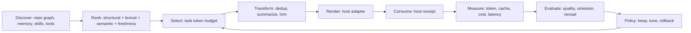

# Cortex Agent Token Control Plane

> **Project Slug**: `token-control-plane`  
> **Status**: `draft`（仅 `measurement-only-first` 已批准）  
> **Owner**: `cortex-agent`  
> **Created**: `2026-08-13`  
> **Related Projects**: `agent-runtime-interoperability`, `context-optimization-v2`, `token-usage`

## 1. 结论

Cortex Agent 不再把 Token 优化理解为单个压缩脚本，而是建立一个跨 Host、跨任务、跨 Agent 的 **Token Control Plane**：

1. 先证明模型实际消费了什么；
2. 再用结构化检索选择最小必要上下文；
3. 由 Host adapter 执行缓存、压实和截断；
4. 用预算策略控制模型、fan-out 和检索深度；
5. 用质量与成本双 Gate 决定策略是否上线。

旧能力继续作为组件存在，不另建模型运行时，不读取 Host 私有 transcript，不把估算值伪装为实际 Token。

## 2. 目标

- 把 `context-budget`、`token-usage`、context trajectory、历史压实、前缀缓存和共享上下文收敛成一个可测量闭环。
- 为 Task、Run、Session、Host、Agent、Model 建立统一但不越权的 Token 账本。
- 在不降低任务成功率的前提下，减少重复读取、无关上下文、历史回放和 fan-out 固定前缀。
- 支持 Codex、Claude、Pi、Cursor 等 Host 的能力差异；不支持的能力显式标记 `unavailable`。
- 建立可复现基线，禁止用“全仓读取”这一不现实上界单独证明收益。

## 3. 范围

### In Scope

- Host usage 上报、render/consume 证据和 Token 账本。
- 结构图、关键词、语义、依赖与变更影响融合的最小上下文选择。
- Host 原生或适配层 compaction、prompt cache、截断和共享前缀。
- soft/hard budget、预算预留、模型与 fan-out 降级策略。
- Token、成本、延迟、任务质量、遗漏、重读和缓存命中评测。
- 双语模板、Management API、Dashboard、Briefing 和 runtime evidence 投影。

### Out of Scope

- 自建 Provider SDK、Agent Loop、推理服务或 KV Cache 引擎。
- 主动读取 Codex、Claude、Cursor 等 Host 的私有 transcript/storage。
- 在没有 Host receipt 时声称 prompt 已渲染、已消费或已命中缓存。
- 默认启用有损 Token 级压缩。
- 用单一 USD 价格表代替 Host 自报成本；价格映射只能是可更新的辅助投影。
- 未经独立批准的自动停机、自动改模型或外部副作用。

## 4. 体系结构



### 4.1 控制面与数据面

| 层 | 所有者 | 职责 |
| :--- | :--- | :--- |
| Cortex 控制面 | Management API + policy evaluator | 预算、选择计划、证据关联、投影、Gate |
| Repository Context | context-budget + Graphify/结构图 adapter | 候选发现、排序、最小上下文包 |
| Host 数据面 | Codex/Claude/Pi/Cursor adapter | 最终渲染、compaction/cache 能力、真实 usage receipt |
| Evaluation | runtime evidence + validation | A/B、质量回归、Token/成本收益、回滚建议 |

### 4.2 状态模型

Token policy 本身不是 Task 状态机。每次模型调用只产生一个不可变 `token-attempt` 证据：

```text
planned -> rendered | unavailable
rendered -> consumed | failed | unknown
consumed -> measured | partially_measured
measured -> evaluated | evaluation_pending
```

`unknown` 与 `unavailable` 是合法终态；不得用估算补成 confirmed。

## 5. 子提案

| ID | 提案 | 状态 | 说明 |
| :--- | :--- | :--- | :--- |
| P-001 | [Token Metering and Ledger](proposals/P-001-token-metering-ledger-proposal.md) | approved | 真实 usage、账本和查询投影；仅 shadow measurement |
| P-002 | [Minimal Context and Graph Retrieval](proposals/P-002-minimal-context-graph-retrieval-proposal.md) | draft | 最小上下文、图遍历预算、渐进式响应 |
| P-003 | [Compaction, Cache and Shared Prefix](proposals/P-003-compaction-cache-shared-prefix-proposal.md) | draft | Host 能力化压实、缓存和共享前缀 |
| P-004 | [Budget Policy and Adaptive Routing](proposals/P-004-budget-policy-adaptive-routing-proposal.md) | draft | 预算预留、降级和模型/fan-out 策略 |
| P-005 | [Evaluation and Rollout Gates](proposals/P-005-evaluation-rollout-gates-proposal.md) | approved (measurement gates only) | 可复现基线与质量 Gate；不含自动 rollout |
| P-006 | [Host-side Context Optimization](proposals/P-006-host-side-context-optimization-proposal.md) | draft | 提示词分层、工具 schema 摘要、历史管理、固定前缀缓存；proposal-only 准备文件 |
| P-007 | [Session & Task Context Offload](proposals/P-007-session-context-offload-proposal.md) | draft | 会话/任务级：memory 沉淀、sub-agent 隔离、skill 按需、task workspace 外置 |

## 6. 关联项目

| 项目 | 路径 / 仓库 | 关系 | 状态 |
| :--- | :--- | :--- | :--- |
| Agent Runtime Interoperability | `projects/agent-runtime-interoperability/` | Host capability、trajectory、receipt 上游 | 已实现，需扩展 |
| Context Optimization v2 | `../../context-optimization/` | 旧压实/缓存/去重实现来源 | 已有代码，收益未闭环 |
| Token Usage | `../../token-usage/` | usage 上报和 Dashboard 基线 | Phase 1 已实现 |
| code-review-graph | `tirth8205/code-review-graph` | 结构化最小上下文与评测参考 | 已调研，不直接依赖 |

## 7. 里程碑

| Milestone | 目标 | 子提案 | 状态 |
| :--- | :--- | :--- | :--- |
| M-001 | 冻结 token-attempt、Host receipt、账本与隐私契约 | P-001 | in progress via M-025/MS-001 |
| M-002 | 接通至少两个 Host 的真实 usage，形成 7 天基线 | P-001、P-005 | pending |
| M-003 | 落地最小上下文入口、预算遍历和 realistic agent baseline | P-002、P-005 | pending |
| M-004 | 接入 Host compaction/cache capability，完成缓存身份与失效证据 | P-003 | pending |
| M-005 | 上线 soft budget、reserve/commit/release 与人工降级建议 | P-004 | pending |
| M-006 | 在两个实战项目完成灰度、质量 Gate 和回滚演练 | P-005 | pending |

## 8. 成功指标

### 8.1 真实性

- `selected`、`rendered`、`consumed`、`measured` 100% 分层，不互相推断。
- 所有实际 Token 必须带 Host receipt/source；否则为 `unknown`。
- 至少两个 Host、连续 7 天有非测试 usage 样本后，才可发布收益比例。

### 8.2 效率

- 非 trivial 代码任务的 P50 实际 input tokens 相对 realistic baseline 降低至少 25%。
- 重复任务/稳定前缀场景 cache-read ratio 提升至少 20 个百分点；不支持缓存的 Host 不计入。
- fan-out 场景每个 Worker 的非任务特定上下文 P50 降低至少 30%。

### 8.3 质量

- 任务成功率下降不得超过 2 个百分点。
- missing-context failure 不得增加超过 1 个百分点。
- 因缺上下文导致的 re-read/tool retry P95 不得恶化超过 10%。
- 高风险任务、规则、决策、错误与 patch 不允许默认 Token 级有损压缩。

## 9. 方案比较

| 维度 | 维持现状 | 只接入 code-review-graph | 只做 Host compaction | 本提案 |
| :--- | :--- | :--- | :--- | :--- |
| 实际用量闭环 | ❌ | ❌ | 部分 | ✅ |
| Repository context | 启发式 L0/L1/L2 | 强结构化 | 无 | 结构图 + 现有知识层 |
| 跨 Host | 部分 | MCP/CLI 集成 | Provider 绑定 | capability-driven |
| 历史与缓存 | 脚本骨架 | 非目标 | 强 | Host adapter + fallback |
| 预算与配额 | 无 | traversal budget | 无 | task/run/session 多维策略 |
| 质量 Gate | 弱 | 有 benchmark，但部分基线偏乐观 | 依赖 Provider | realistic baseline + 独立验证 |
| 维护成本 | 隐性漂移 | 新 Python/runtime 依赖 | 多 Provider 分支 | 中等，按子提案增量落地 |

## 10. 当前决策

| ID | 决策 | 状态 | 链接 |
| :--- | :--- | :--- | :--- |
| D-TCP-003 | 批准 measurement-only-first 并允许 Pi 实施准备 | approved | `.agent/decisions/D-TCP-003.json`；P-002～P-004 仍为 draft |
| D-TCP-004 | 批准 DSH 作为第三个 governed Host 加入 shadow measurement | approved | `.agent/decisions/D-TCP-004-add-dsh-host.json`；scope 仍为 measurement-only-first；Waitpoint `WP-rsl-dsh-host-shadow-20260819` released |

## 11. 架构审计摘要

| 评估维度 | 状态 | 结论 |
| :--- | :--- | :--- |
| 零依赖 | ✅ | Cortex 核心只用 Node.js 内置模块；外部 tokenizer/图工具均为可选 adapter |
| 模板驱动 | ✅ | 通用 schema、skill、workflow 必须同步双语模板 |
| 纯加法升级 | ✅ | 新 schema/version/projection 均 additive；旧 manifest 和 token_usage 可继续读取 |
| 平台无关 | ✅ | Host capability 决定 render/cache/compact，unsupported 为一等状态 |
| 单一事实源 | ✅ | Task/Run/Session/Decision/Waitpoint 仍由既有 owner 管理 |
| 最小修改 | ⚠️ | 跨模块项目，必须按 M-001～M-006 冻结共享契约后串行推进 |
| 隐私安全 | ⚠️ | receipt 只存计数、digest、URI 和原因；禁止完整 prompt、代码正文和凭据 |
| 收益可信度 | ⚠️ | 当前生产 usage 为零；M-002 完成前不得宣称实际节省 |

## 12. 风险

| 风险 | 严重度 | 缓解 |
| :--- | :--- | :--- |
| 把计划注入误报为模型消费 | 高 | 四阶段证据 + Host receipt；未知保持 unknown |
| 有损摘要遗漏关键约束 | 高 | 决策/规则/patch 保留；质量 Gate；原文回退 |
| 图谱召回漏掉动态依赖 | 高 | grep/结构图双路、变更文件强制保留、遗漏反馈回灌 |
| 缓存跨租户泄漏 | 高 | model/template/tool/tenant salt 进入最终前缀 digest |
| 预算并发超卖 | 高 | reserve -> commit/release 账本；幂等 key；过期回收 |
| 自动降级降低质量 | 中 | Phase 1 只建议不自动；高风险任务禁止自动降模型 |
| `.agent/` 遥测膨胀 | 中 | 日分段、摘要索引、保留期与大 payload 外置 |
| workflow 名称漂移 | 中 | `architecture-audit` 已合并为 `architecture-guard`，后续单独修正真源引用 |
| Decision relation 写入能力缺口 | 中 | 当前 Management API 忽略 request payload 中的新 relations；暂以 revision-bound prompt + Waitpoint evidence 精确绑定，不绕过 owner 直写 |

## 13. 下一步

- [x] 用户通过 `D-TCP-003` 批准 `measurement-only-first`。
- [x] 用户通过 `D-TCP-004` 批准 DSH 作为第三个 governed Host 加入 shadow measurement。
- [x] 由 `M-025/MS-001` 实现并独立验证 token-attempt receipt/ledger。
- [x] MS-001 PASS 后进入多 Host 的 shadow measurement（Codex + DSH 已贡献 22,395 receipts）。
- [ ] Phase B 7-day consecutive observation 持续；待双 Host 各 ≥100 receipt / 7 天窗口结束后转入 Phase C。
- [ ] Pi parity work（独立 Decision 范围；参考 `.agent/missions/M-025/handoffs/pi-ledger-audit-20260819.md`）。
- [ ] M-001 前不得新增自动模型路由、自动停机或 Host 私有数据读取。
