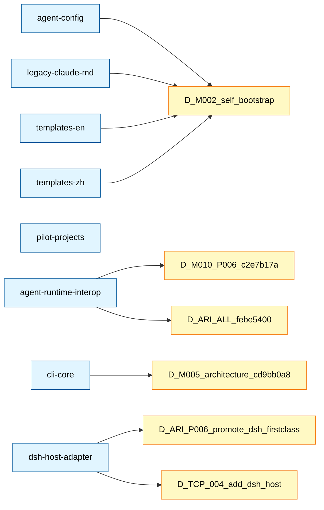

# References Index (知识图谱入口)

> **自动生成**: 2026-08-20T01:23:40.691Z by `node .agent/scripts/build-references-index.js`
> **不要手改**: 每次跑 build-references-index.js 会重写整个文件
> **生成依据**: 扫描 `.agent/references/*.md` 的 frontmatter (OKF V0.2 模板)

## 总览 (Status Distribution)

| Status | 数量 |
|---|---|
| `stable` | 8 |
| `draft` | 0 |
| `deprecated` | 0 |
| **Total** | **8** |

## Stable References (主列表)

| Module | Type | Path | Summary | Last Verified |
|---|---|---|---|---|
| `[agent-config](agent-config.md)` | 项目 Harness 配置 | `.agent` | cortex-agent 项目自身的 Agent Harness 配置，由 zh 模板安装，当前活跃运行 | 2026-06-08 |
| `[agent-runtime-interop](agent-runtime-interoperability-production-readiness.md)` | report | `.agent/plans/proposals/projects/agent-workspace-orchestration/proposals/P-006-agent-operation-lifecycle-readiness-proposal.md` |  | 2026-07-29 |
| `[cli-core](cli-core.md)` | CLI 工具核心 | `bin + lib` | cortex-agent CLI 入口与核心执行引擎，提供 init/upgrade/add/remove 等全部命令 | 2026-06-08 |
| `[dsh-host-adapter](dsh-host-adapter.md)` | adapter | `lib/agents/adapters/dsh.js` |  | 2026-08-19 |
| `[legacy-claude-md](project-context-from-claude.md)` | Legacy 上下文快照 (imported from CLAUDE.md) | `.agent/references/ + .agent/imported_rules/imported_from_CLAUDE.md.md (源)` |  | 2026-07-17 |
| `[pilot-projects](pilot-projects.md)` | 实战项目注册表 | `.agent/references` | cortex-agent 实战项目唯一注册表；状态必须由可解析 evidence_ref 支撑 | 2026-08-19 |
| `[templates-en](templates-en.md)` | 英文模板集 | `templates/en/.agent` | cortex-agent 英文模板集，与 templates/zh 结构完全对称，内容以英文表达 | 2026-06-08 |
| `[templates-zh](templates-zh.md)` | 中文模板集 | `templates/zh/.agent` | cortex-agent 中文模板集，包含完整的 workflows/skills/sub-agents/rules/h... | 2026-06-08 |

## Draft References

_No draft references._

## Archived (Deprecated)

_No deprecated references._

## Mermaid Knowledge Graph

基于 `linked_decisions` 字段,展示 reference ↔ ADR 关系。

---

**Last Generated**: 2026-08-20T01:23:40.691Z
**Total References**: 8 (stable: 8, draft: 0, deprecated: 0)
**Skip Reason for non-indexed files**: 无 frontmatter (V-FM-001) 或 无 `module` 字段 (production-readiness 报告)

