# 🧠 Cortex Agent Framework

**Cortex Agent** 是一个为 AI 编程助手（Cursor、Claude Code、Windsurf、Gemini CLI 等）设计的治理与指令框架。它通过一套结构化的**规则 (Rules)**、**工作流 (Workflows)** 和**技能 (Skills)**，将 AI 从简单的代码生成器提升为具有架构意识和工程规范的"资深工程师"。

## 核心价值

- **架构一致性**：强制 AI 遵循项目预定义的架构模式（六边形、分层、微服务等）。
- **专业化委托**：核心执行 Sub-agent（planner / implementer / researcher / code-reviewer / documenter）与治理型 Sub-agent 分工协作，职责隔离。
- **上下文预算控制**：`context-budget` skill 按 Tier 0-3 分级裁剪上下文，将有效负载控制在窗口 40% 以内。
- **推理三明治**：`/ship` 按 规划(premium) → 执行(standard) → 验证(standard) 分配模型算力，兼顾质量与成本。
- **结构化交接**：`/handoff` 为跨 Agent、跨会话和 sub-agent 接力生成轻量交接文档，避免依赖对话记忆。
- **长周期任务编排**：`/mission` 通过 milestone、验证契约和命令日志支撑多阶段任务稳定推进。
- **协作运行时 (Communication Runtime)**：`management-api` 提供 inbox / decisions / waitpoints 三个通信对象，所有写入受 workflow gate（`mission` / `user` / `owner` / `requester` / `recipient` / `workflow`）约束；Dashboard、CLI 与可选的 MCP 只读适配器共享同一查询投影。详见 [协作运行时设计](docs/architecture/agent-collaboration-runtime.md)。
- **熵治理闭环**：`entropy-scanner` 周期扫描知识库漂移，PostCommit Hook 自动修复，保持 `.agent/` 长期健康。
- **工具无关**：同一套 `.agent/` 配置通过符号链接和指令文件适配 11 个主流 AI 平台。

## 快速开始

### 给 LLM / 本地已安装用户

如果当前机器已经通过 `npm link`、全局安装或 Volta 暴露了 `cortex-agent` 命令，AI 助手可以直接在目标项目根目录执行初始化，不需要再下载 npm 包：

```bash
# 1. 确认本地命令可用
command -v cortex-agent
cortex-agent --version

# 2. 在要接入的项目根目录执行
cortex-agent init --lang zh

# 3. 已有 .agent 的项目使用安全完整更新
cortex-agent update --lang zh
```

给 AI 助手的最小指令：

```text
在当前项目根目录检查 `command -v cortex-agent`。
如果命令存在，直接运行 `cortex-agent init --lang zh`。
如果已存在 `.agent/`，改为运行 `cortex-agent update --lang zh`。
初始化后运行 `/configure` 和 `/scan-project` 补齐项目上下文。
不要修改实战项目自己的 Git user.name / user.email。
```

### 给 LLM 一个 GitHub 链接直接安装

如果用户只提供 cortex-agent 的 GitHub 项目链接，AI 助手可以先从 GitHub 克隆并本地 link，再初始化目标项目：

```bash
# 用户提供：
AGENT_REPO="https://github.com/Kucell/cortex-agent.git"
TARGET_PROJECT="/path/to/your/project"
INSTALL_DIR="$HOME/.local/share/cortex-agent"

# 1. 安装或更新 cortex-agent 本地命令
if ! command -v cortex-agent >/dev/null 2>&1; then
  if [ -d "$INSTALL_DIR/.git" ]; then
    git -C "$INSTALL_DIR" pull --ff-only
  else
    git clone --depth 1 "$AGENT_REPO" "$INSTALL_DIR"
  fi
  cd "$INSTALL_DIR"
  npm link
else
  cortex-agent --version
fi

# 2. 初始化或升级目标项目
cd "$TARGET_PROJECT"
if [ -d ".agent" ]; then
  cortex-agent update --lang zh
else
  cortex-agent init --lang zh
fi
```

给 AI 助手的最小指令：

```text
这是 cortex-agent GitHub 链接：<repo-url>。
目标项目路径是：<project-path>。
如果本机没有 `cortex-agent` 命令，请 clone 该 GitHub 仓库到 `$HOME/.local/share/cortex-agent` 并执行 `npm link`。
然后进入目标项目；已有 `.agent/` 就执行 `cortex-agent update --lang zh`，否则执行 `cortex-agent init --lang zh`。
完成后运行 `/configure` 与 `/scan-project`，并保留目标项目自己的 Git 配置。
```

### 通过 npm 临时使用

```bash
# 初始化当前项目（默认中文模板）
npx cortex-agent init

# 英文模板
npx cortex-agent init --lang=en

# 安全完整更新（同步未被本地修改的框架脚本）
npx cortex-agent update

# 仅补充新增文件（纯加法，不覆盖已有文件）
npx cortex-agent upgrade
```

初始化后，在 AI 助手中运行 `/configure` 完成项目配置。

### 启动协作 Dashboard

在已初始化的项目根目录运行开发服务：

```bash
cortex-agent dev
```

命令会在前台启动 Agent 协作 Dashboard、注册当前服务 Session，并输出可访问地址。默认从 `8787` 端口开始；端口被占用时会自动选择后续可用端口。可通过 `--port`、`--interval-ms` 和 `--session-id` 调整端口、刷新周期与 Session 标识：

```bash
cortex-agent dev --port 8787 --interval-ms 3000 --session-id local-dashboard
```

按 `Ctrl+C` 停止服务并结束 Session。开发服务停止后，静态 Dashboard 生成器与 Management API 的只读查询仍可独立使用。

常用工作流示例：

```
# 从需求描述生成原型（Mermaid 流程图 + Anime.js HTML），输出验收契约
/prototype T-001

# 指定 UI 模式和中等保真度（需 Pixso MCP）
/prototype T-001 --mode ui --fidelity mid

# 仅生成 Mermaid 流程图（最轻量，无工具依赖）
/prototype T-001 --mode doc --fidelity low
```

### 协作运行时命令

`management-api` 是协作运行时与外部消费者（CLI / Dashboard / MCP）共享的查询与受控写入入口。常用命令：

```bash
# 只读查询（Dashboard、CLI、MCP 全部走这些）
node .agent/skills/management-api/scripts/index.js query dashboard-state
node .agent/skills/management-api/scripts/index.js query decisions
node .agent/skills/management-api/scripts/index.js query waitpoints
node .agent/skills/management-api/scripts/index.js query inbox

# 受控写入：所有 mutation 都受 workflow gate 校验
# gate=user（仅人类）/ mission / owner / requester / recipient / workflow / agent
node .agent/skills/management-api/scripts/index.js decisions request \
  --decision-id D-merge --gate mission --action merge \
  --resource-ref branch:integration --requested-by coordinator \
  --prompt "Approve merge?" --options '["approve","reject","revise"]'
node .agent/skills/management-api/scripts/index.js decisions resolve \
  --decision-id D-merge --gate user --status approved \
  --selected-option approve --resolved-by maintainer --rationale "Validation passed."
node .agent/skills/management-api/scripts/index.js waitpoints create \
  --waitpoint-id WP-merge --gate mission --owner-workflow /checkpoint-merge \
  --action merge --resource-ref branch:integration --decision-id D-merge
node .agent/skills/management-api/scripts/index.js waitpoints release \
  --waitpoint-id WP-merge --gate owner --owner-workflow /checkpoint-merge \
  --decision-id D-merge --released-by coordinator
node .agent/skills/management-api/scripts/index.js inbox send \
  --message-id IM-001 --gate workflow --sender-id coordinator \
  --recipient-ids reviewer --subject "Review ready"
node .agent/skills/management-api/scripts/index.js inbox transition \
  --message-id IM-001 --gate recipient --actor-id reviewer --status acknowledged
```

任何直接覆盖 `.agent/inbox/` / `decisions/` / `waitpoints/` / `sessions/` 的尝试都会被 workflow gate 拦截；想要跨平台或编程访问 Dashboard 状态时，优先使用 `management-api` 而不是解析文件。

可选的 **MCP 只读适配器**（`runtime-state-mcp`）通过 stdio 把同一份 `dashboard-state` 投影暴露给 Claude Code / Cursor 等 MCP 客户端，不直接读 `.agent/`。未安装时 Dashboard 与 CLI 路径不受影响。

### 上手流程一览

<p align="center">
  
</p>

<p align="center">
  <em>左：终端实际命令 · 右：6 步开发链路 · 总时长约 12 秒 · 无限循环</em>
</p>

## 目录结构

```text
.agent/
├── inbox/           # 通信对象：recipient-owned message lifecycle（unread/read/acknowledged/archived）
├── decisions/       # 通信对象：open / approved / rejected / superseded 决策记录，含 workflow gate
├── waitpoints/      # 通信对象：blocking / released / expired 等待点，与 approved decision 配对
├── runs/            # 协作运行状态：阶段、活动、事件流、心跳
├── queues/          # 协作队列：依赖排序、并发限制、owning workflow
├── sessions/        # 会话生命周期：open/heartbeat/pause/close，closed 后不可再写
├── rules/           # 核心规则：架构约束、代码规范、语言规则
├── workflows/       # 工作流：/start-task /ship /handoff /mission /configure 等斜杠命令
├── skills/          # 专项技能：architecture-guard / context-budget / validation-contract / self-check / management-api / agent-dashboard
├── sub-agents/      # 子代理：planner / implementer / researcher / coordinator 等
├── hooks/           # 钩子：PostToolUse Lint 检查 + PostCommit 熵清理
├── config/          # 配置：reasoning-config.yml（模型 & API 配置）
├── plans/           # 进度管理：task-progress.md 路线图
├── handoffs/        # 任务交接：跨 Agent / 跨会话的轻量上下文包
├── missions/        # 长周期任务状态：/mission 按需创建
├── registry/        # Agent Registry：coordinator 多 agent 协调
├── artifacts/       # Artifact Bus：coordinator 结构化产物存储
├── locks/           # Progress Lock：任务级 / 文件级互斥
├── debug/           # AI 调试产物：截图 / 日志 / 临时文件
├── resources/       # 模板资源：架构提案、领域验证 skill 等
└── references/      # 知识库：/scan-project 生成的模块参考文档

> **自举仓库**：cortex-agent 自身的 `.agent/` 目录作为独立仓库管理：[Kucell/cortex-agent-agent](https://github.com/Kucell/cortex-agent-agent)
> 本仓库通过 `cortex-agent untrack`（默认）保持 `.agent/` 不被主仓库追踪，IDE 仍可通过符号链接识别 slash 命令菜单。
> 详见 [docs/architecture/self-bootstrapping.md](docs/architecture/self-bootstrapping.md)

docs/
├── architecture/   # 架构设计与演进方案
├── exec-plans/     # 跨会话执行计划资产
├── quality/        # knowledge lint、doc-gardening 与质量治理
├── reliability/    # 日志、指标、Trace、浏览器验证等运行时证据
├── security/       # 安全边界与扫描策略
└── tech-debt.md    # 已知技术债务与偿还路径
```

## 可选增强

### Graphify 知识图谱（可选）

安装 Graphify 后，agent 在 `/handoff` 时可携带当前任务相关的代码知识子图，接手方无需重新探索代码库。未安装时框架自动降级，所有工作流正常运行。

**安装：**

```bash
pip install graphifyy && graphify install
# macOS externally-managed 环境：
pip install --break-system-packages graphifyy && graphify install
```

**扫描项目图谱（在项目根目录执行一次）：**

```bash
graphify update .                        # 代码图谱，无需 API Key
ANTHROPIC_API_KEY=sk-... graphify .      # 完整图谱（含 Markdown 文档）
```

**在 `/handoff` 前提取任务子图：**

```bash
node .agent/plugins/graphify/scripts/extract-subgraph.js \
  --task T-xxx \
  --files "src/main.js,lib/api.js"
# 输出：.agent/artifacts/T-xxx/graphify-subgraph.json
# 并自动注册到 Artifact Bus（kind: knowledge-graph）
```

**在 Claude Code 中查询图谱：**

```
/graphify query "coordinator 与 artifact bus 如何协作？"
/graphify path "handoff-protocol.js" "artifact-bus.js"
/graphify explain "coordinator"
```

详见：[`.agent/plugins/graphify/README.md`](.agent/plugins/graphify/README.md) · [设计提案](docs/architecture/graphify-integration-proposal.md)

---

## 文档索引

| 文档 | 内容 |
| :--- | :--- |
| [docs/getting-started.md](docs/getting-started.md) | CLI 命令参考、新项目/已有项目完整接入流程 |
| [docs/workflows.md](docs/workflows.md) | 全部工作流命令、完整开发链路图、/ship 状态机 |
| [docs/sub-agents.md](docs/sub-agents.md) | Sub-agent 架构图、技能映射、输出契约、路由配置 |
| [docs/platform-integration.md](docs/platform-integration.md) | 11 平台集成方式、Claude Code 插件安装 |
| [docs/language-rules.md](docs/language-rules.md) | TypeScript / Python / Go / Java / Swift 规范 |
| [docs/customization.md](docs/customization.md) | 自定义规则、扩展 Sub-agent、添加 Hooks |
| [docs/architecture.md](docs/architecture.md) | 整体架构设计、模块职责、Mission Lite 设计、Hooks 触发机制 |
| [docs/architecture/mission-lite-design.md](docs/architecture/mission-lite-design.md) | Mission Lite 长周期任务编排的详细架构方案 |
| [docs/architecture/harness-optimization-design.md](docs/architecture/harness-optimization-design.md) | Harness Engineering 与 Mission Lite 演进设计 |
| [docs/architecture/multi-agent-coordinator.md](docs/architecture/multi-agent-coordinator.md) | Multi-Agent Coordinator（多 agent × 多模型协调层）设计稿 |
| [docs/architecture/runtime-continuity-v2-design.md](docs/architecture/runtime-continuity-v2-design.md) | Runtime Continuity v2：跨 agent 工具切换、长会话恢复和结构化工作日志同步 |
| [docs/architecture/self-bootstrapping.md](docs/architecture/self-bootstrapping.md) | 自举工作流：框架使用自身能力完成自我验证和实时更新 |
| [docs/architecture/experience-recursion.md](docs/architecture/experience-recursion.md) | 经验自递归：踩坑→沉淀→检索→防复发闭环设计 |
| [docs/architecture/animation-library-evaluation.md](docs/architecture/animation-library-evaluation.md) | README / Docs 演示增强的动画库评估，覆盖 Mermaid、Anime.js、Remotion、Rive 等选型 |
| [docs/architecture/graphify-integration-proposal.md](docs/architecture/graphify-integration-proposal.md) | Graphify 知识图谱集成提案（Artifact Bus 扩展 + Handoff 协议联动） |
| [docs/architecture/prototype-workflow-design.md](docs/architecture/prototype-workflow-design.md) | /prototype 双路径设计（Document + Pixso UI），需求→原型→验收契约完整链路 |
| [docs/architecture/agent-collaboration-runtime.md](docs/architecture/agent-collaboration-runtime.md) | 协作运行时（Phase 0-6）：Management API + Dashboard + inbox/decisions/waitpoints 通信对象 + 可选 MCP 适配器 |

## 开源协议

MIT
