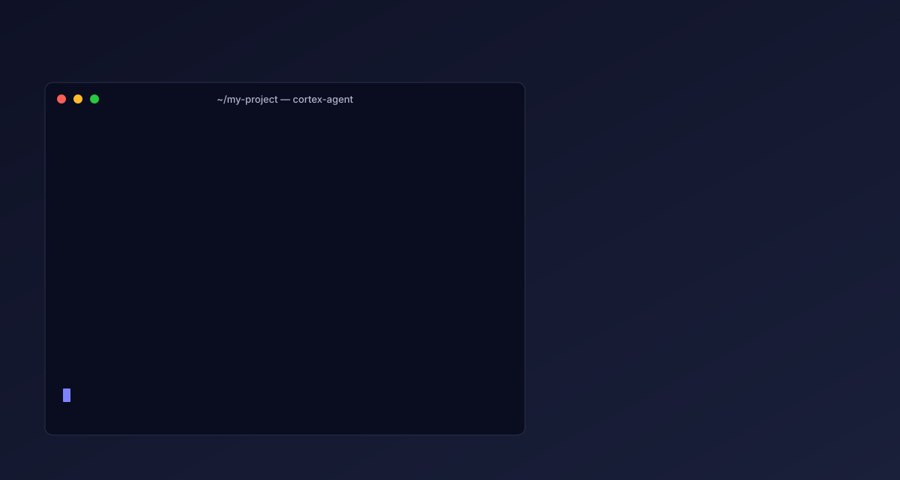

# 🧠 Cortex Agent Framework

**Cortex Agent** 是一个为 AI 编程助手（Cursor、Claude Code、Windsurf、Gemini CLI 等）设计的治理与指令框架。它通过一套结构化的**规则 (Rules)**、**工作流 (Workflows)** 和**技能 (Skills)**，将 AI 从简单的代码生成器提升为具有架构意识和工程规范的"资深工程师"。

## 核心价值

- **架构一致性**：强制 AI 遵循项目预定义的架构模式（六边形、分层、微服务等）。
- **专业化委托**：核心执行 Sub-agent（planner / implementer / researcher / code-reviewer / documenter）与治理型 Sub-agent 分工协作，职责隔离。
- **上下文预算控制**：`context-budget` skill 按 Tier 0-3 分级裁剪上下文，将有效负载控制在窗口 40% 以内。
- **推理三明治**：`/ship` 按 规划(premium) → 执行(standard) → 验证(standard) 分配模型算力，兼顾质量与成本。
- **结构化交接**：`/handoff` 为跨 Agent、跨会话和 sub-agent 接力生成轻量交接文档，避免依赖对话记忆。
- **长周期任务编排**：`/mission` 通过 milestone、验证契约和命令日志支撑多阶段任务稳定推进。
- **协作运行时 (Communication Runtime)**：`management-api` 提供 inbox / decisions / waitpoints 三个通信对象，所有写入受 workflow gate（`mission` / `user` / `owner` / `requester` / `recipient` / `workflow`）约束；Dashboard、CLI 与可选的 MCP 只读适配器共享同一查询投影。详见 [协作运行时设计](docs/architecture/agent-collaboration-runtime.md)。
- **熵治理闭环**：`entropy-scanner` 周期扫描知识库漂移，PostCommit Hook 自动修复，保持 `.agent/` 长期健康。
- **工具无关**：同一套 `.agent/` 配置通过符号链接和指令文件适配 11 个主流 AI 平台。

## 知识层理念 / Knowledge Layer Philosophy

cortex-agent 的 `.agent/references/`、`.agent/workflows/`、`.agent/rules/` 和 `.agent/decisions/` 共同构成项目级的**可验证知识层**，对标 **OKF (Open Knowledge Format) V0.2** 的陈述性知识可信度机制。这不是一个静态 Wiki，而是一套 agent-first 的知识工程基础设施：知识必须有生命周期、可以被自动校验、可以追溯到决策，并且通过 frontmatter 元数据实现程序化消费。

### 四层知识栈 / 4-Layer Knowledge Stack

| 层 | 目录 | 知识类型 | 约束 | 消费方 |
| :--- | :--- | :--- | :--- | :--- |
| **L0 源代码** | `lib/` `src/` 等 | 可执行事实 | lint / test / type-check | 人类 + Agent |
| **L1 程序性知识** | `.agent/workflows/` `.agent/scripts/` | 工作流（怎么做事）| `validate-frontmatter.js` 强制必填字段 | Agent 调度器 |
| **L2 约束性知识** | `.agent/rules/` | 规则（什么能做、什么不能做）| `knowledge-lint` R-LINT 系列规则 | Agent 上下文注入 |
| **L3 陈述性知识** | `.agent/references/` | 模块参考文档（现状是什么）| `knowledge-lint` 校验 status / sources / linked_decisions | Agent 知识检索 |
| **L4 可追溯层** | `.agent/decisions/` `.agent/references/INDEX.md` | 决策记录 + 知识图谱 | ADR 落地必须引用 affected references | Agent + 人（审计/复盘）|

> **关键设计**：L1-L4 每层都有 frontmatter 元数据（`status` / `owner` / `last_verified` / `linked_decisions`），使得 Agent 可以在运行时区分"可信的 stable 知识"和"不应直接采信的 draft 知识"，而不是无差别注入所有 Markdown。

### 与 OpenWiki 的差异化定位 / Differentiation from OpenWiki

| 维度 | OpenWiki | cortex-agent 知识层 |
| :--- | :--- | :--- |
| **受众** | 人类团队（阅读优先） | Agent + 人类（程序化消费优先） |
| **生命周期** | Wiki 页面手动归档 | 4 态自动治理：draft → stable → deprecated（物理不删除，走 git history） |
| **验证** | 人工 review | `validate-frontmatter.js` 阻塞校验 + `knowledge-lint` 健康扫描 + 季度 stale check |
| **可追溯** | 页面历史 | 每条 reference 通过 `linked_decisions` 关联 ADR；`INDEX.md` 自动生成 Mermaid 知识图谱 |
| **入口** | 目录树 / 搜索 | `INDEX.md` 知识图谱入口（Agent 必读，不读全文避免 context bloat） |
| **同步** | 无内置机制 | L1 双语模板（`templates/{zh,en}/.agent/`）通过 `cortex-agent update` 自动同步 |

> OpenWiki 是一个通用的企业知识库工具，适合人类团队的文档协作。cortex-agent 知识层则聚焦于 **agent-first 的项目级知识工程**——它不替代 OpenWiki，而是为 AI 编码助手提供一套结构化的、可验证的、可追溯的知识消费基础设施。

### 知识治理工具链 / Knowledge Governance Toolchain

| 工具 | 路径 | 用途 |
| :--- | :--- | :--- |
| `knowledge-lint` | `.agent/skills/knowledge-lint/` | 知识健康扫描（frontmatter 合规、过期检测、linked_decisions 空引用警告） |
| `validate-frontmatter.js` | `.agent/scripts/` | 阻塞校验（CI/pre-commit hook），必填字段缺失 exit 1 |
| `build-references-index.js` | `.agent/scripts/` | 自动生成 `INDEX.md`（status 分布 + Mermaid 关系图 + Archived 分区） |
| `knowledge-governance.md` | `.agent/rules/` | 知识治理规则（生命周期、废弃流程、验证流程、违反处理） |

详见：
- 知识治理规则：[`.agent/rules/knowledge-governance.md`](.agent/rules/knowledge-governance.md)
- 架构设计：[`docs/architecture/okf-knowledge-layer.md`](docs/architecture/okf-knowledge-layer.md)
- 知识图谱入口：[`.agent/references/INDEX.md`](.agent/references/INDEX.md)

---

## 快速开始

### 给 LLM / 本地已安装用户

如果当前机器已经通过 `npm link`、全局安装或 Volta 暴露了 `cortex-agent` 命令，AI 助手可以直接在目标项目根目录执行初始化，不需要再下载 npm 包：

```bash
# 1. 确认本地命令可用
command -v cortex-agent
cortex-agent --version

# 2. 在要接入的项目根目录执行
cortex-agent init --lang zh

# 3. 已有 .agent 的项目使用安全完整更新
cortex-agent update --lang zh
```

给 AI 助手的最小指令：

```text
在当前项目根目录检查 `command -v cortex-agent`。
如果命令存在，直接运行 `cortex-agent init --lang zh`。
如果已存在 `.agent/`，改为运行 `cortex-agent update --lang zh`。
初始化后运行 `/configure` 和 `/scan-project` 补齐项目上下文。
不要修改实战项目自己的 Git user.name / user.email。
```

### 给 LLM 一个 GitHub 链接直接安装

如果用户只提供 cortex-agent 的 GitHub 项目链接，AI 助手可以先从 GitHub 克隆并本地 link，再初始化目标项目：

```bash
# 用户提供：
AGENT_REPO="https://github.com/Kucell/cortex-agent.git"
TARGET_PROJECT="/path/to/your/project"
INSTALL_DIR="$HOME/.local/share/cortex-agent"

# 1. 安装或更新 cortex-agent 本地命令
if ! command -v cortex-agent >/dev/null 2>&1; then
  if [ -d "$INSTALL_DIR/.git" ]; then
    git -C "$INSTALL_DIR" pull --ff-only
  else
    git clone --depth 1 "$AGENT_REPO" "$INSTALL_DIR"
  fi
  cd "$INSTALL_DIR"
  npm link
else
  cortex-agent --version
fi

# 2. 初始化或升级目标项目
cd "$TARGET_PROJECT"
if [ -d ".agent" ]; then
  cortex-agent update --lang zh
else
  cortex-agent init --lang zh
fi
```

给 AI 助手的最小指令：

```text
这是 cortex-agent GitHub 链接：<repo-url>。
目标项目路径是：<project-path>。
如果本机没有 `cortex-agent` 命令，请 clone 该 GitHub 仓库到 `$HOME/.local/share/cortex-agent` 并执行 `npm link`。
然后进入目标项目；已有 `.agent/` 就执行 `cortex-agent update --lang zh`，否则执行 `cortex-agent init --lang zh`。
完成后运行 `/configure` 与 `/scan-project`，并保留目标项目自己的 Git 配置。
```

### 通过 npm 临时使用

```bash
# 初始化当前项目（默认中文模板）
npx cortex-agent init

# 英文模板
npx cortex-agent init --lang=en

# 安全完整更新（同步未被本地修改的框架脚本）
npx cortex-agent update

# 仅补充新增文件（纯加法，不覆盖已有文件）
npx cortex-agent upgrade
```

初始化后，在 AI 助手中运行 `/configure` 完成项目配置。

### 启动协作 Dashboard

在已初始化的项目根目录运行开发服务：

```bash
cortex-agent dev
```

命令会在前台启动 Agent 协作 Dashboard、注册当前服务 Session，并输出可访问地址。默认从 `8787` 端口开始；端口被占用时会自动选择后续可用端口。可通过 `--port`、`--interval-ms` 和 `--session-id` 调整端口、刷新周期与 Session 标识：

```bash
cortex-agent dev --port 8787 --interval-ms 3000 --session-id local-dashboard
```

按 `Ctrl+C` 停止服务并结束 Session。开发服务停止后，静态 Dashboard 生成器与 Management API 的只读查询仍可独立使用。

### 查询项目 Management API

标准 CLI 可以从任意目录查询明确项目，并始终输出 JSON：

```bash
cortex-agent help --json
cortex-agent help query --json --project /path/to/project
cortex-agent query dashboard-state --project /path/to/project
cortex-agent query runs --project /path/to/project
cortex-agent query activity --project /path/to/project --since 2026-07-13 --until 2026-07-19
```

`--project` 指向项目或 worktree 根目录；共享 `.agent` 软链接会保留代码工作区 `project.root`，并通过 `project.agent_root` 报告真实 Agent 状态目录。成功结果使用稳定的 `command`、`projection`、`project`、`filters`、`data`、`summary`、`warnings` JSON 字段。未知 projection、项目缺失、旧项目缺少 capability registry 或 Management API 不可用时，stdout 返回结构化错误，stderr 仅输出诊断，并以稳定的非零退出码结束。

`activity` 只聚合任务、Run、Session、Decision、Handoff 和 Artifact 中的结构化时间；日期边界按项目进程本地自然日解释并包含起止时刻。缺少有效时间的记录进入 `data.unknown_time`，不会使用文件 mtime 或计划文本推断完成时间。

Agent 与自动化应先读取 `cortex-agent help --json` 的机器契约；查询特定项目时再使用 `help query --json --project <path>` 获取真实 projection capability。新增公开 CLI 命令必须登记到中央契约，否则契约一致性测试会失败。

需要 MCP 的宿主可运行 `cortex-agent mcp serve --project <path>`。该 stdio server 只绑定一个明确本地项目，Resources 来自真实 capability registry，并只提供只读 `cortex.query`；writer tools 保持禁用。

常用工作流示例：

```
# 从需求描述生成原型（Mermaid 流程图 + Anime.js HTML），输出验收契约
/prototype T-001

# 指定 UI 模式和中等保真度（需 Pixso MCP）
/prototype T-001 --mode ui --fidelity mid

# 仅生成 Mermaid 流程图（最轻量，无工具依赖）
/prototype T-001 --mode doc --fidelity low
```

### 协作运行时命令

`management-api` 是协作运行时与外部消费者（CLI / Dashboard / MCP）共享的查询与受控写入入口。常用命令：

```bash
# 只读查询（Dashboard、CLI、MCP 全部走这些）
node .agent/skills/management-api/scripts/index.js query dashboard-state
node .agent/skills/management-api/scripts/index.js query decisions
node .agent/skills/management-api/scripts/index.js query waitpoints
node .agent/skills/management-api/scripts/index.js query inbox

# 受控写入：所有 mutation 都受 workflow gate 校验
# gate=user（仅人类）/ mission / owner / requester / recipient / workflow / agent
node .agent/skills/management-api/scripts/index.js decisions request \
  --decision-id D-merge --gate mission --action merge \
  --resource-ref branch:integration --requested-by coordinator \
  --prompt "Approve merge?" --options '["approve","reject","revise"]'
node .agent/skills/management-api/scripts/index.js decisions resolve \
  --decision-id D-merge --gate user --status approved \
  --selected-option approve --resolved-by maintainer --rationale "Validation passed."
node .agent/skills/management-api/scripts/index.js waitpoints create \
  --waitpoint-id WP-merge --gate mission --owner-workflow /checkpoint-merge \
  --action merge --resource-ref branch:integration --decision-id D-merge
node .agent/skills/management-api/scripts/index.js waitpoints release \
  --waitpoint-id WP-merge --gate owner --owner-workflow /checkpoint-merge \
  --decision-id D-merge --released-by coordinator
node .agent/skills/management-api/scripts/index.js inbox send \
  --message-id IM-001 --gate workflow --sender-id coordinator \
  --recipient-ids reviewer --subject "Review ready"
node .agent/skills/management-api/scripts/index.js inbox transition \
  --message-id IM-001 --gate recipient --actor-id reviewer --status acknowledged
```

任何直接覆盖 `.agent/inbox/` / `decisions/` / `waitpoints/` / `sessions/` 的尝试都会被 workflow gate 拦截；想要跨平台或编程访问 Dashboard 状态时，优先使用 `management-api` 而不是解析文件。

可选的 **MCP 只读适配器**（`runtime-state-mcp`）通过 stdio 把同一份 `dashboard-state` 投影暴露给 Claude Code / Cursor 等 MCP 客户端，不直接读 `.agent/`。未安装时 Dashboard 与 CLI 路径不受影响。

### Coordination 通知进程

关键 Coordination 事件可由公共 Notification Pump 低延迟消费：

```bash
cortex-agent notification pump --project /path/to/project \
  --consumer coordinator --target coordinator:root --adapter codex --once
cortex-agent notification pump --project /path/to/project \
  --consumer coordinator --target coordinator:root --adapter codex --watch
cortex-agent notification pump --project /path/to/project \
  --consumer coordinator --target coordinator:root --adapter codex --status
cortex-agent notification pump --project /path/to/project \
  --consumer coordinator --target coordinator:root --adapter codex --stop
```

`watch` 是显式启动的前台单实例进程，使用文件事件与有界退避；状态、锁、
cursor 和重试记录仅写入 Git ignored 的 `.agent-runtime/coordination/`。
`status` 只读，`stop` 幂等，通知 ACK 不会批准任何操作或改变任务状态。
Codex Desktop/CLI 宿主通过官方 Codex App Server 接入：在 Codex 任务内
自动使用 `CODEX_THREAD_ID`；从外部终端启动时，显式设置
`CORTEX_CODEX_THREAD_ID=<thread-id>`。Adapter 依次执行 `initialize`、
`thread/resume` 和 `turn/start`，只在真实 turn 完成后报告 delivered；仍不
自动 ACK。未提供线程 ID 或 App Server 不可用时保持 deferred 和 journal
恢复，不得用 mock 投递替代真实宿主验收。

### 多宿主开发任务与监督推进

Cortex Agent 可以把冻结后的开发任务交给 Claude Code、Pi、Codex 或其他
实现标准 Adapter 的宿主，并由 Codex 持续监督 Proposal、Mission 和 Plan：

```text
Proposal / Mission / validation contract
  → Decision + Waitpoint + coordination lease
  → capability-aware manual dispatch
  → Claude Code / Pi / Codex / third-party adapter
  → boundary event + receipt + checkpoint + handoff
  → Notification Pump 唤醒 Codex
  → 独立验证并推进 milestone / task-progress
```

当前生产边界：

- Pi 已通过真实一次性进程验证，receipt 仅保存标识、摘要、退出状态和
  SHA-256，不保存 prompt、response、工具负载、凭证或私有 session。
- Claude Code 支持 hook 与显式 CLI 上报；Codex Desktop 通过 App Server
  接收关键事件唤醒，并可从 journal 恢复未确认通知。
- Operation、Authorization、Readiness、checkpoint 和 handoff 都是持久、
  可回放且可独立查询的事实；同一 Operation ID 的并发冲突会 fail closed。
- Codex 可以根据真实事件推进 Mission milestone、验证契约和计划记录，
  但不会从进程退出或普通进度推断“已完成”，也不会自动批准权限。
- 自动 dispatch 与常驻 daemon 默认关闭。当前推荐显式启动
  `notification pump --watch`，或在不支持主动唤醒的宿主上使用定时检查。

因此，关闭当前 Codex 对话不会丢失已落盘状态；恢复后应先读取 pending
critical events、Operation journal、receipt 和 checkpoint，再继续推进。

### 本机密钥管理

公共 CLI 通过项目的 Secrets skill 把凭证保存到 macOS Keychain、Linux
Secret Service 或其他已配置后端。命令不会输出明文，也不接受容易进入
shell history 的 `--value`：

```bash
read -s "NPM_TOKEN?请输入 npm access token: "
echo
export NPM_TOKEN

cortex-agent secrets store --ref npm-publish --from-env NPM_TOKEN
cortex-agent secrets verify --ref npm-publish --provider npm
cortex-agent secrets list

unset NPM_TOKEN
```

`verify` 从 `secret://npm-publish` 解析凭证并执行 provider 身份检查，只返回
身份和验证状态。它不绕过 npm 2FA；发布策略要求 OTP 时仍需显式提供。

### 上手流程一览

<p align="center">
  
</p>

<p align="center">
  <em>左：终端实际命令 · 右：6 步开发链路 · 总时长约 12 秒 · 无限循环</em>
</p>

## 跨工具识别锚点

`.agent/` 默认 gitignored（见项目根 `.git/info/exclude` 的 `/.agent` 行），这意味着 clone 项目的 AI 工具只能读到 `AGENTS.md` 入口，看不到内部规则 / 工作流 / 技能的具体约定。为了让 **Claude Code / Codex / Cursor / Aider / Pi agent / 其他任何 AI 编码工具** 都能准确识别「这是一个由 cortex-agent 管理的项目」，框架提供一个**对外锚点**：

- 锚点文件：<code>docs/cortex-agent/anchor.md</code>（**进版本控制**），由 `cortex-agent init` 自动生成并写入。
- CLI 命令：<code>cortex-agent export-anchor</code> 把同一段内容打印到 stdout，可直接 `>` 重定向到 `CLAUDE.md` / `AGENTS.md` / `.pi/agent.md`。

```bash
# 输出 Markdown 片段（默认）— 粘到 CLAUDE.md / AGENTS.md / 任何 markdown 记忆
cortex-agent export-anchor

# 输出结构化 JSON — 给吃 JSON 的工具（Pi agent settings / 自研 agent）
cortex-agent export-anchor --json

# 写入 Claude Code 长期记忆
cortex-agent export-anchor > CLAUDE.md

# 在指定项目目录跑（默认 cwd）
cortex-agent export-anchor --project /path/to/other-project
```

锚点内容包含：

- `cortex-agent:anchor:v1` 标记（带版本号，便于后续升级）
- 「此项目由 cortex-agent 管理」的明确声明
- 入口文件（`./AGENTS.md`）和内部目录（`./.agent/`）的分工
- 跨工具协作约定：读 `AGENTS.md` → 加载 `.agent/rules/` → 走既有 workflow → 不发明新脚本
- 记忆纪律：记忆是线索不是事实，**项目文件才是真相**

任何工具只要看到 `cortex-agent:anchor` 标记，就知道该走 cortex-agent 流程，而不是按自己的默认行为瞎改。

---

## 目录结构

```text
.agent/
├── inbox/           # 通信对象：recipient-owned message lifecycle（unread/read/acknowledged/archived）
├── decisions/       # 通信对象：open / approved / rejected / superseded 决策记录，含 workflow gate
├── waitpoints/      # 通信对象：blocking / released / expired 等待点，与 approved decision 配对
├── runs/            # 协作运行状态：阶段、活动、事件流、心跳
├── queues/          # 协作队列：依赖排序、并发限制、owning workflow
├── sessions/        # 会话生命周期：open/heartbeat/pause/close，closed 后不可再写
├── rules/           # 核心规则：架构约束、代码规范、语言规则
├── workflows/       # 工作流：/start-task /ship /handoff /mission /configure 等斜杠命令
├── skills/          # 专项技能：architecture-guard / context-budget / validation-contract / self-check / management-api / agent-dashboard
├── sub-agents/      # 子代理：planner / implementer / researcher / coordinator 等
├── hooks/           # 钩子：PostToolUse Lint 检查 + PostCommit 熵清理
├── config/          # 配置：reasoning-config.yml（模型 & API 配置）
├── plans/           # 进度管理：task-progress.md 路线图
├── handoffs/        # 任务交接：跨 Agent / 跨会话的轻量上下文包
├── missions/        # 长周期任务状态：/mission 按需创建
├── registry/        # Agent Registry：coordinator 多 agent 协调
├── artifacts/       # Artifact Bus：coordinator 结构化产物存储
├── locks/           # Progress Lock：任务级 / 文件级互斥
├── debug/           # AI 调试产物：截图 / 日志 / 临时文件
├── resources/       # 模板资源：架构提案、领域验证 skill 等
└── references/      # 知识库：/scan-project 生成的模块参考文档

> **自举仓库**：cortex-agent 自身的 `.agent/` 目录作为独立仓库管理：[Kucell/cortex-agent-agent](https://github.com/Kucell/cortex-agent-agent)
> 本仓库通过 `cortex-agent untrack`（默认）保持 `.agent/` 不被主仓库追踪，IDE 仍可通过符号链接识别 slash 命令菜单。
> 详见 [docs/architecture/self-bootstrapping.md](docs/architecture/self-bootstrapping.md)

docs/
├── architecture/   # 架构设计与演进方案
├── exec-plans/     # 跨会话执行计划资产
├── quality/        # knowledge lint、doc-gardening 与质量治理
├── reliability/    # 日志、指标、Trace、浏览器验证等运行时证据
├── security/       # 安全边界与扫描策略
├── cortex-agent/   # 跨工具识别锚点：anchor.md（对外公开，进版本控制）
└── tech-debt.md    # 已知技术债务与偿还路径
```

## 可选增强

### Graphify 知识图谱（可选）

安装 Graphify 后，agent 在 `/handoff` 时可携带当前任务相关的代码知识子图，接手方无需重新探索代码库。未安装时框架自动降级，所有工作流正常运行。

**安装：**

```bash
pip install graphifyy && graphify install
# macOS externally-managed 环境：
pip install --break-system-packages graphifyy && graphify install
```

**扫描项目图谱（在项目根目录执行一次）：**

```bash
graphify update .                        # 代码图谱，无需 API Key
ANTHROPIC_API_KEY=sk-... graphify .      # 完整图谱（含 Markdown 文档）
```

**在 `/handoff` 前提取任务子图：**

```bash
node .agent/plugins/graphify/scripts/extract-subgraph.js \
  --task T-xxx \
  --files "src/main.js,lib/api.js"
# 输出：.agent/artifacts/T-xxx/graphify-subgraph.json
# 并自动注册到 Artifact Bus（kind: knowledge-graph）
```

**在 Claude Code 中查询图谱：**

```
/graphify query "coordinator 与 artifact bus 如何协作？"
/graphify path "handoff-protocol.js" "artifact-bus.js"
/graphify explain "coordinator"
```

详见：[`.agent/plugins/graphify/README.md`](.agent/plugins/graphify/README.md) · [设计提案](docs/architecture/graphify-integration-proposal.md)

---

## 文档索引

| 文档 | 内容 |
| :--- | :--- |
| [docs/getting-started.md](docs/getting-started.md) | CLI 命令参考、新项目/已有项目完整接入流程 |
| [docs/workflows.md](docs/workflows.md) | 全部工作流命令、完整开发链路图、/ship 状态机 |
| [docs/sub-agents.md](docs/sub-agents.md) | Sub-agent 架构图、技能映射、输出契约、路由配置 |
| [docs/platform-integration.md](docs/platform-integration.md) | 11 平台集成方式、Claude Code 插件安装 |
| [docs/language-rules.md](docs/language-rules.md) | TypeScript / Python / Go / Java / Swift 规范 |
| [docs/customization.md](docs/customization.md) | 自定义规则、扩展 Sub-agent、添加 Hooks |
| [docs/architecture.md](docs/architecture.md) | 整体架构设计、模块职责、Mission Lite 设计、Hooks 触发机制 |
| [docs/architecture/mission-lite-design.md](docs/architecture/mission-lite-design.md) | Mission Lite 长周期任务编排的详细架构方案 |
| [docs/architecture/team-agent-pack.md](docs/architecture/team-agent-pack.md) | Team Agent Pack 的分层模型、CLI、安全边界与冲突处理 |
| [docs/architecture/harness-optimization-design.md](docs/architecture/harness-optimization-design.md) | Harness Engineering 与 Mission Lite 演进设计 |
| [docs/architecture/multi-agent-coordinator.md](docs/architecture/multi-agent-coordinator.md) | Multi-Agent Coordinator（多 agent × 多模型协调层）设计稿 |
| [docs/architecture/runtime-continuity-v2-design.md](docs/architecture/runtime-continuity-v2-design.md) | Runtime Continuity v2：跨 agent 工具切换、长会话恢复和结构化工作日志同步 |
| [docs/architecture/one-click-update-design.md](docs/architecture/one-click-update-design.md) | One-Click Update：`cortex-agent update` 一键升级、语义合并、升级验证和跨 agent 接手保障 |
| [docs/architecture/self-bootstrapping.md](docs/architecture/self-bootstrapping.md) | 自举工作流：框架使用自身能力完成自我验证和实时更新 |
| [docs/architecture/experience-recursion.md](docs/architecture/experience-recursion.md) | 经验自递归：踩坑→沉淀→检索→防复发闭环设计 |
| [docs/architecture/animation-library-evaluation.md](docs/architecture/animation-library-evaluation.md) | README / Docs 演示增强的动画库评估，覆盖 Mermaid、Anime.js、Remotion、Rive 等选型 |
| [docs/architecture/graphify-integration-proposal.md](docs/architecture/graphify-integration-proposal.md) | Graphify 知识图谱集成提案（Artifact Bus 扩展 + Handoff 协议联动） |
| [docs/architecture/prototype-workflow-design.md](docs/architecture/prototype-workflow-design.md) | /prototype 双路径设计（Document + Pixso UI），需求→原型→验收契约完整链路 |
| [docs/architecture/agent-collaboration-runtime.md](docs/architecture/agent-collaboration-runtime.md) | 协作运行时（Phase 0-6）：Management API + Dashboard + inbox/decisions/waitpoints 通信对象 + 可选 MCP 适配器 |

## 开源协议

MIT
