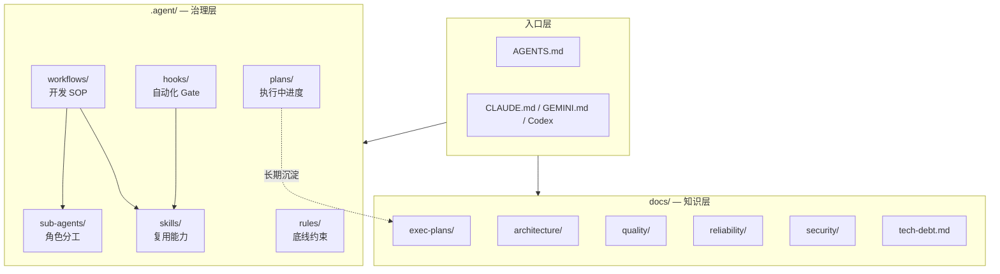
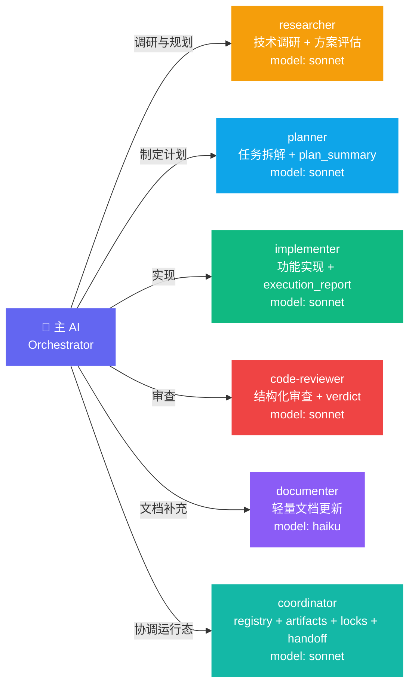
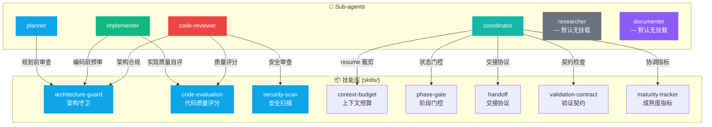
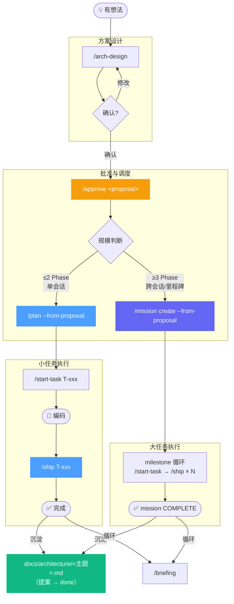
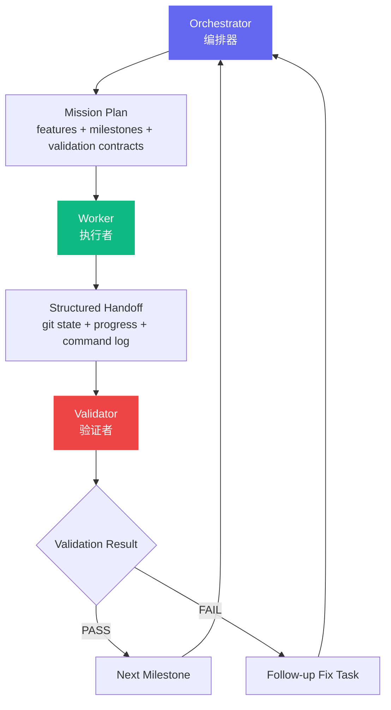
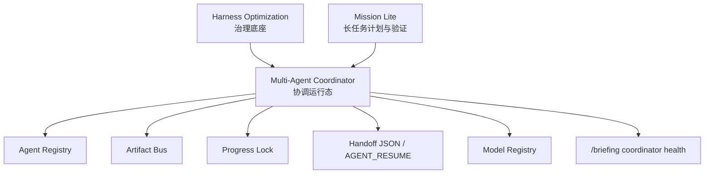
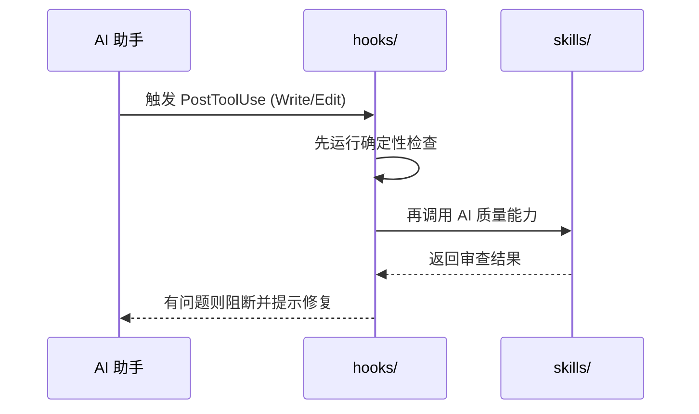

# Cortex Agent — 架构设计文档

本文档描述 Cortex Agent 当前的整体架构、知识分层、Sub-agent 角色，以及主要工作流的协作方式。

---

## 一、整体架构



**核心原则：**

- `.agent/` 是执行期治理的真理来源
- `docs/` 是长期知识资产的承接层
- 各 AI 工具通过入口文件读取同一套规则和知识，不维护多份分叉副本

---

## 二、目录职责一览

| 目录 | 职责 | 修改时机 |
| :--- | :--- | :--- |
| `rules/` | 定义 AI 必须遵守的底线（架构、代码、提交规范、语言约定） | 架构变更、新增语言规范时 |
| `workflows/` | 预定义开发场景的 SOP，通过斜杠命令触发 | 新增/优化开发流程时 |
| `skills/` | 封装可复用的复杂逻辑，供工作流和 sub-agent 调用 | 抽取通用能力时 |
| `sub-agents/` | 专职代理，有独立模型、工具权限和上下文边界 | 新增专业领域代理时 |
| `hooks/` | 事件驱动，在文件编辑、提交等关键操作前后自动执行 | 需要强制策略或自动化时 |
| `plans/` | 存储当前路线图和任务进度，让 AI 随时掌握项目状态 | 每次任务规划/交付时更新 |
| `.agent/plans/proposals/` | **执行期提案**：arch-design 产出的方案草案，含执行细节、状态流转；approved → in-progress 阶段持续更新 | 提案从 draft 推进到 done |
| `docs/architecture/` | **沉淀架构文档**：提案完成后提炼的纯净架构描述，去掉执行噪音，长期可查阅 | 提案状态变为 done 时精炼写入 |
| `docs/exec-plans/` | 记录跨会话、可追踪的执行计划资产 | 大任务启动、阶段切换或归档时 |
| `docs/quality/` | 记录质量标准、质量度量和后续 lint 策略 | 质量规则收敛时 |
| `docs/reliability/` | 记录可观测性、运行时验证与可靠性实践 | 增加验证与观测能力时 |
| `docs/security/` | 记录安全边界、扫描与治理策略 | 安全策略明确化时 |
| `docs/tech-debt.md` | 统一记录已知债务及偿还路径 | 发现结构性债务时 |

---

## 三、Sub-agent 架构

### 3.1 代理总览



### 3.2 代理职责与触发方式

| Sub-agent | 模型 | 职责 | 触发方式 |
| :--- | :--- | :--- | :--- |
| `planner` | sonnet | 任务拆解、依赖分析、制定实施计划，输出 `plan_summary` | `/start-task` 自动调用 |
| `implementer` | sonnet | 独立完成功能编码，包含单元测试与实现报告 | `/ship` 默认流水线；并行任务中可实例化多个 |
| `researcher` | sonnet | 技术调研、方案对比、可行性评估（只读） | `/start-task` 默认前置调研；复杂任务可独立派发 |
| `code-reviewer` | sonnet | 架构合规、代码质量、安全和结构化 verdict 输出 | `/ship`、`/code-review` 自动调用 |
| `documenter` | haiku | 轻量文档更新，如 README / API 文档 / CHANGELOG | `/ship` 或手动流程按需调用 |
| `coordinator` | sonnet | 多 agent / 多模型运行态协调，输出 `coordination_report`，覆盖 registry、artifact bus、lock、handoff 和 resume 决策 | `/mission`、`/handoff`、`/parallel` preflight、`/briefing` health |

---

## 四、Skills 与 Sub-agent 挂载关系

每个 Sub-agent 只挂载它职责范围内**确实需要**的技能，避免权限过宽。



### 挂载逻辑说明

| Sub-agent | 挂载的 Skills | 挂载原因 |
| :--- | :--- | :--- |
| `planner` | `architecture-guard` | 规划阶段先确认任务边界与架构约束 |
| `implementer` | `architecture-guard` + `code-evaluation` | 编码前审查结构，编码后做实现质量自评 |
| `code-reviewer` | `architecture-guard` + `code-evaluation` + `security-scan` | 审查阶段同时覆盖架构、质量和安全 |
| `coordinator` | `context-budget` + `phase-gate` + `handoff` + `validation-contract` + `maturity-tracker` | 多 agent 运行态协调、恢复决策和健康度报告 |
| `researcher` | 无 | 保持只读调研，避免角色越界 |
| `documenter` | 无 | 专注轻量文档同步 |

除 sub-agent 挂载的技能外，仓库还保留直接调用型技能，用于维护知识与治理资产，例如 `knowledge-lint` 与 `doc-gardening`。

---

## 五、完整开发链路



> **推荐节奏**：`/briefing` 同步上下文 → `/arch-design` 收敛方案 → `/approve` 批准并调度 → 小任务走 `/plan + /start-task + /ship`，大任务走 `/mission` → 完成后沉淀到 `docs/architecture/`。

> **提案生命周期**：`draft`（arch-design 产出）→ `approved`（/approve 写入）→ `in-progress`（执行中）→ `done`（沉淀后）。提案文件在 `.agent/plans/proposals/`，沉淀文档在 `docs/architecture/`，两者互不替代。

### 工作流命令速查

| 命令 | 用途 | 典型场景 |
| :--- | :--- | :--- |
| `/configure` | 初始化项目配置 | 首次接入 |
| `/approve` | 批准架构提案，按规模调度到 /plan 或 /mission | arch-design 完成、方案已确认时 |
| `/briefing` | 同步当前上下文与任务状态 | 每日开工、跨会话恢复 |
| `/arch-design` | 架构方案设计与评审 | 新功能/重构前收敛方案 |
| `/plan` | 任务拆解与实施计划 | 功能开发启动 |
| `/start-task` | 启动具体任务执行 | 进入编码阶段 |
| `/prototype` | 从需求描述生成文档型原型（Mermaid + Anime.js）或 UI 型原型（Pixso MCP），输出 validation-contract | 需求确认前视觉锚点、UI-heavy 项目早期原型验证 |
| `/ship` | 代码审查、提交、交付 | 完成编码后交付 |
| `/handoff` | 跨 Agent / 跨会话的轻量交接 | Agent 切换、长任务中断恢复 |
| `/mission` | 长周期多阶段任务编排 | 多天、多功能大任务 |
| `/bug-fix` | 聚焦单点 bug 修复 | 快速修复 |
| `/scan-project` | 生成/更新项目模块参考文档 | 大规模重构后同步知识库 |

---

## 六、Mission Lite 长周期任务编排

Mission Lite 是 Cortex Agent 面向长周期、多功能、多里程碑任务的编排层。它借鉴 Factory Missions 的可靠性思想，但保持 Cortex 的轻量架构：不引入新的运行时依赖，不把所有任务都升级为重型流程，只在任务规模超过普通 `/start-task` + `/ship` 能稳定承载时启用。

详细设计见 [Mission Lite 架构设计方案](architecture/mission-lite-design.md)。

### 6.1 适用边界

| 场景 | 推荐流程 |
| :--- | :--- |
| 单点 bug、单文件修复、轻量文档更新 | `/bug-fix` 或直接 `/ship` |
| 一个明确功能、可在单次上下文内完成 | `/start-task` → `/ship` |
| 多功能、多子系统、需要数小时到数天推进 | Mission Lite |
| 跨 Agent 或跨会话切换 | `/handoff` |

Mission Lite 的目标不是最大化并行，而是最大化长周期任务的稳定性。默认策略是：代码修改串行，研究、验证和文档类工作可并行。

### 6.2 三角色模型



| 角色 | 职责 | 不做什么 |
| :--- | :--- | :--- |
| Orchestrator | 拆解 features / milestones，维护任务顺序，创建修复任务 | 不直接写业务代码 |
| Worker | 在干净上下文中实现单个 feature，提交结构化结果 | 不重写 mission 计划，不扩大范围 |
| Validator | 按验证契约做对抗式检查，运行测试和必要的 runtime 验证 | 不依赖 Worker 的自我解释 |

### 6.3 核心产物

Mission Lite 应把状态写入文件，而不是依赖对话记忆：

```text
.agent/missions/M-xxx/
├── mission-plan.md
├── validation-contract.json
├── command-log.md
├── milestones/
│   └── MS-001.md
└── handoffs/
    └── YYYYMMDD-HHMMSS-{focus}.md
```

| 产物 | 作用 |
| :--- | :--- |
| `mission-plan.md` | 记录 feature、milestone、顺序、范围和退出条件 |
| `validation-contract.json` | 记录可执行或可审查的验收断言 |
| `command-log.md` | 记录命令、exit code、结果和后续动作 |
| `milestones/*.md` | 记录每个 checkpoint 的状态、验证结论和修复项 |
| `handoffs/*.md` | 复用 `/handoff` 的通用交接模板 |

### 6.4 验证契约

Mission Lite 要求计划阶段先产出验证契约，再允许进入实现。契约不追求一次性覆盖所有细节，但必须让 Validator 有明确检查依据。

```json
{
  "mission_id": "M-001",
  "milestone_id": "MS-001",
  "assertions": [
    {
      "id": "VC-001",
      "type": "test",
      "command": "npm test -- auth",
      "assertion": "invalid password returns 401",
      "blocking": true
    },
    {
      "id": "VC-002",
      "type": "docs",
      "assertion": "public API changes are reflected in INTERFACES.md",
      "blocking": true
    },
    {
      "id": "VC-003",
      "type": "runtime",
      "assertion": "primary UI flow renders and completes without console errors",
      "blocking": false
    }
  ]
}
```

验证契约的来源应优先复用现有资产：

- `.agent/plans/context-manifest.json` 提供相关上下文范围
- `docs/reliability/*` 提供 runtime evidence 和浏览器验证模板
- `.agent/rules/integration-safety.md` 提供接口契约一致性要求
- `/handoff` 提供跨 Agent / 跨会话的结构化交接格式

### 6.5 执行策略

Mission Lite 的默认状态流：

```text
SCOPE → PLAN → CONTRACT → EXECUTE_FEATURE → HANDOFF → VALIDATE_MILESTONE → FIX_OR_ADVANCE → COMPLETE
```

关键约束：

- `CONTRACT` 必须早于 `EXECUTE_FEATURE`
- 每个 milestone 结束必须验证
- Validator 只读取计划、验证契约、diff、命令日志和必要源码
- Worker 的自然语言解释不能作为验证依据
- 失败时由 Orchestrator 创建 follow-up fix task，而不是让 Worker 无限自修
- 命令执行必须记录 exit code；未运行的命令也要记录原因

### 6.6 与现有工作流的关系

| 现有能力 | Mission Lite 中的角色 |
| :--- | :--- |
| `/start-task` | 仍用于启动单个 feature 或 fix task |
| `/ship` | 仍用于单个任务交付；Mission Lite 在 milestone 层聚合多个 `/ship` 结果 |
| `/parallel` | 仅用于只读研究、验证和明确无共享文件的任务 |
| `/handoff` | 作为 Worker / Validator / 新会话之间的标准交接格式 |
| `phase-gate` | 后续可扩展为 Mission 状态转换前置检查 |
| `knowledge-lint` / `doc-gardening` | Mission 完成后维护知识资产健康度 |

---

## 七、Multi-Agent Coordinator 多智能体协调层

Multi-Agent Coordinator 是 Cortex Agent 下一阶段的完整主线，目标是在多 agent / 多模型 / 多会话切换时，提供统一的 agent 登记、结构化产物、进度锁、handoff 协议和恢复路径。

详细设计见 [Multi-Agent Coordinator 设计](architecture/multi-agent-coordinator.md)。

### 7.1 与 Harness / Mission Lite 的关系



| 层级 | 负责 | 不负责 |
| :--- | :--- | :--- |
| Harness Optimization | `.agent/` 治理、`docs/` 知识层、workflow / skill / sub-agent 边界 | agent 调度、文件锁、运行态状态 |
| Mission Lite | mission scope、milestone、validation contract、command log、验证证据 | agent registry、artifact bus、lock、跨模型 resume |
| Multi-Agent Coordinator | registry、artifact bus、progress lock、handoff JSON、model preference、resume 决策 | 重写 mission scope、替代 `/ship`、替代业务实现 |

### 7.2 核心构件

| 构件 | 作用 |
| :--- | :--- |
| Agent Registry | 记录哪些 agent 在跑、负责什么任务、使用什么模型、当前状态是什么 |
| Artifact Bus | 统一保存 plan / execution / review / validation / handoff 等结构化产物引用 |
| Progress Lock | 防止多个 agent 并发修改同一任务或同一文件 |
| Handoff Protocol | 同时提供人可读 Markdown 与 agent 可消费 JSON |
| Model Registry | 记录模型能力、上下文窗口、成本和偏好，辅助 handoff 接手决策 |

### 7.3 推进顺序

Coordinator 保持完整目标，但按阶段交付：

```text
T-C01A -> T-C02 -> T-C03/T-C04 -> T-C05/T-C06 -> T-C07/T-C08 -> T-C09/T-C10
```

其中 `T-C01A` 负责前置架构对齐；`T-C02` 开始定义 `coordinator` sub-agent；`T-C09` 必须验证 Claude -> Codex 的真实交接场景。

---

## 八、Hooks 触发机制



当前注册的 Hooks：
- `PostToolUse(Write, Edit)` → 确定性检查优先，再触发 AI 审查
- `PostCommit` → 轻量熵治理与自动清理

---

## 九、版本与演进

架构变更时，请至少同步以下资产：

- `docs/architecture.md`
- `docs/architecture/*.md`
- `.agent/plans/task-progress.md`
- `docs/exec-plans/active/` 或 `docs/exec-plans/completed/`
