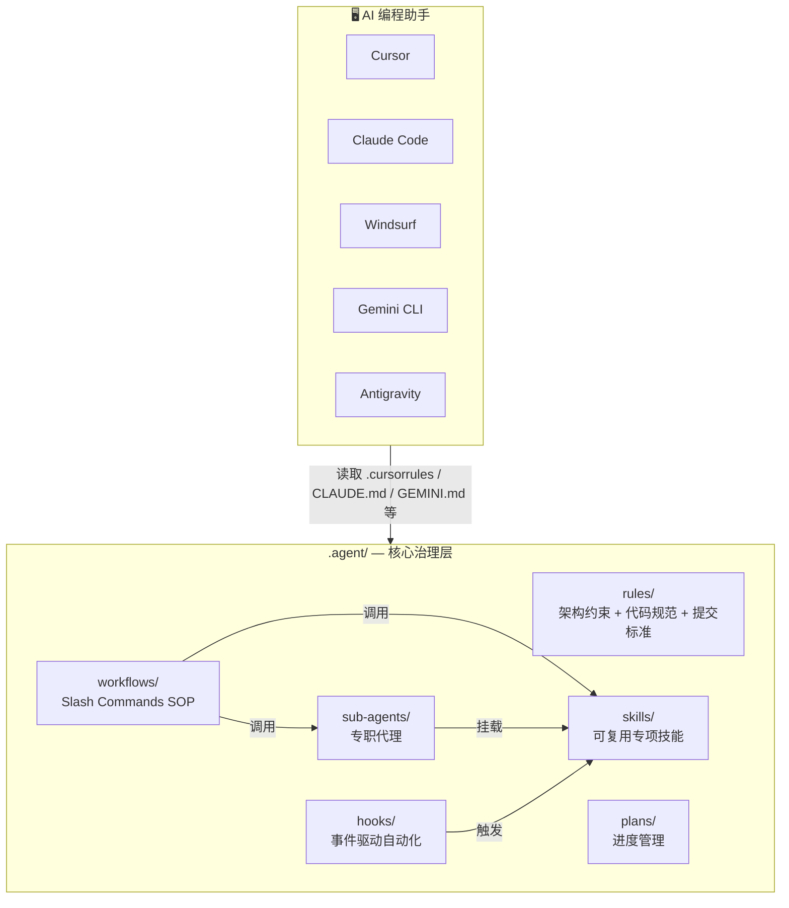
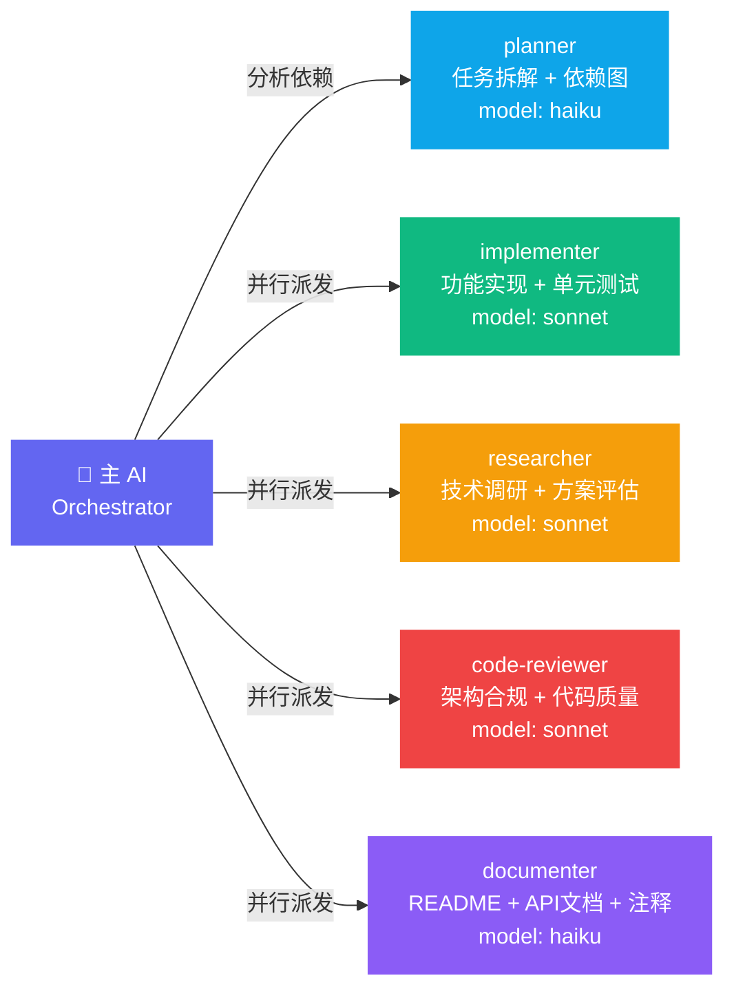
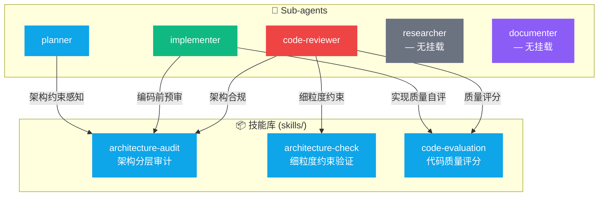
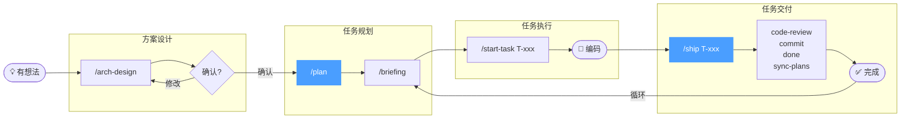
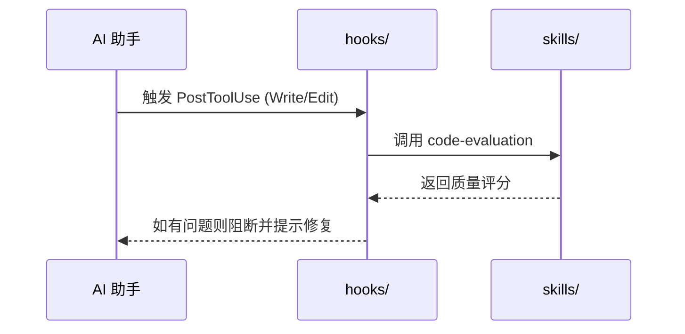

# Cortex Agent — 架构设计文档

本文档描述 Cortex Agent 框架的整体架构、模块职责，以及 Sub-agent 与 Skills 的协作关系。

---

## 一、整体架构

**设计原则：** `.agent/` 是唯一的真理来源 (Single Source of Truth)。各 AI 工具通过各自的配置入口文件读取同一套治理规则，无需重复维护。

---

## 二、目录职责一览

| 目录 | 职责 | 修改时机 |
| :--- | :--- | :--- |
| `rules/` | 定义 AI 必须遵守的底线（架构、代码、提交规范、语言约定） | 架构变更、新增语言规范时 |
| `workflows/` | 预定义开发场景的 SOP，通过斜杠命令触发 | 新增/优化开发流程时 |
| `skills/` | 封装可复用的复杂逻辑，供工作流和 sub-agent 调用 | 抽取通用能力时 |
| `sub-agents/` | 专职代理，有独立模型、工具权限和上下文边界 | 新增专业领域代理时 |
| `hooks/` | 事件驱动，在文件编辑、提交等关键操作前后自动执行 | 需要强制策略或自动化时 |
| `plans/` | 存储路线图和任务进度，让 AI 随时掌握项目状态 | 每次任务规划/交付时更新 |

---

## 三、Sub-agent 架构

### 3.1 代理总览

### 3.2 代理职责与触发方式

| Sub-agent | 模型 | 职责 | 触发方式 |
| :--- | :--- | :--- | :--- |
| `planner` | haiku | 任务拆解、依赖分析、制定实施计划 | `/start-task`、`/parallel` 自动调用 |
| `implementer` | sonnet | 独立完成功能编码，包含单元测试 | `/parallel` 派发 |
| `researcher` | sonnet | 技术调研、方案对比、可行性评估（只读） | `/parallel` 派发 |
| `code-reviewer` | sonnet | 架构合规、代码质量、性能检查 | `/ship`、`/code-review` 自动调用 |
| `documenter` | haiku | 同步 README、API 文档、注释、CHANGELOG | `/parallel` 派发 |

---

## 四、Skills 与 Sub-agent 挂载关系

每个 Sub-agent 只挂载它职责范围内**确实需要**的技能，避免权限过宽。

### 挂载逻辑说明

| Sub-agent | 挂载的 Skills | 挂载原因 |
| :--- | :--- | :--- |
| `planner` | `architecture-audit` | 制定计划前感知架构约束，确保任务边界合理 |
| `implementer` | `architecture-audit` + `code-evaluation` | 编码前架构预审，编码后自评实现质量 |
| `code-reviewer` | `architecture-audit` + `architecture-check` + `code-evaluation` | 三技能联动：整体架构 + 细节约束 + 质量评分 |
| `researcher` | 无 | 只读调研，不涉及架构决策 |
| `documenter` | 无 | 专注文档写作，无需架构判断 |

---

## 五、完整开发链路

> **每日节奏**：早上 `/briefing` → 开启 `/start-task` → 完成后 `/ship` → 第二天继续。

---

## 六、Hooks 触发机制

当前注册的 Hooks：
- `PostToolUse(Write, Edit)` → 自动调用 `code-evaluation`，实现写完即检

---

## 七、版本与演进

架构变更时，请同步更新本文档，并在 `task-progress.md` 中记录对应任务。
