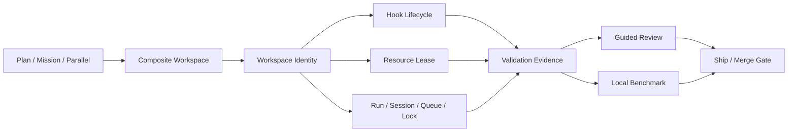

# Agent Workspace Orchestration

## Position

Cortex Agent remains an Agent governance protocol. It adopts workspace lifecycle, isolation, review evidence, and multi-repository coordination without becoming a desktop Agent host, terminal emulator, editor, or model proxy.

## Contract layers



- `WorkspaceIdentity` correlates one repository worktree with its owner, task, Mission, Run, Session, Queue, Lock, hooks, leases, and failure state.
- `HookLifecycle` records setup/run/teardown authorization and state. The state tool does not execute arbitrary shell commands; the owning workflow executes project commands.
- `ResourceLease` provides owner-checked local claims for ports, namespaces, cache prefixes, paths, sockets, and processes. External effects require an approved Decision reference.
- `CompositeWorkspace` correlates two or more repositories while preserving independent Git histories, commits, validation, and merge approvals.

## Lifecycle and safety

Workspace, hook, lease, and composite records use temporary sibling files followed by atomic rename. State is preserved for recovery instead of being deleted after failure.

Hook output must be redacted. Retries and timeouts are bounded. External side effects require an exact Decision. Read-only stale scanning may mark a lease stale but cannot release or delete it.

## Cross-repository merge boundary

Cross-repository merge is never atomic. Each member has its own repository ID, workspace ID, base/head commit, validation refs, and merge Decision. A Decision is accepted only when its resource identifies the exact composite workspace, repository, and head revision:

```text
composite:<composite-id>:repo:<repository-id>:revision:<head-commit>
```

The composite layer records ordered checkpoints and the next recovery target. A failed member blocks the composite; it cannot be silently treated as complete.

## Agent review and benchmark

The `agent-review-benchmark` skill produces two deterministic artifacts:

- Guided Review groups files by intent and records impact, risk, validation evidence, and follow-ups with Task/Run/Session/Workspace/revision identities.
- Local Benchmark scores explicit versioned assertions with integer arithmetic and reports quality, cost, and duration separately.

No external LLM judge is required by default. Worker prose is not evidence, and repeated generation from the same input must be byte-identical.

## Compatibility

The feature is additive. Projects without workspace state continue using existing `/worktree` behavior. The outer CLI remains zero-dependency, `.agent/` remains the source of truth, and English/Chinese templates carry byte-identical machine contracts and scripts.
