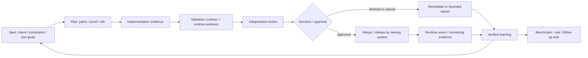

# AI-Native SDLC Governance

## Position

Cortex Agent extends its existing Task Pipeline, Artifact Bus, Validation Contract, Decision/Waitpoint, Run journal, worktree and review/benchmark capabilities into a closed-loop governance protocol: intent and constraints → spec → plan → implementation → validation and independent review → human approval → runtime evidence and learning feedback. The feature is additive. It does not introduce a parallel state machine, a model provider, an agent loop, an arbitrary executor, a CI/CD platform, or a production deployment control plane.

`P-001 Closed-Loop Governance` is the architecture proposal that drives this capability. Mission `M-032` (status: completed on 2026-08-27) landed three milestones that turn the proposal into reviewable evidence:

- **MS-001 (contract freeze)** — risk-tier policy contract, template parity in English/Chinese, fixture-friendly schema updates.
- **MS-002 (guided review and continuous evaluation pilot)** — sanitized benchmark fixtures, proof-carrying independent review, and learning-candidate recording against explicit targets.
- **MS-003 (opt-in runtime feedback pilot)** — a strictly non-production signal (CI flaky-test rate) wired through a versioned schema, deterministic detector, and audit record. Diagnostic identity has no write or release privilege.

## Contract layers

The loop binds seven artifact kinds together. None of them is authoritative on its own — completion, risk, waiver, and runtime claims all require an artifact reference, command output, or an approved human Decision:

- **spec** records the human-confirmed problem statement, scope, non-goals, constraints, and open questions.
- **plan** records the writable scope, validation commands, risk rationale, and deviation policy.
- **implementation** evidence pins changes to a plan reference and the diff or commit that materialised them.
- **validation** binds to a contract, command transcripts, runtime evidence, and the drift-check result.
- **review** carries risk tier, independent reviewer identity, proof-carrying findings, and the verdict.
- **decision** names the task, the proposal revision, the risk, the action, and the resource scope. It is the only path to a merge, release, deployment, or external side effect.
- **learning** records the source event, the human confirmer, the target (rule, benchmark fixture, follow-up task, or waiver), and a verification plan.

## Risk matrix

Every task starts at Medium. Promotion to a higher or lower tier requires evidence and explicit reasoning recorded in the plan.

| Tier | Typical change | AI may | Required gate | Prohibited without named approval |
| :--- | :--- | :--- | :--- | :--- |
| Low | Documentation, scoped non-sensitive fixes, small changes covered by tests | plan, implement, deterministic validation, routine review | scope + validation; project policy may require review | cannot use Low to bypass protected branches or host privileges |
| Medium | Multi-module change, dependency upgrade, reversible migration | prepare implementation and evidence, per-area review | final plan, validation, independent review | cannot extend writable scope without a recorded deviation |
| High | auth, permission, data flow, security, irreversible migration, external side effect | prepare plans, restricted implementation, evidence and PR | architecture / owner Decision, strengthened validation, independent / human review | no merge, release, or high-impact execution without a named approval |
| Critical | production secrets, production data deletion, regulated flows, production release | read-only diagnosis and draft plans only | explicit named Decision, environment gate, manual execution or pre-approved runbook | agents must not execute, delegate to other agents, or expand privileges |

Unknown classification, cross-environment work, or unclear agent-to-agent privilege chains default to High.

## Lifecycle and safety

### Decision and Waitpoint binding

Authority boundaries are enforced by paired Decision and Waitpoint records. A Decision names the resource (task, proposal revision, action, environment), and a released Waitpoint confirms that the named human or owner has authorised it. Until both records exist, the action remains blocked:

- Merge, release, push, publish, deploy, credential access, and any destructive action require a named human Decision with an environment- and revision-scoped resource reference.
- Runtime triggers never grant authority. A trigger can only observe, diagnose read-only, or draft a proposal — see MS-003 below.
- Agent-to-agent messaging is treated as part of the privilege chain. Allowlist routing, single-purpose identities, and audit constraints apply.

### Risk-tier policy contract

Phase A (MS-001) froze the risk-tier policy contract as a versioned, additive surface:

- Four tiers (Low, Medium, High, Critical) with explicit minimum gates, evidence, review and prohibited-action tables.
- Default-on-Medium rule and explicit downgrade requirements.
- Bilingual template parity (English / Chinese) and an additive upgrade behavior that keeps older projects working.
- Drift-check rule: Phase A introduces no runtime, deployment controller, provider, or parallel intent system.

### Guided review and continuous evaluation

Phase B (MS-002) established the review and evaluation pilot:

- Independent reviewers operate with a fresh context limited to spec, plan, diff, validation evidence, and allowed historical cases. They do not inherit the implementation session.
- Findings must reference evidence and ship with a reproducible proof or an explicit manual verification step.
- Local, versioned, sanitized benchmark fixtures replay deterministic validation, scope, review, and regression signals. Benchmark output is not a merge or release authority.
- A learning candidate carries a human-confirmed target: rule, fixture, follow-up task, or waiver. Unconfirmed candidates never write to global rules or expand agent privileges.

### Opt-in runtime feedback

Phase C (MS-003) introduced a strictly opt-in non-production signal (CI flaky-test rate) wired through a versioned schema, deterministic detector, and audit record. The pilot binds three capabilities only:

| Capability | What the pilot can do | What it cannot do |
| :--- | :--- | :--- |
| Observe | record evidence | invoke any agent |
| Diagnose | emit a read-only diagnosis | write code, publish, or change state |
| Propose | emit a draft spec, task, or PR | execute or expand privileges |

Every invocation records agent identity, task and operation references, rule version, input evidence, allowed tools, output artifact, and the associated Decision/Waitpoint references. The schema enforces `allowed_tools: []`, `message_route: "none"`, and `additionalProperties: false`. The detector script imports only `node:fs` and `node:path`. Architecture guard audit reports zero violations across the audited source tree at MS-003 close.

## Audit

- Three milestones closed with independent reviewer verdict PASS and no must-fix findings.
- Architecture guard audit reports zero violations across 1275 source files (post-Phase X).
- All work was bound to the proposal P-001 revision digest and to the released waitpoint. No merge, release, push, publish, deploy, credential, destructive, or external-side-effect operation was performed.
- The pilot scope, capability, and resource reference are recorded by paired Decision and Waitpoint with an explicit `valid_until` date and reviewer identity.

## Compatibility

- Additive only. Projects that do not opt into risk-tier review, independent reviewer, or runtime feedback continue to work with existing Task Pipeline and Ship workflows.
- English / Chinese templates carry byte-identical machine contracts and scripts.
- The architecture guard rule set is additive; existing audit messages continue to apply.
- The runtime feedback pilot is opt-in per signal. New signals require a new paired Decision and Waitpoint with explicit capability, environment, and reviewer constraints.
- Subsequent external actions (push, pull request, merge, release, deployment, credential access) each require their own resource-bound Decision and Waitpoint. Mission closeout does not pre-authorise them.

## Evidence pointers

Local references below are paths inside this repository. They are pointers, not required reading entries — the developer-facing flow above stands on its own:

- Mission plan and review: `M-032/mission-plan.md`, `M-032/review.md`.
- Validation contract: `M-032/validation-contract.json`.
- Milestone evidence: `M-032/milestones/MS-001.md`, `MS-002.md`, `MS-003.md`.
- Governance evidence for MS-002 and MS-003: `T-AINSDLC-001/004-ms002-benchmark-input.json` ... `T-AINSDLC-001/016-ms003-independent-review.json`.
- Decision and Waitpoint for the MS-003 pilot: `decisions/D-M032-MS003-runtime-pilot-5f9b7e2a.json`, `waitpoints/WP-M032-MS003-runtime-pilot-5f9b7e2a.json`.
- Local commits: `d78fb7e` (MS-001 risk-tier policy contract) and `219b2f2` (MS-003 opt-in runtime feedback pilot) on branch `agent/M-032-ai-native-sdlc`.
