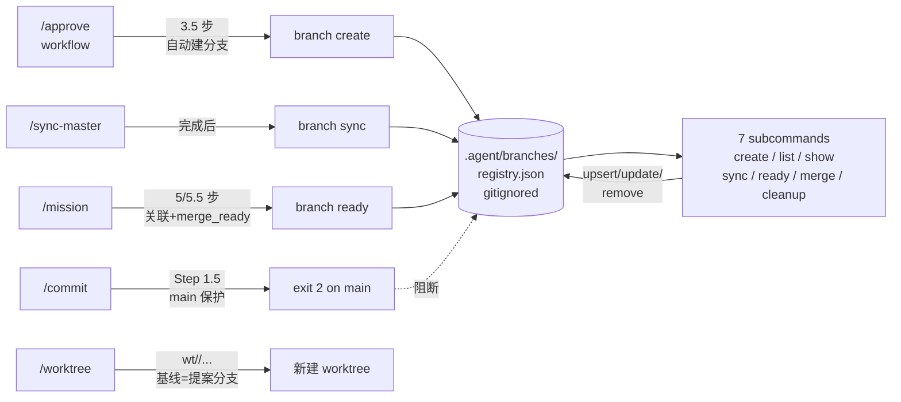

# Branch Management Design

> **Status**: M-016 COMPLETE (2026-08-06)
> **Spec**: `.agent/plans/proposals/cortex-agent-branch-management-proposal.md`
> **Implementation**: `feat/branch-management` (commits `f03e3e8` / `88ff629` / `a3abcb8`)
> **Audience**: future developers + agents who need to understand or extend the branch governance capability

## 1. 概述

cortex-agent 引入完整分支治理底座：命名规范、提案-分支自动绑定、注册表原子 I/O、CLI `branch` 子命令簇、main 分支保护、过期分支检测、5 个 workflow 集成。补齐了「提案被批准后不会自动建分支」「分支命名无统一规范」「main 没有保护」三个长期缺口。

三个 commit 的语义分工：

| Commit | MS | 范围 |
|---|---|---|
| `f03e3e8` | MS-001 | 数据底座：注册表 + 命名校验（`lib/branch-registry.js` + `lib/branch-naming.js`）|
| `88ff629` | MS-002 | CLI 暴露：7 个 `branch` 子命令（`lib/commands/branch.js` + `bin/cli.js` 路由）|
| `a3abcb8` | MS-003 | 5 workflow 集成：`/approve` / `/sync-master` / `/commit` / `/mission` / `/worktree` |

## 2. 架构图

## 3. 三层组件

### 3.1 数据层（MS-001）

**`lib/branch-registry.js`**：注册表原子 I/O

- `defaultRegistry()` 返回 `{ schema_version: 1, updated_at, branches: {} }`
- `readRegistry(cwd, options)` 含损坏恢复（备份 + 原子写回空 schema）
- `writeRegistry(cwd, registry)` 走 `tmp-${pid}-${ts}` + `renameSync`（原子写）
- 字段：`name` / `type` / `base_branch` / `base_commit` / `created_at` / `proposal_ref` / `mission_id` / `task_id` / `status` / `last_sync` / `commits_ahead` / `worktree_path` / `purpose` / `merged_commit` / `shipped`
- 状态白名单：`active` / `merge_ready` / `merged` / `archived`
- 类型白名单：`feat` / `fix` / `release` / `hotfix` / `chore`

**`.agent/branches/registry.json`**：运行时数据，**gitignored**。每个 worktree 独立一份。

### 3.2 校验层（MS-001）

**`lib/branch-naming.js`**：命名规范校验器

- `validate(name)` 返回 `{ valid, reason? }`
- 规则（提案 §4.2）：kebab-case / 前缀白名单 / 总长 ≤ 60 / 禁任务 ID 主体
- helper：`slugFromProposal(path)` / `slugFromMissionId(id)`

### 3.3 CLI 层（MS-002）

**`lib/commands/branch.js`**：7 子命令 + 公共约定

| 约定 | 值 |
|---|---|
| Exit codes | 0=PASS / 1=用户错 / 2=门禁失败 / 3=系统错 |
| Stderr 前缀 | `[branch] <subcommand>:` |
| 输出格式 | 默认 human / `--json` 输出 JSON |
| 副作用 | 写操作走 MS-001 原子写 + `upsertBranch` 双重门禁 |

**`bin/cli.js`**：注册 `branch` 路由（strictly additive，+1 import +1 case）

## 4. 5 个 Workflow 集成点（MS-003）

| Workflow | 集成点 | 关键命令 |
|---|---|---|
| `/approve` | 批准后 3.5 步自动建绑定分支 | `cortex-agent branch create --from <proposal>` |
| `/sync-master` | 完成后 6 步更新注册表 | `cortex-agent branch sync <branch> --no-rebase` |
| `/commit` | Step 1.5 main 保护 | bash 片段 exit 2 on main/master |
| `/mission` | 5 步关联分支 + 5.5 步 mark merge_ready | `branch ready <branch>` 验证后 |
| `/worktree` | CREATE 步重写为 `wt/<slug>/<task-id>-<slug>`，基线=提案分支 | `git worktree add -b wt/... <path> feat/<proposal>` |

**自举样例**：`D-M002-self-bootstrap` 路径仍能跑通，approval 自动建分支后注册表 +1 条 entry。

## 5. 安全模型

### 5.1 4 个 merge fail-closed gates（VC-016-07）

| Gate | 触发 | 行为 |
|---|---|---|
| on main | `cwd HEAD == main/master` | exit 2 + stderr 「refusing to merge on main」 |
| dirty tree | `git status --short` 非空 | exit 2 + stderr 「working tree dirty」 |
| behind main | `commits_ahead < 0` | exit 2 + stderr 「behind main by N commits」 |
| not merge_ready | registry status != `merge_ready` | exit 2 + stderr 「status is active, must be merge_ready」 |

### 5.2 dry-run 0 字节改动（VC-016-06）

`branch cleanup --dry-run` 必须保证 `.agent/branches/registry.json` 0 byte / 0 mtime / 0 size 改动。三重校验（sha256sum + stat -f %m + size）确保 fail-closed。

### 5.3 原子写 + 损坏恢复（VC-016-01）

`writeRegistry` 走 `tmp-${pid}-${ts}` + `renameSync`；损坏时自动备份 + 写回空 schema，下次读是干净状态。

## 6. 验证矩阵

| MS | 测试 | 覆盖率 |
|---|---|---|
| MS-001 | 68/68 | line 95.63% / branch 84.68% / funcs 100% |
| MS-002 | 145/145 | line 95.15% / branch 82.06% / funcs 98.21% |
| MS-003 | 155/155 (10 workflow + 83 branch-cli + 37 branch-naming + 25 branch-registry) | (workflow docs 增量无 lib 改动) |
| MS-004 | 全量回归 + Architecture Guard | 0 fail / 0 new violation |

每个 MS 都有独立 Validator sub-agent 复核 5/5 PASS。

## 7. 已知边界

- **不实现** GitHub/GitLab 远程 Branch Protection API（仅管理本地行为，提案 §3.2 明确排除）
- **不强制** PR 流程（本地 merge 仍允许，但需通过 4 个 fail-closed gates）
- **不修改** `/worktree` 的任务级 worktree 语义，只在它之上叠加提案分支层
- **`.agent/` 整体 gitignored**——注册表是运行时数据，跨 worktree 不共享；每个 worktree 自己的 `.agent/branches/registry.json`
- **bin/cli.js** 改动 strictly additive（MS-002 落地 +1 import +1 case），不动其他子命令语义

## 8. 遗留迁移

2026-08-06 之前，`codex/codex-desktop-wakeup` 领先 main 117 commit。处理方式：`git branch -m codex/codex-desktop-wakeup main` 重命名收口为当前 main（HEAD `44108f2`，reflog 保留 rename 记录可追溯）。这是 M-016 §11.1 的实际执行结果，无需 M-016 单独处理。

## 9. 后续工作

- root session 拍板 merge `feat/branch-management` → `main`（标准 PR 流程）
- 未来 mission 可参考本设计 + handoff 模板，建立分支治理流程
- 监控 `branch cleanup --dry-run` 的 0 字节不变量（产品逻辑依赖）
- 未来扩展：GitHub Branch Protection API / PR review UI 集成（提案 §3.2 范围外）

---

**维护**：本文档是稳定架构真相，长期可读。任何 5 workflow 集成点变更、CLI 子命令行为调整、安全模型演化都要同步更新本文件。handoff artifact 在 `.agent/missions/M-016/handoffs/` 是临时交接产物，Mission COMPLETE 后可归档。
