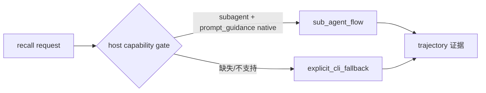

# Capability-Gated Auto Recall — metadata precheck 与能力门控召回 (P-001)

> **目的**: 为知识召回引入 host-capability 门控的自动 sub-agent 召回与 metadata-only 预检,在无能力宿主上保持显式 CLI fallback,并把召回证据统一接入既有 trajectory 回放体系。
> **状态**: P-001 shipped (2026-09-09, M-032 MS-001)
> **版本**: v1.0
> **关联**: [P-001 提案](../../.agent/plans/proposals/projects/team-knowledge-recall/proposals/P-001-auto-recall-sub-agent-proposal.md) · [M-032 MS-001](../../.agent/missions/M-032/milestones/MS-001.md) · [dsh-host-adapter.md](./dsh-host-adapter.md)
> **位置**: `templates/_shared/.agent/skills/knowledge-retrieval/` · `templates/_shared/.agent/sub-agents/cortex-recall.md` · `lib/runtime-adapters/capability-contract.js`

---

## 1. 背景与动机

知识召回（knowledge-retrieval skill）原先只能由主 agent 手动调用,存在三类问题:

- **无预检**: 每次召回都做全量检索,即使索引缺失/损坏/query 为空也照跑。
- **无宿主能力感知**: 是否值得用 sub-agent 自动召回、能否获得 prompt guidance,取决于宿主能力,但代码没有声明式契约。
- **证据弱**: 召回结果缺少可回放的结构化证据轨迹。

P-001 在 P-007 host capability descriptor 之上,把"召回路径"变成由宿主能力门控的选择:

- 支持 `subagent` + `prompt_guidance` 的宿主 → 能力门控自动召回（`sub_agent_flow`）。
- 不支持的宿主 → 显式 CLI fallback（`explicit_cli_fallback`）,绝不让 unavailable 伪装成 not_relevant。

---

## 2. 目标 / 非目标

### 目标

| # | Goal |
| :--- | :--- |
| G1 | metadata-only 预检:RELEVANT / NOT_RELEVANT / CHECK_UNAVAILABLE 三态,fail-closed |
| G2 | capability 门控:host 声明 `subagent` + `prompt_guidance` 才启用自动召回 |
| G3 | 显式 CLI fallback:无能力宿主走 `--check --query --task-id`,退出码 0 + 结构化 JSON |
| G4 | 证据回放:召回扫描与评分写入既有 trajectory 体系,可 replay |
| G5 | 隐私边界:metadata/trajectory 输出不含正文、prompt、命令负载或密钥 |

### 非目标（P-002 / P-003 范围,不实现）

- ❌ Team Pack `files[].projects` 项目范围维度（P-002,draft）
- ❌ friction telemetry / 被动学习（P-003,draft）
- ❌ 自动 sub-agent 调用:门控只决定"是否走 sub-agent 流程",实际调用仍需宿主工具授权

---

## 3. 架构

### 3.1 召回路径选择

门控判定位于 `lib/runtime-adapters/capability-contract.js`（P-007 HostCapabilityDescriptor）:

- 封闭词汇表 `CAPABILITY_NAMES`:新增 `subagent`、`prompt_guidance`(经 D-P007-TKR-CAP-EXT 授权扩展)。
- 封闭等级 `CAPABILITY_LEVELS`:`native|adapter|explicit|unobservable|unsupported`。
- `validateCapabilityDescriptor()` 冻结/归一化,schema version `1.0`。
- DSH host 声明两者为 `native`(证据:in-session subagent/subagent_fork 工具);Pi 等 absent host 声明 `unsupported`。

### 3.2 Metadata 预检

`recall.js --check --query <q> --task-id <id>`:

- 仅读取受限 metadata 索引(`.agent/metrics/recall-metadata.json`,closed-schema)。
- 三态:RELEVANT / NOT_RELEVANT / CHECK_UNAVAILABLE(缺索引/损坏索引/空 query/scorer 异常)。
- fail-closed:索引含正文等非元数据字段 → CHECK_UNAVAILABLE 且该条目不进入输出。
- 预检结果写入 `recall-check-result.json`,并记录 `scan` / `score` 两个 trajectory 步骤。

### 3.3 Sub-agent 契约

`templates/_shared/.agent/sub-agents/cortex-recall.md`:

- 输入:`--check --query --task-id`;仅做 metadata-only 预检 + 受限召回。
- 输出:`{verdict, doc_ids, sources, summary, trajectory_ref}`,summary 为 redacted 摘要。
- 决策规则:unavailable 不得误报为 not_relevant;LOW shortcut 仅在 RELEVANT 且 guidance 可用时使用。

### 3.4 证据

`retrieval-trajectory/scripts/record.js` 暴露可复用 `recordStep({root, taskId, action, ...})`,recall.js 直接复用,不新增状态机;trajectory 归既有 writer/reader 体系所有。

---

## 4. 验证

| 项 | 结果 |
| :--- | :--- |
| M-032 MS-001 断言 | 7/7 PASS(VC-001..006 + VC-DRIFT-001) |
| capability-gated recall E2E | 5/5 PASS |
| 合并后回归 | 93/93 PASS + architecture guard PASS |
| 提交 | 8459e035(feat(knowledge-retrieval),已合并 main) |
| 模板一致性 | recall.js / record.js 运行时=模板 |

---

## 5. 边界与后续

- P-002(project scope 维度)与 P-003(friction-assisted learning)为独立子提案,不在本文范围。
- 自动 sub-agent 调用不因门控而放开;调用本身仍需宿主授权(本会话内仅验证门控契约)。
