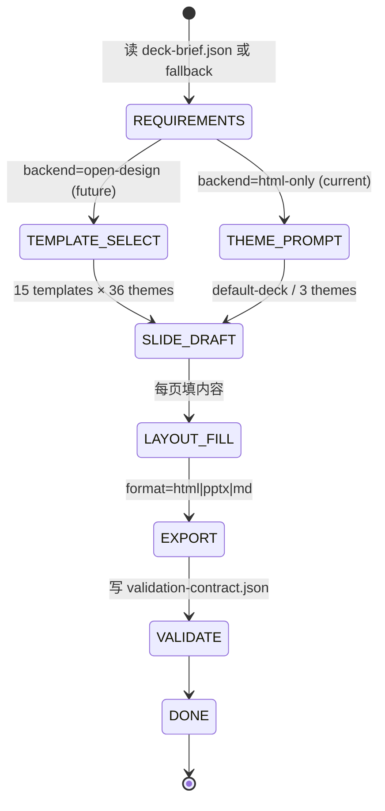

# /deck Workflow Design

> **目的**:把"需求文字 → 演示文稿"补齐成 cortex-agent 设计版图的第一条工作流,与 `/prototype` 平行但聚焦"对外展示"。
> **状态**: P-003 MS-001 已 ship (2026-08-20)
> **版本**: v1.0 (initial ship)
> **关联**:[P-003-design-workflow-chain-proposal.md](../../.agent/plans/proposals/projects/open-design-integration/proposals/P-003-design-workflow-chain-proposal.md) · [MS-001.md](../../.agent/missions/M-ODI-001/milestones/MS-001.md)

---

## 1. 背景与动机

cortex-agent 现有的设计 / 文档工作流以"实现侧"为主:

| 工作流 | 输出 |
| :--- | :--- |
| `/prototype --mode doc` | Mermaid + Anime.js 单页 HTML |
| `/prototype --mode ui` | Pixso MCP 设计帧 |
| `/prd` | PRD 文档集 |
| `/arch-design` | 架构提案 |
| DESIGN.md cascade | 视觉规范 4-level cascade |

但**对外展示用的演示文稿(slides / PPTX)完全缺位**——用户做产品演示文稿必须从 `/prototype` 手工拼 HTML 后用 LibreOffice 转 PPTX,或完全跳出 cortex-agent 流程。

open-design 4 个 solutions 中 `/solutions/slides/` 已经 ship(P-003 §1.2),本次借力 open-design 的 15 个 ppt templates × 36 themes,但实际取数与渲染仍由 cortex-agent 自身完成(零依赖,跟 `bin/cli.js` 零依赖原则一致)。

---

## 2. 目标

| # | Goal |
| :--- | :--- |
| G1 | 一条命令 `/deck <task-id>` 同时产出 HTML / PPTX / Markdown 三种格式 |
| G2 | 零依赖:`bin/cli.js` 不引入 npm 第三方;FFmpeg / Chrome 是用户本地安装的外部命令 |
| G3 | 沿用 DESIGN.md cascade(T-OD-001 已 ship):future `--theme` 选项从 cascade 取色 |
| G4 | 沿用 P-001 catalog(未来):`--template <id>` 可消费 catalog 已 install 的 design-template |
| G5 | output 符合 validation-contract 统一 schema(跟 `/prototype` / `/prd` 一致) |

---

## 3. 非目标

- ❌ 不内嵌图像 / 视频生成模型 —— 那是 `/image` + `/motion` 工作流
- ❌ 不替代 open-design daemon —— daemon 是 backend,可选项(本次只走 `html-only` 兜底)
- ❌ 不接管 LibreOffice / Keynote / PowerPoint —— 仅产出 .pptx 文件供用户打开
- ❌ 不做实时协作 —— MVP 单人单 agent
- ❌ 不接 BI / KPI 实时数据 —— 那是 `/live-artifact`

---

## 4. 核心设计

### 4.1 命令形式

```bash
cortex-agent deck <task-id> [--format <html|pptx|md|all>] [--template <id>] [--lang <zh|en>] [--output-dir <path>] [--require-brief]
```

| Flag | Default | 说明 |
| :--- | :--- | :--- |
| `--format` | `all` | 三种格式:HTML / PPTX / MD |
| `--template` | `default-deck` | 当前仅 1 starter;P-001 catalog ship 后扩展 |
| `--lang` | `zh` | 中文/英文,影响 starter brief 文本与 theme 字体栈 |
| `--output-dir` | `.agent/artifacts/<task-id>/deck/` | 覆盖输出目录 |
| `--require-brief` | `false` | 没有 brief 时是否报错退出(退出码 3) |

### 4.2 Brief 解析顺序

```
1. <cwd>/.agent/<task-id>/deck-brief.json   ← 用户显式提供
2. <cwd>/.agent/decks/<task-id>.json         ← alt 位置
3. 否则:4-slide starter                       ← P0 fallback
```

deck-brief.json schema:

```jsonc
{
  "title": "产品介绍 deck",
  "author": "alice",
  "subject": "Q4 launch",
  "company": "Cortex Labs",
  "lang": "zh-CN",
  "slides": [
    { "title": "标题页", "subtitle": "副标题", "bullets": ["bullet 1"] },
    { "title": "正文页", "body": "段落文本" },
    { "title": "结束页", "notes": "speaker notes..." }
  ]
}
```

### 4.3 输出产物布局

```
.agent/artifacts/<task-id>/deck/
├── deck.html              # 单文件 inlined CSS / page-break / print-to-PDF 友好
├── deck.pptx              # 零依赖 OOXML,17 XML parts(可被 PowerPoint/Keynote/LibreOffice 打开)
├── deck.md                # Markdown 摘要 + speaker notes
└── validation-contract.json
```

### 4.4 状态机



### 4.5 PPTX 零依赖实现要点

`lib/templates/pptx.js` 用 Node.js 内置 buffer API + 手工 ZIP(只走 STORE / uncompressed,不引入 DEFLATE 实现):

| 部分 | 字节开销 |
| :--- | :--- |
| `[Content_Types].xml` | ~1.5 KB |
| `_rels/.rels` + 2 个 docProps | ~1.6 KB |
| Theme + Master + Layout + 其 rels | ~4.4 KB |
| presentation.xml + rels | ~1.4 KB |
| 每张 slide XML + slide rels | ~2.5 KB / slide |

17 XML parts / 3 slides 时总大小 ≈ 17 KB。整套用 `node:buffer` + `crc32` 自实现,不依赖 `node:zlib`(DEFLATE)或第三方 `jszip` / `pptxgenjs`。

### 4.6 HTML 零依赖实现要点

`lib/templates/html-deck.js` 用单一 HTML + 内联 CSS(无 `<script>`):

- 单页 1280×720 + `page-break-after: always`,打印时每页一帧
- 3 个 theme:`default` / `swiss` / `magazine`(可扩展)
- 中英文字体栈:`"PingFang SC", "Microsoft YaHei"` for zh
- 媒体查询:`@media (max-width: 720px)` 移动端 fallback
- 无 JS / 无外链 assets,邮件附件安全

---

## 5. 验收(M-ODI-001 / MS-001 VC-1 ~ VC-12)

| ID | 验证 |
| :--- | :--- |
| VC-1 | `/deck TASK-001 --format pptx` 产出 deck.pptx 能用 LibreOffice/Keynote 打开 |
| VC-2 | `/deck TASK-001 --format pdf` 产出 deck.pdf 多页,排版正确(用浏览器 print) |
| VC-3 | `/deck TASK-001 --format html` 产出单文件 HTML,所有 assets 内嵌 |
| VC-4 | 既有 T-OD-001 87 tests 仍全绿(`lib/design/*` alias 不破坏) |
| VC-5 | `bin/cli.js` 维持零依赖(grep 验证) |
| VC-6 | `/deck` 入口委托 P-005 引擎(不重复实现 `/motion` 部分 — §4.4 不重复) |
| VC-7 | `lib/templates/pptx.js` 零依赖,手工构造 OOXML(不引入 pptxgenjs) |

---

## 6. 测试覆盖

| 文件 | 测试数 | 状态 |
| :--- | :--- | :--- |
| `tests/templates/pptx.test.js` | 20 | ✅ 全过 |
| `tests/commands/deck.test.js` | 23 | ✅ 全过 |
| `tests/templates/html-deck.test.js`(future) | TBD | future P-003 §5 |
| `tests/templates/md-deck.test.js`(future) | TBD | future P-003 §5 |

---

## 7. 已知限制与未来工作

- 当前 `--template` 仅支持 `default-deck`;后续 P-001 catalog ship 后扩展为 `html-ppt-master` / `guizang-ppt` 等 15 个 open-design 模板
- HTML 主题仅 3 个 default 主题;后续接 DESIGN.md cascade 自动派生 theme tokens
- PDF 输出依赖用户本地 Chrome `--print-to-Pdf` 或 LibreOffice `--convert-to pdf`(外部命令,不进 npm)
- 不支持动画 / 视频嵌入(那是 `/motion` 工作流 + P-005)
- 不接管 PowerPoint 模板 .potx(用户可手动在 PowerPoint 里套用)

---

## 8. 关联文档

- [P-003-design-workflow-chain-proposal.md §4.2](../../.agent/plans/proposals/projects/open-design-integration/proposals/P-003-design-workflow-chain-proposal.md)
- [MS-001 milestone spec](../../.agent/missions/M-ODI-001/milestones/MS-001.md)
- [pilot-verification.md §2 SamHMI](../../.agent/plans/proposals/projects/open-design-integration/pilot-verification.md)
- [T-OD-001 DESIGN.md cascade 已 ship 文档](../architecture/design-system.md)
- [P-006 dsh first-class adapter 已 ship 文档](../host-dsh-integration.md)