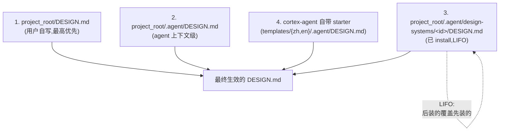
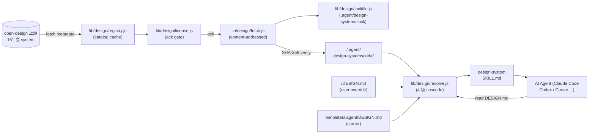

# Design System Integration Architecture

> **Status**: T-OD-001 architecture (approved 2026-08-04)
> **Source of truth**: `.agent/plans/proposals/design-system/cortex-agent-open-design-integration-proposal.md`
> **Task**: `.agent/tasks/T-OD-001.json` (active / implement / MS-001 in progress)
> **上游 / Upstream**: [nexu-io/open-design](https://github.com/nexu-io/open-design) (Apache-2.0, 151 design systems)
> **Audience**: cortex-agent maintainers + adapter authors + users adopting `cortex-agent design` CLI
> **Architecture constraint**: zero npm dependencies, additive-only, 4-level cascade, content-addressed lock file, license 强制 ack

---

## 1. TL;DR

cortex-agent 把 [open-design](https://github.com/nexu-io/open-design) 上游 151 套 design system 通过 `DESIGN.md` 格式接入,作为 AI agent 上下文级别的**视觉规范层**(brand identity / color roles / typography / spacing / components / motion / accessibility / anti-patterns)。任何 `cortex-agent init` 项目自动获得 7-section starter template,可选 `install` 上游 system。

**关键设计**:
- 4 级 cascade:`<cwd>/DESIGN.md` > `<cwd>/.agent/DESIGN.md` > install LIFO > starter
- Content-addressed lock file(`.agent/design-systems.lock`),SHA-256 校验,跨主机可复现
- License 强制 ack + brand category 警示
- 零 npm 依赖,纯 Node.js 内置模块
- 跟 prd-visualization / agent-dashboard-prd-ui 三层互补(规范 → 设计稿 → UI 渲染)

## 2. 背景 / Background

cortex-agent 当前链路覆盖从架构设计到研发交付,`.agent/` 是 single source of truth。但**设计系统(design system)层完全空白**:`.agent/` 没有 `DESIGN.md` 模板,没有 `design-systems/` 目录,没有 AI agent 上下文级别的"视觉规范"概念。

`prd-visualization` 提案引入 OpenPencil(节点树级"设计稿"),`agent-dashboard-prd-ui` 提案引入 dashboard UI 渲染。两者都是**设计稿/UI 渲染层**,缺少**设计规范层**。结果:研发环节的 AI agent 在生成 UI 代码时只能从对话上下文推断视觉风格,既不稳定也不可复现。

[open-design](https://github.com/nexu-io/open-design)(Apache-2.0) 是 Claude Design 的开源替代品,核心交付物 `DESIGN.md` 是一种"人/AI 都能读的视觉规范格式",并随仓库发布 **151 套**来自真实品牌的 design system(airbnb / ant / apple / claude / cursor / linear-app / spotify / stripe 等)。每个 system 是 `design-systems/<slug>/` 下一个标准 package:

```text
design-systems/<slug>/
├── manifest.json     # id, name, category, description, source.{type,origin,license}
├── DESIGN.md         # 7+ H2 section,品牌视觉意图 prose
└── tokens.css        # semantic-token 编译产物(可选)
```

## 3. 目标 / Goals

| # | Goal | 说明 |
|---|---|---|
| G1 | **模板占位** | `templates/{zh,en}/.agent/DESIGN.md` 提供 7-section starter,所有 `cortex-agent init` 项目自动获得 |
| G2 | **目录骨架** | `templates/_shared/.agent/design-systems/README.md` 解释 license / cascade / source |
| G3 | **registry + fetch** | 工具层能 content-addressed 拉取上游 151 套 system,记录 SHA-256 |
| G4 | **lock file** | `.agent/design-systems.lock` 锁住已 install system 的 hash,跨主机可复现 |
| G5 | **license 治理** | install 时强制展示 license + 来源,用户 ack 后才能继续;brand 类按 category 警示 |
| G6 | **cascade 解析** | 4 级 cascade 优先级 + LIFO 冲突解决 |
| G7 | **CLI 子命令** | `cortex-agent design {list,install,upgrade,show,remove,resolved,refresh-catalog}` |
| G8 | **Skill 集成** | `design-system` skill,任何 agent 可被引导消费 DESIGN.md |
| G9 | **默认安全** | 只 enable `default` + `warm-editorial` 起步器,brand 类需用户主动 install |
| G10 | **零依赖** | 全部用 Node.js 内置模块,`bin/cli.js` 不引入 npm 依赖 |
| G11 | **双语同步** | zh + en 模板 byte-identical 内容,docs 双语 |

## 4. 非目标 / Non-Goals

- **N1. 不 ship 上游 151 套 system 的本地副本** — content-addressed 拉取,避免 license 治理爆炸
- **N2. 不实现 visual rendering 后端** — 不是 OpenPencil / Figma 替代
- **N3. 不解析 `tokens.css`** — MVP 只读 `DESIGN.md` + `manifest.json`,tokens 透传不消费
- **N4. 不实现 MCP server 双向桥接** — Phase 2 再考虑
- **N5. 不修改 bin/cli.js 主体** — 走现有 case dispatch,加 1 个分支
- **N6. 不强校验 DESIGN.md 7-section** — upstream 接受 legacy DESIGN.md-only,保持兼容
- **N7. 不绑死 open-design 上游** — upstream URL 可配置,支持未来切换 / 私有 mirror
- **N8. 不替代 `cortex-agent design` 之外的视觉规范格式** — 只在 agent context 层引入 DESIGN.md

## 5. 核心设计 / Core Design

### 5.1 4 个核心决策(已与 Eric 拍板 / Decided)

| 维度 / Dimension | 决策 / Decision | 理由 / Rationale |
|---|---|---|
| License 治理 / License gate | **强制 ack / Mandatory ack** | install 时显示 license + 来源 + category,用户必须 `y`;brand 类按 category 警示 |
| Lock file 位置 / Lockfile location | **`.agent/design-systems.lock`** | 跟 .agent 体系一致,git 共享友好 |
| Cascade 优先级 / Cascade priority | **LIFO + 4 级 cascade** | 跟 npm 解析直觉一致;4 级:项目根 > .agent > install LIFO > starter |
| 默认 enable / Default enable | **只 enable `default` + `warm-editorial`** | 最小惊讶,brand 类需用户主动 install,降低 license 风险 |

### 5.2 4 级 Cascade 解析

任何时候,AI agent 实际消费的视觉规范由以下优先级决定(从高到低):



**冲突解决**:晚加载覆盖早加载,用户在 `cortex-agent design resolved` 中可看到完整 cascade 链。

### 5.3 数据流 / Data Flow



### 5.4 工具层(5 个 lib 模块)

```
lib/design/
├── registry.js   # 拉上游 catalog(API/CLI 探测),生成 catalog index
├── fetch.js      # content-addressed fetch(SHA-256 校验,MITM 防)
├── lockfile.js   # .agent/design-systems.lock 读写 + atomic write
├── license.js    # license 显示 / ack gate / category warning
└── resolve.js    # 4 级 cascade 解析 + LIFO 排序
```

| 模块 | 职责 | 关键约束 |
|---|---|---|
| `registry.js` | 拉上游 catalog,生成 `{id, name, category, license, source, sha256, path}[]` | 24h TTL 缓存,`refresh-catalog` 主动刷新 |
| `fetch.js` | content-addressed fetch | 纯 `https` / `http` / `node:fs`,hash 不匹配拒绝写入(防 MITM) |
| `lockfile.js` | `.agent/design-systems.lock` 读写 | atomic write(tmp + rename),`read / write / add / remove / upgrade` |
| `license.js` | license ack gate | 缺失 fail-closed(可 `--force`);brand category 警示 |
| `resolve.js` | 4 级 cascade + LIFO | 返回 `Array<{layer, source, sha256, weight}>` |

### 5.5 CLI 子命令

```bash
cortex-agent design list [--available | --installed] [--json]
cortex-agent design install <id>... [--yes] [--no-cache]
cortex-agent design upgrade [<id>] [--yes]
cortex-agent design remove <id>...
cortex-agent design show <id>
cortex-agent design resolved [--json]
cortex-agent design refresh-catalog
```

| Exit code | 含义 |
|---|---|
| 0 | 成功 |
| 1 | 通用错误 |
| 2 | 用户错误(invalid args) |
| 3 | 网络错误 |
| 4 | license 拒绝 |

### 5.6 Lock file 格式

路径:`<cwd>/.agent/design-systems.lock`

```json
{
  "lockfileVersion": 1,
  "schemaVersion": "od-design-system-project/v1",
  "fetched_at": "2026-08-04T...",
  "upstream": "https://raw.githubusercontent.com/nexu-io/open-design/main",
  "systems": [
    {
      "id": "default",
      "sha256_manifest": "ab12...",
      "sha256_design": "cd34...",
      "sha256_tokens": "ef56...",
      "license": "Apache-2.0",
      "category": "Starters",
      "source": { "type": "upstream", "origin": "nexu-io/open-design" },
      "fetched_at": "2026-08-04T..."
    }
  ]
}
```

- **commit-friendly**:lock file 应提交到 git,确保 team 共享同一份已 install system
- **content-addressed**:相同 SHA-256 不重复 fetch
- **upgrade 主动动作**:`cortex-agent design upgrade` 拉新 hash 与 lock 对比,显示 delta

## 6. 跟现有架构的关系 / Relationships

### 6.1 跟 M-003 plugin CLI 的关系

M-003 ship 了 `cortex-agent plugin {list,install,show,run,...}`,open-design 上游有 `od plugin` 体系。本次**不复用** M-003 plugin CLI,因为 plugin 跟 design system 是不同抽象:

| 维度 | Plugin | Design System |
|---|---|---|
| 抽象 | 可执行 / 可运行的工作流 | 静态规范文件 |
| 核心文件 | SKILL.md | DESIGN.md + manifest.json + tokens.css |
| 用途 | 跑任务 | 规范 agent 输出 |
| Cascade | 注册到 .agent | 4 级 cascade |
| 治理 | M-002 `lib/agents/registry.js` | 本次新增 `lib/design/` |

共用 `lib/cli-contract.js` 的 case dispatch 与 `--json` 协议。

### 6.2 跟 prd-visualization / agent-dashboard-prd-ui 的关系

```
prd-visualization(OpenPencil .pen/.fig 节点树)
   ↓ 消费
design-system(DESIGN.md 规范)        ← 本次新增
   ↓ 消费
agent-dashboard-prd-ui(dashboard UI 渲染)
```

三层递进:设计规范 → 设计稿 → UI 渲染。本次补齐中间层。

### 6.3 跟 .agent/ single source of truth 的关系

- 严格遵守 `.agent/rules/architecture-design.md` 原则 4(平台无关 + 符号链接桥接)
- `templates/{zh,en}/.agent/DESIGN.md` + `templates/_shared/.agent/design-systems/` 是真值
- 平台(Claude Code / Cursor / Windsurf 等)通过 symlink 自动读

### 6.4 跟 v2.0 启动条件的关系

v2.0 启动条件 #4 已在 M-003 5 adapters + MCP bridge 满足。本次设计系统集成**不阻塞 v2.0**,但**为 v2.0 之后的"general 模式 + 设计一致"实战**奠定基础,跟 AI-Brain 内部 case study(#3)互补。

## 7. 实施计划 / Implementation

### 7.1 文件清单(18 文件 / ~3200 LOC / 2-3 周)

| 类型 | 文件 | 阶段 |
|---|---|---|
| 模板 | `templates/zh/.agent/DESIGN.md` | MS-001 ✅ |
| 模板 | `templates/en/.agent/DESIGN.md`(byte-identical 内容) | MS-001 ✅ |
| 模板 | `templates/_shared/.agent/design-systems/README.md` | MS-001 ✅ |
| 工具 | `lib/design/registry.js` | MS-002 |
| 工具 | `lib/design/fetch.js` | MS-002 |
| 工具 | `lib/design/lockfile.js` | MS-002 |
| 工具 | `lib/design/license.js` | MS-002 |
| 工具 | `lib/design/resolve.js` | MS-002 |
| CLI | `lib/commands/design.js` | MS-003 |
| CLI | `lib/cli-contract.js` (add design subcommand) | MS-003 |
| Skill | `templates/_shared/.agent/skills/design-system/SKILL.md` | MS-003 |
| 文档 | `docs/architecture/design-system.md` | MS-001 ✅(本文件) |
| 测试 | `tests/design-registry.test.js` | MS-002 |
| 测试 | `tests/design-fetch.test.js` | MS-002 |
| 测试 | `tests/design-lockfile.test.js` | MS-002 |
| 测试 | `tests/design-license.test.js` | MS-002 |
| 测试 | `tests/design-resolve.test.js` | MS-002 |
| 测试 | `tests/design-cli.test.js` | MS-003 |

### 7.2 里程碑 / Milestones

- **MS-001 模板 + starter + 文档** — 1 周,~4 文件(本节,已完成 ✅)
- **MS-002 工具层 + lock file + license 治理** — 1.5 周,~5 文件 + 5 测试
- **MS-003 CLI + skill + 集成测试** — 0.5 周,~3 文件 + 1 测试

### 7.3 验收 / Acceptance Criteria

| # | 验证项 |
|---|---|
| VC-1 | `templates/{zh,en}/.agent/DESIGN.md` byte-identical 内容 |
| VC-2 | `cortex-agent design list --available --json` 返回上游 catalog |
| VC-3 | `cortex-agent design install <id>` 在 5s 内完成,lock 写入,hash 校验通过 |
| VC-4 | `cortex-agent design install <brand-id>` 强制展示 license + brand warning + 等待 y |
| VC-5 | `cortex-agent design resolved` 打印 4 级 cascade + 冲突提示 |
| VC-6 | `cortex-agent design upgrade` 拉新 hash 跟 lock 对比,显示 delta |
| VC-7 | MITM 防护:模拟篡改 upstream,fetch.js 拒绝写入 |
| VC-8 | `bin/cli.js` 维持零依赖(grep 验证) |
| VC-9 | `architecture-guard` 0 violation(全 source files) |
| VC-10 | 完整回归:既有测试 + 新增 6 个 design test 全绿 |
| VC-11 | 双语模板 byte-identical(zh/en 同步) |
| VC-12 | PR review:1 reviewer / 0 must-fix |

## 8. 风险 / Risks

| # | 风险 | 等级 | 缓解 |
|---|---|---|---|
| R1 | upstream 演进 breaking(open-design 自己可能改 manifest schema) | 中 | 锁 `schemaVersion: "od-design-system-project/v1"`,不匹配时 warn + 拒绝 install(可 `--force`) |
| R2 | 151 套 system 大量 license 散落 | 中 | `manifest.source.license` 字段透传,install 时强制展示 |
| R3 | network 不稳定导致 install 半成功 | 中 | fetch.js 原子写(写到 tmp 再 rename);lock 写入在 fetch 全部成功后才提交 |
| R4 | 跟 M-003 plugin CLI 用户认知冲突 | 低 | README 明确 plugin vs design system 区分 |
| R5 | cascade 优先级用户不直观 | 低 | `cortex-agent design resolved` 打印 4 级 + 当前生效链 |
| R6 | 上游 license 字段可能缺失 | 中 | `license.js` 缺失时 fail-closed(可 `--force`) |
| R7 | brand-referencing system 法务风险(企业场景) | 中 | brand category install 时显示强提示;企业用户可加白名单 |
| R8 | upstream GitHub 限流 | 低 | catalog-cache.json 24h TTL;`refresh-catalog` 主动刷新 |
| R9 | 测试时 mock upstream 漂移 | 低 | 测试用本地 fixture repo(SHA-256 已知);不依赖网络 |
| R10 | cortex-agent 自带 starter 跟用户期望冲突 | 低 | starter 显式声明 "cortex-agent default starter",用户可覆盖 |

## 9. 后续 Phase(不在本提案范围 / Out of Scope)

- **Phase 2**:`tokens.css` 解析 + 编译为 cortex-agent agent context 的 semantic token
- **Phase 3**:MCP server 双向桥接 cortex-agent ↔ open-design 桌面 app
- **Phase 4**:`cortex-agent design validate` — DESIGN.md 7-section 提示,自检 + lint
- **Phase 5**:`cortex-agent design fork` — 用户基于已 install system fork 出自己的 brand
- **Phase 6**:跟 `prd-visualization` 的 OpenPencil 联动 + dispatch / dashboard 联动

## 10. 关联资源 / References

- 上游:`https://github.com/nexu-io/open-design` (Apache-2.0, 83.6k stars)
- catalog:`https://open-design.ai/zh/plugins/systems/` (151 套)
- 派生:`https://github.com/VoltAgent/awesome-design-md` (MIT, ~70 套)
- 派生:`https://github.com/bergside/awesome-design-skills` (~57 套)
- 已有提案:`.agent/plans/proposals/prd-visualization/`
- 已有提案:`.agent/plans/proposals/agent-dashboard-prd-ui/`
- 工具地景:`.agent/references/external/prd-tool-landscape.md`
- 架构原则:`.agent/rules/architecture-design.md`
- 提案结构:`.agent/rules/proposal-structure.md`

## 11. 决策记录 / Decision Log

| 决策 / Decision | 选项 / Options | 拍板 / Choice | 拍板人 / Decided by | 日期 / Date |
|---|---|---|---|---|
| License 治理 | A 强制 ack / B 信息 / C 白名单 | **A** | Eric | 2026-08-04 |
| Lock file 位置 | A 根 / B .agent/ / C 集成 | **B** | Eric | 2026-08-04 |
| Cascade 优先级 | A LIFO / B EXPLICIT / C 单一 | **A** | Eric | 2026-08-04 |
| 默认 enable | A 起步器 / B 全部 / C 全部+warning | **A** | Eric | 2026-08-04 |
| 集成方案 | A 模板 / B 模板+skill / C 全栈 | **B** | Eric | 2026-08-04 |
| Architecture 批准 | 提交 review → approve | **approve** | Eric | 2026-08-04 21:55 |
