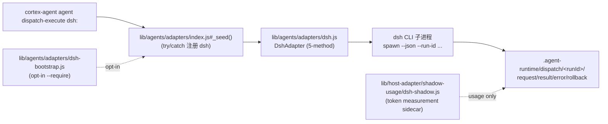

# DSH (DeepSeek Harness) First-Class Adapter — 架构决策

> **状态**: 已实施（M-029，2026-08-19）
> **决策**: `D-ARI-P006-promote-dsh-firstclass`（user approved）
> **实施载体**: Mission M-029（MS-001～MS-004 PASS，MS-005 waived）
> **集成指南**: [docs/host-dsh-integration.md](../host-dsh-integration.md)

## 1. 背景与问题

Cortex Agent 的 first-class dispatch adapter 体系（`lib/agents/adapters/`，五方法契约 `discover / health / invoke / cancel / report`）原本覆盖 Pi、Claude Code、Codex CLI、MiniMax。DeepSeek Harness (DSH) 此前仅是 **Token Control Plane 的第三 governed shadow host**（决策 `D-TCP-004`，只做 usage measurement）：

- `lib/host-adapter/shadow-usage/dsh-shadow.js` — 从 DSH session envelope 提取 token 用量写 ledger；
- `scripts/dsh-usage-sync.js` — backfill `~/.dsh/sessions/` 的 usage 事件（832 receipts 已回放验证）。

**缺口**：DSH 没有 dispatch adapter，`cortex-agent agent dispatch-execute dsh:<id>` 无目标；没有 `templates/integrations/dsh/`（`cortex-agent add dsh` 无模板）；没有 `docs/host-dsh-integration.md`；agent 注册 `external.adapter_type = "dsh"` 会抛 `ERR_INVALID_ADAPTER_TYPE`。DSH 与 Pi / Claude Code / Codex CLI 在"可被 Cortex 治理地执行"这一维度上不对等。

## 2. 最终决策

批准把 DSH 从 shadow usage host **提升为与 Pi / Claude Code / Codex CLI 同等地位的 first-class dispatch adapter**：

1. 新增 `lib/agents/adapters/dsh.js`（~650 行，`DshAdapter extends BaseAdapter`，五方法契约 + 6 类失败模式）。
2. 注册路径走 **additive 扩展**：`VALID_ADAPTER_TYPES_EXT` 加入 `"dsh"`、`_seed()` try/catch 注入、`dsh-bootstrap.js`（opt-in）、`adapter-core.js` 加入 `dsh.local` / `dsh.dev`；**不修改** M-002 frozen 的 `lib/agents/registry.js`。
3. 双语模板 `templates/{zh,en}/integrations/dsh/{README.md, AGENTS.md, settings.json}` + `cortex-agent add dsh` CLI。
4. `docs/host-dsh-integration.md`（安装 / 注册 / dispatch / 限制四节）。
5. 能力声明遵守 P-001 冻结词汇：`tool.before.*` / `context.render.observe` 显式 `unsupported`（无真实 hook 证据前不假装支持）。

**批准范围**（`D-ARI-P006` rationale）：不包含 DSH 自动 dispatch 默认启用、未经门禁的外部副作用、Provider/Agent Loop/TUI 自建、复制 DSH 完整 session JSONL storage。

## 3. 方案对比摘要

| 维度 | 维持现状（DSH 仅 shadow） | 复制 Pi 完整链路（不推荐） | 本决策（P-006） |
| :--- | :--- | :--- | :--- |
| 架构合规 | DSH 只在 measurement 层 governed | 与 M-003 / P-001 冲突 | 沿用既有五方法契约与 `_seed()` try/catch 模式 |
| 跨 host 对等 | DSH 与 Codex/Pi 不可比 | 高度重复，回归负担重 | DSH 进入既有 first-class 体系 |
| token 治理一致性 | DSH 已在 TCP 中（D-TCP-004） | 复制 token 抓取易双源真相 | 复用 `dsh-shadow.js`，single source of truth |
| 模板与 CLI 对称 | `cortex-agent add dsh` 无模板 | 不解决模板层 | 与 claude / codex / pi / minimax 对齐 |
| 实施成本 | 0 | 高 | 中（1 adapter + 1 bootstrap + 模板 + 文档 + 测试） |
| 迁移风险 | DSH 用户手工拼装 | 大 | additive、缺省关闭、可回退 |

## 4. 架构与调用流

**关键流程**：

1. `invoke()` 写 `request.json` → spawn `dsh --json --run-id <id> --task <task>` → JSON-RPC over stdio → 解析响应 → 写 `result.json` + `rollback.json`（atomic `.tmp + rename`）。
2. 6 类失败模式全部写 `error.json` + `rollback.json`（或 `rollback-failed.json` + `notify_parent: true`）：`ERR_ADAPTER_SPAWN` / `ERR_DISPATCH_FAILED` / `ERR_DISPATCH_TIMEOUT` / `ERR_JSONRPC_PARSE` / `ERR_DSH_<code>` / rollback 写失败。
3. `cancel()` 通过 `_subprocesses` Map（runId → child）SIGTERM；`report()` 读 journal 并附加 `adapter_type` + `latency_ms`。

**能力声明**（`discover().capability_descriptor`，P-001 冻结词汇）：

| 能力 | 等级 | 来源 |
| :--- | :--- | :--- |
| session.boundary | explicit | self-reported |
| turn.boundary | adapter | runtime-trace |
| message.boundary | unobservable | not-exposed |
| tool.before.observe / block | unsupported | not-implemented |
| tool.update | unobservable | not-exposed |
| context.render.observe | unsupported | not-implemented |

## 5. 影响范围

- **新增**：`lib/agents/adapters/dsh.js`、`lib/agents/adapters/dsh-bootstrap.js`、`templates/{zh,en}/integrations/dsh/`（6 文件）、`docs/host-dsh-integration.md`、`tests/agent/agent-adapter-dsh.test.js`、`tests/cli/add-host-dsh.test.js`。
- **修改（additive）**：`lib/agents/registry-adapter-types.js`（`VALID_ADAPTER_TYPES_EXT` 加 `"dsh"`）、`lib/agents/adapters/index.js#_seed()`（末尾 try/catch 注入）、`lib/coordination/adapter-core.js`（`REGISTERED_ADAPTER_IDS` 加 `dsh.local`/`dsh.dev`）、`lib/registry/index.js`（`PLATFORM_REGISTRY.dsh`）、`docs/platform-integration.md`（平台映射表行）、`docs/architecture/adapter-authoring.md`（§9.4 / §9.5）。
- **零修改（硬约束）**：`lib/agents/registry.js`（M-002 frozen）、`bin/cli.js`、既有 5 个 vendor adapter。
- **不触碰**：`~/.dsh/sessions/`（shadow backfill 独占）、`lib/host-adapter/shadow-usage/dsh-shadow.js`、TCP 测量逻辑。

## 6. 迁移与回滚策略

- **纯加法**：`cortex-agent upgrade` 不覆盖用户对本地治理目录的改动；`add dsh` 的 `settings.json` 走 merge（保留用户字段），README/AGENTS 已存在则跳过。
- **回滚**：移除 `_seed()` try/catch 块或从 `VALID_ADAPTER_TYPES_EXT` 删除 `"dsh"` 即恢复 pre-P-006 行为；其他宿主不受影响（注册为可选）。
- **fail-closed**：DSH CLI 未安装时 `health()` → `ready: false`（`ERR_ADAPTER_SPAWN`），`invoke()` 写结构化失败，不影响既有 dispatch。

## 7. 后续任务

- [ ] DSH 真实 hook 能力证据出现后，单列 P-007 follow-up（tool gate + context pilot），把 `tool.before.*` / `context.render.observe` 从 `unsupported` 提升。
- [x] `docs/architecture.md` 既有对 ARI 提案的本地治理目录路径引用已迁移为 docs 相对链接（commit `95052e8`）。
- [ ] 完整 CLI e2e（`cortex-agent agent dispatch-execute dsh:<id>` 真实 agent 条目）可选补充。

---

> 返回：[架构文档](./README.md) | [集成指南](../host-dsh-integration.md) | [Adapter Authoring](./adapter-authoring.md)
