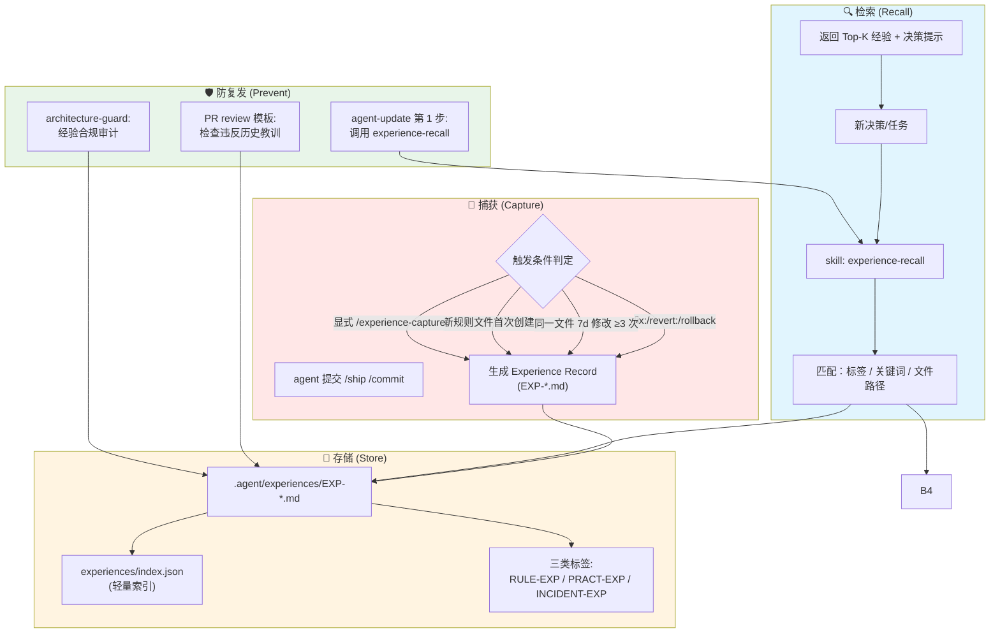

# Experience Recursion Design

> **经验自递归**：让 cortex-agent 从"踩坑→沉淀→检索→防复发"形成闭环

**状态**: 设计完成
**版本**: 1.0.0
**最后更新**: 2026-06-12

---

## 1. 背景与动机

### 1.1 问题：经验无法自复用

在 cortex-agent 的实际使用中观察到：

| 现象 | 原因 |
|------|------|
| 同一类错误反复出现 | 经验没有沉淀到可检索的位置 |
| 修正依赖人工记忆 | 没有自动化的"教训记录"机制 |
| 新 agent 接手时易踩坑 | 知识库没有"避坑指南" |
| 规则更新不及时 | 错误修正后没回流到 rules/ |

### 1.2 现实案例

本次会话（2026-06-12）就出现了两个"经验教训"事件：

| 案例 | 触发 | 错误 | 当前修正方式 |
|------|------|------|--------------|
| **EXP-001: handoff schema 不匹配** | T-C09 E2E 验证 | `artifact-bus.js` 把 handoff JSON 包装在 `{artifact_id, seq, payload}` 中，但 `handoff.schema.json` 期望字段在根级别 | 手动加 `extractHandoffPayload()` |
| **EXP-002: self-check 误入通用 /ship** | T-B04 | self-check 是 cortex-agent 自己的自举能力，不应进入通用工作流 | 手动回滚 + 沉淀 `agent-scope.md` |

**核心痛点**：
- 修正完成只是改代码，规则没自动更新
- 下次类似场景出现时，agent 不知道之前踩过这个坑
- 必须通过 PR review / 人工规则编写才能避免重犯

### 1.3 设计目标

让 cortex-agent 能够：
1. **捕获**：自动识别"踩坑"事件
2. **沉淀**：结构化记录为经验
3. **检索**：在新决策时自动查找相关历史
4. **防护**：在 PR review 和工作流中自动检查是否违反历史教训

---

## 2. 现状：已有能力盘点

| 组件 | 职责 | 能否被复用？ |
|------|------|--------------|
| `agent-update` workflow | 添加/修改 AI 指令 | ✅ **核心载体**，作为经验沉淀的触发点 |
| `knowledge-lint` skill | 检查知识结构 | ✅ 经验检索可参考其 skill 模式 |
| `architecture-guard` skill | 架构合规审计 | ✅ 防复发检查可集成 |
| `rules/agent-scope.md` | 三层归属规则 | ✅ 经验分类的参考模型 |
| `metrics/knowledge-health.json` | 健康度报告 | ✅ 经验覆盖率可作为新指标 |
| `experiences/` | **不存在** | ❌ 新增 |

---

## 3. 核心设计

### 3.1 整体流程



### 3.2 经验数据结构

借鉴 ADR (Architecture Decision Record) 风格，统一格式：

```yaml
---
id: EXP-001
title: handoff JSON schema 与 artifact wrapper 不匹配
type: bug-fix                  # bug-fix | design-correction | refactor
severity: high                 # low | medium | high
date: 2026-06-12
trigger: T-C09 E2E 验证
tags: [schema, handoff, artifact-bus, e2e]
related_files:
  - .agent/handoffs/scripts/handoff-protocol.js
  - .agent/artifacts/scripts/artifact-bus.js
supersedes: null               # 如果经验被新版本覆盖
superseded_by: null
---

## 错误 (What)
artifact-bus.js 把 handoff JSON 包装在 `{artifact_id, seq, payload}` 中
但 handoff.schema.json 期望字段在根级别，导致 `resume-prompt` 失败

## 触发 (When)
- handoff JSON 同时被 raw payload 和 artifact bus 存储
- 两种 schema 没有协调

## 修正 (How)
harness-protocol.js 添加 `extractHandoffPayload()` 自动检测 wrapper

## 教训 (Lesson)
> 任何在多个存储位置间流转的结构化数据，
> 必须在第一个版本就定义统一的 schema 适配层。

## 防复发检查
- [ ] 新增 schema 是否考虑多存储路径？
- [ ] 是否在第一个版本就提供 extractor/adapter？
- [ ] PR review 是否包含 schema 兼容性检查？

## 相关经验
- (无)
```

### 3.3 三种经验分类

借鉴 K8s 的资源生命周期模型：

| 类别 | 标识 | 何时生成 | 生命周期 | 归档策略 |
|------|------|---------|---------|---------|
| **规则型** | `RULE-EXP` | 沉淀为永久 rule 的教训 | 永久 | 永不归档 |
| **实践型** | `PRACT-EXP` | 短期避坑指南 | 180 天 | 到期后归档到 `.archive/` |
| **事件型** | `INCIDENT-EXP` | 重大事故记录 | 365 天 | 到期后归档 |

**示例映射**：

| 经验 | 类别 | 理由 |
|------|------|------|
| EXP-001: handoff schema 不匹配 | PRACT-EXP | 已修复，不会再发生 |
| EXP-002: self-check 误入通用 /ship | RULE-EXP | 沉淀到 `agent-scope.md` 后永久 |
| T-C09 coordinator 注册失败（假设） | INCIDENT-EXP | 重大协调问题需长期追踪 |

---

## 4. 与 `agent-update` 工作流的集成

### 4.1 当前 `agent-update` 流程

```
1. 需求分析
2. 内容草稿
3. 文件操作
4. 验证和总结
```

### 4.2 增强后的流程

```
1. 需求分析
   └─> 🆕 调用 experience-recall 检索相关历史教训
2. 内容草稿
   └─> 🆕 在 draft 中引用相关 experience IDs
3. 文件操作
4. 经验捕获（新增独立阶段）
   └─> 是否触发经验记录条件？
       ├─> 是 → 生成 EXP-*.md
       └─> 否 → 跳过
5. 验证和总结（增强）
   └─> 报告是否创建了经验记录
```

### 4.3 触发条件详解

```yaml
experience_capture_triggers:
  # 显式触发
  - explicit:
      - user calls /experience-capture
      - agent-updates Rule file (自动)

  # 隐式触发（commit message）
  - commit_message:
      patterns:
        - "^fix:.*"
        - "^revert:.*"
        - "^rollback.*"
        - "wip:.*(rollback|undo|revert)"

  # 隐式触发（文件修改频率）
  - file_churn:
      threshold: 3          # 同一文件 7 天内修改次数
      window_days: 7

  # 隐式触发（手动标记）
  - manual:
      - commit message 包含 "experience:" 前缀
      - PR 标签 "experience-capture"
```

---

## 5. `experience-recall` Skill 设计

复用 `knowledge-lint` 的 skill 模式（零依赖、产出 JSON 报告）：

```yaml
---
name: experience-recall
description: 检索与当前任务相关的历史经验教训，避免重复犯错。基于标签、关键词和文件路径的混合匹配。
---

# Experience Recall Skill

## 目标
在新任务开始前，主动检索历史经验，避免重蹈覆辙。

## 触发
- `/start-task` 第一步
- `agent-update` 需求分析阶段
- `architecture-guard` 审计
- 显式调用 `/experience-recall`

## 检索算法

### 输入
- task description（任务描述）
- modified_files（修改文件列表）
- tags（任务标签，可选）

### 检索步骤
1. **标签匹配**（权重 0.5）：
   - 计算任务 tags 与经验 tags 的 Jaccard 相似度
2. **关键词匹配**（权重 0.3）：
   - 分词后扫描经验 title/lesson 字段
3. **文件路径匹配**（权重 0.2）：
   - 任务的 modified_files 与经验的 related_files 重合度

### 输出
```json
{
  "matched_experiences": [
    {
      "id": "EXP-001",
      "title": "...",
      "relevance": 0.85,
      "matched_on": ["tags", "files"],
      "key_lesson": "...",
      "path": ".agent/experiences/EXP-001.md"
    }
  ],
  "warnings": [
    "⚠️ 此任务涉及 schema 变更，请检查 EXP-001 教训"
  ],
  "total_experiences_scanned": 12
}
```

## 存储位置
`.agent/experiences/EXP-*.md`
```

---

## 6. 防复发集成点

### 6.1 在 `agent-update` 工作流中

```yaml
## 1. 需求分析（增强）

> 🆕 在评估影响时，先调用 experience-recall：
>
> ```
> /experience-recall --tags "schema,workflow" --files ".agent/workflows/ship.md"
> ```
>
> 若返回相关经验，应在草稿中**显式引用** experience IDs。

## 4. 经验捕获（新增）

> 在 commit 前判断：
> - 本次修改是否触发经验记录条件？
> - 若触发，生成 EXP-*.md 并 commit。
```

### 6.2 在 `architecture-guard` 中

```yaml
### Layer 2: 手动审查（增强）

#### 5. 经验合规检查
- [ ] PR 修改的 files 是否涉及历史经验的 related_files？
- [ ] 如涉及，对应经验的"防复发检查"是否已满足？
- [ ] 是否需要在 PR 描述中引用 experience IDs？
```

### 6.3 在 PR review 模板中

```markdown
## 经验合规检查
- [ ] 已调用 /experience-recall 检索相关教训
- [ ] 已确认不违反相关经验的"防复发检查"
- [ ] 如本次修改属于 fix/revert，已生成 EXP-*.md
```

---

## 7. 三层归属（与 agent-scope 协调）

| 组件 | 归属 | 理由 |
|------|------|------|
| `skills/experience-recall/` | **L1 框架模板** | 所有项目都受益于"避免重犯" |
| `experiences/EXP-*.md` | **L2 项目实例** | 项目自身的经验，不下发给用户 |
| 自动捕获脚本（PostCommit Hook） | **L3 框架自举** | 仅 cortex-agent 自己用 |
| 经验索引 `experiences/index.json` | **L2 项目实例** | 配合 L1 skill 使用 |

---

## 8. 实施路径

### Phase 1: 基础设施（半天）
| 任务 | 描述 | 归属 |
|------|------|------|
| T-ER01 | 创建 `experiences/` 目录 + 经验模板 | L2 |
| T-ER02 | 实现 `skills/experience-recall/` (tags 匹配基础版) | L1 |
| T-ER03 | 迁移本次会话两个教训到 EXP-001 / EXP-002 | L2 |
| T-ER04 | 创建 `experiences/index.json` 索引 | L2 |

### Phase 2: 集成到 agent-update（半天）
| 任务 | 描述 | 归属 |
|------|------|------|
| T-ER05 | 修改 `agent-update.md` 加入经验检索 + 捕获步骤 | L1 |
| T-ER06 | 创建 `rules/lesson-capture.md` 经验沉淀规则 | L1 |
| T-ER07 | 更新 `.agent/README.md` 引用经验机制 | L1 |

### Phase 3: 主动防护（可选）
| 任务 | 描述 | 归属 |
|------|------|------|
| T-ER08 | `architecture-guard` 加入经验合规检查 | L1 |
| T-ER09 | PR review 模板加入经验合规检查 | L1 |
| T-ER10 | PostCommit Hook 自动捕获（仅 cortex-agent） | L3 |

---

## 9. 方案对比

| 维度 | 现状（手动沉淀） | 提案（经验自递归） |
|------|------------------|-------------------|
| **经验沉淀** | 手动写规则 | 半自动（agent-updates + 显式） |
| **经验查询** | 靠记忆 | skill 检索 |
| **防复发** | 无 | PR review + 工作流检查 |
| **新 agent 接手** | 读 docs | 查 experience DB |
| **维护成本** | 中（持续写规则） | 低（自动捕获 + 自动索引） |
| **实现难度** | 1（无需实现） | 4（需 experience-recall skill） |
| **规则合规** | 100% | 100% |
| **可观测性** | 低 | 高（经验覆盖率可统计） |

---

## 10. 风险与缓解

| 风险 | 描述 | 缓解 |
|------|------|------|
| **过度捕获** | 自动捕获产生大量低质量经验 | severity 过滤 + 人工确认 |
| **隐私泄露** | 经验可能包含敏感上下文 | 沉淀前脱敏 |
| **规则冲突** | 新经验与现有规则矛盾 | 引用而非复制，规则优先 |
| **经验库膨胀** | 大量 PRACT-EXP 堆积 | LRU 归档 + 标签过滤 |
| **检索噪音** | 误匹配无关经验 | relevance 评分 ≥ 0.6 才返回 |

---

## 11. 架构合规性

| 检查项 | 合规 | 说明 |
|--------|------|------|
| 零依赖原则 | ✅ | experience-recall 可用 Node.js 内置模块 |
| 模板驱动 | ✅ | 经验模板可在 `templates/` 中 |
| 纯加法升级 | ✅ | 仅新增 skill / 目录 |
| 平台无关 | ✅ | 经验格式独立于平台 |
| 最小修改 | ✅ | agent-update 增强而非重写 |
| 三层归属 | ✅ | experience-recall L1，捕获脚本 L3 |

---

## 12. 预期收益

### 12.1 短期（Phase 1+2 完成）
- 经验可被新 agent 检索
- `agent-update` 流程自动包含"历史经验查询"
- 本次两个教训自动被未来会话复用

### 12.2 中期（Phase 3 完成）
- PR review 自动检查违反历史教训
- 经验覆盖率成为新指标
- 框架从"被动修正"转为"主动防护"

### 12.3 长期
- 形成"踩坑→沉淀→检索→防护"的完整自举闭环
- cortex-agent 自身变成"经验驱动"的智能体
- 减少同类错误复发，提升开发效率

---

## 13. 相关文档

- [Self-Bootstrapping](./self-bootstrapping.md) — 框架自举的更宏观设计
- [Multi-Agent Coordinator](./multi-agent-coordinator.md) — 涉及经验传递的协调层
- [Mission Lite Design](./mission-lite-design.md) — 长周期任务也需经验积累
- `rules/agent-scope.md` — 三层归属模型
- `rules/lesson-capture.md`（将创建） — 经验捕获规则

---

## 14. 版本历史

| 版本 | 日期 | 描述 |
|------|------|------|
| 1.0.0 | 2026-06-12 | 初始设计，基于 T-C09 / T-B04 教训沉淀 |
