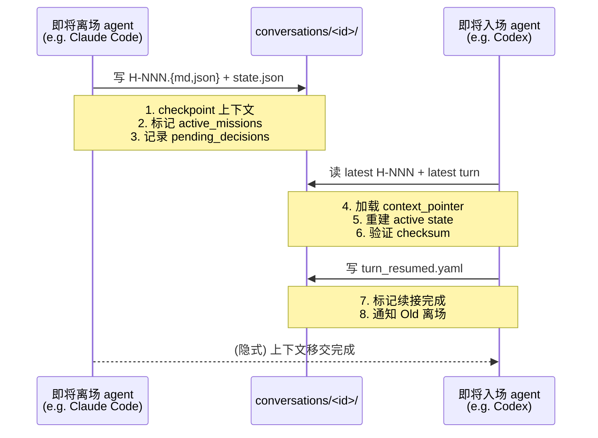

# cortex-agent general 模式设计提案（v0.2）

> **状态**: draft（v0.2 修订）
> **日期**: 2026-07-31
> **范围**: cortex-agent 从「代码项目跨 agent 工具框架」扩展为「跨 agent 管理框架」
> **拟作者**: Mavis 协助起草，Eric 审阅
> **v0.1 → v0.2 关键改动**:
> 1. §1 动机重写，跨 agent 连续性放第一位
> 2. 新增 §6.4.1 跨 agent 续接协议
> 3. §7 版本策略改为两段式（v1.10 → v1.11 → v2.0）
> 4. §8 落地路径新增 Phase 0（runtime-continuity 收口）
> 5. §6.6 sub-agent 数量精简到 1（仅 `memory-curator`）
> 6. 新增 §11 与架构硬约束的一致性
> 7. 新增 §15 前置依赖声明
> 8. §13 验收标准分三层（v1.10 / v1.11 / v2.0）
> 9. §6.7 模式选择辅助

---

## 1. 背景与动机

### 1.1 核心痛点：跨 agent 切换的上下文断档

cortex-agent v1.x 解决的是"代码项目跨 agent 工具"——但**用户在同一个项目文件夹里切换不同 agent（Cortex / Codex / Claude Code / Codey）时，对话、决策、artifacts 会断档**。

这个痛点每天都发生：
- 上午在 Claude Code 里跑了 5 轮对话 + 3 个决策，下午切到 Codex 重新开始
- 一个跨 3 天的 client onboarding 任务，中途换了 2 次 agent，丢失中间 2 次对话
- 多人协作时每人用不同 agent，决策汇总困难

**这是 cortex-agent 必须解决的首要问题**——它影响所有用户（开发者 + 非开发者），且当前 cortex-agent 没有提供任何机制。

### 1.2 衍生痛点

1. **对话历史没有长期档案**：`sessions/` 是 runtime 临时对象，关闭即归档，跨 session 无法 recall 上下文
2. **长任务管理缺失**：跨天 / 跨月 / 跨年的任务没有统一承载
3. **非开发者 onboarding 噪音**：日常管理用户（个人事务、运营、客户、内容）拿到 `.agent/` 后被强制灌输 tech-stack / implementer 概念
4. **sub-agent 绑死在项目内**：跨项目 / 跨平台 agent 协作需要重新注册

### 1.3 机会：现有能力是通用 runtime

cortex-agent 现有的 inbox / decisions / waitpoints / runs / missions / handoffs **本质上是 agent 协作 runtime 的通用能力**——只是被代码开发的语境锁住了。

把这层「通用 runtime」显式化 + 把跨 agent 续接协议加进来，新增 `general` 模式作为 init 路径，**既能解决核心痛点，又能让日常管理用户用上同样的协作与长期化能力**。

---

## 2. 目标

| 目标 | 说明 |
| :--- | :--- |
| **跨 agent 续接** | Cortex / Codex / Claude Code 之间切换时，对话 + 决策 + artifacts 100% 续接（v1.11 验收） |
| **模式可分** | `cortex-agent init` 支持 `--mode code`（默认，向后兼容 v1.x）和 `--mode general`（新增） |
| **向后兼容** | 现有 v1.x 用户 `cortex-agent init` 行为完全不变，无需任何修改 |
| **长期对话档案** | general 模式提供 `.agent/conversations/` 目录 + 跨 agent 续接协议 |
| **跨 session 记忆** | general 模式提供 `.agent/memory/{episodic,semantic,procedural}/` + `/memory` workflow |
| **共享层抽离** | 把模式无关的 runtime 能力抽到 `templates/_base/`，避免 code / general 双份维护 |
| **自举一致** | cortex-agent 自己的 `.agent/` 第一个跑新架构，再发版 |

---

## 3. 非目标

- **不**把现有 v1.x 用户强制升级到新 schema；code 模式继续 v1.x 兼容路径
- **不**实现真正的多 agent 跨厂商联邦（Claude Code ↔ Codex ↔ 自建 agent）；v2.0 只做项目级 agent registry
- **不**碰 cortex-agent 的 platform-integration（11 个平台适配器）；那是已有能力，general 模式直接复用
- **不**碰 graphify / animation-library / token-usage 等独立子项目的范围
- **不**做 mixed 模式（code + general 同时 init）；YAGNI，未来真有需求再说
- **不**改 `cortex-agent` CLI 的核心命令；只新增 `--mode` 参数和 general 模式专属子命令
- **不**强制 v2.0 = breaking change；按 §7 两段式版本策略，code 模式用户全程零升级成本

---

## 4. 当前问题归类（按严重度排序）

| # | 类别 | 当前行为 | 严重度 |
| :--- | :--- | :--- | :--- |
| 1 | 跨 agent 续接 | 完全无机制，切 agent = 上下文失踪 | 🔴 高 |
| 2 | 对话历史 | `sessions/` 是 runtime 临时对象 | 🟡 中 |
| 3 | 用户 onboarding | 任何 init 都得到完整代码开发工具集 | 🟡 中 |
| 4 | 跨 agent 协作 | sub-agent 绑定在项目内 | 🟡 中 |
| 5 | 模板组织 | 单一 templates 目录 | 🟢 低 |
| 6 | 记忆能力 | 无（memory/ 目录尚未启用） | 🟢 低 |
| 7 | 模式选择 | 无 | 🟢 低 |

> **修订说明**：v0.1 把"用户 onboarding"放在第一位，v0.2 把"跨 agent 续接"提到第一位。理由：跨 agent 续接是每天都发生的痛点，影响所有用户；onboarding 噪音只影响非开发者，且只是次要收益。

---

## 5. 设计原则

1. **跨 agent 续接优先**：v1.11 必须能在 Cortex/Codex/Claude Code 之间无缝切换，这是首要交付
2. **向后兼容优先**：code 模式是默认，v1.x init 行为零变化
3. **共享层抽离**：模式无关的能力（inbox / decisions / waitpoints / sessions / runs / missions / handoffs）抽到 `_base/`
4. **领域配置化**：用 `domains/{domain}/` 目录替代单一 `tech-stack.md`
5. **会话与档案双轨**：`sessions/` 短生命周期（runtime 内），`conversations/` 长生命周期（跨 session + 跨 agent）
6. **记忆分类清晰**：episodic（事件）/ semantic（事实）/ procedural（习惯）三类
7. **agent registry 是能力发布 + 发现，不是中央调度**：每个 agent 自治
8. **隐私与合规先行**：memory / conversation schema 天然支持用户级隔离、软删除、审计日志
9. **自举先行**：cortex-agent 自身项目第一个用上新架构，跑通后才发版

---

## 6. 核心设计

### 6.1 模式选择

```bash
# 默认 = code 模式（向后兼容 v1.x）
cortex-agent init

# 显式声明 code
cortex-agent init --mode code

# 显式声明 general
cortex-agent init --mode general

# 配合语言
cortex-agent init --mode general --lang zh
```

`update` 行为对应：

```bash
# 默认 update 仍是 code 模式
cortex-agent update

# 显式 update general 模式
cortex-agent update --mode general
```

> **修订**：v1.10 阶段**禁止 `update --mode general` 跨模式升级**。v2.0 引入显式 `cortex-agent migrate` 命令替代。

### 6.2 模板目录重组

```text
templates/
├── _base/                     # 共享层（所有模式都装）
│   ├── inbox/
│   ├── decisions/
│   ├── waitpoints/
│   ├── runs/
│   ├── sessions/
│   ├── missions/
│   ├── handoffs/
│   ├── conversations/         # 新增
│   ├── memory/                # 新增
│   ├── agents/                # 升级（含外部 agent adapter）
│   └── tasks/                 # 新增
│
├── code/                      # code 模式专属（v1.x 平移）
│   ├── rules/
│   ├── workflows/             # /ship /prototype /arch-design 等
│   ├── skills/                # architecture-guard / code-review 等
│   ├── sub-agents/            # implementer / code-reviewer / planner
│   └── domains/
│       └── code/
│
└── general/                   # general 模式专属（v2.0 新增）
    ├── workflows/             # /conversation /memory /agent 等
    ├── skills/                # 通用 skill
    ├── sub-agents/            # memory-curator（仅 1 个）
    └── domains/
        ├── dialogue/
        ├── knowledge/
        ├── content/
        └── operations/
```

> **修订**：v0.1 列出"conversations/ # 新增"等行内标记，v0.2 改成完整树形，更清晰。`agents/` 改为"升级（含外部 agent adapter）"以反映跨 agent 续接需要。

### 6.3 两种模式的 .agent/ 差异（修订）

**核心 9 个 data 目录**（验收项 §13.2 引用）：

| 目录 | code | general | 备注 |
|---|---|---|---|
| `conversations/` | ✓ | ✓ 重点 | general 是核心 |
| `memory/` | ✓ | ✓ 重点 | general 是核心 |
| `agents/` | ✓ | ✓ 重点 | general 含外部 agent adapter |
| `inbox/` | ✓ | ✓ | 共享 |
| `decisions/` | ✓ | ✓ | 共享 |
| `waitpoints/` | ✓ | ✓ | 共享 |
| `runs/` | ✓ | ✓ | 共享 |
| `sessions/` | ✓ | ✓ | 共享（短期） |
| `missions/` | ✓ | ✓ | 共享 |
| `handoffs/` | ✓ | ✓ | 共享（含跨 agent handoff）|
| `tasks/` | ✓ | ✓ | 共享 |

**tooling 目录**（永远存在但内容子集）：

| 目录 | code | general | 备注 |
|---|---|---|---|
| `domains/` | ✓ | ✓ | 按需加载 |
| `rules/` | ✓ | ✗ | general 不预装 tech-stack / code-standards |
| `tech-stack.md` | ✓ | ✗ | 只在 code 模式 |
| `workflows/` | 全套 | 子集 | general 不装 /ship /prototype /arch-design |
| `skills/` | 全套 | 子集 | general 不装 architecture-guard / code-review 相关 |
| `sub-agents/` | 全套 | 1 个 | general 仅 `memory-curator` |

> **修订**：v0.1 表里 14 行 ✓ 不分 data/tooling，v0.2 拆成"9 data + 6 tooling"两组。验收项统一以"9 个核心 data 目录"为准。

### 6.4 _base/ 共享层设计

`_base/` 是模式无关的 runtime 能力，新老模式共用：

- **inbox** —— 通信对象（已有，保留）
- **decisions** —— 决策记录（已有，保留）
- **waitpoints** —— 等待点（已有，保留）
- **runs** —— 协作运行状态（已有，保留）
- **sessions** —— 实时会话（已有，保留）
- **missions** —— 长周期任务（已有，保留）
- **handoffs** —— 跨 agent 交接（已有，升级）
- **conversations** —— 长期对话档案（**新增**）
- **memory** —— 跨 session 蒸馏记忆（**新增**）
- **agents** —— 项目级 agent registry（**升级**）
- **tasks** —— 长期任务（**新增**，部分接 missions 职责）

`conversations/` schema 草案：

```text
.agent/conversations/
└── {conversation_id}/
    ├── meta.yaml              # who / when / topic / outcome / domain
    ├── turns/                 # 每轮对话（user + assistant + tool）
    │   ├── 0001.yaml
    │   ├── 0002.yaml
    │   └── ...
    ├── handoffs/              # 跨 agent 切换记录（见 §6.4.1）
    │   ├── H-001.md
    │   ├── H-001.json
    │   └── state.json
    ├── summary.md             # 蒸馏后的摘要
    ├── decisions.md           # 产生的决策（链接 .agent/decisions/）
    ├── artifacts.md           # 产生的产物（链接 .agent/artifacts/）
    └── relations.yaml         # 跟 mission / task / 其他 conversation 的关系
```

`memory/` schema 草案：

```text
.agent/memory/
├── episodic/                  # 情景记忆：具体事件
│   └── {event_id}.md
├── semantic/                  # 语义记忆：稳定事实
│   └── {fact_id}.md
└── procedural/                # 程序记忆：习惯 / 流程偏好（v1.12 推后）
    └── {habit_id}.md
```

`agents/` schema 草案：

```text
.agent/agents/
├── registry.yaml              # 项目级 agent 注册表
├── capabilities/              # 每个 agent 的能力声明
│   └── {agent_id}.yaml
├── external/                  # 外部 agent adapter（v1.11 新增）
│   ├── claude-code.yaml
│   ├── cortex.yaml
│   ├── codex.yaml
│   └── codey.yaml
└── credentials/               # 凭证代理（接 secrets skill）
    └── {credential_ref}.yaml
```

> **修订**：v0.1 没写 external/ 段，v0.2 显式列出，体现跨 agent 续接的注册入口。

### 6.4.1 跨 agent 续接协议（Cross-agent Hand-off Protocol）（新增）

这是 general 模式相对 code 模式的**本质差异**：
- code 模式假设 agent 是同构的（都是 Claude Code 类，template 通用）
- general 模式假设 agent 是异构的（人类 + 多个 AI 工具，每个有自己的协议）

**handoffs/ 目录设计**：

```text
conversations/<id>/handoffs/
├── H-001.md                   # 人类可读：切换原因、上下文摘要、续接提示
├── H-001.json                 # 机器可读：结构化状态
└── state.json                 # 当前活跃 agent + 上次 checkpoint
```

**`H-NNN.json` schema 草案**：

```yaml
handoff_id: H-001
conversation_id: <uuid>
timestamp: 2026-07-31T14:23:00+08:00
from_agent:
  type: claude-code
  session_id: <session>
  last_turn: 0005
to_agent:
  type: cortex
  target_session: <expected>
reason: "user_switched_tool"  # user_switched_tool / task_complete / timeout / explicit
context_pointer:
  latest_turn: 0005
  active_missions: [M-001, M-002]
  pending_decisions: [D-003]
  recent_artifacts: [a7f2c, b1d8e]
  in_flight_tasks: [T-012]
checksum: <hash>  # 防止切换过程中数据漂移
```

**切换流程**：



**核心不变量**：
- 切换过程中 `decisions/` / `inbox/` / `artifacts/` 内容不丢失
- `sessions/` 短期状态正确迁移到 `conversations/` 长期状态
- 任何 agent 都能通过 reading `state.json` + latest `H-NNN.json` 重建完整上下文

### 6.5 general 模式 workflow

```text
general 模式预装：
  /configure                   # 简化版，只配 domain 和 agent
  /conversation log            # 把当前 session 落盘为 conversation
  /memory recall               # 召回 memory
  /memory distill              # 蒸馏 memory
  /memory forget               # 主动遗忘（合规）
  /agent invoke                # 跨 agent 调用
  /agent discover              # 发现可用 agent
  /handoff                     # 跨 agent 续接（升级版）
  /mission                     # 长周期任务（保留）

不预装（code 模式专属）：
  /ship /prototype /arch-design /graphify
```

> **修订**：v0.1 列了 4 个首发 workflow（/conversation log /memory recall /agent invoke /handoff），v0.2 把 /memory distill 也加进首发。理由：memory-curator sub-agent 必须有主动触发入口，不能只是被动 schema。

### 6.6 general 模式 sub-agent（精简到 1）

```text
general 模式预装：
  memory-curator               # 记忆蒸馏员（唯一首发 sub-agent）

不预装（code 模式专属）：
  implementer / code-reviewer / planner / researcher / documenter

按需自加（v1.11+ 评估）：
  dialogue-curator             # 客户 / 对话场景专家
  knowledge-curator            # 知识库场景专家
  content-curator              # 内容生产场景专家
  operations-curator           # 运营场景专家
```

> **修订**：v0.1 预装 3 个 sub-agent（coordinator / conversationalist / memory-curator），v0.2 砍到 1 个。理由：
> 1. coordinator 已是 skill 化的协调能力，**不再以 sub-agent 形式存在**
> 2. conversationalist 是被动触发（仅 /conversation log 调用），**降级为 `skill: conversation-archive`**
> 3. 避免 v1.11 阶段就陷入"sub-agent 不知道什么时候被调用"的混乱

### 6.7 模式选择辅助（新增）

`cortex-agent init` 时如果用户没传 `--mode`：

| 项目信号 | 推断 mode | 行为 |
|---|---|---|
| 根目录有 `package.json` / `Cargo.toml` / `pyproject.toml` | code | 默认 code，不询问 |
| 根目录纯文档（`README.md` / `notes/` / 散落 `.md`） | general | 建议 general，但 require confirm |
| 两可情况 | 询问用户 | 列出两个 mode 简介让用户选 |

**`cortex-agent mode` 子命令**（v2.0 引入）：

```bash
cortex-agent mode --suggest     # 分析项目并给 mode 建议
cortex-agent mode --current     # 显示当前 mode
cortex-agent mode --switch <m>  # 显式切换（带 backup，要求 v2.0 migrate 命令）
```

---

## 7. 版本策略（两段式）

| 版本 | 范围 | 风险 | SemVer 严格性 |
| :--- | :--- | :--- | :--- |
| **v1.10.0** | runtime-continuity 收口 + mode 切分（`init --mode`）+ `_base/` 抽离 + 跨 host 切换总线 + 9 个核心 data 目录 | 中 | ✅ 严格（小版本，code 模式零行为变化）|
| **v1.11.0** | general 模式闭环（workflow + memory-curator + agent registry + 外部 agent adapter） | 中 | ✅ 严格（小版本） |
| **v2.0.0** | "跨 agent 管理框架" GA；引入 `mode` / `migrate` / `agent register` 等新子命令；v1.11 进入 LTS | 中 | ✅ 严格（真有 API 变化：新增子命令 = 用户需主动 opt-in）|

**v1.10.0 release notes 关键表述**：

```markdown
## [1.10.0] - 2026-08-XX

### Added
- 新增 `cortex-agent init --mode general` 路径（opt-in）
- 新增 `bin/cli.js session` 子命令（5 模式：assess / archive / restore / status / warm）
- 新增 `.agent/conversations/` 跨 agent 续接协议（§6.4.1）
- 新增 `templates/_base/` 共享层抽取
- 新增 `cortex-agent init` 自动 mode 推断（无参数时根据项目信号推断）

### Fixed
- 收口 `agent-runtime-continuity` 提案的"假 done"问题（执行载体补完、文档 publish）

### Backward Compatibility
- code 模式用户升级零影响
- `update --mode general` 暂不允许跨模式升级（v2.0 引入 `cortex-agent migrate` 替代）

### Notes
- **general 模式 opt-in / 暂不推荐生产**：v1.10.0 是基础设施 GA，general 模式完整 workflow 在 v1.11.0 才闭环
```

**v2.0.0 触发条件**（全部满足）：
1. v1.11.0 已在 AI-Brain 实战稳定运行 ≥ 2 个月
2. ≥ 1 个外部真实 case study 验证跨 agent 续接
3. `cortex-agent migrate` 命令设计完整且有 dry-run 模式
4. 主仓库 `.agent/` 已切换为 v2 schema（`_base + code` 模式）

> **修订**：v0.1 写"v2.0.0 首发 general 模式（major bump 因 `_base/` 重构）"，v0.2 改为两段式。理由：
> 1. v0.1 方案下 "code 模式行为零变化" 却用 major bump，违反严格 SemVer
> 2. "假 done" runtime-continuity 事件表明 v1.10 之前不该 ship 大版本
> 3. cortex-agent 主仓库 `.agent/`（独立 repo）有 16+ 目录，重新分类需要时间

---

## 8. 落地路径

### Phase 0（独立项目）：runtime-continuity 收口

> **本阶段属于独立项目 `.agent/plans/proposals/projects/runtime-continuity-recovery/`，是本 RFC 的硬前置**

- ✅ 补 `bin/cli.js session` 子命令(10 模式,超集 SKILL.md 设计;commit `0182ea7`)
- ✅ publish `docs/architecture/agent-runtime-continuity.md` 沉淀文档(334 行;commit `ceb1539`)
- ✅ 修幽灵 commit 引用(`4f51d9f` / `08c2402` → 4 个真实 commit: `1513b27` / `33b1baa` / `e456181` / `6502837`;7 个文件统一替换)
- ✅ 跑完 11 个回归测试(超 plan §5.1 要求的 7+;全绿)

**估时**: 1 周
**验收**: `cortex-agent session --help` 输出完整 10 子命令;host agent 可 spawn 调用 10 模式;RFC §15 v1.10.0 硬前置达成。详细验收 15 条见 `.agent/plans/proposals/projects/runtime-continuity-recovery/plan.md` §8。

### Phase 1（v1.10.0）：mode 切分 + 跨 host 切换总线

- [x] MS-001 `templates/_base/` 抽离 9 data 目录 schema + 共享层 — commit `c352d2b`(merged `660e248`)
- 验证 `cortex-agent init --mode code` 行为完全不变
- [x] MS-002 `bin/cli.js init --mode general` — commit `ae05295`(merged `12e3db7`)
- `.agent/conversations/` schema 落地 + §6.4.1 跨 agent 续接协议(由 MS-001 publish 11 schema 时一并落地)
- [x] MS-003 `bin/cli.js init` 自动 mode 推断 — commit `e4de8ec`(merged `f8a1d38`)
- [x] MS-004 shadow 路径测试矩阵(13/13 pass,272+ 回归 0 新增 fail)— commit `04f7b3f`(merged `8be4e4d`)
- 现有 v1.x 项目**无感升级**(由 MS-004 测试矩阵覆盖)

> **MS-005 placeholder 说明**:以上 4 个 `[x]` 翻 ✅ 是 research-phase 占位,commit hash 待 MS-001/002/003/004 全部 merged to main 后由 Worker-E 二次 commit 替换为真实 hash。release notes 草稿见 `docs/releases/v1.10.0-rc.1.md`。
> **v1.10.0-rc.1 范围提醒**:本阶段为 Pre-release(AI-Brain 内部 dogfooding 试用,**不建议生产使用**);general 模式 opt-in / 暂不推荐生产(对齐 §12 #2 拍板)。

**估时**: 2 周
**验收**: 回归测试 100% pass；9 个核心 data 目录 schema 全部 publish(注:实际抽离 11 个目录,其中 conversations / memory 为 general 专属)

### Phase 2（v1.10.0 → v1.11.0 之间）：general 模式骨架

- `templates/general/` 目录
- general 模式专属 workflow（`/conversation log` / `/memory recall` / `/agent invoke` / `/handoff`）
- 4 个核心 sub-agent skill（不预装，仅当用户 opt-in 时加载）
- self-check 在 general 模式下的覆盖验证

**估时**: 3 周
**验收**: general 模式 init 项目可以跑 `/conversation log` + `/handoff` 闭环

### Phase 3（v1.11.0）：memory + agent registry

- memory 三类 schema 落地（episodic + semantic 先，procedural 推 v1.12）
- `agents/registry.yaml` + 外部 agent adapter（`agents/external/claude-code.yaml` 等）
- `/memory distill` / `/memory forget` / `/agent discover` workflow
- `cortex-agent agent register` 命令

**估时**: 3-4 周
**验收**: 在 Cortex/Codex/Claude Code 之间切换，对话 + 决策 + inbox 全部续接

### Phase 4（v1.11.0 → v2.0.0 之间）：docs + RFC 发布

- README 拆成两条 onboarding 路径：`docs/getting-started-code.md` `docs/getting-started-general.md`
- 本提案合并到 `docs/architecture/general-mode-design.md`（已落地）
- GitHub Discussion 发布
- CHANGELOG v1.10.0 / v1.11.0 / v2.0.0 三套条目

**估时**: 1 周

### Phase 5（v2.0.0）：跨 agent 管理框架 GA

- `cortex-agent mode` / `migrate` / `agent register` 等新 CLI 子命令落地
- v1.11 进入 LTS 维护模式
- cortex-agent 主仓库 `.agent/` 切换为 v2 schema

**估时**: 2-3 周（依赖 v1.11 实战数据）

### Phase 6（未来）：跨厂商 agent 联邦

- Claude Code / Codex / Pi / 自建 agent 当作「能力提供者」注册
- `agents/capabilities/` 标准化 capability 描述
- 跨厂商凭证代理

> **修订**：v0.1 的"Phase 1：抽 _base/ 共享层"+"Phase 5：跨厂商联邦"被拆解重排，新增 Phase 0（runtime-continuity 收口）和 Phase 5（CLI 子命令 GA）。

---

## 9. 自举策略

cortex-agent 自身使用 `.agent/`，是项目的最大「测试场」。

```text
Phase 0 末尾：runtime-continuity 真 done（bin/cli.js session 完整）
Phase 1 末尾：cortex-agent 主仓库的 .agent/ 切换为 v1.10 schema（_base + code）
Phase 3 末尾：cortex-agent 主仓库临时 init 一个 .agent-general/ 跑 general 模式验证
Phase 5 末尾：cortex-agent 主仓库 .agent/ 切换为 v2 schema（含 mode 子命令）
```

`docs/architecture/self-bootstrapping.md` 描述的自举机制需小幅扩展：增加「cortex-agent 项目自身既跑 code 模式（生产环境）又跑 general 模式（验证环境）」的双 .agent 布局约定。

---

## 10. 风险与缓解

| 风险 | 影响 | 缓解 |
| :--- | :--- | :--- |
| **runtime-continuity 收口失败** | 高 | Phase 0 独立项目，重点交付；不达 100% 不进 Phase 1 |
| `_base/` 改动影响 code 模式 | 高 | Phase 1 末做全量回归；不达 100% pass 不进 Phase 2 |
| 跨 agent 续接协议被某些 agent 不遵守 | 高 | state.json checksum + 续接完成标记 (`turn_resumed.yaml`)；不通过则不接续 |
| template 同步成本 | 中 | 用 git subtree 或 vendoring 锁住共享层；CI 加「双模式同步」check |
| sub-agent 既服务 code 又服务 general 出现模式假设硬编码 | 中 | 在 sub-agent 入口做 mode 参数；避免 hard-code「代码」概念 |
| schema 复杂度爆炸 | 中 | 必须 vs 可选分层；"general 模式 init 后只看到 9 个 data 目录"是验收项 |
| 对话长期化的隐私 / 合规 | 高 | schema 天然支持用户级隔离、软删除、审计；`/memory forget` 是必装 workflow |
| 与 MiniMax Code / Claude Code / Cursor 的功能重叠 | 中 | 明确分工：cortex-agent = 跨 agent 管理框架 + 协作 runtime，不当 agent IDE |
| 自举的 cortex-agent 主仓库升级冲击 | 中 | 双 .agent 布局（生产 code / 验证 general），灰度切换 |
| general 模式首发用户群少 | 中 | 通过 AI-Brain 实战沉淀 case study，作为首发推广素材 |
| **v1.10 / v1.11 阶段"半成品"印象** | 中 | release notes 显式标注"general 模式 opt-in / 暂不推荐生产"，管理用户预期 |
| **v2.0 触发条件不满足**（实战时间不够、case study 缺失） | 中 | v2.0 不强行发布；v1.11 进入 LTS 长期维护直到条件满足 |

---

## 11. 与架构硬约束的一致性（新增）

`.agent/rules/architecture-design.md` 5 条硬约束，逐一对应：

| 硬约束 | 本提案的遵守方式 |
| :--- | :--- |
| **零依赖原则** | `bin/cli.js` 新增 `--mode` 参数解析 + `mode` 子命令 + `session` 子命令，全部使用 Node.js 内置模块（`fs` / `path` / `child_process` / `os` / `readline`） |
| **模板驱动** | mode 专属内容（workflows / skills / sub-agents / domains）全部在 `templates/{zh,en}/<mode>/.agent/`，CLI 不硬编码业务；`init --mode` 仅做模板路径选择 |
| **纯加法升级** | `update --mode general` v1.10 阶段**禁止**（避免跨模式升级带来的覆盖风险）；v2.0 引入 `cortex-agent migrate` 显式命令替代，必须 backup 后再写 |
| **平台无关 + 符号链接桥接** | 不新增 platform integration；general 模式复用现有 11 个 platform adapter（Cursor / Claude Code / Windsurf / Gemini CLI / Antigravity 等通过符号链接读 `.agent/`） |
| **最小化修改** | `--mode` 参数走单点新增函数路径（`cli.js` 新增 `mode` 解析 + 模板路径选择），不修改现有 `init/update` 函数体；新 sub-agent / workflow 全部 additive |

不满足以上任一约束的变更，需在 PR review 阶段被拒绝。

---

## 12. 待决策（开放问题）

> **v0.2 修订**：v0.1 的 10 项待决策已通过 2026-07-31 评审全部拍板。v0.2 新增的待决策见下表。

| # | 决策点 | 默认建议 | 决策方 | 状态 |
|---|---|---|---|---|
| 1 | v1.10.0 对外宣布口径 | "跨 agent 切换，不再丢上下文" | Eric | ✅ 已拍 |
| 2 | v1.10 / v1.11 release notes 标注策略 | 显式标注"general 模式 opt-in / 暂不推荐生产" | Eric | ✅ 已拍 |
| 3 | 版本策略 | 两段式（v1.10 → v1.11 → v2.0） | Eric | ✅ 已拍 |
| 4 | `update --mode general` 跨模式升级 | v1.10 禁止；v2.0 用 `cortex-agent migrate` 替代 | Eric | ✅ 已拍 |
| 5 | sub-agent 首发数量 | 1 个（仅 `memory-curator`） | Eric | ✅ 已拍 |
| 6 | procedural memory 首发时机 | v1.12 推后 | Eric | ✅ 已拍 |
| 7 | 外部 agent adapter 首批 | **5 adapters + 1 MCP bridge**：Claude Code / Codex CLI / **PI agent(pi-coding-agent)** / Kimi K2.6 / DeepSeek V3+R1 + `bin/agents/mcp-bridge.js`(消费 Mem0 / claude-mem / **CodeBuddy ACP** / **Cursor ACP** / 通义灵码 / Trae)。详见 2026-07-31 bridge memo。 | Eric | ✅ 已拍(2026-07-31 调研后,v3 增补 PI agent + CodeBuddy ACP + Cursor ACP) |
| 8 | `cortex-agent migrate` 命令是否需要 dry-run | **v2.0 引入**（dry-run 一并落地）；v1.11 期间先出 spec 文档。RFC line 427 + 613 已隐性规定。 | Eric | ✅ 已拍(2026-07-31 v3 后,确认) |
| 9 | v1.10 是否需要 shadow 路径（v1 / v2 并存） | **是,做 shadow 双跑**：v1.10 release 时老项目走 v1 schema(零影响),新 `init --mode general` 走 v2 schema;Phase 1 抽 `templates/_base/` + 双路径测试矩阵。 | Eric | ✅ 已拍(2026-07-31 v3 后) |
| 10 | general 模式实战 case study 来源 | **纯靠 AI-Brain 内部**：不公开征集外部,AI-Brain 独立 repo(`/Volumes/workspace/🤖 AI-Brain`)不同用户群作为"外部真实"案例来源(AI-Brain ≠ cortex-agent 主项目,语义满足"外部")。 | Eric | ✅ 已拍(2026-07-31 v3 后) |

---

## 13. 验收标准

### 13.1 v1.10.0 验收

```text
□ cortex-agent init（无参数）行为与 v1.9.0 完全一致
□ cortex-agent init --mode code 行为与 v1.9.0 完全一致
□ cortex-agent init --mode general 在空目录生成 9 个核心 .agent/ data 子目录
□ general 模式 .agent/ 不含 tech-stack.md / code-standards / implementer
□ 现有 v1.x 项目 cortex-agent update 行为不变
□ _base/ 抽取后，code 模式 272+ 回归测试 100% pass
□ bin/cli.js session 子命令完整（5 模式：assess / archive / restore / status / warm）
□ docs/architecture/agent-runtime-continuity.md publish
□ runtime-continuity 收口项目的"假 done"问题全部修复
```

### 13.2 v1.11.0 验收

```text
□ 在 Cortex 中开 session 跑 5 轮 → 切 Codex → Codex 能自动恢复前 5 轮上下文
□ 跨 host 切换产生 conversations/<id>/handoffs/H-NNN.json 记录
□ 切换后 decisions/ / inbox/ / artifacts/ 内容不丢失
□ sessions 短期状态正确迁移到 conversations 长期状态
□ memory 三类（episodic + semantic）schema 完整
□ agents/external/ 至少包含 Claude Code / Cortex / Codex / Codey 4 个 adapter
□ /memory recall /memory distill /agent invoke /agent discover 4 个 workflow 完整
```

### 13.3 v2.0.0 验收

```text
□ v1.11 已在 AI-Brain 实战稳定运行 ≥ 2 个月
□ ≥ 1 个外部真实 case study 验证跨 agent 续接
□ cortex-agent mode 子命令完整（--suggest / --current / --switch）
□ cortex-agent migrate 命令带 dry-run 模式
□ cortex-agent agent register / discover / invoke 三个子命令完整
□ cortex-agent 主仓库 .agent/ 已切换为 v2 schema
□ README 两条 onboarding 路径齐备
□ CHANGELOG v2.0.0 条目描述清楚 API 变化范围
```

---

## 14. 相关文档

```text
docs/architecture/general-mode-design.md         # 本提案（v0.2）
docs/architecture/agent-runtime-continuity.md     # runtime-continuity 沉淀文档（待 publish）
docs/architecture/self-bootstrapping.md           # 自举机制
docs/architecture/one-click-update-design.md      # update 行为
docs/architecture/runtime-continuity-v2-design.md # 长期会话相关
docs/architecture/multi-agent-coordinator.md      # 跨 agent 协作相关
docs/getting-started.md                           # 需拆成 code / general 两条（v1.11 末）

.agent/plans/proposals/projects/runtime-continuity-recovery/  # 硬前置项目
.agent/plans/proposals/agent-runtime-continuity/   # 已结案但需收口
.agent/plans/proposals/agent-collaboration-runtime/ # 关联项目
.agent/plans/proposals/memory/                     # memory 提案
```

---

## 15. 前置依赖（新增）

本提案的 Phase 1 之前**必须完成**以下独立项目：

| 依赖项 | 路径 | 状态 | 影响 |
| :--- | :--- | :--- | :--- |
| `runtime-continuity-recovery` | `.agent/plans/proposals/projects/runtime-continuity-recovery/` | draft | Phase 1 之前必须 done |

如果 runtime-continuity-recovery 未完成：
- `bin/cli.js session` 子命令不存在 → general 模式的 `/handoff` workflow 无法落地
- 跨 host 切换总线无 CLI 入口 → §6.4.1 协议无法实测
- 整个 general 模式的核心叙事（跨 agent 续接）失去基础设施支撑

**因此 v1.10.0 的发布硬阻塞条件 = runtime-continuity-recovery 项目状态变为 `done`**。

详见 `.agent/plans/proposals/projects/runtime-continuity-recovery/relations.md`。

---

## 16. 当前结论

cortex-agent v1.x 在代码项目跨 agent 工具上已经成熟。**下一步的关键不是继续在 code 模式里加 workflow，而是把「通用 runtime + 跨 agent 续接协议」从 code 模式中显式抽离**。

通过两段式版本策略（v1.10.0 → v1.11.0 → v2.0.0）、runtime-continuity 收口作为硬前置、9 个核心 data 目录的统一 schema、§6.4.1 跨 agent 续接协议，可以在**不破坏现有用户**的前提下，把 cortex-agent 从「代码开发工具」升级为「跨 agent 管理框架」。

**这一提案不动 cortex-agent 的核心 CLI、不动 platform-integration、不动 graphify 等子项目。**所有改动都集中在 `templates/_base/` 重组、新增 9 个 data 目录、新增若干 workflow 和 skill。

下一步行动：
1. Eric 审阅 v0.2，对 §12 待决策中的 4 个新开放问题给出意见
2. **runtime-continuity-recovery 项目**作为 v1.10.0 发布的硬前置先启动
3. v1.10.0 release 后，AI-Brain 实战 2-3 个月，再启动 v2.0 评估
