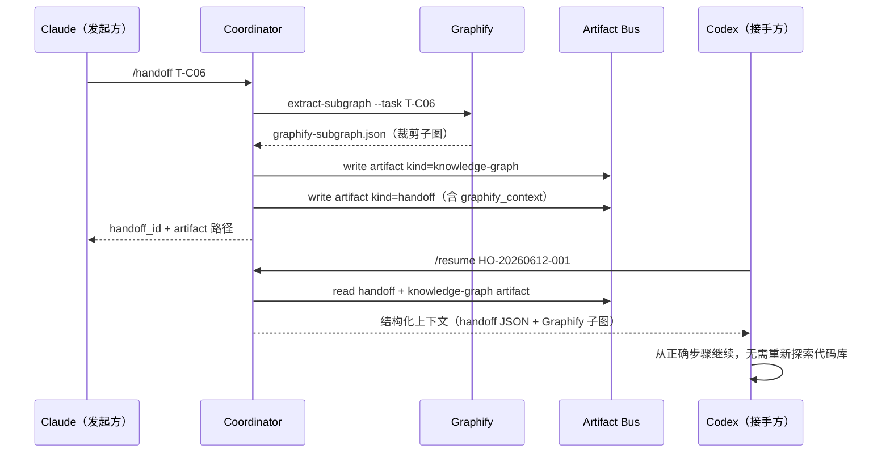
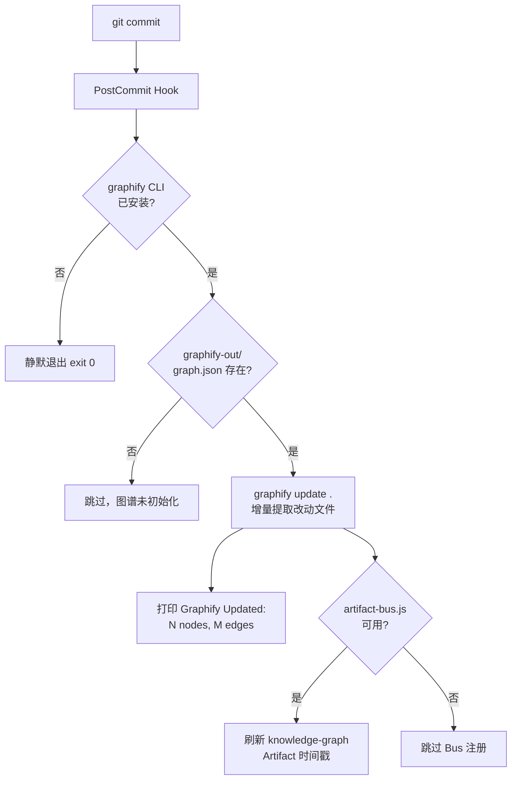

<!-- cspell:disable -->

# Graphify × Cortex Agent 集成提案

> 状态：**已实现（T-G01/G02/G03/T-G04/T-G05 ✅）**
> 提案日期：2026-06-12
> 最后更新：2026-06-15
> 影响范围：Artifact Bus · Handoff 协议 · PostCommit Hook · doctor 命令
> 已完成任务：T-G01 · T-G02 · T-G03
> 当前任务：Graphify 基础集成与自更新流程已完成，后续增强按需立项

---

## 1. 背景

[Graphify](https://graphifylabs.ai)（[GitHub](https://github.com/safishamsi/graphify)）是一个为 AI 编程助手设计的知识图谱工具。工作原理分三阶段：

1. **代码结构解析**（免费、确定性）：静态分析 import/export、调用链、文件依赖
2. **音视频转录**（via faster-whisper）
3. **文档/PDF/图片语义分析**（via LLM）

核心优势与 Cortex Agent 的契合点：

| Graphify 能力 | 对应 Cortex Agent 痛点 |
|---|---|
| 预生成"项目地图"，AI 直接导航 | sub-agent 每次 dispatch 重复探索代码库 |
| Token 消耗最高降低 60% | context-budget 依赖手工 `estimated_tokens` |
| 支持 Claude Code、Codex 等主流平台 | 多模型切换后接手方缺乏代码结构上下文 |
| 无嵌入系统，纯结构图谱 | 不与现有 harness SST 冲突 |

---

## 2. 架构原则检查

| 架构原则 | 结论 | 说明 |
|---|---|---|
| 零依赖（P1） | ✅ 兼容 | Graphify 二进制留在用户项目，不进入 `bin/cli.js` |
| 模板驱动（P2） | ✅ 兼容 | 集成配置落在 `templates/zh\|en/.agent/plugins/graphify/` |
| 纯加法升级（P3） | ✅ 兼容 | 只新增文件，不修改任何现有文件 |
| 单一真理源（P4） | ✅ 兼容 | 范围划分：`context-index.json` = harness 层；Graphify = 源码层，不重叠 |
| 最小化修改（P5） | ✅ 兼容 | 只改两处 schema，不触碰 cli.js |

---

## 3. 集成点（仅两处）

### 3.1 Artifact Bus — 新增 `knowledge-graph` 类型

**文件**：`.agent/artifacts/artifact-schema.json`

当前 `kind` 枚举：
```json
"enum": ["plan", "execution", "review", "handoff", "validation", "state", "note"]
```

变更后：
```json
"enum": ["plan", "execution", "review", "handoff", "validation", "state", "note", "knowledge-graph"]
```

`knowledge-graph` artifact payload 结构：

```json
{
  "artifact_id": "KG-20260612-001",
  "task_id": "global",
  "agent_id": "graphify",
  "produced_at": "2026-06-12T09:00:00Z",
  "kind": "knowledge-graph",
  "summary": "项目知识图谱快照，由 Graphify 生成",
  "refs": [".graphify/map.json"],
  "payload": {
    "graphify_version": "1.x",
    "map_path": ".graphify/map.json",
    "entry_modules": ["bin/cli.js", "lib/"],
    "generated_at": "2026-06-12T09:00:00Z",
    "total_nodes": 0,
    "total_edges": 0
  }
}
```

**作用**：Graphify 图谱在 Artifact Bus 中可寻址，Coordinator 可将其引用到 handoff payload。

---

### 3.2 Handoff 协议 — 加入可选 `graphify_context` 字段（随 T-C06 同期）

**文件**：T-C06 将新增的 handoff JSON schema

在 handoff JSON 顶层加入可选字段：

```json
{
  "handoff_id": "HO-20260612-001",
  "from_agent": "claude",
  "to_agent": "codex",
  "task_id": "T-C06",
  "resume_from": "HANDOFF",
  "graphify_context": {
    "enabled": true,
    "subgraph_path": ".agent/artifacts/T-C06/graphify-subgraph.json",
    "relevant_files": [
      "lib/commands.js",
      ".agent/skills/handoff/SKILL.md"
    ],
    "entry_functions": ["trackAgent()", "applyGitExclusion()"],
    "generated_at": "2026-06-12T09:00:00Z"
  },
  "last_artifact": ".agent/artifacts/T-C06/execution-latest.json"
}
```

**字段规则**：
- `graphify_context` 完全可选；Graphify 未安装时字段不存在，handoff 正常工作
- `enabled: false` 时接手方跳过 Graphify 上下文，退化为当前行为
- `subgraph_path` 指向从完整图谱裁剪出的任务级子图（由 `extract-subgraph.js` 生成）

---

## 4. 数据流



---

## 5. 模板文件结构

```
templates/
├── zh/.agent/plugins/graphify/
│   ├── README.md              # 安装说明 + cortex-agent 配合方式
│   ├── config.yml             # 扫描范围、排除规则、子图提取配置
│   └── scripts/
│       └── extract-subgraph.js   # 按 task_id 从完整图谱裁剪子图
└── en/.agent/plugins/graphify/   # 英文版（内容同步）
    ├── README.md
    ├── config.yml
    └── scripts/
        └── extract-subgraph.js
```

`config.yml` 示例：

```yaml
graphify:
  version: ">=1.0.0"
  map_path: ".graphify/map.json"
  include:
    - "bin/"
    - "lib/"
    - ".agent/skills/"
    - ".agent/sub-agents/"
  exclude:
    - "node_modules/"
    - "templates/"
    - "*.test.js"

subgraph:
  max_nodes: 50         # 单次 handoff 最多携带 50 个节点
  max_depth: 3          # 从入口文件最多展开 3 层依赖
  fallback: skip        # Graphify 不可用时直接跳过，不报错
```

---

## 6. 风险与缓解

| 风险 | 级别 | 缓解方案 |
|---|---|---|
| Graphify 未安装导致 handoff 失败 | 🔴 | `fallback: skip`；`graphify_context` 完全可选字段；coordinator 在写 handoff 前检测 `graphify` 可用性 |
| 子图过大导致 handoff payload 膨胀 | 🟡 | `config.yml` 的 `max_nodes` / `max_depth` 硬上限；超出则只记录 `subgraph_path`，不内联 |
| Graphify 图谱与实际代码不同步 | 🟡 | `extract-subgraph.js` 读取时检查 `generated_at`；超过 24h 则 coordinator 告警，建议重新扫描 |
| 两套"项目地图"概念让用户困惑 | 🟡 | README 明确边界：`context-index.json` = harness 文件索引；Graphify = 源码知识图谱 |
| Graphify schema 升级破坏脚本 | 🟢 | `extract-subgraph.js` 加版本兼容检查，不匹配时 skip 并 warn |

---

## 7. 任务拆解

| 任务 ID | 优先级 | 描述 | 状态 |
|---|---|---|---|
| **T-G01** | P1 | `artifact-schema.json` 加 `knowledge-graph` 类型 + artifact-bus.js VALID_KINDS | ✅ 已完成 |
| **T-G02** | P1 | `templates/zh\|en/.agent/plugins/graphify/`（README + config.yml + extract-subgraph.js） | ✅ 已完成 |
| **T-G03** | P1 | `extract-subgraph.js` BFS 子图裁剪 + L3 自举验证（90 nodes，Artifact Bus 注册成功） | ✅ 已完成 |
| **T-G04** | P2 | `post-commit-update.js`：PostCommit 自动触发 `graphify update .` | ✅ 已完成（2026-06-15） |
| **T-G05** | P2 | `cortex-agent doctor` 集成 Graphify 状态检测 + 未安装时交互安装提示 | ✅ 已完成（2026-06-15）|

后续增强（不在本提案范围，视需要再立项）：

- `sync-to-context-index.js`：Graphify 精确 token 数同步到 `context-index.json`
- knowledge-lint 扩展：接入 Graphify 源码级断链检测
- `/briefing` Graphify 图谱健康度板块

---

## 8. 验收标准

- [x] `artifact-schema.json` 的 `kind` 枚举包含 `knowledge-graph`
- [x] `templates/zh|en/.agent/plugins/graphify/` 目录存在且双语同步
- [x] `extract-subgraph.js` 在 Graphify 不可用时返回空对象，不抛错
- [x] handoff JSON schema 包含可选 `graphify_context` 字段，并有 `enabled: false` 的 fallback 路径
- [x] coordinator 在 HANDOFF 模式下：若 Graphify 可用则填充子图，否则静默跳过
- [x] `cortex-agent doctor` 显示 Graphify 三项状态（CLI 安装 / 插件配置 / 图谱已生成）
- [x] `post-commit-update.cjs` 在 PostCommit 后自动增量更新图谱（T-G04）

---

## 9. 自更新流程设计（T-G04 · 已完成）

> 来源：2026-06-15 /arch-design 会话

### 需求

`graphify update .` 目前需手动运行，代码变更后图谱随时过期。
需要在 `git commit` 后自动触发增量更新，保持图谱与源码同步。

### 方案

新增 `post-commit-update.cjs`（模板驱动，零依赖，使用 `.cjs` 扩展名以兼容 ESM 项目）注入 PostCommit Hook：



### 新增文件

```
templates/zh/.agent/plugins/graphify/scripts/post-commit-update.cjs
templates/en/.agent/plugins/graphify/scripts/post-commit-update.cjs
```

Hook 注入位置：`hooks/hooks.json` PostCommit 段（async: true，timeout: 120s）

实现状态：

- `templates/zh/.agent/plugins/graphify/scripts/post-commit-update.cjs`（CommonJS，兼容 ESM 项目）
- `templates/en/.agent/plugins/graphify/scripts/post-commit-update.cjs`
- `templates/zh/.agent/hooks/hooks.json` 已加入 Graphify PostCommit hook
- `templates/en/.agent/hooks/hooks.json` 已加入 Graphify PostCommit hook
- 验证环境中 `graphify update .` 成功更新 `4763 nodes / 5340 edges`
- Artifact Bus 可用时写入 `kind: knowledge-graph`，不可用时静默跳过

### 风险缓解

| 风险 | 缓解 |
|------|------|
| 超大项目（>50k 文件）更新慢 | 增量模式只处理 changed files；config.yml 可配置 `post_commit_update: false` 关闭 |
| graphify 未安装导致 hook 报错 | 脚本首行检测 CLI，不可用时 exit 0 |
| 图谱未初始化时触发 | 检测 `graphify-out/graph.json` 是否存在，不存在则跳过 |

---

## 10. 决策记录

| 日期 | 决策 |
|------|------|
| 2026-06-12 | 批准 T-G01/G02/G03，与 T-C06 同期实现 |
| 2026-06-15 | T-G01/G02/G03 全部完成；T-G04（自更新）、T-G05（doctor）立项 |
| 2026-06-15 | T-G05 完成；T-G04 进入实施阶段 |
| 2026-06-15 | T-G04 完成：PostCommit hook 接入中英模板，自动增量更新 Graphify 图谱 |
