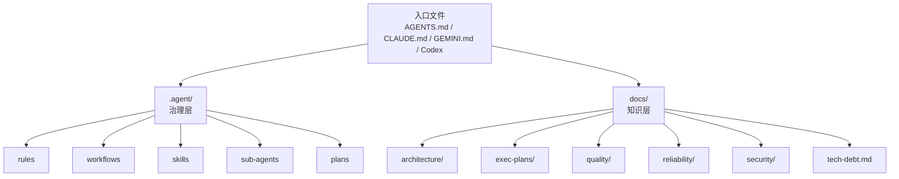

# Harness Engineering 演进设计方案

> **状态**：进行中（Phase 7）
> **版本**：v2.0
> **日期**：2026-04-20
> **基础文档**：[cortex-agent-harness-optimization.md](../cortex-agent-harness-optimization.md)

---

## 一、设计目标

基于新版 [cortex-agent-harness-optimization.md](../cortex-agent-harness-optimization.md)，当前阶段不再继续扩张新的 Harness 机制，而是优先完成三件事：

1. 把仓库知识体系搭起来，让 Agent 能稳定找到“下一份该读的文档”
2. 把已有架构文档更新到当前真实实现，而不是继续保留旧版叙事
3. 把“计划、债务、质量、可靠性、安全”这些高价值知识从零散描述变成版本化资产

这一步是后续继续做应用可理解性、knowledge lint、doc-gardening 的前置条件。

---

## 二、现状与问题

### 2.1 与架构原则的符合性

| 原则 | 符合性 | 说明 |
|------|--------|------|
| 零依赖 | ✅ | 本轮仅新增/更新 Markdown 文档与目录说明 |
| 模板驱动 | ✅ | 本轮主要是仓库内设计与知识架构整理，不新增运行时依赖 |
| 纯加法升级 | ✅ | 无覆盖式迁移逻辑，本轮不改变 upgrade 行为 |
| 平台无关 | ✅ | 强化的是仓库知识层，不绑定单一 IDE/Agent |
| 最小化修改 | ✅ | 先做知识架构与设计文档收敛，不同时引入大量新自动化 |

### 2.2 当前主要问题

虽然 Phase 6 已经完成了较多 Harness 机制，但仓库知识层仍然存在明显缺口：

- `docs/architecture.md` 仍然描述旧版 sub-agent 模型、skill 挂载和 workflow 关系
- `docs/architecture/harness-optimization-design.md` 仍把上一轮方案视作“全部已完成”，与新版优化文档不一致
- `docs/` 下缺少稳定的质量、可靠性、安全、执行计划和技术债务承接位置
- 计划文件仍主要停留在 `.agent/plans/`，但面向长期演进的执行计划还没有在 `docs/` 中形成清晰资产层

换句话说：Harness 的控制机制已经长出来了，但“仓库知识系统”还没有跟上。

---

## 三、方案描述

### 3.1 总体思路

在现有 `.agent/` 治理层之外，补齐一个更稳定的 `docs/` 知识层：



两层职责明确区分：

- `.agent/`：给 Agent 执行时使用的规则、流程、角色与运行约束
- `docs/`：给人和 Agent 共用的、可长期维护的仓库知识资产

### 3.2 结构性变更

本轮落地以下知识架构骨架：

| 路径 | 作用 |
|------|------|
| `docs/quality/README.md` | 沉淀质量标准、质量度量与后续 knowledge lint 入口 |
| `docs/reliability/README.md` | 沉淀可观测性、运行时验证与应用可理解性方向 |
| `docs/security/README.md` | 沉淀安全边界、扫描策略和后续安全文档入口 |
| `docs/exec-plans/README.md` | 定义执行计划的生命周期和目录规则 |
| `docs/exec-plans/active/README.md` | 活跃计划规范 |
| `docs/exec-plans/completed/README.md` | 已完成计划归档规范 |
| `docs/exec-plans/active/harness-phase7-knowledge-architecture.md` | 本轮实际执行计划 |
| `docs/tech-debt.md` | 记录当前已知债务与后续偿还路径 |

同时更新两份关键文档：

- `docs/architecture.md`
- `docs/architecture/harness-optimization-design.md`

### 3.3 不在本轮直接实现的内容

以下内容在新版优化文档中很重要，但不适合在本轮一起硬上：

- knowledge lint 自动化
- doc-gardening 定时任务
- 应用级 logs/metrics/traces 接入
- merge policy 的代码化落地

原因很简单：如果先没有稳定的文档结构和资产承接点，自动化只会加速制造噪音。

---

## 四、方案对比

| 维度 | 现状 | 本轮方案 |
|------|------|---------|
| 架构文档准确性 | 部分仍停留在旧版叙事 | 同步到当前真实实现与新版方向 |
| 知识承接位置 | `docs/` 结构较散 | 增加清晰的知识域入口 |
| 执行计划资产化 | 主要集中在 `.agent/plans/` | 补充 `docs/exec-plans/` 作为长期资产层 |
| 技术债务管理 | 分散在 issue / 风险描述中 | 统一沉淀到 `docs/tech-debt.md` |
| 自动化前置条件 | 不充分 | 为 knowledge lint / doc-gardening 提供落点 |

### 结论

本轮方案不是“再发明一个新 Harness 机制”，而是给现有机制补齐稳定的知识地基。

---

## 五、风险与副作用

### 风险 1：文档层级增加，维护成本上升

这是事实，但风险可控。解决方法不是回避结构，而是：

- 先把目录职责写清楚
- 控制新增内容的密度
- 后续通过 knowledge lint 和 doc-gardening 维护质量

### 风险 2：`docs/` 与 `.agent/` 可能职责重叠

这是最需要避免的副作用。

边界定义如下：

- `.agent/` 存放执行期治理规则和 workflow
- `docs/` 存放长期知识、设计说明、计划资产、债务记录

### 风险 3：只做文档整理，短期看不到“功能增强”

短期确实如此，但这类工作直接决定后续优化是否能持续推进。没有知识架构，后面的自动化只会变成堆机制。

---

## 六、任务拆解

### T-H09 [P0] 建立知识架构骨架

**目标**：补齐 `docs/quality`、`docs/reliability`、`docs/security`、`docs/exec-plans` 和 `docs/tech-debt.md`

**验收标准**

- 相关目录和入口文档已创建
- 每个入口文档明确说明职责边界和后续承接内容
- 不引入运行时依赖或 CLI 逻辑改动

### T-H10 [P0] 同步架构文档到当前真实实现

**目标**：更新 `docs/architecture.md` 与本设计文档，反映现状和新的优化方向

**验收标准**

- 文档中的 sub-agent、skills、workflow 关系与仓库当前实现一致
- 明确体现“`.agent/` 治理层 + `docs/` 知识层”的双层结构

### T-H11 [P1] 执行计划与技术债务资产化

**目标**：新增 active plan 和统一 debt 记录入口

**验收标准**

- `docs/exec-plans/active/` 下存在本轮实际计划
- `docs/tech-debt.md` 记录当前已知高优先级债务

### T-H12 [P1] 设计 knowledge lint 与 doc-gardening 落地方案

**目标**：为后续自动化维护准备规则和落点

**验收标准**

- 在质量文档或计划文档中明确下一批实现范围
- 不要求本轮完成自动化代码

---

## 七、实施顺序

1. 更新设计文档和总架构文档
2. 创建知识架构骨架
3. 写入 active plan 和 tech debt
4. 更新任务进度，作为下一轮执行入口

---

## 八、Mission Lite 设计补充（2026-05-19）

### 8.1 背景

在完成 context-budget、sub-agent 防火墙、runtime evidence 与 handoff 基线后，Cortex Agent 已经具备单任务执行和跨会话交接的基础能力。下一阶段需要解决的问题是：

- 多 feature / 多 milestone 任务如何避免上下文漂移
- 长周期任务如何保证每个阶段都有验证证据
- Worker 的实现结果如何交给独立 Validator，而不是自证正确
- 跨 Agent、跨会话时如何维持结构化状态，而不是依赖自然语言回忆

因此引入 **Mission Lite** 作为设计方向：它不是重型任务平台，也不是全自动多 Agent 系统，而是建立一套可文件化、可验证、可中断恢复的长周期任务编排约束。

### 8.2 设计目标

Mission Lite 目标是补齐普通 `/start-task` + `/ship` 之外的长周期协作能力：

1. **前置验证契约**：计划阶段先产出可执行或可审查的验收断言
2. **里程碑验证**：每个 milestone 结束时必须验证，而不是只在最终交付检查
3. **角色隔离**：Orchestrator 规划，Worker 实现，Validator 按契约挑错
4. **结构化交接**：任务状态通过 `.agent/missions/` 与 `.agent/handoffs/` 文件传递
5. **命令日志**：所有关键命令记录 command、exit code、结果和后续动作
6. **保守并行**：代码修改默认串行，只读研究和验证允许并行

### 8.3 非目标

Mission Lite 第一阶段不做以下事情：

- 不引入新的第三方依赖
- 不修改 CLI 运行时逻辑
- 不要求所有项目都使用 Mission Lite
- 不强制多模型或多供应商
- 不把所有验证都做成阻断项
- 不在第一阶段实现长期后台自动运行

### 8.4 文件结构

建议新增的任务状态结构如下：

```text
.agent/missions/M-xxx/
├── mission-plan.md
├── validation-contract.json
├── command-log.md
├── milestones/
│   └── MS-001.md
└── handoffs/
    └── YYYYMMDD-HHMMSS-{focus}.md
```

其中：

| 文件 | 职责 |
|------|------|
| `mission-plan.md` | 记录目标、范围、features、milestones、顺序和退出条件 |
| `validation-contract.json` | 记录 milestone / feature 的验证断言 |
| `command-log.md` | 记录关键命令、exit code、结果和后续动作 |
| `milestones/*.md` | 记录每个 checkpoint 的状态、验证结论和修复项 |
| `handoffs/*.md` | 复用通用 handoff 模板保存跨 Agent / 跨会话状态 |

### 8.5 状态机

Mission Lite 的建议状态机：

```text
SCOPE → PLAN → CONTRACT → EXECUTE_FEATURE → HANDOFF → VALIDATE_MILESTONE → FIX_OR_ADVANCE → COMPLETE
```

状态约束：

| 状态 | Gate |
|------|------|
| `SCOPE` | 目标、边界、非目标已明确 |
| `PLAN` | features / milestones 已拆解 |
| `CONTRACT` | 每个 milestone 至少有一组验证断言 |
| `EXECUTE_FEATURE` | Worker 只处理当前 feature 范围 |
| `HANDOFF` | 交接文档包含进度、引用、命令日志和下一步 |
| `VALIDATE_MILESTONE` | Validator 基于契约、diff、测试和 runtime evidence 独立验证 |
| `FIX_OR_ADVANCE` | 失败则生成 follow-up fix task；通过则进入下一 milestone |
| `COMPLETE` | 所有 milestone 通过，知识资产和任务进度已同步 |

### 8.6 验证契约格式

第一版验证契约可以保持简单，但必须可被 Agent 和人同时阅读：

```json
{
  "mission_id": "M-001",
  "milestone_id": "MS-001",
  "assertions": [
    {
      "id": "VC-001",
      "type": "test",
      "command": "npm test -- auth",
      "assertion": "invalid password returns 401",
      "blocking": true
    },
    {
      "id": "VC-002",
      "type": "docs",
      "assertion": "public API changes are reflected in INTERFACES.md",
      "blocking": true
    },
    {
      "id": "VC-003",
      "type": "runtime",
      "assertion": "primary UI flow renders and completes without console errors",
      "blocking": false
    }
  ]
}
```

断言类型建议先限定为：

- `test`：测试命令或测试文件检查
- `typecheck`：类型检查
- `lint`：静态检查
- `api`：接口契约或 schema 检查
- `docs`：文档同步检查
- `runtime`：日志、浏览器、metrics、trace 等运行时证据
- `manual`：暂时无法自动化但必须人工确认的检查

### 8.7 与现有体系的关系

Mission Lite 不替代现有 workflow，而是做编排层：

| 现有组件 | Mission Lite 中的定位 |
|----------|----------------------|
| `/handoff` | 标准交接格式 |
| `/start-task` | 单个 feature / fix task 的启动入口 |
| `/ship` | 单个 task 的交付状态机 |
| `/parallel` | 只读研究、验证或无共享文件任务的加速器 |
| `phase-gate` | 后续可扩展为 mission 状态 Gate |
| `context-budget` | 为每个 Worker 选择最小必要上下文 |
| `runtime evidence` 文档 | 为 `runtime` 类型断言提供验证模板 |
| `knowledge-lint` / `doc-gardening` | Mission 完成后的知识健康检查 |

### 8.8 后续任务拆解

建议新增一组 Mission Lite 任务：

| 任务 ID | 优先级 | 描述 | 验收标准 |
|--------|--------|------|----------|
| T-H24 | P0 | Mission Lite 架构设计 | `docs/architecture.md` 明确 Mission Lite 角色、状态机、产物和边界 |
| T-H25 | P0 | 新增 `validation-contract` skill | 定义 CREATE / CHECK 两种模式和 JSON 契约模板 |
| T-H26 | P1 | 新增 `/mission` workflow | 支持 SCOPE / PLAN / CONTRACT / EXECUTE / VALIDATE 状态说明 |
| T-H27 | P1 | 扩展 planner / reviewer 输出契约 | planner 输出 validation contract，reviewer 按 contract 验证 |
| T-H28 | P2 | 命令日志与 milestone 模板标准化 | 提供 `command-log.md` 与 `milestones/MS-xxx.md` 模板 |

### 8.9 推荐落地顺序

1. 完成架构设计文档同步（T-H24）
2. 新增 `validation-contract` skill（T-H25）
3. 新增 `/mission` workflow（T-H26）
4. 再改 sub-agent 输出契约（T-H27）
5. 最后补命令日志与 milestone 模板（T-H28）

---

## 九、推荐结论

推荐立即实施本轮方案。

理由：

- 改动风险低
- 与现有架构原则完全兼容
- 能为后续的应用可理解性、knowledge lint、doc-gardening 提供稳定基础

这是一个典型的“先整理地基，再继续加楼层”的步骤，应该先做。
