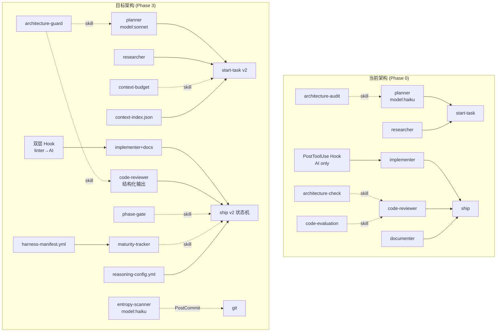

# Harness Engineering 优化设计方案

> **状态**: ✅ 已完成（Phase 6 全部交付）
> **版本**: v1.1
> **日期**: 2026-03-27
> **基础文档**: [cortex-agent-harness-optimization.md](../cortex-agent-harness-optimization.md)

---

## 一、架构冲突分析

### 1.1 与核心架构原则的符合性

| 原则 | 符合性 | 说明 |
|------|--------|------|
| ① 零依赖 | ✅ 完全符合 | 所有新增均为 `.md` / `.yml` / `.json` 配置文件，无 npm 依赖 |
| ② 模板驱动 | ✅ 符合 | 所有变更均体现在 `templates/zh/` 和 `templates/en/` |
| ③ 纯加法升级 | ⚠️ 需注意 | 新增文件纯加法 ✅；**改造现有文件时 upgrade 不覆盖** → 已有安装用户需手动同步 |
| ④ 平台无关 | ✅ 符合 | `.agent/` 为唯一真理来源，通过符号链接桥接 |
| ⑤ 最小化修改 | ✅ 符合 | 分 Phase 逐步实施，每 PR 聚焦单一能力 |

**关键风险**：`upgrade` 命令不覆盖已有文件，因此已有用户的 `ship.md`/`planner.md` 等**改造文件**不会自动更新。需在 `upgrade` 后提示用户手动对比或提供迁移指南。

### 1.2 架构变更概览



---

## 二、结构变更详情

### 2.1 新增文件（10 个）

| 文件路径（相对 `.agent/`） | 所属 Phase | 优先级 | 当前状态 |
|---------------------------|-----------|--------|---------|
| `config/reasoning-config.yml` | Phase 1 | P0 | ✅ 已完成 |
| `skills/architecture-guard/` | Phase 1 | P0 | ✅ 已完成 |
| `skills/phase-gate/` | Phase 1 | P0 | ✅ 已完成 |
| `metrics/baseline.yml` | Phase 1 | P0 | ✅ 已完成 |
| `context-index.json` | Phase 1 | P0 | ✅ 已完成 |
| `skills/context-budget/` | Phase 1 | P0 | ✅ 已完成 |
| `sub-agents/routing-defaults.yml` | Phase 2 | P1 | ✅ 已完成 |
| `sub-agents/entropy-scanner.md` | Phase 3 | P2 | ✅ 已完成 |
| `entropy-config.yml` | Phase 3 | P2 | ✅ 已完成 |
| `harness-manifest.yml` | Phase 3 | P3 | ✅ 已完成 |
| `skills/maturity-tracker/` | Phase 3 | P3 | ✅ 已完成 |
| `metrics/component-health.json` | Phase 3 | P3 | ✅ 已完成 |

### 2.2 改造文件（9 个）

| 文件路径（相对 `.agent/`） | 改动要点 | 当前状态 |
|---------------------------|---------|---------|
| `sub-agents/planner.md` | haiku→sonnet + architecture-guard + 上下文选择 + plan_summary JSON 契约 | ✅ 已完成 |
| `sub-agents/implementer.md` | 推理声明 + BLOCKED 机制 + execution_report JSON 契约 | ✅ 已完成 |
| `sub-agents/code-reviewer.md` | 结构化评分 + 输入隔离 + review_verdict JSON 契约 | ✅ 已完成 |
| `workflows/ship.md` | 状态机 + max_retry + CONTEXT_CLEANUP + ENTROPY_SCAN | ✅ 已完成 |
| `workflows/start-task.md` | 插入 context-manifest 生成步骤 | ✅ 已完成 |
| `workflows/scan-project.md` | reference 生成时加 frontmatter + 更新 context-index | ✅ 已完成 |
| `workflows/update-refs.md` | 刷新 frontmatter 和 context-index 增量更新 | ✅ 已完成 |
| `workflows/briefing.md` | 知识库健康度板块 + 成熟度看板 | ✅ 已完成 |
| `hooks/hooks.json` | 双层 hooks（linter先行+AI后行）+ PostCommit L0 自动清理 | ✅ 已完成 |

### 2.3 移除/归档文件（5 个）

| 文件路径 | 处理方式 | 当前状态 |
|---------|---------|---------|
| `skills/architecture-audit/` | 合并为 architecture-guard | ✅ 已删除 |
| `skills/architecture-check/` | 合并为 architecture-guard | ✅ 已删除 |
| `sub-agents/researcher.md` | **保留**（评估后决策见 §3.1） | 保留 |
| `sub-agents/documenter.md` | **轻量化**（评估后决策见 §3.1） | 保留 |
| `workflows/agent-update.md` | 可选：降级为手动编辑 | 待决策 |

---

## 三、方案评估与对比

### 3.1 Sub-agent 精简决策

**原方案**：5 → 3（合并 researcher→planner，documenter→implementer）

**评估结论**：**保留 5 个，优化路由**

| 合并项 | 原方案风险 | 采纳决策 |
|--------|-----------|---------|
| researcher → planner | 调研（发散思维）≠ 规划（收敛思维），合并导致两头不到岸 | ❌ 不合并，保留独立 researcher |
| documenter → implementer | implementer 上下文可能已满，文档质量下降 | ❌ 不合并，documenter 改为轻量化（仅 API 文档/CHANGELOG） |

解决方案：新增 `sub-agents/routing-defaults.yml` 实现自动路由，用户无需手动选择。

### 3.2 方案对比总表

| 维度 | Phase 0（现状） | Phase 3（目标） |
|------|---------------|---------------|
| 架构合规 | rules + hooks，AI 判断为主 | 双层验证：确定性工具 + AI 审查 |
| 上下文控制 | 无预算，全量注入 | 分层预算（40% 上限，Tier 0/1/2/3）|
| 模型分配 | planner=haiku, 其余 sonnet | 成本模式可配（balanced 默认：全 sonnet）|
| 可靠性 | AI 自判"差不多可以" | 硬性 phase-gate + max_retry=2 |
| 子代理隔离 | 完整输出传递，上下文污染 | 结构化摘要契约，~8K→~2K tokens |
| 知识库维护 | 手动触发 /update-refs | PostCommit L0 自动 + /ship L1 辅助 |
| 可观测性 | 无 | component-health.json + /briefing 看板 |
| 退化路径 | 无（只增不减） | harness-manifest 定义退场条件 |

---

## 四、数据流影响

### 4.1 `/start-task` 数据流变化

```
[Before]
用户输入 → planner(haiku) → task-progress.md → implementer 开始

[After]
用户输入 → context-index.json 相关性匹配
         → context-manifest.json 生成（记录上下文分配）
         → planner(sonnet) + 精选上下文（≤40%）
         → task-progress.md + context-manifest.json
         → phase-gate 检查 PLAN→EXECUTE
         → implementer 开始
```

### 4.2 `/ship` 状态机

```
PLAN → EXECUTE → LINT → REVIEW → COMMIT → DONE → ENTROPY_SCAN → CLEAN

每个转换：
  - phase-gate 硬性前置条件检查（确定性）
  - max_retry=2 超限阻断（不依赖 AI 判断）
  - review verdict 必须 PASS（score≥7 且 blocking_issues=0）
```

---

## 五、实施路线图

详见任务计划 `.agent/plans/task-progress.md` Phase 6 部分。

**总体原则**：
- P0 先行，快速建立基础设施
- 每个 Phase 独立可验证（有明确交付标准）
- 双语模板同步更新（zh + en 必须一致）
