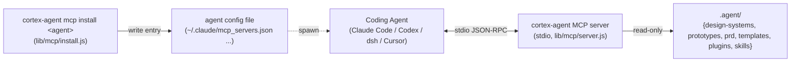

# MCP Bridge — cortex-agent stdio MCP server architecture (P-002 MS-003)

> **目的**: 让任何 MCP-compatible coding agent(Claude Code / Codex / Cursor / dsh / ...)通过 stdio MCP 直接消费 cortex-agent 项目 `.agent/` 治理下的 design systems / prototypes / PRDs / templates / plugins / skills,形成与 open-design 上游的双向桥接。
> **状态**: P-002 MS-003 shipped (2026-08-20)
> **版本**: v1.0
> **关联**: [P-002-mcp-bridge-proposal.md](../../.agent/plans/proposals/projects/open-design-integration/proposals/P-002-mcp-bridge-proposal.md) · [MS-003.md](../../.agent/missions/M-ODI-001/milestones/MS-003.md) · [runtime-adapter.md](./runtime-adapter.md)
> **约束**: 零 npm 依赖(node:* built-ins only),纯加法,stdio only(HTTP 留 Phase 5)

---

## 1. 背景与动机

cortex-agent 的项目资产(`.agent/design-systems/` · `.agent/prototypes/` · `.agent/prd/` · `.agent/templates/` · `.agent/plugins/` · `.agent/skills/`)此前只能被 cortex-agent 自身 CLI 或宿主规则消费。外部 agent(Claude Code / Codex / dsh 等)无法通过 MCP 协议层自动发现这些资产,只能被手动告知"去读 `.agent/prd/PRD-001/`"。

P-002 的目标是把 cortex-agent 项目资产暴露为 **stdio MCP server**(11 tools + 4 resource URI 模板),让外部 agent 用 MCP 标准协议发现 + 读取 + (受限)写入。同时复用 M-029 / P-006 已 ship 的 dsh first-class adapter,使 dsh 零额外配置即可消费。

### 与既有 MCP 的关系

| 维度 | Management API MCP (M-001) | 本 bridge (P-002) |
| :--- | :--- | :--- |
| 命令 | `cortex-agent mcp serve --project <path>` | `cortex-agent mcp serve [--token] [--loopback-only]` |
| 暴露资产 | Management projections (`cortex.query`) | `.agent/` design/prototype/prd/template/plugin/skill |
| 传输 | stdio,newline-delimited JSON | 同左(同一 wire format) |
| 兼容 | — | `serve --project` 保留 M-001 契约(向后兼容) |

---

## 2. 目标 / 非目标

### 目标

| # | Goal |
| :--- | :--- |
| G1 | stdio MCP server 暴露 11 tools(P-002 §4.1) |
| G2 | 4 resource URI 模板:`design://resolved` / `design://systems/{id}` / `prototype://{taskId}/{path}` / `prd://{prdId}/{file}` |
| G3 | `cortex-agent mcp install <agent>` 一键写入 16+ agent 配置文件 |
| G4 | `cortex-agent mcp ping` 健康检查(tools/list 探活) |
| G5 | 默认 read-only;唯一 write tool `design/install` 需 `confirm: true` |
| G6 | 零 npm 依赖,纯 Node.js 内置模块 |

### 非目标(P-002 §3)

- ❌ 不替代 open-design 的 stdio MCP server(两者并存)
- ❌ 不重写 dsh adapter(P-006 已 ship)
- ❌ 不引入远程 HTTP MCP(Phase 5)
- ❌ 不接管 open-design daemon 的 `/api/*` 内部路径
- ❌ od-bridge thin wrapper(GET-only 白名单)不在本 milestone — 见 P-002 §4.5 后续

---

## 3. 核心设计

### 3.1 模块清单

```text
lib/mcp/
├── jsonrpc.js   # JSON-RPC 2.0 over stdio: readFrames / sendResult / sendError
├── server.js    # stdio MCP server: 11 tools + 4 resources + stdio loop
├── install.js   # per-agent 配置文件写入器 (json / toml / unknown)
└── ping.js      # 健康检查: spawn server → tools/list → 期望响应

lib/commands/mcp.js   # `cortex-agent mcp <serve|install|ping|list|uninstall>` dispatcher
bin/cli.js            # case "mcp" → mcpCommand (additive)
lib/cli/contract.js   # mcp entry: mode=mcp_bridge, zero_dep=true
```

### 3.2 JSON-RPC 传输(jsonrpc.js)

- **帧格式**: newline-delimited JSON(每行一个 JSON-RPC 2.0 消息),与既有 runtime-state MCP server 的 wire format 一致
- `readFrames(stream)` → async iterable;空行 / 畸形帧跳过,不抛错
- `sendResult(stream, id, result)` / `sendError(stream, id, code, message, data)`
- 纯 `node:readline` + `node:stream`

### 3.3 Server 核心(server.js)

`createHandler(deps)` 返回纯 dispatcher(可注入依赖以便测试):

| 方法 | 行为 |
| :--- | :--- |
| `initialize` | 协议版本协商(2025-03-26 / 2024-11-05)+ serverInfo |
| `notifications/initialized` | 无响应 |
| `ping` | `{ pong: true }` |
| `resources/list` | 4 个 resource URI 模板 |
| `resources/read` | 解析 URI → 读取资产(path traversal guard) |
| `tools/list` | 11 tools(P-002 §4.1 schema) |
| `tools/call` | 分发给 11 个 tool handler |

**11 tools**(名称 / 数据源):

| Tool | 数据源 |
| :--- | :--- |
| `design/list` | `lib/design/lockfile.listSystems` + `lib/catalog`(available)+ `lib/design/resolve`(cascade) |
| `design/show` | `.agent/design-systems/<id>/DESIGN.md` + lockfile entry |
| `design/install` | 委托 `cortex-agent design install <id> --yes`(content-addressed CLI);`confirm: true` 门禁 |
| `design/resolved` | `lib/design/resolve.resolveCascade`(4-level cascade) |
| `prototype/list` / `prototype/show` | `.agent/prototypes/<taskId>/`(flow.md / prototype.html / validation-contract.json ...) |
| `prd/list` / `prd/show` | `.agent/prd/<prdId>/`(prd.md / flows.md / screens.md / acceptance-criteria.md) |
| `template/list` | `lib/catalog/lockfile`(installed)+ 本地扫描 `.agent/templates/` + starter(available) |
| `plugin/list` | `lib/catalog/lockfile`(installed)+ 本地扫描 `.agent/plugins/` + starter(available) |
| `skill/browse` | 扫描 `.agent/skills/*/SKILL.md` frontmatter;fallback 到 `lib/commands/skill-browse` |

**安全护栏**:
- 所有文件读取走 `resolveInside(base, rel)` — path traversal 拒绝
- 默认 read-only;`design/install` 需 `confirm: true`(P-002 §8 决策 C)
- `design/install` 委托 content-addressed CLI,SHA-256 校验沿用 T-OD-001
- stdout 仅承载协议帧,诊断信息写 stderr

### 3.4 安装器(install.js)

`install(agentId, opts)` 把 MCP server entry 写入目标 agent 配置文件:

```json
{
  "command": "cortex-agent",
  "args": ["mcp", "serve"],
  "env": { "CORTEX_AGENT_PROJECT_ROOT": "<cwd>", "CORTEX_AGENT_MCP_TOKEN": "<hex32>" }
}
```

| Agent | 配置路径 | 格式 |
| :--- | :--- | :--- |
| claude | `~/.claude/mcp_servers.json` | JSON `mcpServers` |
| claude-desktop | `~/.config/Claude/claude_desktop_config.json` | JSON `mcpServers` |
| codex | `~/.codex/config.toml` | TOML `[mcp_servers.cortex-agent]` |
| cursor | `~/.cursor/mcp.json` | JSON `mcpServers` |
| copilot | `~/.config/github-copilot/mcp.json` | JSON `mcpServers` |
| dsh | `~/.config/dsh/mcp.json` | JSON `mcpServers` |
| opencode / cline / openclaw | best-effort 已知路径 | JSON(带警告) |
| 其余 (reasonix/raven/antigravity/trae/kimi/kiro/pi/vibe/hermes) | unknown | 警告 + 拒绝写入 |

**安全**: `--token` 必须 hex32(64 hex chars)校验;自动生成走 `crypto.randomBytes(32)`;配置原子写入(tmp+rename)+ 0600 权限;`--dry-run` 零写入。

### 3.5 健康检查(ping.js)

`ping({cwd, timeout, token})` → spawn `cortex-agent mcp serve` → 发送 `tools/list` → 期望 `result.tools[]` 帧。超时 / 进程退出 / spawn 失败返回结构化错误。`--timeout` 支持 `5s` / `3000`(ms)。

### 3.6 CLI 接口

```bash
cortex-agent mcp serve [--token <hex32>] [--loopback-only]   # stdio MCP server
cortex-agent mcp install <agent> [--token <hex32>] [--dry-run] [--print]
cortex-agent mcp ping [--timeout 5s]
cortex-agent mcp list [--json]
cortex-agent mcp uninstall <agent>
cortex-agent mcp serve --project <path>   # 保留 M-001 Management API MCP
```

Exit codes: `0` success / `1` runtime / `2` usage。

---

## 4. 数据流



**调用路径**:
1. `cortex-agent mcp install claude` 把 `{command: "cortex-agent", args: ["mcp","serve"], env}` 写入 `~/.claude/mcp_servers.json`
2. Claude Code 启动时 spawn `cortex-agent mcp serve`,通过 stdio 发起 `tools/list` → 11 tools
3. agent 调 `design/list` / `prd/show` / `prototype/show` ... → server 读 `.agent/` 资产返回结构化 JSON
4. `design/install`(写工具)→ `confirm: true` → 委托 `cortex-agent design install`(content-addressed + license ack)

---

## 5. 向后兼容

- **`mcp serve --project <path>`** 保留 M-001 Management API MCP 契约: `lib/commands/mcp.js` 检测到 `--project` 时委托 `lib/commands/surface/mcp.js`(runtime-state MCP server)
- **bin/cli.js 纯加法**: `case "mcp"` 改绑 `mcpCommand`,其他 case 零改动
- **lib/commands.js / lib/commands/surface/mcp.js 零修改**

---

## 6. 测试

| 文件 | 覆盖 |
| :--- | :--- |
| `tests/mcp/jsonrpc.test.js` | 帧读写 round-trip、分块/合并、畸形帧跳过(11 tests) |
| `tests/mcp/server.test.js` | tools/list 11 tools、每 tool stub、resources、traversal guard(23 tests) |
| `tests/mcp/install.test.js` | JSON/TOML 写入、merge、dry-run、token 校验、uninstall/list、mock fs(15 tests) |
| `tests/mcp/ping.test.js` | parseTimeout、ok/timeout/spawn-error(5 tests) |
| `tests/mcp/cli.test.js` | argv parse、dispatch、exit codes(11 tests) |
| `tests/runtime-adapters/index.test.js` | 26 agent 文档 schema 校验(12 tests) |

零回归验证:`tests/management/management-mcp-cli.test.js`(`mcp serve --project` e2e)保持绿色。

---

## 7. 风险与缓解

| # | 风险 | 等级 | 缓解 |
| :--- | :--- | :--- | :--- |
| R1 | MCP 1.x → 2.x 协议演进 | 低 | stdio JSON-RPC 是稳定抽象,演进只在 tool schema 层 |
| R2 | 16+ agent 配置路径差异 | 中 | install.js per-agent 表 + 每 agent 测试 + unknown 警告 |
| R3 | open-design daemon 不在线 | 低 | 本 server 独立工作,探测失败只警告(P-002 §4.5 后续) |
| R4 | `.agent/` 资产被误改 | 低 | 默认 read-only,write tool 需 confirm |
| R5 | token 泄漏 | 中 | hex32 校验 + 0600 配置 + 只显示一次 |
| R6 | 跨平台配置路径差异 | 中 | `os.homedir()` + platform 探测,fixture 测试 |

---

## 8. 后续(Out of Scope)

- **Phase 3**: HTTP MCP server(远程 / team 协作)
- **Phase 4**: 反向暴露给 open-design daemon(open-design 0.14+)
- **Phase 5**: od-bridge thin wrapper(GET-only 白名单)+ token 头校验
- **Phase 6**: `cortex-agent mcp proxy`(统一入口)
