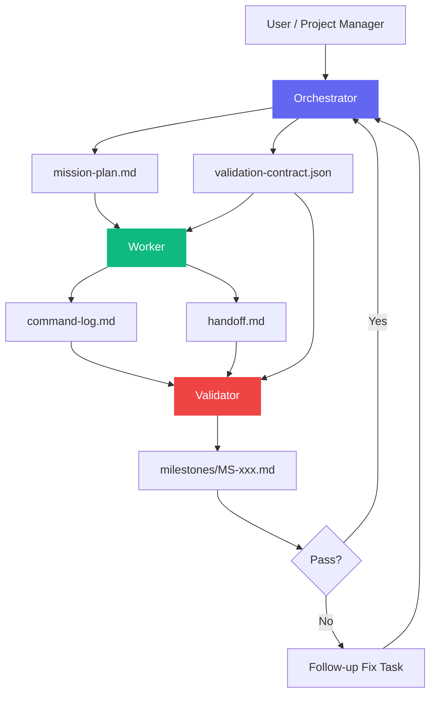
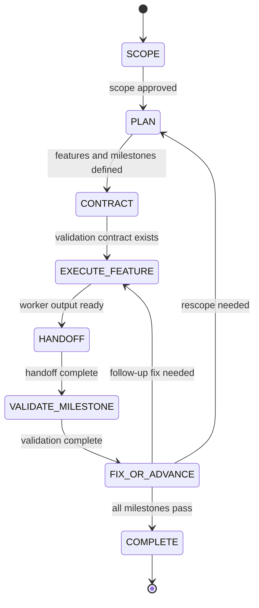
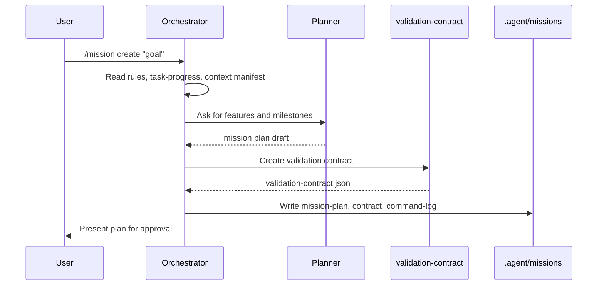
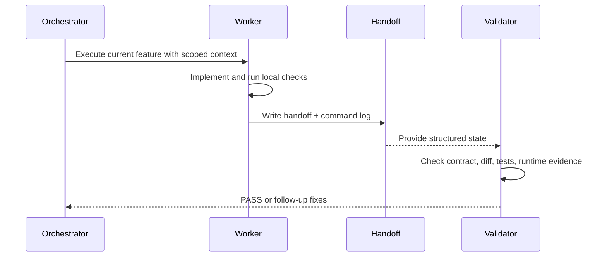
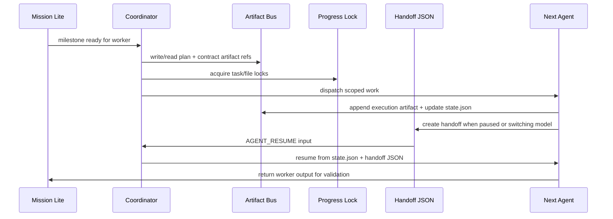

# Mission Lite 架构设计方案

> **Document Status**: Template MVP Complete
> **Related Task**: T-H24 / T-H25 / T-H26 / T-H27 / T-H28  
> **Core Objective**: 为 Cortex Agent 增加轻量长周期任务编排能力，让多 milestone 任务可以通过验证契约、结构化交接和独立验证稳定推进。

---

## 执行摘要

Mission Lite 第一版已经完成模板级闭环：`/mission` workflow、`validation-contract` skill、planner / reviewer 契约扩展、mission plan / command log / milestone 模板均已落地。

本文档后续定位为 Multi-Agent Coordinator 的长任务编排上游：Mission Lite 负责“任务如何拆、如何验证、如何推进 milestone”；Coordinator 负责“多个 agent 如何登记、产出、抢占、交接和恢复”。两者叠加，而不是互相替代。

### Current State & Pain Points

- Cortex Agent 已有 `/start-task`、`/ship`、`/parallel` 和 `/handoff`，但缺少专门面向多 milestone 长周期任务的编排层。
- `planner` 已可输出可选 `validation_contract`，但命令日志与 milestone 模板仍需标准化，才能形成完整 mission 证据链。
- `/handoff` 已能解决跨 Agent / 跨会话交接，但还没有与 milestone、命令日志、验证结论形成闭环。
- `/parallel` 能加速互不依赖任务，但如果用于共享代码修改，容易引入协调成本和范围漂移。

### Value Proposition

- 让长周期任务从“连续对话推进”升级为“文件化 mission 状态推进”。
- 在实现前定义验证契约，减少 Worker 自证正确的问题。
- 通过 milestone 级验证，把风险控制在阶段边界，而不是最终交付时一次性暴露。
- 复用现有 `.agent/` 工作流和 skill，不引入新运行时依赖。

---

## 1. 方案对比

### 1.1 核心维度对比

| Dimension | Status Quo | Mission Lite Proposal | Impact |
| :--- | :--- | :--- | :--- |
| **Design Compliance** | 单任务链路清晰，但长任务状态分散在对话、计划和 diff 中 | 新增 `.agent/missions/` 状态目录，仍保持模板驱动和文件化治理 | 改善 |
| **System Complexity** | `/start-task` + `/ship` 简洁，但不覆盖多 milestone 编排 | 增加 mission 状态机、验证契约和命令日志 | 适度增加 |
| **Maintenance & Scalability** | 长任务靠人工记忆和 handoff 拼接，难持续扩展 | 每个 mission 有计划、契约、日志、milestone 和 handoff | 改善 |
| **Performance/Resources** | 单任务成本低；大任务反复读上下文成本高 | 每个 Worker 使用最小上下文，Validator 按契约读取 | 稳定或改善 |
| **Reliability** | 验证集中在 `/ship`，阶段性缺陷可能晚暴露 | 每个 milestone 必须验证，失败生成 follow-up fix task | 改善 |

### 1.2 结构变化对比

#### Current Structure

```text
.agent/
├── workflows/
│   ├── start-task.md
│   ├── ship.md
│   └── handoff.md
├── skills/
│   ├── context-budget/
│   └── handoff/
└── plans/
    └── task-progress.md
```

当前结构适合单任务执行和跨会话交接，但没有 mission 级状态目录，也没有验证契约的统一格式。

#### Proposed Structure

```text
.agent/
├── workflows/
│   └── mission.md
├── skills/
│   └── validation-contract/
└── missions/
    └── M-xxx/
        ├── mission-plan.md
        ├── validation-contract.json
        ├── command-log.md
        ├── milestones/
        │   └── MS-001.md
        └── handoffs/
            └── YYYYMMDD-HHMMSS-{focus}.md
```

Mission Lite 不替代现有流程，而是在长任务场景中编排多个已有工作流。

---

## 2. 详细设计

### 2.1 模块职责

| Module | Responsibility | Notes |
| :--- | :--- | :--- |
| `/mission` workflow | 定义 SCOPE / PLAN / CONTRACT / EXECUTE / VALIDATE / COMPLETE 的执行 SOP | 新增工作流，模板驱动 |
| `validation-contract` skill | 创建、检查和压缩验证契约 | 新增 skill，纯文档/JSON 约束 |
| `.agent/missions/` | 保存 mission 运行状态 | 由 Agent 创建，非 CLI 强依赖 |
| `/handoff` workflow + skill | 继续作为跨 Agent / 跨会话交接格式 | 被 mission 复用 |
| `planner` | 输出 `plan_summary`，并可为高风险任务或 Mission Lite 输出 `validation_contract` | T-H27 已完成 |
| `code-reviewer` / Validator | 按 contract 验证实现证据，并输出 `contract_results` | T-H27 已完成 |
| `phase-gate` | 未来可扩展 mission 状态 gate | 非第一阶段目标 |

### 2.2 与 Multi-Agent Coordinator 的职责边界

Mission Lite 和 Multi-Agent Coordinator 是相邻层：

| 能力 | Mission Lite | Multi-Agent Coordinator |
| :--- | :--- | :--- |
| 长任务 scope / feature / milestone 拆解 | ✅ 负责 | 读取，不重写 |
| 验证契约与 Validator 输入隔离 | ✅ 负责 | 复用 contract 作为 artifact 校验依据 |
| 命令日志与 milestone 证据 | ✅ 负责 | 可索引为 artifact |
| agent registry | 不负责 | ✅ 负责 |
| artifact bus | 不负责 | ✅ 负责 |
| progress lock | 不负责 | ✅ 负责 |
| handoff JSON / AGENT_RESUME | 触发或引用 | ✅ 负责协议与消费 |
| 跨模型 resume 决策 | 不负责 | ✅ 负责 |

边界规则：

- Mission Lite 不维护“谁正在跑、占用哪些文件、是否心跳超时”的运行态。
- Mission Lite 不仲裁并发写入；共享文件冲突由 Coordinator 的 Progress Lock 处理。
- Mission Lite 的 `mission-plan.md`、`validation-contract.json`、`command-log.md` 和 `milestones/*.md` 可被 Coordinator 索引到 Artifact Bus，但源文件仍保持可读、可手写、可恢复。
- Coordinator 不应重写 mission scope；若发现 scope 过期，应要求 Orchestrator 回到 Mission Lite 的 `PLAN` 或 `FIX_OR_ADVANCE` 状态。

### 2.3 三角色模型



| Role | Owns | Does Not Own |
| :--- | :--- | :--- |
| Orchestrator | scope、feature/milestone 分解、验证契约、修复任务创建 | 业务代码实现 |
| Worker | 当前 feature 的实现、局部测试、命令日志、handoff | 扩大任务范围、重写 mission 计划 |
| Validator | 按契约审查 diff、测试、runtime evidence、命令日志 | 依赖 Worker 的自然语言解释 |

### 2.4 状态机



### 2.5 状态 Gate

| State | Required Evidence |
| :--- | :--- |
| `SCOPE` | mission 目标、非目标、边界、风险已记录 |
| `PLAN` | features / milestones / ordering 已写入 `mission-plan.md` |
| `CONTRACT` | `validation-contract.json` 存在且每个 milestone 至少有一条 blocking assertion |
| `EXECUTE_FEATURE` | Worker 只拿到当前 feature 所需上下文 |
| `HANDOFF` | handoff 包含进度、关键引用、命令日志和下一步 |
| `VALIDATE_MILESTONE` | Validator 读取 contract、diff、command log 和必要文件 |
| `FIX_OR_ADVANCE` | 失败项被转换为 follow-up fix task，或明确进入下一 milestone |
| `COMPLETE` | 所有 milestone 通过，任务进度和知识资产已同步 |

---

## 3. 验证契约设计

### 3.1 Contract Schema

第一版保持可读、可手写、可被 Agent 检查，不引入 JSON Schema 依赖。

```json
{
  "type": "validation_contract",
  "mission_id": "M-001",
  "milestone_id": "MS-001",
  "scope": {
    "feature": "auth-login",
    "files": ["src/auth/*", "tests/auth/*"]
  },
  "assertions": [
    {
      "id": "VC-001",
      "type": "test",
      "command": "npm test -- auth",
      "assertion": "invalid password returns 401",
      "blocking": true
    }
  ]
}
```

### 3.2 Assertion Types

| Type | Meaning | Example |
| :--- | :--- | :--- |
| `test` | 单元/集成测试命令 | `npm test -- auth` |
| `typecheck` | 类型检查 | `npm run typecheck` |
| `lint` | 静态检查 | `npm run lint` |
| `api` | API / schema / interface 契约 | `POST /auth/login` response shape |
| `docs` | 文档同步 | `INTERFACES.md` updated |
| `runtime` | 运行时证据 | browser flow / logs / traces |
| `manual` | 暂时无法自动化但必须确认 | security approval |

### 3.3 Contract Rules

- 每个 milestone 至少有一条 `blocking: true` 的 assertion。
- `command` 可选；没有命令时必须写清楚人工或文档检查依据。
- `runtime` 类型优先引用 `docs/reliability/*` 的模板。
- public API 变化必须包含 `api` 或 `docs` 类型断言。
- contract 失败时，不允许直接跳过；必须记录 waiver 或创建 follow-up fix task。

---

## 4. 交互与数据流

### 4.1 Mission Create Flow



### 4.2 Milestone Execution Flow



### 4.3 Coordinator Integration Flow

当 Mission Lite 进入跨 agent / 跨会话执行时，Coordinator 接管运行态协调：



该流程不改变 Mission Lite 的核心状态机，而是在 `EXECUTE_FEATURE`、`HANDOFF`、`VALIDATE_MILESTONE` 之间补齐可恢复的 agent 运行状态。

---

## 5. API / Workflow Change List

### 5.1 New Workflow

```text
.agent/workflows/mission.md
templates/en/.agent/workflows/mission.md
templates/zh/.agent/workflows/mission.md
```

Suggested usage:

```text
/mission create "migrate auth module"
/mission status M-001
/mission resume M-001
/mission validate M-001 MS-001
```

### 5.2 New Skill

```text
.agent/skills/validation-contract/SKILL.md
templates/en/.agent/skills/validation-contract/SKILL.md
templates/zh/.agent/skills/validation-contract/SKILL.md
```

Modes:

- `CREATE`: convert scope and acceptance criteria into assertions
- `CHECK`: verify contract completeness and report missing coverage
- `SUMMARIZE`: compress contract for handoff or reviewer input

### 5.3 Future Contract Extensions

Planner output may gain:

```json
{
  "validation_contract": [
    {
      "id": "VC-001",
      "type": "test",
      "command": "npm test -- auth",
      "assertion": "invalid password returns 401",
      "blocking": true
    }
  ]
}
```

Reviewer output may gain:

```json
{
  "contract_results": [
    {
      "id": "VC-001",
      "status": "PASS",
      "evidence": "npm test -- auth exited 0"
    }
  ]
}
```

---

## 6. 架构合规审计

| 评估维度 | 合规状态 | 发现的问题 | 改进建议 |
| :--- | :--- | :--- | :--- |
| 职责分配 | ✅ | Orchestrator / Worker / Validator 边界清晰 | 后续在 `/mission` workflow 中写成硬约束 |
| 依赖关系 | ✅ | 新能力通过模板文件和 `.agent/` 文档接入，不依赖 CLI runtime | 第一阶段不修改 `bin/cli.js` |
| 代码质量 | ✅ | 暂无业务代码变更 | 后续如增加脚本，必须仅用 Node 内置模块 |
| 模板驱动 | ✅ | 新 workflow / skill 应同步 zh / en 模板 | T-H25 / T-H26 必须同步双语模板 |
| 纯加法升级 | ✅ | 新增文件不覆盖既有用户配置 | `upgrade` 仍只复制不存在文件 |
| 平台无关 | ✅ | 所有平台通过 `.agent/workflows` 和 `.agent/skills` 读取 | 不绑定 Claude / Codex / Factory |

结论：Mission Lite 符合当前架构原则。主要成本来自新概念数量增加，应通过分阶段落地控制复杂度。

---

## 7. 实施计划

### Phase 1：验证契约能力（T-H25）

Status: completed in the first template-only version.

- 新增 `validation-contract` skill
- 定义 CREATE / CHECK / SUMMARIZE 模式
- 提供 assertion 类型和最小 JSON 模板
- 更新 `.agent/README.md` 与模板 README

### Phase 2：Mission 工作流（T-H26）

Status: completed in the first template-only version.

- 新增 `/mission` workflow
- 定义 create / status / resume / validate 子命令
- 明确每个状态的输入、输出和 gate
- 只做文档与模板，不引入 CLI 逻辑

### Phase 3：Sub-agent 契约扩展（T-H27）

Status: completed in the first template-only version.

- 扩展 planner 输出示例，加入 `validation_contract`
- 扩展 code-reviewer 输出示例，加入 `contract_results`
- 保持向后兼容：旧 `plan_summary` 和 `review_verdict` 字段不删除

### Phase 4：模板标准化（T-H28）

Status: completed in the first template-only version.

- 提供 `mission-plan.md` 模板
- 提供 `command-log.md` 模板
- 提供 `milestones/MS-xxx.md` 模板
- 明确 mission 完成后的归档策略

---

## 8. 风险与缓解

| Risk | Severity | Mitigation |
| :--- | :--- | :--- |
| 概念过多，增加使用门槛 | Medium | `/mission` 只推荐给多 milestone 长任务；普通任务仍走 `/start-task` + `/ship` |
| 验证契约变成形式主义 | Medium | `validation-contract` skill 的 CHECK 模式必须检查 blocking assertion 和证据来源 |
| Worker / Validator 边界被破坏 | Medium | reviewer 输入只允许 contract、diff、command log、必要源码 |
| `/parallel` 被误用于共享代码并行修改 | Medium | `/mission` 明确代码修改默认串行，只读研究和验证可并行 |
| 纯加法升级导致旧项目拿不到改造 | Low | README 和 release notes 明确新文件通过 `upgrade` 加法安装 |
| runtime evidence 部分已实现 | Low | `verification-summary.json` 已实现（2026-06-15）；`runtime-health.json` / `browser-verification.json` 对 CLI 项目为合理占位；`runtime` assertion 可作为 advisory，不默认阻断 |

---

## 9. 推荐结论

Mission Lite 模板 MVP 已完成，推荐保持当前边界并进入 Coordinator 集成准备。

后续优先级：

1. 不继续扩张 Mission Lite 的基础概念。
2. 将 mission 产物作为 Coordinator Artifact Bus 的输入来源。
3. 在 Coordinator 的 T-C08 中再显式补充 `/mission` 的 HANDOFF / RESUME 状态衔接。
4. 如果要增强 Mission Lite，应优先做 runtime evidence integration 或轻量状态辅助脚本，而不是新增角色。

Mission Lite 的价值是“让长任务可计划、可验证、可中断”；Coordinator 的价值是“让多个 agent 可登记、可交接、可恢复”。下一阶段应以 Coordinator 为主线推进。
