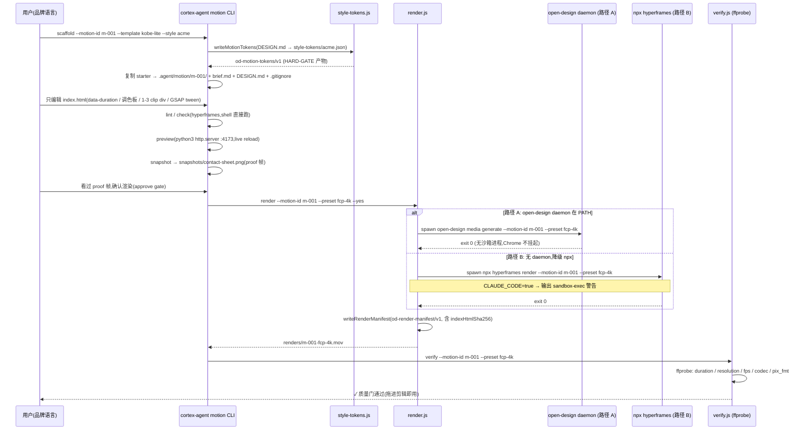
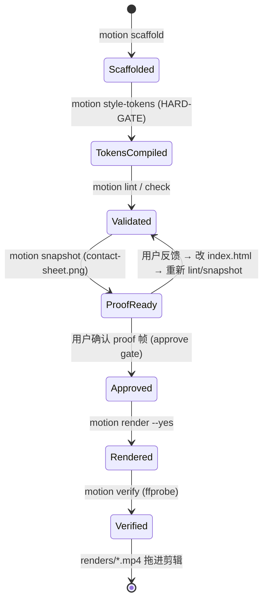

# /motion 工作流架构(动效第 5 平面)

> **Status: shipped(M-ODI-001 / MS-005,P-005 / D-ODI-004)**
>
> 本文档是动效第 5 平面的正式架构说明,替换 draft 占位。引擎采用
> [heygen-com/hyperframes](https://github.com/heygen-com/hyperframes)(Apache-2.0,
> "Write HTML. Render video. Built for agents."),cortex-agent 只做编排 +
> 品牌绑定 + 剪辑协议 + 质量门。

## 1. 概述与目标

用户原话场景:"动态图形就是用 Hyperframes 在 OpenDesign 里做的:他用自己的品牌配色描述想要的效果,OpenDesign 便生成出来、实时预览,再导出成 MP4 — 直接拖进剪辑就能用,而且是他的观众所期待的那种成片级质量。"

拆解为 4 个不可省略环节,每个环节都有对应的架构支撑:

| # | 环节 | 架构支撑 |
| :--- | :--- | :--- |
| 1 | 品牌配色描述 | DESIGN.md 4-level cascade → motion style tokens(HARD-GATE,`style-tokens.js`) |
| 2 | 生成 + 实时预览 | 3 个 starter 模板 + `scaffold.js` + `preview.js`(python3 http.server live reload) |
| 3 | 导出 MP4 剪辑即用 | `render.js`(daemon 路径 A / npx 路径 B)+ 8 个 `edit-presets.js` |
| 4 | 成片级质量 | `verify.js`(ffprobe 质量门)+ `snapshot.js`(proof 帧)+ `doctor.js`(依赖检测) |

### 1.1 目标(G1–G8)

- **G1 第 5 平面**:`.agent/motion/` + `cortex-agent motion` 命令矩阵(10 子命令)
- **G2 品牌驱动**:DESIGN.md → motion style tokens,调色板 / 字体 / 动效规则强制可溯源
- **G3 迭代循环**:scaffold 起步 → preview/snapshot → 迭代到满意才渲染
- **G4 剪辑即用**:帧率 / 分辨率 / 编码 / Alpha 矩阵,FCP / Premiere / 剪映 / CapCut 直拖
- **G5 成片级质量**:确定性渲染(render-manifest 哈希审计)· GPU 硬件加速 · 运动曲线库
- **G6 复用上游**:HyperFrames 20 skills 是引擎,cortex-agent 只做编排
- **G7 零 npm 依赖**:`lib/motion/*` 仅 Node.js 内置模块;外部命令走 spawn
- **G8 渲染门控**:渲染是用户门控动作(approve gate),无自动渲染

### 1.2 非目标(N1–N5)

- N1 不重写 HyperFrames 引擎;N2 不镜像 20 skills;N3 不做 AI 视频生成(t2v/i2v);
  N4 不支持 Windows 本地渲染(走 Docker / daemon);N5 不做音频混音。

## 2. 模块定位与边界

### 2.1 数据布局

```text
.agent/motion/
├── .gitignore                  # 隐藏 .hyperframes-cache/(引擎缓存,不提交)
├── README.md                   # 第 5 平面说明 + 质量矩阵(模板同步)
├── style-tokens/
│   └── <design-system-id>.json  # DESIGN.md → motion style tokens(HARD-GATE 产物)
└── <motion-id>/                # composition(只编辑 index.html 一处)
    ├── brief.md                # 用户品牌语言描述(系统生成,锁定)
    ├── DESIGN.md               # 最小可溯源 DESIGN.md(系统生成,锁定)
    ├── hyperframes.json        # HF composition 契约(锁定)
    ├── meta.json               # HF 元数据(锁定)
    ├── index.html              # HTML+CSS+GSAP ★ 唯一编辑对象
    ├── snapshots/
    │   └── contact-sheet.png   # proof 帧(渲染门控输入)
    └── renders/
        ├── <motion-id>-<preset>.<ext>   # 交付级(mov / mp4 / webm)
        └── render-manifest.json         # 质量矩阵 + 确定性哈希(审计)
```

### 2.2 代码布局

```text
lib/motion/
├── style-tokens.js   # DESIGN.md → motion tokens 编译(HARD-GATE 产物)
├── edit-presets.js   # 剪辑预设矩阵(8 preset + ffmpegArgs 翻译)
├── scaffold.js       # `media scaffold` thin wrapper(本地 starter + npx 委托)
├── render.js         # `media generate/wait` daemon dispatch + npx 降级 + manifest
├── verify.js         # lint/check(hyperframes)+ ffprobe 质量门
├── doctor.js         # Chrome + FFmpeg + hyperframes + open-design daemon 检测
├── preview.js        # python3 http.server live reload
└── snapshot.js       # proof 帧 contact-sheet(headless Chrome)
lib/commands/motion.js   # `cortex-agent motion {scaffold,style-tokens,lint,check,
                         #   snapshot,preview,render,verify,presets,doctor}`
bin/cli.js               # +1 require +1 case(纯 additive)
lib/cli/contract.js      # +1 motion 契约条目
templates/_shared/.agent/motion/  # README + kobe-lite / saas-hero / stat-counter
tests/motion/*.test.js            # 6 个单元测试文件
tests/commands/motion.test.js     # CLI round-trip
docs/architecture/motion-workflow-design.md  # 本文档
```

### 2.3 边界规则

| 边界 | 规则 |
| :--- | :--- |
| 内部 | `lib/motion/*` 相互依赖仅限:verify→render(compositionDirOf)、verify→edit-presets、scaffold→style-tokens、render→edit-presets |
| 外部 | open-design / npx / ffprobe / python3 / headless Chrome 都是外部命令,一律经 `child_process.spawn`,不在 Node 内实现 |
| 只读依赖 | `lib/motion/style-tokens.js` 只读 `lib/design/resolve.js`(T-OD-001 frozen,不改) |
| 冻结面 | `bin/cli.js` 既有 case、`lib/design/*`、`lib/agents/registry.js`、`templates/{zh,en}/.agent/workflows/`、`.agent/decisions/` 均不触碰 |
| 零依赖 | `lib/motion/*` 只用 `node:fs` / `node:path` / `node:crypto` / `node:child_process` / `node:os` / `node:readline` |

## 3. 8 个 lib/motion 模块详细 API

### 3.1 `style-tokens.js` — DESIGN.md → motion tokens(HARD-GATE)

**职责**:把生效 DESIGN.md(4-level cascade)编译为 `od-motion-tokens/v1` JSON,作为 HARD-GATE 输入与品牌可溯源的唯一凭证。

**来源优先级**(P-005 §4.2):
1. 显式 `--design-system <id>` → `.agent/design-systems/<id>/DESIGN.md`(+ 同级 `tokens.css`)
2. 显式 `designSystemPath`(测试/嵌入用)
3. cascade 生效 DESIGN.md(`lib/design/resolve.effectiveDesign`)

**提取规则**:
- 调色板:`tokens.css` 的 `--color-{primary,secondary,accent,bg}` 优先;否则解析 `## Color roles` 表格(Role/Hex/Usage);兜底 HyperFrames OD 默认画布(`#0b0b0f` + `#ffb76b` + `#7da4ff`)
- 字体:`## Typography` 的 `- **Heading**/**Body**: family, weight NNN`;frontmatter `font-family` 可覆盖
- 动效规则:frontmatter `motion:` 块优先;否则 `## Motion and interaction` 的 Easing / Duration / Stagger;都没有 → GSAP defaults(`power2.out` / fast 200 · base 400 · slow 800)
- anti-patterns:`## Anti-patterns` 的 `❌` 列表 → `no <原文>` id + `anti_pattern_details`

**API**:
```js
compileMotionTokens({ cwd, designSystemId?, designSystemPath?, templateDir? }) → tokens
writeMotionTokens({ cwd, motionId, designSystemId?, motionDir? }) → { path, tokens }
resolveDesignSource({ cwd, designSystemId?, designSystemPath? }) → { designMdPath, cascadeLayer, kind }
```

**产物示例**:
```json
{
  "version": "od-motion-tokens/v1",
  "derived_from": "f04b0a63998b003a...",          // DESIGN.md sha256
  "source": { "designSystemId": "acme", "cascadeLayer": 3 },
  "palette": { "primary": "#ff6a00", "secondary": "#2b2b33",
               "accent": "#7da4ff", "bg": "#0b0b0f" },
  "typography": { "heading": { "family": "Inter Display", "weight": 700,
                               "size_scale": [12, 16, 24, 36, 56] },
                  "body": { "family": "Inter", "weight": 400,
                            "size_scale": [12, 14, 16] } },
  "motion": { "easing": "power2.out",
              "durations": { "fast": 150, "base": 300, "slow": 600 },
              "patterns": ["fade-up", "scale-in", "slide-from-right",
                           "kinetic-type", "stat-counter"] },
  "anti_patterns": ["no default #333 / #3b82f6 / Roboto", "…"],
  "compiled_at": "2026-08-21T…"
}
```

### 3.2 `edit-presets.js` — 剪辑预设矩阵

**职责**:8 个 preset 的单一事实源(编码 / 帧率 / 分辨率 / 像素格式 / 容器 / Alpha / 目标软件),并提供 FFmpeg flag 翻译与校验。

**API**:
```js
PRESETS / PRESET_IDS / REQUIRED_FIELDS
getPreset(id) → preset | null
validatePreset(preset) → { ok, errors }      // 必填字段 + codec/container/alpha 约束
ffmpegArgs(preset, { input?, output?, duration?, extra? }) → string[]  // 纯函数
presetsByKind("fcp"|"pp"|"webm"|"vertical"|"overlay"|"all") → { id: preset }
outputExtension(preset) → "mov" | "mp4" | "webm"
```

### 3.3 `scaffold.js` — `media scaffold` thin wrapper

**职责**:脚手架起步(不 from scratch)。把 `templates/_shared/.agent/motion/<starter>/` 复制到 `.agent/motion/<motion-id>/`,生成 brief.md / DESIGN.md,写 `.gitignore` 隐藏 `.hyperframes-cache/`。外部模板(非本地 3 starter)委托 `npx hyperframes scaffold`。

**本地 starter**:`kobe-lite`(kinetic-type hero)/ `saas-hero`(产品发布 hero)/ `stat-counter`(count-up 数据动效)。

**编辑最小面**:`hyperframes.json.editPolicy` 声明 `editable: ["index.html"]` + `locked: [hyperframes.json, meta.json, DESIGN.md, brief.md]` — 只改 index.html 一处,降低出错面(P-005 §4.5)。

**API**:
```js
scaffoldComposition({ motionId, template, style?, cwd, templateDir?, motionDir? })
  → { motionDir, compositionDir, files, gitignore, tokens? }
runHyperframesScaffold({ motionId, template?, cwd, env, spawnFn?, wait? })
  → { ok, code? } | { ok:false, code:"NPX_MISSING"|"HYPERFRAMES_SCAFFOLD_FAILED", message }
isSlug(id) → boolean   // /^[a-z0-9][a-z0-9-]{0,63}$/
```

### 3.4 `render.js` — 渲染调度 + render-manifest

**职责**:渲染是用户门控动作(approve gate)。默认走**路径 A**(open-design daemon dispatch,无沙箱进程),降级**路径 B**(`npx hyperframes render` + Claude Code sandbox 警告)。渲染成功后写 `od-render-manifest/v1`(确定性审计)。

**API**:
```js
renderMotion({ motionId, preset, cwd, env, detect?, spawnFn?, outputs? })
  → { ok, engine: "open-design-daemon"|"hyperframes-npx", path?, manifest?, message? }
selectRenderPath({ hasOpenDesign, hasNpx }) → "daemon" | "npx" | { error }
sandboxWarning(env) → string | null
compositionHashes(cwd, motionId) → { indexHtmlSha256, hyperframesJsonSha256, metaJsonSha256 }
writeRenderManifest({ cwd, motionId, presetId, engine, outputs }) → { path, manifest }
expectedOutputPath(cwd, motionId, presetId, preset) → <compDir>/renders/<id>-<preset>.<ext>
```

### 3.5 `verify.js` — lint/check + ffprobe 质量门

**职责**:
- `lint` / `check`:shell 可直接跑(`npx hyperframes lint|check --motion-id <id>`),无需 daemon(P-005 §4.6)
- `verify`:ffprobe 校验产出(时长 / 分辨率 / 帧率 / codec / 像素格式 / alpha),overlay preset 必查 alpha

**API**:
```js
runCompositionCheck({ motionId, mode: "lint"|"check", cwd, env, detect?, spawnFn? })
validateRender(info, preset) → { ok, checks[], errors[] }   // 纯函数
parseFfprobeOutput(json) → { duration, width, height, fps, codec, pixelFormat, hasAlpha }
verifyRender({ motionId, preset?, file?, cwd, ffprobeFn? }) → { ok, info?, checks?, errors? }
```

### 3.6 `doctor.js` — 依赖检测

**职责**:`cortex-agent motion doctor` 检测 node / chrome / ffmpeg / hyperframes / open-design daemon + 平台,缺失时优雅报错 + 安装指引(VC-1 / VC-11)。

**API**:
```js
runDoctor({ which?, run?, chromeDetect?, env? })
  → { ok, deps: { node, chrome, ffmpeg, hyperframes, openDesign }, platform, warnings }
detectNode() / detectChrome(env, findFn?, knownPaths?) / platformInfo()
```

检测矩阵:

| 依赖 | 检测方式 | 缺失指引 |
| :--- | :--- | :--- |
| node | `process.versions.node` ≥ 18 | 安装 Node.js ≥ 18 |
| chrome | PATH 6 个命令 + macOS/Linux 常见路径 | 安装 Google Chrome / Chromium(headless) |
| ffmpeg | PATH + `ffmpeg -version` | `brew install ffmpeg` / `apt install ffmpeg` |
| hyperframes | `npx --no-install hyperframes --version` | `npm install -g hyperframes` |
| openDesign | PATH `open-design` | 安装 open-design daemon(推荐路径 A) |

### 3.7 `preview.js` — browser live reload

**API**:
```js
startPreview({ motionId, cwd, port = 4173, spawnFn?, wait? })
  → { ok, url: "http://localhost:<port>/", port, child, message, compositionDir }
stopPreview(entry) → boolean
```

实现:在 `<cwd>/.agent/motion/<id>/` 起 `python3 -m http.server <port> --directory <compDir>`。改 `index.html` 后浏览器刷新即迭代(G3)。

### 3.8 `snapshot.js` — proof 帧 contact-sheet

**API**:
```js
captureSnapshot({ motionId, cwd, detect?, spawnFn?, env?, wait? })
  → { ok, path: <compDir>/snapshots/contact-sheet.png, message?, child? }
selectSnapshotTool({ hasScreenshotAuto, hasNpx })
  → { tool: "screenshot-auto", args } | { tool: "npx", args: ["hyperframes","snapshot"] } | { error }
```

依赖 headless Chrome(`screenshot-auto` 优先,降级 `npx hyperframes snapshot`);Chrome 缺失时优雅报错,不 fail。

## 4. 8 个 edit-presets 参数矩阵(完整)

| preset id | codec | profile | pix_fmt | W×H | fps | audio | container | alpha | targets |
| :--- | :--- | :--- | :--- | :--- | :--- | :--- | :--- | :--- | :--- |
| `fcp-1080p` | prores_ks | 2 | yuv422p10le | 1920×1080 | 24 | pcm_s16le | mov | ❌ | Final Cut Pro / DaVinci |
| `fcp-4k` | prores_ks | 3 | yuv422p10le | 3840×2160 | 24 | pcm_s16le | mov | ❌ | Final Cut Pro / DaVinci |
| `pp-1080p` | h264 | high | yuv420p | 1920×1080 | 30 | aac | mp4 | ❌ | Premiere / 剪映 / CapCut |
| `pp-4k` | h264 | high | yuv420p | 3840×2160 | 30 | aac | mp4 | ❌ | Premiere |
| `jianying-1080p` | h264 | high | yuv420p | 1080×1920 | 30 | aac | mp4 | ❌ | 剪映 / CapCut(竖屏直拖) |
| `vertical-9x16` | h264 | high | yuv420p | 1080×1920 | 30 | aac | mp4 | ❌ | TikTok / Reels / 抖音 / 快手 |
| `overlay-webm` | vp9 | — | yuva420p | 1920×1080 | 30 | libopus | webm | ✅ | Premiere / 剪映 / FCP 上叠 |
| `overlay-mov` | prores_ks | 4 | yuva444p10le | 1920×1080 | 24 | pcm_s16le | mov | ✅ | FCP / DaVinci 专业后期 |

**约定**:
- ProRes / VP9 / WebM 免费编解码默认;H.264 需 FFmpeg 编译支持(R2 缓解)
- overlay 预设 `alpha: true`,`validatePreset` 拒绝 H.264 + alpha 组合
- `verify.js` 对 alpha 预设强制检查 `pix_fmt` 前缀 `yuva`
- 透明 overlay 在 QuickTime 可能显示黑底(README 与 preset description 已标注)

## 5. 渲染 pipeline 时序

### 5.1 完整链路



### 5.2 渲染门控状态机



## 6. HARD-GATE 实现

HARD-GATE(品牌门控)在渲染前强制品牌可溯源,由三层构成:

1. **Visual Identity Gate**:composition 必须能回溯到 `style-tokens/<id>.json`,其 `derived_from` 是 DESIGN.md 的 SHA-256。style-tokens 缺失或 hash 不匹配时,`render` 拒绝(CLI 层在用户确认前已校验 composition 存在;tokens 由 `scaffold --style` / `motion style-tokens` 生成)。
2. **3 个情绪问题**(写入 brief.md,渲染前必须回答):
   - 这支动效想让观众**感觉**什么?(克制 / 兴奋 / 信任 / 惊喜 …)
   - 画面应该是**明亮 / 暗调 / 中间调**?
   - 只允许出现**一个品牌色**,它是什么?
3. **anti-patterns 校验**:tokens 记录 DESIGN.md 的 What-NOT-to-Do(如 `no default #333 / #3b82f6 / Roboto`),`motion lint` 检查 composition 是否引入未声明 token。

来源优先级(P-005 §4.2):① cascade 生效 DESIGN.md(最高)→ ② 用户点名风格 → ③ 3 情绪问题兜底生成最小 DESIGN.md。

## 7. 沙箱路径 A/B 决策(macOS sandbox-exec)

### 7.1 问题(实证)

Claude Code 等 agent CLI 的 Bash 被 macOS **sandbox-exec** 包裹。puppeteer 的 Chrome 子进程在帧捕获中途挂起,导致 `npx hyperframes render` 直接渲染不可靠。open-design daemon 在**无沙箱进程**中渲染,可靠完成(P-005 §4.6 硬理由)。

### 7.2 决策

| 路径 | 谁跑 | 何时用 | 命令 |
| :--- | :--- | :--- | :--- |
| **A(默认,推荐)** | open-design daemon 无沙箱进程 | `doctor` 检测到 `open-design` 在 PATH | `spawn('open-design', ['media','generate','--motion-id',id,'--preset',preset])` |
| **B(降级)** | 用户 shell | 无 daemon | `spawn('npx', ['hyperframes','render','--motion-id',id,'--preset',preset])` |

### 7.3 sandbox 警告

路径 B 且 `process.env.CLAUDE_CODE === 'true'`(或 `'1'`)时,`render.js` 输出:

```
⚠️ Claude Code sandbox-exec 会挂起 Chrome — 建议在普通 shell 中运行(或安装 open-design daemon 走路径 A)
```

纯函数 `sandboxWarning(env)` 可单测;`doctor` 同样在检测到 CLAUDE_CODE 时加入 warnings。

## 8. FFmpeg codec flag 矩阵

`edit-presets.ffmpegArgs(preset)` 的翻译规则:

| preset codec | FFmpeg 视频编码器 | 附加 flag | 像素格式 | 音频 | 容器 |
| :--- | :--- | :--- | :--- | :--- | :--- |
| `prores_ks` | `-c:v prores_ks` | `-profile:v <2\|3\|4>` | `yuv422p10le` / `yuva444p10le` | `-c:a pcm_s16le` | `-f mov` |
| `h264` | `-c:v libx264` | `-profile:v high` | `yuv420p` | `-c:a aac` | `-f mp4` |
| `vp9` | `-c:v libvpx-vp9` | — | `yuva420p` | `-c:a libopus` | `-f webm` |

通用 flag:`-s <W>x<H>`、`-r <fps>`、`-pix_fmt <fmt>`;`-t <durationSec>` 由调用方按需传入;`--color-space p3` 由上层透传(默认 sRGB)。

### 8.1 确定性渲染保证(render-manifest.json)

```json
{
  "schemaVersion": "od-render-manifest/v1",
  "motionId": "m-001",
  "preset": "fcp-4k",
  "composition": {
    "hyperframesJsonSha256": "ab12…",
    "indexHtmlSha256": "cd34…",
    "metaJsonSha256": "ef56…"
  },
  "render": {
    "fps": 24, "width": 3840, "height": 2160,
    "codec": "prores_ks", "pixelFormat": "yuv422p10le",
    "alpha": false, "gpu": "hardware", "durationSec": 8.0,
    "frames": 192, "seed": 42
  },
  "outputs": [ { "path": "renders/m-001-fcp-4k.mov", "size": 482000000, "sha256": "12ab…" } ],
  "renderedAt": "2026-08-21T…",
  "engine": "hyperframes@>=1.x + open-design daemon"
}
```

同输入 → 同输出;`indexHtmlSha256` 变 → manifest 变,审计"这段 MP4 是哪版代码渲染的"。

## 9. 安全模型

1. **BYOK keyRef**:BYOK / 任何密钥只以环境变量名(`keyRef`)引用,绝不写入 manifest / brief / DESIGN.md / tokens。
2. **.gitignore 隐藏缓存**:`.agent/motion/.gitignore` 固定包含 `.hyperframes-cache/`(引擎 composition 源文件只留缓存);只有 `renders/*` 交付物可入库。
3. **路径约束**:所有产物落在 `<cwd>/.agent/motion/` 内;scaffold 拒绝覆盖已存在 composition;motion-id 校验 `/^[a-z0-9][a-z0-9-]{0,63}$/`。
4. **渲染门控**:非 TTY 环境未传 `--yes` 时渲染 fail-closed(exit 2),杜绝无确认自动渲染。
5. **零 npm 依赖**:`bin/cli.js` 与 `lib/motion/*` 只用 Node.js 内置模块;`npx --no-install` 探测 hyperframes 不触发网络安装。
6. **平台限制**:HyperFrames 要求 macOS Apple Silicon / Linux x64;Windows 走 open-design Docker / daemon(`doctor.platformInfo` 给出 warning)。

## 10. 验证方式

### 10.1 单元测试(零外部依赖,全部可离线跑)

| 文件 | 覆盖 |
| :--- | :--- |
| `tests/motion/style-tokens.test.js` | frontmatter / section / palette(css+table)/ typography / motion(GSAP 兜底)/ anti-patterns / compile 端到端 / write / derived_from |
| `tests/motion/edit-presets.test.js` | 8 preset 完整参数 / 必填字段 / ffmpegArgs / validatePreset / presetsByKind / outputExtension |
| `tests/motion/scaffold.test.js` | 产物文件 / .gitignore / editPolicy 锁定 / 模板校验 / 覆盖拒绝 / npx 缺失 / 3 starter 全通过 |
| `tests/motion/render.test.js` | 路径 A/B 调度 / sandbox 警告 / 错误路径 / manifest 确定性 / expectedOutputPath |
| `tests/motion/verify.test.js` | ffprobe 解析 / validateRender(alpha 必查)/ FFPROBE_MISSING 优雅报错 |
| `tests/motion/doctor.test.js` | node / chrome / ffmpeg / hyperframes / open-design / 平台 / CLAUDE_CODE 警告 |
| `tests/commands/motion.test.js` | CLI 参数解析 / 10 子命令 / 错误处理(真实 spawn bin/cli.js) |

### 10.2 验收映射(MS-005 VC)

| VC | 验证 |
| :--- | :--- |
| VC-1 | `motion doctor` 检测 5 项依赖 + 平台 |
| VC-2/VC-3 | `motion scaffold` 产物 + style-tokens 编译(HARD-GATE) |
| VC-4/VC-5 | `motion preview` URL / `motion snapshot` contact-sheet(外部缺失优雅指引) |
| VC-6 | `motion lint/check`(shell 直接跑) |
| VC-7/8/9 | `motion render --preset fcp-4k / jianying-1080p / overlay-webm` 产出 + ffprobe 校验 |
| VC-11 | 缺失 Chrome/FFmpeg/hyperframes 优雅报错 + 安装指引 |
| VC-12/13 | HARD-GATE + 渲染门控(非 TTY 无 --yes fail-closed) |
| VC-14/15 | bin/cli.js 零依赖(grep 验证)+ 既有 tests 全绿 |

### 10.3 回归基线

- T-OD-001 `tests/design/*.test.js`:118 tests(不变)
- MS-001/002/003 既有套件:~340 tests(不变)
- 新增:`tests/motion/*` 85 tests + `tests/commands/motion.test.js` 23 tests
- 运行:`node scripts/test-runner.cjs --scope motion` / `--scope commands`

## 11. 已知限制与后续

- **R1 沙箱**:路径 B 在 Claude Code 环境需人工注意;推荐 daemon 路径 A
- **R4 引擎演进**:版本锁 `hyperframes@>=1.x` + `doctor` 检测 + manifest.engine 审计
- **R7 黑底**:overlay 在 QuickTime 可能显示黑底(标注于 README / preset description)
- **Phase 4-8(out of scope)**:voiceover / audio-reactive / t2v / 模板市场 / Figma 导入

## 12. 相关文档

- [P-005 提案](../../.agent/plans/proposals/projects/open-design-integration/proposals/P-005-motion-graphics-hyperframes-proposal.md)(451 行)
- [D-ODI-004 决策](../../.agent/plans/proposals/projects/open-design-integration/decisions/D-ODI-004.md)
- [open-design 集成架构总览](./open-design-integration.md)
- [DESIGN.md cascade 设计系统架构](./design-system.md)(T-OD-001,本架构的输入)
- [deck-workflow-design.md](./deck-workflow-design.md)(P-003,兄弟工作流)
