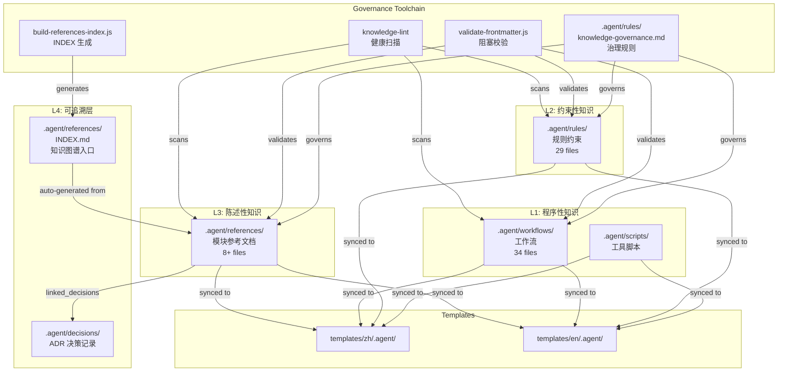

# OKF Knowledge Layer Design

> **Status**: M-018 MS-004 (2026-08-06)
> **Proposal**: `.agent/plans/proposals/okf-knowledge-layer/cortex-agent-okf-knowledge-layer-proposal.md`
> **Implementation**: M-018 `feat/okf-knowledge-layer` (MS-001 → MS-004)
> **Audience**: future developers + agents who need to understand or extend the knowledge governance infrastructure

## 1. 概述

M-018 把 `.agent/references/`、`.agent/workflows/`、`.agent/rules/` 升级为对标 **OKF V0.2** 的四层可验证知识栈。核心不变量：**知识必须有生命周期（draft → stable → deprecated）、可以被自动校验（validate-frontmatter + knowledge-lint）、可以追溯到决策（linked_decisions → ADR），并通过 frontmatter 元数据实现程序化消费。**

4 个 Milestone 的语义分工：

| MS | Scope | 关键产物 |
|:---|:---|:---|
| MS-001 | references frontmatter 升级 + 迁移脚本 + knowledge-lint 识别新字段 | `migrate-references-frontmatter.js` / 8 refs 升级 / R-LINT-007 |
| MS-002 | workflows + rules frontmatter 升级 + validate-frontmatter.js | ~30 wfs 升级 / 3 core rules 升级 / 三类 schema 校验 |
| MS-003 | knowledge-governance.md + INDEX.md 自动生成器 | 9 章治理规则 / build-references-index.js / 18 单测 |
| MS-004 | README 双语增量 + L1 模板同步 + 架构沉淀 + 回归 + handoff | 本文档 / templates sync / handoff artifacts |

## 2. 架构图



## 3. Frontmatter Schema 设计

### 3.1 References 类 (OKF V0.2 模板)

```yaml
---
module: "module-name"           # 模块标识
module_path: ".agent/references/xxx.md"
module_type: "模块参考文档"
keywords: [key1, key2]
status: stable                  # NEW: stable | draft | deprecated
owner: "git-author"             # NEW: 知识责任人
last_verified: "2026-08-06"     # NEW: 最后校验日期
verified_by: "knowledge-lint"   # NEW: 校验者
sources:                        # NEW: 知识来源引用
  - "lib/xxx.js"
linked_decisions:               # NEW: 关联 ADR
  - "D-XXX-001"
deprecation_reason: ""          # NEW: 废弃原因（status=deprecated 时必填）
---
```

### 3.2 Workflows 类

```yaml
---
type: workflow
applicable_to: [all]            # NEW: 适用角色/场景
inputs: [input1, input2]        # NEW: 输入
outputs: [output1]              # NEW: 输出
linked_skills: [skill-name]     # NEW: 关联技能
linked_rules: [rule-name]       # NEW: 关联规则
linked_workflows: [wf-name]     # NEW: 关联工作流
owner: "maintainer"
last_verified: "2026-08-06"
status: stable
---
```

### 3.3 Rules 类

```yaml
---
title: "Rule Title"
type: rule
scope: L1                      # NEW: L1/L2/L3 作用域
applicable_to: [all]            # NEW: 适用角色
linked_workflows: [wf-name]     # NEW: 关联工作流
linked_skills: [skill-name]     # NEW: 关联技能
owner: "maintainer"
last_verified: "2026-08-06"
status: stable
---
```

## 4. 知识生命周期状态机

```
  ┌─────────┐      validate       ┌─────────┐     deprecate      ┌────────────┐
  │  draft  │ ──────────────────► │ stable  │ ─────────────────► │ deprecated │
  └─────────┘                     └─────────┘                    └────────────┘
       │                                │                              │
       │ 缺失必填字段                    │ 必填字段全                     │ 必填 deprecation_reason
       │ ⚠️ Agent 不应采信              │ ✅ Agent 可直接采信            │ ⚠️ 从 INDEX 主列表移到
       │                                │                               │    Archived 分区
       └────────────────────────────────┴──────────────────────────────┘
                               永不物理删除 (git history)
```

- **draft → stable**: 跑 `validate-frontmatter.js` 通过 + `knowledge-lint` 无阻塞违规
- **stable → deprecated**: 走 `/propose-deprecation` workflow + 轻量 ADR 审批
- **物理删除**: 永不执行；`status: deprecated` 标记已足够

## 5. 校验门体系

### 5.1 Pre-commit 阻断

改 `.agent/{references,workflows,rules}/*.md` 时，`.agent/hooks/pre-commit-check.sh` 自动跑 `validate-frontmatter.js`。必填字段缺失 → exit 1 → 阻断 commit。

### 5.2 Knowledge-Lint 健康扫描

| Rule | 严重度 | 描述 |
|:---|:---|:---|
| R-LINT-001 | error | reference 文件缺少必填 frontmatter 字段 |
| R-LINT-007 | warning | `linked_decisions` 为空（鼓励关联 ADR） |
| R-LINT-008 | warning | `status` 值非法（非 stable/draft/deprecated） |
| R-LINT-009 | warning | `last_verified` 超过 90 天未更新（stale） |

### 5.3 季度 Stale Check

每季度末 (3/6/9/12 月) 跑 `/update-refs` 全量扫描：
- `last_verified` 超过 90 天 → 标 stale warning
- 关联 ADR 状态变更为 superseded → 标 stale warning
- 输出报告到 `.agent/metrics/knowledge-stale-report.json`

## 6. 工具链详解

### 6.1 migrate-references-frontmatter.js (MS-001)

一次性迁移脚本，把 8 个现有 references 从旧 frontmatter 升级到 OKF V0.2 模板：

```
node .agent/scripts/migrate-references-frontmatter.js --dry-run   # 预览
node .agent/scripts/migrate-references-frontmatter.js --apply      # 执行
```

支持 idempotent (重复跑产出稳定)：
- `owner` 默认 = `git log -1 --format=%an` 取 author
- `last_verified` 默认 = `last_updated`
- `sources` 从文件内 `module_path` 推断
- `status` 默认 = `stable`

### 6.2 validate-frontmatter.js (MS-002)

阻塞校验脚本，支持三类 schema：

```bash
node .agent/scripts/validate-frontmatter.js --type references
node .agent/scripts/validate-frontmatter.js --type workflows
node .agent/scripts/validate-frontmatter.js --type rules
node .agent/scripts/validate-frontmatter.js --file .agent/references/cli-core.md
```

必填字段缺失 → exit 1 并打印 violation list（含文件名 + 缺失字段）。

### 6.3 build-references-index.js (MS-003)

自动生成 `references/INDEX.md`：

```bash
node .agent/scripts/build-references-index.js             # 写入
node .agent/scripts/build-references-index.js --dry-run   # 预览
```

生成内容：
1. 总览（status 分布表）
2. Stable References 主列表（按模块名排序）
3. Draft References
4. Archived (Deprecated) 分区
5. Mermaid 知识关系图（基于 `linked_decisions`）

Skip 规则：无 frontmatter、无 `module` 字段（如 production-readiness 报告）的文件不进入 INDEX。

## 7. L1 模板同步策略

M-018 的所有变更（references frontmatter / validate-frontmatter.js / knowledge-governance.md / build-references-index.js / INDEX.md）通过 `templates/{zh,en}/.agent/` 的双语副本同步到 L1 模板层，确保 `cortex-agent init --lang zh|en` 初始化的项目天然具备完整知识治理能力。

同步覆盖范围：

| 源路径 | 模板路径 | 说明 |
|:---|:---|:---|
| `.agent/references/` | `templates/{zh,en}/.agent/references/` | 全量 15 个 reference 文件 |
| `.agent/scripts/` | `templates/{zh,en}/.agent/scripts/` | 7 个脚本（不含 `__tests__/`） |
| `.agent/rules/knowledge-governance.md` | `templates/{zh,en}/.agent/rules/` | 知识治理规则 |
| `.agent/skills/knowledge-lint/scripts/` | `templates/{zh,en}/.agent/skills/knowledge-lint/scripts/` | knowledge-lint 升级版 |

> `templates/{zh,en}/.agent/` 中先前缺失的 `references/` 和 `scripts/` 目录在 M-018 MS-004 中首次创建。

## 8. 与现有系统的关系

| 系统 | 关系 |
|:---|:---|
| **knowledge-lint** (`.agent/skills/knowledge-lint/`) | 本次升级：R-LINT-007 (linked_decisions 空警告) / R-LINT-008 (status 非法值) / R-LINT-009 (stale 预警)。知识层校验的运行时。 |
| **agent-scope** (`.agent/rules/agent-scope.md`) | 知识治理规则 scope: L1，所有项目受益 |
| **proposal-structure** | 提案落地时必须引用 affected references / workflows / rules |
| **decision-records** (`.agent/decisions/`) | references 通过 `linked_decisions` 关联 ADR；ADR 落地必须声明 affected references |
| **commit-standards** | 修改 reference / workflow / rule 时 pre-commit hook 自动跑 validate-frontmatter |
| **update-refs** (`/update-refs` workflow) | 季度 stale check，联动 knowledge-lint |
| **scan-project** (`/scan-project` workflow) | 模块扫描后触发 references 更新；新 reference 默认 status: draft |
| **build-references-index** | 依赖 references frontmatter；产出 INDEX.md（Agent 知识检索入口） |

## 9. 遗留与后续

| ID | 内容 | 优先级 |
|:---|:---|:---|
| F-MS004-followup-1 | workflows applicable_to 字段人工 review（~30 个 workflow） | 中 |
| F-MS004-followup-2 | rules scope / description 字段人工 review（3 个 core rules + 全量） | 中 |
| F-MS004-followup-3 | 61 references 文件的 `linked_decisions` 回填（当前全空，lint warning） | 低 |
| F-MS004-followup-4 | 季度 stale check 首次触发 (2026-09) | 低 |
| F-MS004-followup-5 | OKF V0.2 spec 更新时同步 review 本项目 frontmatter 兼容性 | 低 |

---

**Last Updated**: 2026-08-06 (M-018 MS-004)
