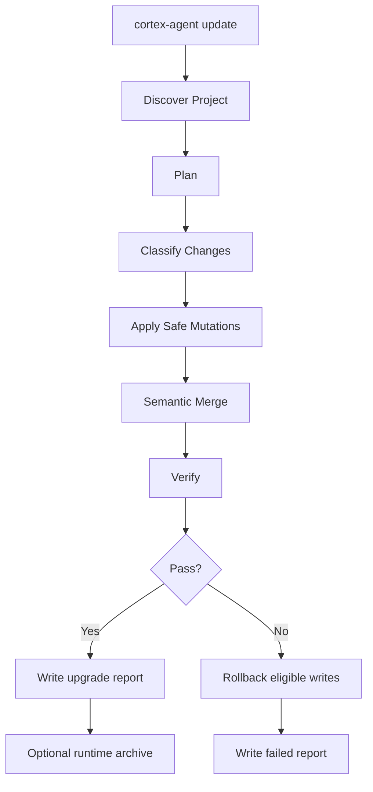

# One-Click Update 架构设计提案

> 状态：已批准，开发中  
> 日期：2026-07-23  
> 范围：`cortex-agent update` 一键升级、语义合并、升级验证、跨 agent 接手可用性

## 1. 背景

SamHMI 实战同步暴露出一个关键问题：`cortex-agent update` 已能安全添加文件和刷新部分受管脚本，但还不能保证目标项目升级后立即具备最新运行能力。

典型缺口包括：

- `AGENTS.md`、`CLAUDE.md`、`GEMINI.md` 已存在时会被跳过，旧 bootstrap 文案可能和新 runtime 规则冲突。
- `.agent/hooks/hooks.json`、`.claude/settings.json` 需要语义合并，而不是只做文件存在性判断。
- 新 Management API projection 同步后，缺少端到端 smoke test，SamHMI 的完整 `activity` 查询曾因大输出被截断。
- `safe update partially complete` 只说明“保留了本地修改”，但没有产出机器可读升级报告和明确修复路径。
- Runtime Continuity、Mission Lite、Multi-Agent Coordinator 依赖 `.agent` 工作状态一致，当前 update 不能自动证明新 agent 可以接手。

因此，本提案将 `update` 从“安全复制模板”升级为“可验证的一键项目升级”。

## 2. 目标

| 目标 | 说明 |
| :--- | :--- |
| 一键可用 | `cortex-agent update` 后，目标项目具备最新 `.agent` 能力，无需手工补 hook / 入口文档 |
| 语义合并 | 对 agent entry、hook 配置、projection registry、受管脚本执行结构化合并 |
| 本地保护 | 用户修改不被静默覆盖；冲突被明确报告并给出可执行修复建议 |
| 自动验证 | 升级后自动运行 runtime、Management API、handoff/resume 关键 smoke tests |
| 可恢复 | 升级动作写入 upgrade report；失败可回滚到备份，成功可生成 runtime-continuity archive |
| 跨 agent 友好 | Claude Code、Codex、Gemini 等工具切换时，新 agent 可读取 `.agent` 接手状态 |

## 3. 非目标

- 不把 `update` 变成强制覆盖命令。
- 不读取或迁移宿主私有完整聊天记录。
- 不替代 `doctor` 的全面诊断；`update` 只运行和升级结果直接相关的验证。
- 不在默认流程中执行业务构建、业务测试或联网安装依赖。
- 不解决目标项目本身的 git 分支落后、冲突或业务代码失败。

## 4. 当前问题归类

| 类别 | 当前行为 | 风险 |
| :--- | :--- | :--- |
| Entry files | 已存在即跳过 | 新规则无法传播，agent 启动说明漂移 |
| Hooks | 文件级保守更新 | SessionStart 可能缺少 runtime-continuity 或缺少环境门禁 |
| Managed scripts | 可更新受管脚本，但验证不足 | 新 projection 或大输出场景升级后才暴露 |
| Capability registry | 新文件可添加 | CLI 与项目 API contract 可能不匹配 |
| Runtime state | 不自动生成接手验证 | 新 agent 仍需人工判断是否可恢复 |
| Reporting | 输出人类日志 | 无结构化 report，无法供 CI / Coordinator 消费 |

## 5. 设计原则

1. 先计划，后写入：所有动作先进入 plan，再 apply。
2. 分层升级：L0 添加文件、L1 受管脚本、L2 语义合并、L3 验证归档分开统计。
3. 可解释保护：跳过必须带原因、文件、建议命令和风险级别。
4. 语义优先：JSON 用 parser 合并，Markdown entry 用受管 section 合并，不做整文件粗暴替换。
5. 验证即契约：update 成功不只看文件写入，还必须证明关键 CLI 能跑。
6. 交接优先：升级完成后，`resume-bundle` 是一等验收项。

## 6. Upgrade Pipeline



### 6.1 Discover Project

输入：

- 当前工作目录或 `--project <path>`
- `--lang`
- `.agent/.cortex-version`
- `.agent/manifest.json` 或 script manifest
- 当前 git 状态

输出：

- `project.root`
- `project.agent_root`
- 语言与平台检测结果
- 是否存在共享 `.agent` 软链接
- 当前 template / CLI / project capability versions

### 6.2 Plan

`update --dry-run` 和真实 `update` 必须使用同一个 planner。planner 输出机器可读计划：

```json
{
  "schema_version": 1,
  "command": "update",
  "project": {
    "root": "/path/to/project",
    "agent_root": "/path/to/project/.agent"
  },
  "plan": [
    {
      "path": "AGENTS.md",
      "layer": "L2",
      "action": "merge",
      "reason": "entry_runtime_bootstrap_stale",
      "risk": "medium"
    }
  ],
  "blocked": []
}
```

### 6.3 Classify Changes

| Layer | 内容 | 默认动作 |
| :--- | :--- | :--- |
| L0 additive | 缺失模板文件、schema、README | 直接添加 |
| L1 managed scripts | manifest 追踪的脚本 | 未改动则覆盖；用户改动则保护 |
| L2 semantic files | agent entry、hooks、settings、projection registry | parser 合并 |
| L3 runtime validation | status、resume-bundle、query smoke test | 只读验证，必要时用户门禁 archive |
| L4 forced repair | 本地修改脚本覆盖、冲突 entry 重写 | 仅 `--force-*` 或显式确认 |

## 7. 语义合并设计

### 7.1 Agent Entry Merge

适用文件：

- `AGENTS.md`
- `CLAUDE.md`
- `GEMINI.md`

策略：

- 在文件中维护受管 section，例如 `<!-- cortex-agent:session-bootstrap:start -->`。
- 已存在受管 section 时替换 section 内容。
- 不存在受管 section 时，基于标题插入到 `Session Bootstrap` 附近。
- 文件其余内容原样保留。
- 若检测到旧版危险指令，例如手工运行 `warm --auto` 且没有 `CORTEX_SESSION_START=1`，升级为 blocker 或自动修复项。

目标内容必须表达：

- SessionStart hook 自动执行 `CORTEX_SESSION_START=1 ... warm --auto`。
- 宿主不支持 hook 时，不得手工伪造自动模式。
- fallback 是 `status`，必要时 `archive --gate user --full`。

### 7.2 Hook Merge

适用文件：

- `.agent/hooks/hooks.json`
- `.claude/settings.json`

策略：

- 使用 JSON parser。
- 保留未知 hooks。
- 通过 description 或 command 中的 `runtime-continuity` 识别旧 hook。
- 缺失时新增；旧命令缺少 `CORTEX_SESSION_START=1` 时替换 command。
- 同一类型 hook 去重。
- 输出 merge diff summary。

必备 hook：

```bash
PROJ=$(node -e "console.log(require('path').basename(process.cwd()))"); CORTEX_SESSION_START=1 node .agent/skills/runtime-continuity/scripts/index.js warm --auto --project "$PROJ" 2>/dev/null; exit 0
```

### 7.3 Projection Registry Merge

适用文件：

- `.agent/skills/management-api/scripts/projection-registry.json`

策略：

- 按 `projection.name` 合并。
- 新 projection 自动追加。
- 已存在 projection 如字段变化，若用户未改动则更新；若用户改动则报告 conflict。
- 验证 registry 中每个 projection 都能被 Management API script 识别。

### 7.4 Managed Script Reconcile

继续沿用现有 script manifest，但补充：

- 每次脚本更新后运行 `node --check`。
- 对 Management API script 运行 `query capabilities`。
- 对 runtime-continuity script 运行 `status --project <name>`。
- 对大输出 projection 使用 `maxBuffer` 和有界 smoke test 验证。

## 8. Verify Contract

默认 `update` 完成后运行快速验证：

| 验证项 | 命令 | 失败影响 |
| :--- | :--- | :--- |
| JSON 配置 | parse hooks/settings/registry | update failed |
| Runtime status | `runtime-continuity status --project <p>` | warning 或 failed，取决于脚本是否存在 |
| Resume bundle | `runtime-continuity resume-bundle --project <p>` | failed |
| Capabilities | `management-api query capabilities` | failed |
| Dashboard query | `cortex-agent query dashboard-state --project <p>` | failed |
| Activity query | `cortex-agent query activity --project <p> --since <today>` | warning/failed |

可选 `--verify-full`：

- 完整 `activity` 查询。
- `runtime-continuity archive --gate user --full`。
- `doctor --fix` 中安全项。
- hook command dry execution。

## 9. Upgrade Report

每次 update 写入：

```text
.agent/updates/
├── latest.json
└── U-20260723_021500.json
```

report 结构：

```json
{
  "update_id": "U-20260723_021500",
  "started_at": "2026-07-23T02:15:00.000Z",
  "finished_at": "2026-07-23T02:15:10.000Z",
  "status": "passed",
  "project": {
    "root": "/path/to/project",
    "agent_root": "/path/to/project/.agent"
  },
  "changes": {
    "added": [],
    "updated": [],
    "merged": [],
    "protected": []
  },
  "verification": [
    {
      "name": "resume-bundle",
      "status": "passed",
      "command": "node .agent/skills/runtime-continuity/scripts/index.js resume-bundle --project SamHMI",
      "exit_code": 0
    }
  ],
  "next_actions": []
}
```

`/briefing`、Coordinator Health 和 Dashboard 可读取 `updates/latest.json`，向新 agent 说明项目是否处于可接手状态。

## 10. CLI Contract

```bash
cortex-agent update --dry-run
cortex-agent update
cortex-agent update --verify
cortex-agent update --verify-full
cortex-agent update --report json
cortex-agent update --force-scripts
cortex-agent update --force-entry
cortex-agent update --force-hooks
```

默认行为：

- `update --dry-run` 不写任何文件。
- `update` 执行 L0/L1/L2 安全升级和默认 verify。
- `--verify` 只运行验证，不写升级文件。
- `--verify-full` 运行较重验证和可选手工 archive。
- `--force-*` 只作用于对应层级，不提供一个笼统的全量强制覆盖开关。

## 11. 与现有架构关系

| 系统 | 关系 |
| :--- | :--- |
| Runtime Continuity v2 | update 必须验证 `status`、`resume-bundle`，必要时生成 archive |
| Mission Lite | update report 可作为 mission command-log 证据 |
| Multi-Agent Coordinator | Coordinator 读取 update report 判断 agent 是否可调度 |
| Management API | update 通过 capabilities/projection smoke test 验证查询契约 |
| Dashboard | 可展示最近 update 状态、保护项和修复建议 |
| Graphify | 后续可作为可选 verify 项，验证 post-commit hook 与图谱路径 |

## 12. 实施拆分

| Task | 内容 | 验收 |
| :--- | :--- | :--- |
| T-U01 | Update planner/report schema | `update --dry-run --report json` 输出完整计划且零写入 |
| T-U02 | Agent entry semantic merge | 旧 AGENTS/CLAUDE/GEMINI 可自动升级 Session Bootstrap section |
| T-U03 | Hook semantic merge | `.agent/hooks/hooks.json` 与 `.claude/settings.json` 自动补齐 runtime-continuity hook |
| T-U04 | Projection registry merge | 新 projection 合并、冲突报告、capabilities 验证 |
| T-U05 | Verify pipeline | 默认 smoke test + `--verify` / `--verify-full` |
| T-U06 | Upgrade report | 写入 `.agent/updates/latest.json`，Dashboard/briefing 可读 |
| T-U07 | Runtime archive integration | verify-full 可生成 `archive --gate user --full` 并写入 report |
| T-U08 | SamHMI regression fixture | 用 SamHMI 风格大 `.agent` 数据验证完整 activity 与 resume-bundle |

## 13. 验收标准

- [x] `cortex-agent update --dry-run --report json` 对已有项目输出准确计划，不写文件。
- [x] 已存在 `AGENTS.md` 可被语义合并，旧 Session Bootstrap 被受管 section 替换。
- [x] hook 配置自动补齐 `CORTEX_SESSION_START=1` runtime-continuity SessionStart。
- [x] projection registry 可按 `projection.name` 追加模板新增项，并保留本地自定义 projection。
- [x] `cortex-agent update --verify --report json` 可执行只读 smoke checks 并返回结构化验证结果。
- [ ] 更新后 `node --check` 覆盖所有受管 JS 脚本。
- [x] 验证模式覆盖 `query capabilities`、`dashboard-state`、`activity --since <today>`。
- [ ] 完整 activity 大输出不会被截断。
- [x] `.agent/updates/latest.json` 在 update apply 后写入，并可被 `/briefing` 与 `dashboard-state.latest_update` 读取。
- [ ] `--verify-full` 能证明新 agent 可通过 `resume-bundle` 接手。
- [ ] SamHMI 实战项目不需要手工 patch 即可完成升级验证。

## 14. 风险与对策

| 风险 | 对策 |
| :--- | :--- |
| 语义合并误改用户文档 | 受管 section + dry-run diff + report |
| hook JSON 存在非标准格式 | parse 失败时不写入，输出 blocker |
| 大项目 activity 输出过大 | 默认 smoke test 使用 `--since <today>`，full verify 使用高 buffer |
| 用户修改受管脚本 | 默认保护，`--force-scripts` 生成 `.bak` |
| 多 agent 同时 update | 后续引入 Progress Lock 或 update lock |

## 15. 结论

`update` 应从“保守文件同步器”升级为“项目运行时迁移器”。一键升级的定义不是覆盖所有文件，而是在保护本地改动的前提下，自动完成必要语义合并，并用可执行验证证明目标项目已经具备最新 Cortex Agent 能力。
