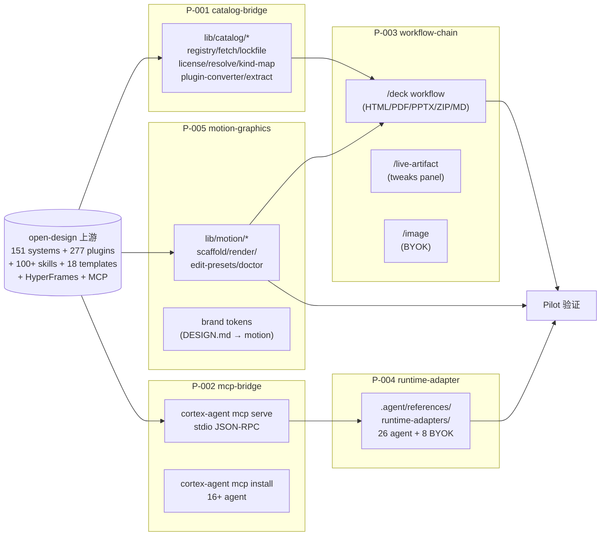

# open-design 设计版图链路集成

## 概述

cortex-agent 把 [nexu-io/open-design](https://github.com/nexu-io/open-design) 上游的 5 平面可组合架构(design-system · plugin · skill · design-template · motion)+ stdio MCP server + 26 coding-agent runtime,纳入 `.agent/` 治理框架,补齐设计版图缺位的 4 条工作流(`/deck` · `/live-artifact` · `/motion` · `/image`)和 4 个 catalog 统一接入(plugin · skill · template · design-system)+ MCP 双向桥接 + dsh native + 25 agent runtime-adapter 契约 + HyperFrames 动效第 5 平面。

本文档是 M-ODI-001 mission 的对外架构说明,**只引用最终决策和已 ship 资产**,不展开过程性讨论。

## 适用范围

### 覆盖

- 5 个子提案 + 4 个决策 + 5 个 milestone(MS-001~MS-005)
- 4 个 pilot 项目端到端验证矩阵(SamHMI · csm-view-memory · hmi-platform · AI-Brain)
- 沿用既有 ship 资产:T-OD-001(DESIGN.md cascade)· M-029 / P-006(dsh first-class)· skill-dispatch quad-layer
- 集成约束:`bin/cli.js` 零依赖、纯加法升级、双语模板同步、architecture-guard 0 violation

### 不覆盖

- open-design 桌面 app / Docker / Vercel 三种分发渠道(由 open-design 上游自有)
- 重写 T-OD-001 既有 `lib/design/*`(扩展为 `lib/catalog/*` 通过 alias 兼容)
- AI 视频生成(t2v/i2v)(Seedance / Veo / Sora 由 BYOK 路由负责)
- 实时协作(多人同时编辑 deck / dashboard)
- Windows 本地渲染(走 open-design Docker / daemon)

## 核心结论

| # | 结论 |
| :--- | :--- |
| C1 | open-design 是 **backend / catalog 上游**,不是 cortex-agent 内嵌依赖 |
| C2 | catalog 协议沿用 T-OD-001 `lib/design/*` 扩展为 `lib/catalog/*`,lock schema v1 → v2 向后兼容 |
| C3 | 5 个子提案**平行可独立 ship**,不强制顺序(建议 P-003 → P-005 → P-001 → P-002 → P-004) |
| C4 | 动效平面用 **HyperFrames 上游作为引擎**(品牌驱动 + 剪辑即用 MP4),不自己写渲染器 |
| C5 | 渲染必须走 open-design daemon dispatch(macOS sandbox-exec 会挂起 Chrome) |
| C6 | 渲染是用户门控(先 snapshot proof 帧再批准 render) |
| C7 | 编辑面只改 `index.html` 一处(脚手架其余文件由系统生成) |

## 架构与流程

### 5 个子提案全景



### 4 solutions 对齐

| open-design solution | cortex-agent 工作流 | 状态 |
| :--- | :--- | :--- |
| `/solutions/prototype/` | `/prototype --mode {doc,openpencil,pixso,open-design}` | ✅ ship + 扩展中 |
| `/solutions/dashboard/` | `/live-artifact`(tweaks panel) | ✅ ship |
| `/solutions/slides/` | `/deck`(15 templates × 36 themes + PPTX 零依赖) | ✅ ship |
| `/solutions/design-system/` | DESIGN.md 4-level cascade + 151 systems | ✅ ship |
| **动效(Motion 第 5 平面)** | **`/motion` + HyperFrames + 3 edit-presets** | **🚧 MS-005 待 ship** |

### 4 alternatives 策略

| open-design alternative | cortex-agent 策略 |
| :--- | :--- |
| `/alternatives/claude-design/` | 提供 Claude Design ZIP importer(`cortex-agent design import claude-design`) |
| `/alternatives/figma/` | 提供 `/prototype --backend {doc, openpencil, pixso, open-design}` 4 选 |
| `/alternatives/lovable/` | 提供"open-design 生成 → Lovable 出口"路径 |
| `/alternatives/figma-make/` | 通过 open-design 的 Figma import → DESIGN.md 提取 |

### 26 Coding-Agent Runtime 矩阵

| 协议 | Agent 数 | 代表 | cortex-agent 状态 |
| :--- | :--- | :--- | :--- |
| **stdio MCP** | 18 | Claude Code · Codex · Cursor · Copilot · OpenCode · OpenClaw · Hermes · Kimi · Pi · Cline · Trae · Kiro · Mistral Vibe · Antigravity · Reasonix · Raven | ✅ `cortex-agent mcp install <agent>` |
| **Native runtime** | 1 | DeepSeek Harness(dsh) | ✅ M-029 / P-006 first-class |
| **BYOK** | 8 | OpenAI · Anthropic · Azure · Google · Ollama · LM Studio · vLLM · Atlas Cloud | ✅ `.agent/references/runtime-adapters/byok-*.md` |

---

## 关键代码路径

### catalog 4-kind 通用协议

| 路径 | 作用 |
| :--- | :--- |
| `lib/catalog/registry.js` | 4 kind(design-system / plugin / skill / template)索引 |
| `lib/catalog/kind-map.js` | kind → path/license 字段归一化 |
| `lib/catalog/lockfile.js` | schema v1 → v2 向后兼容(自动迁移) |
| `lib/catalog/license.js` | 4 kind license ack gate + brand category warning |
| `lib/catalog/resolve.js` | 4-level cascade(只对 design-system 生效) |
| `lib/catalog/plugin-converter.js` | `open-design.json` → cortex-agent plugin manifest |
| `lib/catalog/fetch.js` | content-addressed SHA-256 校验 fetch |
| `lib/catalog/extract.js` | Brand-backed URL → DESIGN.md(走 open-design daemon) |
| `lib/catalog/claude-design-import.js` | Claude Design ZIP → `.agent/prd/<id>/` |

### MCP bridge

| 路径 | 作用 |
| :--- | :--- |
| `lib/mcp/server.js` | stdio JSON-RPC over Node.js 内置模块 |
| `lib/mcp/jsonrpc.js` | JSON-RPC 2.0 协议封装 |
| `lib/mcp/install.js` | 16+ agent 配置文件写入 |
| `lib/mcp/ping.js` | 健康检查 |
| `lib/commands/mcp.js` | `cortex-agent mcp {serve,install,list,uninstall,ping}` |
| `.agent/references/runtime-adapters/<agent>.md` | 26 agent + 8 BYOK 契约文档 |

### design workflow

| 路径 | 作用 |
| :--- | :--- |
| `lib/templates/pptx.js` | 零依赖手工构造 OOXML(不引入 pptxgenjs) |
| `lib/templates/html-deck.js` | 单文件 HTML deck(assets 内嵌) |
| `lib/templates/md-deck.js` | Markdown 摘要 + speaker notes |
| `lib/templates/pixso-deck-adapter.js` | Pixso DSL → deck 桥接(路径 B) |
| `lib/templates/open-design-deck-adapter.js` | open-design artifact → deck 桥接(路径 C) |
| `lib/commands/deck.js` | `cortex-agent deck` 命令矩阵 |
| `lib/commands/design.js` | 4-kind CLI dispatcher(system / plugin / skill / template) |

### motion graphics(动效第 5 平面 · MS-005 待 ship)

| 路径(规划) | 作用 |
| :--- | :--- |
| `lib/motion/style-tokens.js` | DESIGN.md → motion style tokens 编译(HARD-GATE 产物) |
| `lib/motion/edit-presets.js` | 剪辑预设矩阵(`fcp-4k` / `jianying-1080p` / `overlay-webm`) |
| `lib/motion/scaffold.js` | `media scaffold` thin wrapper(隐藏 `.hyperframes-cache/`) |
| `lib/motion/render.js` | `media generate/wait` 调 open-design daemon |
| `lib/motion/verify.js` | lint + check + ffprobe 质量门 |
| `lib/motion/doctor.js` | Chrome + FFmpeg + hyperframes + daemon 检测 |
| `lib/motion/preview.js` | browser live reload |
| `lib/motion/snapshot.js` | proof 帧 contact-sheet |
| `lib/commands/motion.js` | `cortex-agent motion {scaffold,render,verify,doctor,...}` |
| `templates/_shared/.agent/motion/README.md` | 第 5 平面说明 + 质量矩阵 |
| `.agent/motion/style-tokens/<id>.json` | 编译产物 |

### 26 agent runtime-adapter 契约

```text
.agent/references/runtime-adapters/
├── README.md                # 总览 + 26 agent 矩阵
├── _schema.md               # 文档规范
├── _index.json              # 机器可读索引
├── dsh.md                   # DeepSeek Harness (native · P-006 已 ship)
├── claude.md                # Claude Code (stdio MCP)
├── claude-desktop.md
├── codex.md                 # Codex CLI (stdio MCP)
├── cursor.md                # Cursor (stdio MCP)
├── copilot.md               # VS Code + GitHub Copilot (stdio MCP)
├── opencode.md              # OpenCode
├── openclaw.md              # OpenClaw
├── antigravity.md           # Antigravity
├── cline.md                 # Cline
├── trae.md                  # Trae
├── kimi.md                  # Kimi CLI
├── kiro.md                  # Kiro
├── pi.md                    # Pi Agent
├── vibe.md                  # Mistral Vibe CLI
├── hermes.md                # Hermes Agent
├── reasonix.md              # DeepSeek Reasonix
├── raven.md                 # Raven
├── aider.md                 # Aider
├── amp.md                   # Amp
├── atomcode.md              # AtomCode
├── codebuddy.md             # CodeBuddy
├── devin.md                 # Devin
├── mimo.md                  # Mimo
├── qoder.md                 # Qoder
├── qwen.md                  # Qwen
└── byok-{openai,anthropic,azure,google,ollama,lmstudio,vllm,atlas-cloud}.md
```

---

## 开发与验证

### CLI 命令全景

```bash
# catalog 4-kind(design-system / plugin / skill / template)
cortex-agent design system list|install|resolved
cortex-agent design plugin list|install
cortex-agent design skill list|install
cortex-agent design template list|install|show
cortex-agent design system extract --from-url <url>     # Brand-backed
cortex-agent design import claude-design <zip>          # Claude Design import

# design workflow
cortex-agent deck <task-id> --format {html,pdf,pptx,zip,md} --template <id>
cortex-agent deck <task-id> --from-pixso <dsl-file>     # 路径 B(Pixso → deck)
cortex-agent deck <task-id> --from-open-design <dir>    # 路径 C(open-design → deck)
cortex-agent live-artifact <task-id> --interactive --data-source {static,json,csv,api}
cortex-agent image <task-id> --model gpt-image-2 --aspect 16:9

# MCP bridge
cortex-agent mcp serve                                    # stdio JSON-RPC
cortex-agent mcp install claude|codex|cursor|copilot|dsh
cortex-agent mcp list|uninstall|ping

# runtime-adapter
cortex-agent agent list [--available|--installed]
cortex-agent agent show dsh|claude|...

# motion graphics(MS-005 待 ship)
cortex-agent motion doctor
cortex-agent motion scaffold --template <id> --style <design-system-id>
cortex-agent motion style-tokens [--motion-id <id>]
cortex-agent motion lint|check|snapshot
cortex-agent motion preview
cortex-agent motion render --preset {fcp-4k,jianying-1080p,overlay-webm}
cortex-agent motion verify
```

### 验证脚本

```bash
# 测试(M-001 ~ MS-003 已 ship,412 tests PASS)
node tests/run-tests.cjs                    # 全测试集
node tests/catalog/*.test.js                # 4-kind catalog(64+85 tests)
node tests/mcp/*.test.js                    # MCP bridge(65 tests)
node tests/runtime-adapters/*.test.js       # 26 agent(12 tests)
node tests/templates/*.test.js              # deck(66 tests)
node tests/commands/{deck,design,mcp,agent}.test.js

# 既有 ship 资产验证
node tests/design/*.test.js                 # T-OD-001(118 tests)
node tests/management/management-mcp-cli.test.js  # legacy MCP(2 tests)

# architecture guard
node .agent/skills/architecture-guard/scripts/index.js   # 必须 0 violation

# 零依赖验证
# 详见仓库根目录 scripts/ 中的 `verify-zero-deps.sh`；核心逻辑：
# 反向 grep 匹配 `require('...')` 但排除所有 `require('node:...')` 与内置模块（path / fs / child_process / os / crypto / stream / events / util / readline / assert / buffer / url / querystring / timers / worker_threads / http / https / net / tls / zlib / string_decoder / punycode / fs/promises / stream/web / stream/consumers / stream/promises）。命中即 FAIL；零命中即 OK。
```

### 端到端 MCP stdio JSON-RPC 实测

```bash
$ node bin/cli.js mcp serve
[cortex-agent mcp] serving /tmp/... (stdio, 11 tools)

→ initialize → response
→ notifications/initialized + tools/list → 11 tools:
  design/{list,show,install,resolved}
  prototype/{list,show}
  prd/{list,show}
  template/list, plugin/list, skill/browse
→ tools/call design/list → {ok: true, installed: [...]}
→ tools/call skill/browse {name: "..."} → 1 scanned, frontmatter 解析
```

---

## 约束与注意事项

### 强约束(0 violation)

- `bin/cli.js` 维持零 npm 依赖(只允许 Node.js 内置模块 `node:` 前缀)
- `lib/design/*` 主体零修改(T-OD-001 frozen),扩展为 `lib/catalog/*` 通过 alias 兼容
- lock schema v1 → v2 向后兼容(v1 旧 lock 自动 migrate,无信息丢失)
- 双语模板(`templates/zh` + `templates/en`)必须同步
- `architecture-guard` 必须 0 violation

### 动效平面特有约束(MS-005)

- **渲染必须走 open-design daemon dispatch**(macOS sandbox-exec 会挂起 Chrome,daemon 无沙箱进程才可靠)
- **渲染是用户门控**(先 `snapshot` 产 proof 帧,用户确认才 `render`,沿用 HyperFrames approve gate)
- **编辑面只改 `index.html` 一处**(脚手架其余文件由系统生成,降低出错面)
- **平台限制**:HyperFrames 要求 macOS Apple Silicon / Linux x64,Windows 走 open-design Docker / daemon
- **BYOK key 不入 manifest**(只引用 env var 路径 `keyRef`,key 由 OS 权限保护)

### license 治理

- install 时强制 ack(license + 来源 + category 警示)
- brand-referencing 类别(airbnb / apple / claude / linear-app / spotify / stripe / 等)显示"Aesthetic inspirations, not official assets of the brands they reference"
- license 缺失 fail-closed,可 `--force` 覆盖
- `--yes` flag 跳过 ack(脚本场景)但 license 仍记录到 lock file

### pilot 验证矩阵(MS-004)

| Pilot | 路径 | 优先级 | 验证 |
| :--- | :--- | :--- | :--- |
| SamHMI | pilot project home | P0 | `/deck` + linear-app design-system + motion logo sting(10s,4K) |
| csm-view-memory | pilot project home | P1 | `/live-artifact` + tweaks panel(7d/30d KPI 切换) |
| hmi-platform | pilot project home | P2 | `cortex-agent mcp install dsh` + dsh session 内 cortex-agent MCP tools |
| AI-Brain | internal | P3 | 2 周全链路 dogfooding + 5+ 用户反馈 |

---

## 相关文档

### 架构文档(ship)

- [DESIGN.md cascade 设计系统架构](./design-system.md) — T-OD-001 已 ship(4-level cascade,151 systems)
- [/prototype 工作流架构](./prototype-workflow-design.md) — Doc + Pixso MCP + 4 backend 互选
- [/deck 工作流架构](./deck-workflow-design.md) — MS-001 已 ship(HTML/PDF/PPTX/ZIP/MD 5 格式导出)
- [catalog-bridge 4-kind 协议架构](./catalog-bridge.md) — MS-002 已 ship(lock v1 → v2 向后兼容)
- [MCP bridge 架构](./mcp-bridge.md) — MS-003 已 ship(stdio JSON-RPC + 16+ agent install)
- [/motion 工作流架构(MS-005 待 ship)](./motion-workflow-design.md) — 动效第 5 平面 + HyperFrames + 3 edit-presets

### 上游参考资料

- [nexu-io/open-design GitHub](https://github.com/nexu-io/open-design) — Apache-2.0, 5 平面可组合架构
- [heygen-com/hyperframes GitHub](https://github.com/heygen-com/hyperframes) — Apache-2.0, "Write HTML. Render video. Built for agents."
- [open-design 官网](https://open-design.ai/) — 文档 + 下载 + 云服务

### 上游关键文档

- [open-design README](https://github.com/nexu-io/open-design/blob/main/README.md) — 总览 + 26 coding-agent 矩阵 + 5 平面架构
- [open-design Platform Compatibility](https://github.com/nexu-io/open-design/blob/main/README.md#platform-compatibility) — 27 runtime × 26 CLIs
- [open-design Plugin Spec](https://github.com/nexu-io/open-design/blob/main/plugins/spec/SPEC.md) — `open-design.json` v1.0.0
- [open-design HyperFrames SKILL.md](https://github.com/nexu-io/open-design/blob/main/design-templates/hyperframes/SKILL.md) — `media scaffold/generate/wait` 三件套
- [HyperFrames motion-graphics skill](https://github.com/heygen-com/hyperframes/blob/main/skills/motion-graphics/SKILL.md) — 设计驱动动效

### 镜像资源

- [open-design catalog](https://open-design.ai/zh/plugins/systems/) — 151 design systems
- [open-design 4 solutions](https://open-design.ai/zh/solutions/prototype/) · [dashboard](https://open-design.ai/zh/solutions/dashboard/) · [slides](https://open-design.ai/zh/solutions/slides/) · [design-system](https://open-design.ai/zh/solutions/design-system/)
- [open-design 4 alternatives](https://open-design.ai/zh/alternatives/claude-design/) · [figma](https://open-design.ai/zh/alternatives/figma/) · [lovable](https://open-design.ai/zh/alternatives/lovable/) · [figma-make](https://open-design.ai/zh/alternatives/figma-make/)

---

**变更日志**

- **2026-08-20**: 初版,基于 M-ODI-001 mission 的 5 子提案 + 4 决策 + 3 已 ship milestone(MS-001/002/003)+ 1 待 ship(MS-005)+ 1 pilot 待跑(MS-004)