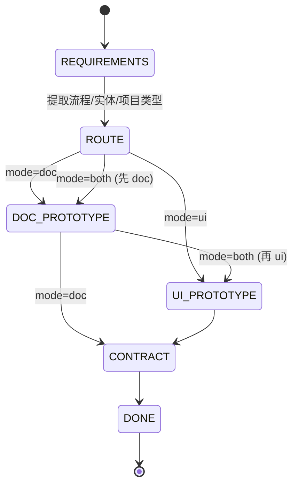
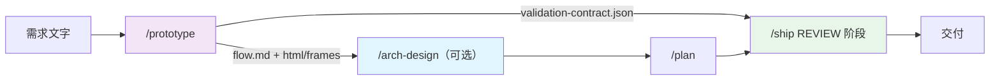

# /prototype Workflow Design

> 双路径原型工作流：从需求文字快速生成可验证的文档型原型（Mermaid + Anime.js）或 UI 型原型（Pixso MCP），统一输出 validation-contract，衔接需求与架构设计。

**状态**: 设计完成
**版本**: 1.0.0
**最后更新**: 2026-06-12

---

## 1. 背景与问题

### 1.1 现有覆盖

Cortex Agent 目前的治理能力集中在**实现侧**——从已确认的方案到代码交付的全链路：

| 阶段 | 工作流/能力 | 职责 |
|------|------------|------|
| 架构方案 | `/arch-design` | 提出、评估、整合架构想法，沉淀到 `.agent/references/` 与 `docs/` |
| 任务计划 | `/plan`、`planner` sub-agent | 将已确认方案拆解为 `task-progress.md` 中的结构化任务 |
| 验收契约 | `validation-contract` skill | CREATE / CHECK / SUMMARIZE 三种模式，定义可执行断言 |
| 交付收尾 | `/ship`、`/start-task` | 代码审查 → 提交 → 标记完成 → 同步计划 |

### 1.2 缺失的环节

上述链路有一个明显空档：**需求 → 原型** 阶段没有专门工作流。

```
需求文字  →  [ 空档 ]  →  /arch-design  →  /plan  →  /ship
            ↑
       缺少快速可验证的原型阶段
```

后果：

1. **需求到方案跨度太大**——AI 直接从一段需求跳到架构设计，缺少中间可视化锚点，方案容易偏离用户真实意图。
2. **验收契约没有早期输入**——`validation-contract` 在实现阶段才介入，原型阶段的对齐信息无法沉淀。
3. **UI 型需求无原型出口**——对 UI-heavy 项目，没有标准方式把需求转成可看的设计帧。

本工作流 `/prototype` 填补这一空档：在 `/arch-design` 之前（或并行）提供快速原型能力，产物直接供下游 `/arch-design` 与 `/ship` 消费。

---

## 2. 设计目标

| 目标 | 描述 | 验收 |
|------|------|------|
| **快速原型** | 从需求文字快速生成可浏览/可点击的原型 | 一条命令产出 flow.md（+ HTML / Pixso 帧） |
| **连接需求与架构** | 原型作为需求与 `/arch-design` 之间的锚点 | 产物可直接作为 `/arch-design` 输入 |
| **双路径** | 同时支持 Document（图 + HTML）与 UI（Pixso）两条路径 | `--mode doc\|ui\|both` 可控 |
| **统一验收出口** | 两条路径都汇合到 validation-contract | 产出 `validation-contract.json` |
| **轻量可降级** | 轻量需求不必走完整流程 | `--fidelity low` 只产 flow.md |
| **不绑定具体 API** | UI 路径仅规范调用约定，不耦合特定 Pixso MCP 参数 | 用户可按实际 MCP 工具调整 |

边界原则：

- `/prototype` 只负责需求 → 原型 → 验收契约，不做架构决策（交给 `/arch-design`），不写业务代码（交给 `/ship`）。
- UI 路径不绑定具体 Pixso API 细节，只定义输入/输出 JSON 契约。

---

## 3. 双路径设计

`/prototype` 的核心是两条可独立或并行执行的路径，通过 `--mode` 路由，通过 `--fidelity` 控制深度。

### 3.1 状态机总览



### 3.2 Document 路径

面向需求理解与流程验证，无构建步骤，纯静态产物。

```
需求文字
  → Phase 3a Step 1: Mermaid 流程图 (flow.md)
        ├─ sequenceDiagram     —— 用户操作序列
        └─ stateDiagram-v2     —— 页面/状态流转
  → Phase 3a Step 2: Anime.js HTML 可点击原型 (prototype.html)
        ├─ 基于 coordinator-dispatch.html 的深色终端风格
        ├─ 每个需求步骤映射为一个 Anime.js timeline 节点
        └─ Play / Reset 控件，CDN 加载 animejs，无构建
  → Phase 4: validation-contract
```

HTML 原型的节点模板（每个需求步骤对应一个 `.node`）：

```html
<div class="node" id="step-N">
  <div class="label">Step N</div>
  <div class="name">[动作]</div>
  <div class="status">[状态]</div>
</div>
```

### 3.3 UI 路径

面向 UI-heavy 需求，通过 Pixso MCP 生成真实设计帧。

```
需求文字
  → Phase 3b Step 1: 调用 Pixso MCP
        ├─ 传入：需求描述 + 用户流程步骤列表
        └─ 生成：设计帧（每步一帧）
  → Phase 3b Step 2: 记录设计帧 (pixso-frames.json)
        ├─ file_id
        ├─ frames[] (name + url)
        └─ export_hint（导出 PNG/SVG 建议）
  → Phase 4: validation-contract
```

### 3.4 路由与降级矩阵

| `--mode` | 执行路径 | 主要产物 |
|----------|---------|---------|
| `doc` | DOC_PROTOTYPE | flow.md、prototype.html |
| `ui` | UI_PROTOTYPE | pixso-frames.json |
| `both`（默认） | DOC_PROTOTYPE → UI_PROTOTYPE 串行 | 全部产物 |

| `--fidelity` | 行为 | 跳过 |
|--------------|------|------|
| `low`（默认） | 只产 flow.md | HTML、Pixso MCP 调用 |
| `mid` | flow.md + HTML（doc）/ frames（ui） | —— |
| `high` | 全量产物 + validation-contract 完整断言 | —— |

> `--fidelity low` 是轻量需求的逃生口：当需求简单到只需一张流程图时，跳过 HTML 渲染与 MCP 调用，避免工作流过重。

---

## 4. 输入/输出契约

### 4.1 入参

```
/prototype <task-id> [--mode doc|ui|both] [--fidelity low|mid|high]
```

| 入参 | 必填 | 默认 | 说明 |
|------|------|------|------|
| `task-id` | ✅ | —— | 任务标识，决定产物目录 |
| `--mode` | ❌ | `both` | 路径选择：doc / ui / both |
| `--fidelity` | ❌ | `low` | 保真度：low / mid / high |
| 需求描述 | ✅ | —— | 任务上下文中的需求文字（核心用户流程、关键实体、交互节点） |

### 4.2 产物目录

所有产物落在 `.agent/prototypes/<task-id>/`：

```
.agent/prototypes/<task-id>/
├── flow.md                    # Mermaid 流程图（sequenceDiagram + stateDiagram-v2）
├── prototype.html             # Anime.js 可点击 HTML 原型（doc 路径，fidelity≥mid）
├── pixso-frames.json          # Pixso 设计帧记录（ui 路径）
└── validation-contract.json   # 验收契约（两路径汇合产物）
```

| 产物 | 生产路径 | fidelity 门槛 |
|------|---------|--------------|
| `flow.md` | doc | low+ |
| `prototype.html` | doc | mid+ |
| `pixso-frames.json` | ui | mid+ |
| `validation-contract.json` | doc / ui 汇合 | low+ |

### 4.3 validation-contract 断言约定

Phase 4 调用 `validation-contract` skill（CREATE 模式），契约中必须包含：

| assertion type | 触发路径 | 断言内容 |
|----------------|---------|---------|
| `manual` | 全部 | 原型与需求描述是否对齐（人工确认） |
| `docs` | doc | flow.md Mermaid 图是否覆盖所有用户流程 |
| `runtime` | ui | Pixso 帧链接是否可访问 |

---

## 5. 与现有工作流的关系

`/prototype` 在需求与架构之间插入，下游产物可被 `/arch-design` 与 `/ship` 直接消费。



衔接关系：

1. **`/prototype` → `/arch-design`（可选）**：原型产物（流程图、HTML、设计帧）作为架构设计的可视化输入。复杂需求建议先 `/arch-design` 再 `/plan`；简单需求可跳过架构设计直接 `/ship`。
2. **`/prototype` → `/ship`**：`/prototype` 输出的 `validation-contract.json` 可直接供 `/ship` 的 REVIEW 阶段消费——实现完成后用同一份契约做验收，无需重新定义断言。

---

## 6. Pixso MCP 调用约定

UI 路径依赖 Pixso MCP server，但**只规范输入/输出 JSON 契约，不绑定具体 API 参数**。用户可按实际 Pixso MCP 工具签名调整调用细节。

### 6.1 调用时机

UI 路径 Phase 3b。当 `--mode` 为 `ui` 或 `both`、且 `--fidelity` ≥ `mid` 时触发。

### 6.2 传入

| 字段 | 说明 |
|------|------|
| 需求描述 | Phase 1 提取的核心用户流程与关键实体 |
| 用户流程步骤列表 | 有序的交互节点（每步对应一个设计帧） |

### 6.3 输出记录格式（pixso-frames.json）

```json
{
  "file_id": "<pixso-file-id>",
  "frames": [
    { "name": "Step 1 - 登录页", "url": "<pixso-frame-url>" },
    { "name": "Step 2 - 主面板", "url": "<pixso-frame-url>" }
  ],
  "export_hint": "在 Pixso 中选中所有帧 → 导出为 PNG/SVG → 放入 docs/assets/prototypes/<task-id>/"
}
```

| 字段 | 类型 | 说明 |
|------|------|------|
| `file_id` | string | Pixso 文件 ID |
| `frames` | array | 设计帧列表，每帧含 `name` + `url` |
| `frames[].name` | string | 帧名，约定格式 `Step N - [页面名]` |
| `frames[].url` | string | 帧可访问链接（供 runtime 断言校验） |
| `export_hint` | string | 资产导出路径建议（非强制） |

> 注意：上表只是输入/输出契约。具体 Pixso MCP 工具名、参数 schema 由用户实际安装的 MCP server 决定；本工作流不假设任何固定 API 签名。

---

## 7. 任务拆解

对应实现计划 `docs/superpowers/plans/2026-06-12-prototype-workflow.md`：

| 任务 ID | 描述 | 产物 | 依赖 | 状态 |
|---------|------|------|------|------|
| T-P01 | 架构设计文档 | `docs/architecture/prototype-workflow-design.md` | —— | 🔄 进行中 |
| T-P02 | 核心工作流（Document 路径 + 本地 prototype.md） | `.agent/workflows/prototype.md` | T-P01 | 待开始 |
| T-P03 | 中文模板同步 | `templates/zh/.agent/workflows/prototype.md` | T-P02 | 待开始 |
| T-P04 | 英文模板同步 | `templates/en/.agent/workflows/prototype.md` | T-P02 | 待开始 |
| T-P05 | 文档收尾（architecture.md + README.md + cspell.json） | 修改三处索引/字典 | T-P02 | 待开始 |

---

## 8. 附录

### 8.1 相关文档

- [Self-Bootstrapping Design](./self-bootstrapping.md)
- [Multi-Agent Coordinator](./multi-agent-coordinator.md)
- [Animation Library Evaluation](./animation-library-evaluation.md)
- 实现计划：`docs/superpowers/plans/2026-06-12-prototype-workflow.md`

### 8.2 相关工件

- `.agent/workflows/arch-design.md`（上游：架构设计）
- `.agent/workflows/plan.md`（下游：任务拆解）
- `.agent/workflows/ship.md`（下游：交付收尾，消费 validation-contract）
- `.agent/skills/validation-contract/`（共享：验收契约）

### 8.3 版本历史

| 版本 | 日期 | 描述 |
|------|------|------|
| 1.0.0 | 2026-06-12 | 初始版本，定义双路径（Document + Pixso UI）设计 |
