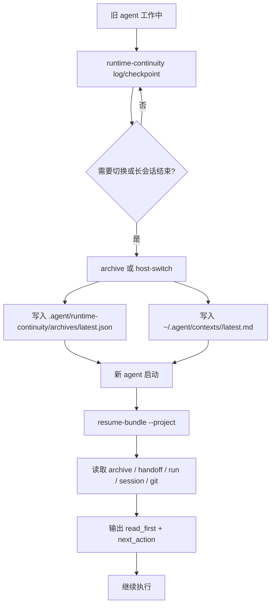

# Runtime Continuity v2 Design

> 状态：设计批准 · T-RC01
> 日期：2026-07-23
> 范围：跨 agent 工具切换、长会话恢复、结构化工作日志同步

## 1. 背景

Cortex Agent 已有 `/handoff`、Artifact Bus、Coordinator Health、Mission Lite 和
`runtime-continuity` CLI。它们能保存任务交接点，但还不能完整覆盖三类恢复诉求：

1. 同一项目从 Claude Code / Codex / Cursor / Windsurf 等工具切换时，旧 agent 的工作日志和状态需要可迁移。
2. 多天或长会话恢复不能只依赖一份松散 Markdown 存档。
3. 新 agent 接手后应能自动读取最近工作存档，自己生成恢复入口。

本设计不尝试抓取各宿主私有 transcript。统一策略是：所有 agent 工具把可迁移的工作状态同步到 `.agent/`，再由标准 CLI 生成 archive 和 resume bundle。

## 2. 目标

| 目标 | 说明 |
|------|------|
| 标准工作日志 | 提供 host-agnostic `runtime-continuity log/checkpoint` 入口 |
| 结构化存档 | 每次 archive 同时产出项目内 JSON 与用户级 Markdown |
| 自动恢复 | `restore --auto` / `resume-bundle` 能找到最新 archive、pending handoff、active run 和 git 状态 |
| 长会话闭环 | archive 记录 session、run、handoff、artifact、dirty files、commands 和 next action |
| 低耦合 | 不依赖 Claude/Codex 私有会话，不保存 secret，不引入 npm 依赖 |

## 3. 非目标

- 不读取或复制宿主私有完整聊天记录。
- 不保存 OAuth token、浏览器登录态、API key 或 shell history。
- 不引入 daemon、数据库或后台常驻进程。
- 不替代 `/handoff`；task-level transfer 仍由 handoff JSON 承担。
- 不替代 Management API；run/session 仍由 management-api 做权威 runtime writer。

## 4. 数据模型

新增项目内目录：

```text
.agent/runtime-continuity/
├── README.md
├── archive.schema.json
├── event.schema.json
├── state.json
├── events/
│   └── 20260723_010203_001-event.json
└── archives/
    ├── RC-20260723_010203_001.json
    └── latest.json
```

继续保留用户级可读存档：

```text
~/.agent/contexts/<project>/
├── ctx_20260723_010203_001.md
└── latest.md
```

### 4.1 Event

`event.schema.json` 描述单条可迁移工作日志：

```json
{
  "event_id": "RCE-20260723_010203_001",
  "project": "cortex-agent",
  "host": "codex",
  "agent_id": "codex-main",
  "run_id": "R-T-RC02",
  "task_id": "T-RC02",
  "type": "checkpoint",
  "phase": "editing",
  "message": "runtime-continuity CLI expanded",
  "summary": {
    "done": ["added schema"],
    "in_progress": "implementing CLI",
    "next": ["sync templates"]
  },
  "refs": {
    "files": [".agent/skills/runtime-continuity/scripts/index.js"],
    "commands": [
      {
        "command": "node tests/runtime-continuity.test.js",
        "exit_code": 0,
        "summary": "passed"
      }
    ],
    "artifacts": [".agent/artifacts/T-RC02/state.json"],
    "handoffs": []
  },
  "created_at": "2026-07-23T00:00:00.000Z"
}
```

### 4.2 Archive

`archive.schema.json` 描述一次可恢复快照：

```json
{
  "archive_id": "RC-20260723_010203_001",
  "project": "cortex-agent",
  "created_at": "2026-07-23T00:00:00.000Z",
  "source_host": "claude-code",
  "target_host": "codex",
  "reason": "switch implementation to Codex",
  "git": {
    "root": "/Users/xueyq/myworks/cortex-agent",
    "branch": "main",
    "head": "abc123",
    "status_short": ""
  },
  "state": {
    "current_goal": "Implement Runtime Continuity v2",
    "done": ["T-RC01 design"],
    "in_progress": "T-RC02 CLI",
    "next": ["add resume-bundle", "sync templates"],
    "blockers": []
  },
  "refs": {
    "latest_events": [".agent/runtime-continuity/events/20260723_010203_001-event.json"],
    "runs": [".agent/runs/R-T-RC02.json"],
    "sessions": [".agent/sessions/S-cortex-agent-20260723_010203_001.json"],
    "handoffs": [".agent/handoffs/H-xxx.json"],
    "artifacts": [".agent/artifacts/T-RC02/state.json"],
    "dirty_files": []
  },
  "restore": {
    "read_first": [
      "AGENTS.md",
      ".agent/rules/core-principles.md",
      ".agent/rules/ai-behavior.md",
      ".agent/runtime-continuity/archives/latest.json"
    ],
    "commands": [
      "node .agent/skills/runtime-continuity/scripts/index.js resume-bundle --project cortex-agent"
    ],
    "next_action": "Continue from T-RC02 CLI implementation."
  }
}
```

## 5. CLI Contract

`runtime-continuity` 扩展为 10 个模式：

| 命令 | 写入 | 用途 |
|------|------|------|
| `warm --auto --project <p>` | run event | 会话启动事件 |
| `status --project <p>` | run event | 查看最新 archive 年龄 |
| `log --project <p> ...` | `.agent/runtime-continuity/events/*.json` + run event | 记录可迁移工作日志 |
| `checkpoint --project <p> ...` | event + optional run checkpoint | 记录阶段断点 |
| `archive --project <p> --gate user` | Markdown + JSON archive + state | 创建长会话快照 |
| `archive --full ...` | 同上 | 显式要求完整结构化 refs |
| `host-switch --from-host <a> --to-host <b>` | archive + session last_host + run event | 跨工具切换 |
| `restore --project <p> --load latest` | read-only + run event | 读取最新 Markdown/JSON 存档 |
| `restore --auto --project <p>` | read-only + run event | 自动选择最新 archive 并输出恢复摘要 |
| `resume-bundle --project <p>` | read-only | 给新 agent 的完整接手包 |

### 5.1 Resume Bundle

`resume-bundle` 是新 agent 的默认入口，返回：

- latest archive JSON 路径和核心状态
- latest Markdown archive 路径
- pending handoffs
- active/stale sessions
- active/latest runs
- Artifact Bus latest state
- git status
- read-first 文件列表
- next actions

新 agent 接手同一项目时，只需先执行：

```bash
node .agent/skills/runtime-continuity/scripts/index.js resume-bundle --project cortex-agent
```

## 6. 与现有系统关系

| 系统 | Runtime Continuity v2 关系 |
|------|-----------------------------|
| `/handoff` | task-level 交接，archive 引用 handoff，不复制内容 |
| Artifact Bus | archive 引用 state/artifact 路径；不重写 Artifact Bus |
| Management API | run/session 权威写入仍走 management-api；runtime-continuity 只追加兼容事件 |
| Mission Lite | mission command-log/milestone 可被 archive 引用 |
| Coordinator | `/briefing` 和 coordinator-health 可读取 pending handoff 与 archive |
| Graphify | 可选引用 knowledge-graph artifact，不内联图谱 |

## 7. 恢复流程



## 8. 验收标准

- [x] `archive.schema.json` 和 `event.schema.json` 存在，字段覆盖 host、agent、run、task、state、refs、restore。
- [x] `archive --full` 写入 `.agent/runtime-continuity/archives/RC-*.json` 和 `latest.json`。
- [x] `log` / `checkpoint` 写入 events 并能被 archive 引用。
- [x] `host-switch` 自动创建结构化 archive。
- [x] `restore --auto` 可在没有用户说明时返回最新恢复上下文。
- [x] `resume-bundle` 可输出新 agent 的 read-first 与 next-action。
- [x] 中英模板同步。
- [x] 测试覆盖 runtime-continuity v2 新命令。

## 9. 分阶段任务

| 任务 | 描述 | 状态 |
|------|------|------|
| T-RC01 | Runtime Continuity v2 设计文档 + schema | ✅ 已完成 |
| T-RC02 | 扩展 runtime-continuity CLI：log/checkpoint/archive full/restore auto/resume-bundle | ✅ 已完成 |
| T-RC03 | 接入 workflows、SessionStart、briefing、templates、测试 | ✅ 已完成 |
