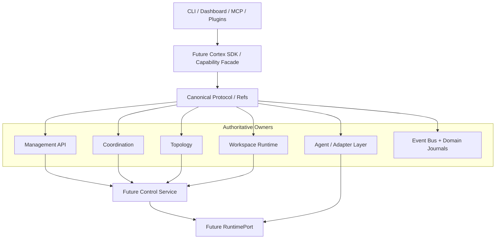

# Runtime, Control and Integration Ownership

> **Status**: M-040 MS-001 architecture baseline  
> **Date**: 2026-09-29  
> **Purpose**: define authoritative ownership and dependency direction before Cortex introduces the canonical Protocol/SDK, RuntimePort, Control Service, Project Integration and Extension contracts.

## 1. Position

Cortex remains a governance and orchestration framework. M-040 does not replace existing Management API, Coordination, Dispatch, Workspace, Topology, Agent Adapter or Event Bus implementations with a new runtime kernel.

Instead, later milestones introduce stable contracts **over** existing authoritative owners.

## 2. Layer model



The future SDK and protocol own no new persistence.

## 3. Authoritative ownership matrix

| Concern | Authoritative owner | Notes |
| :--- | :--- | :--- |
| Mission / Milestone / workflow truth | existing `.agent` mission/workflow state | governance truth |
| Coordination task lifecycle | `lib/coordination/contract.js`, `state.js`, journal/service | deterministic fail-closed state machine |
| Management projections | Management API | query/projection boundary |
| Run / Queue / Session records | existing Management/Collaboration contracts | observable/governance runtime records |
| Decisions / Waitpoints / Inbox | Management API governed writers + state | authorization/coordination |
| Agent registry | `lib/agents/registry.js` | agent identity/capabilities |
| External agent adapter contract | `lib/agents/adapters/*` | preserve behind future RuntimePort bridge |
| Governed manual dispatch orchestration | `lib/dispatch/*` | plan/gate/lease/idempotency composition |
| Transport execution | `lib/agents/dispatch-execute.js` and concrete adapters | below orchestration boundary |
| Runtime capability descriptor/matching | `lib/runtime-adapters/*` | existing capability/routing base |
| Host control | `lib/host-adapter/*` | gated host-specific control |
| Project topology | `lib/topology/index.js` + `.agent/topology/projects.json` | project identity / peers / capabilities |
| Workspace lifecycle | `.agent/workspaces/scripts/workspace-runtime.js` + schemas | identities/hooks/leases/composites |
| Framework event transport | `lib/event-bus/*` | transport/persistence/subscription |
| Coordination event truth | coordination journal | domain-authoritative journal |
| Dashboard process lifecycle | `lib/dashboard/supervisor.js` | operational process state only |
| MCP | `lib/mcp/*` | surface/adapter, not domain owner |
| CLI | `bin/cli.js` + `lib/commands/*` | routing/surface, not canonical owner |

## 4. Important non-collapsing boundaries

### Coordination state != Runtime state

Coordination already owns the software-work task lifecycle. RuntimePort will represent backend execution lifecycle only.

A runtime reporting `completed` MUST NOT directly transition a Mission or Coordination Task to completed.

### Framework Event Bus != universal domain state store

The Event Bus provides durable event transport, dedupe, ack, subscription and history. Domain journals may remain authoritative.

Future `CortexEvent` is a canonical envelope/projection contract, not a requirement to rebuild all state solely from one global event log.

### Project topology != Runtime topology

Project topology identifies repositories/projects and cross-project relations.

Runtime topology identifies hosts/runtime endpoints/execution capabilities.

They may reference each other but must remain distinct concepts.

### Workspace identity != Project identity

A project may have multiple workspaces/worktrees. Workspace state must continue to be owned by the existing workspace runtime.

### Dispatch orchestration != Transport executor

```text
Governed Dispatch / Control
        |
        v
    RuntimePort
        |
        v
Adapter / Transport Executor
```

`lib/dispatch/execute.js` and `lib/agents/dispatch-execute.js` currently represent different layers and must not be merged casually.

## 5. Existing capability architecture

`lib/runtime-adapters/capability-contract.js` already defines a versioned Host Capability Descriptor with closed capability names, levels and evidence sources.

M-040 will extend this architecture into separate capability namespaces:

```text
Host observability capabilities
Runtime lifecycle capabilities
Project capabilities
Extension permissions
```

These share versioning/naming conventions but are not one flat enum.

Existing capability matching and dispatch policy are migration inputs for RuntimePort/Topology work.

## 6. External project integration

External Project Integration MUST evolve the current topology owner instead of adding a second project registry.

```text
Project topology
    |
    +-- self / peer identity
    +-- roles
    +-- capabilities
    +-- topology references
    +-- bridge subscriptions
    |
    +-- future Project Integration descriptor
```

Projects such as Axrail remain authoritative for their own domain/runtime semantics.

Cortex may govern Missions, validation, evidence, decisions and cross-repository coordination without taking ownership of Axrail's HarnessRuntime, ToolRuntime, Policy, Approval, Validation or TransactionRuntime.

## 7. Workspace and cross-project integration

The existing workspace runtime already owns:

- WorkspaceIdentity
- HookLifecycle
- ResourceLease
- CompositeWorkspace
- ordered cross-repository recovery

Future SDK/project contracts wrap these capabilities rather than creating another workspace persistence layer.

Cross-repository merge remains non-atomic.

## 8. Current surface coupling

Today `bin/cli.js` routes directly to many implementation modules. That is acceptable for command routing, but shared canonical capabilities should gradually move behind the M-040 SDK facade.

The SDK is not intended to wrap every utility command. Priority is:

1. project resolution / Management query;
2. canonical refs and capability discovery;
3. topology/project lookup;
4. Run / Queue / Session queries;
5. Decision / Waitpoint queries;
6. Agent discovery;
7. Workspace reads;
8. RuntimePort.

## 9. Architecture guards

M-040 will extend the existing architecture-guard/testing approach.

Required future guards include:

- canonical protocol/domain code cannot import Paseo, Axrail or provider-specific modules;
- SDK facade cannot own a second persistent state store;
- RuntimePort cannot directly complete Missions/Coordination Tasks;
- Control Service cannot bypass workflow/Decision/Waitpoint authorization;
- Project Integration cannot create a second ProjectRegistry beside topology;
- Workspace facade cannot create a second workspace state store;
- MCP/Dashboard/UI cannot mutate governed state through private file writes;
- runtime events cannot become governance commands without owner validation;
- native execution must remain functional without Paseo.

The existing `tests/management/management-interface-boundary.test.js` is a useful behavioral guard seed.

The existing `architecture-guard` skill currently contains sample-level checks and must be upgraded before it can enforce these boundaries.

## 10. MS-002 migration baseline

MS-002 should introduce the smallest useful canonical facade first.

Proposed initial namespaces:

```text
project.*
management.query.*
topology.*
capabilities.*
refs.*
```

No broad rewrite is required.

Existing implementation modules remain behind adapters until later milestones migrate them deliberately.

## 11. Architecture invariants

1. One authoritative owner per state type.
2. Facades/protocols do not create duplicate state.
3. Runtime details never leak into core governance domain.
4. Project integration preserves target-project autonomy.
5. Runtime completion is evidence, not governance completion.
6. Recommendations/routing scores are never authorization.
7. Optional Control Service adds coordination, not new truth.
8. Existing native adapter/direct mode remains supported.
