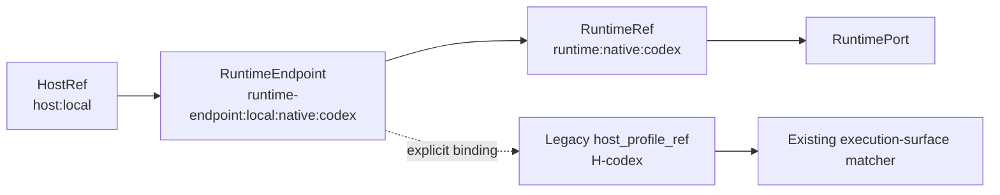

# Host / Runtime Topology and Capability Routing

> **Status**: M-040 MS-005 baseline  
> **Validated**: 2026-09-29  
> **Focused CI**: 59/59 PASS

## 1. Identity model

Cortex distinguishes three concepts that were historically easy to conflate:

```text
HostRef
  = physical/logical execution machine
  e.g. host:local, host:mac-mini, host:linux-server

RuntimeRef
  = runtime implementation on a host
  e.g. runtime:native:codex, runtime:paseo:mac-mini

RuntimeEndpointRef
  = one reachable runtime endpoint
  e.g. runtime-endpoint:local:native:codex
```

Legacy `host_profile_ref` remains the coding-agent host/profile capability identity used by the existing execution-surface matcher. It is not a physical HostRef.

## 2. Topology



Project topology remains independent:

```text
Project topology
  -> project identity / peers / repository relationships

Runtime topology
  -> host / runtime endpoint / execution capability
```

## 3. RuntimeEndpoint contract

A RuntimeEndpoint carries:

- endpoint_ref
- host_ref
- runtime_ref
- local/remote location
- transport
- availability
- runtime protocol descriptor
- available WorkspaceRefs

The portable contract lives in `@cortex-agent/runtime-port`.

Unknown fields fail closed.

Runtime descriptors may declare only the `runtime.*` capability namespace.

## 4. RuntimeRequirement

A RuntimeRequirement can hard-filter by:

- required runtime capabilities
- explicit endpoint
- HostRef
- RuntimeRef
- location
- transport
- WorkspaceRef
- availability

The filter is deterministic and has no soft score.

## 5. Native adapter discovery

Existing native adapters are projected into RuntimeEndpoint records.

Example:

```text
Codex Adapter
  -> HostRef: host:local
  -> RuntimeRef: runtime:native:codex
  -> Endpoint: runtime-endpoint:local:native:codex
```

Adapter `health()` supplies endpoint availability when probing is enabled.

Observer-only adapters do not gain execution capabilities merely because BaseAdapter methods exist.

## 6. Two-stage routing

Cortex reuses the existing host matcher rather than replacing it.

```text
RuntimeRequirement
       |
       v
RuntimeEndpoint hard filter
       |
       v
accepted RuntimeEndpoints
       |
       +-- explicit endpoint ↔ host_profile_ref snapshot binding
       |
       v
existing execution-surface-matcher
  - host capability level
  - governance decision
  - lease
  - TTL
  - reliability/cost/latency advisory score
       |
       v
RuntimeEndpoint selection
```

The composite router lives at `lib/runtime-port/capability-router.js`.

## 7. No silent failover

When a caller specifies an exact RuntimeEndpoint, all other endpoints fail the runtime hard filter.

If the requested endpoint later fails the host/governance matcher, routing returns:

```text
selection = null
```

It does not silently execute elsewhere.

This is especially important for risky operations.

## 8. Routing is not authorization

Every composite routing result explicitly carries:

```json
{
  "authorization": {
    "authorized": false,
    "reason": "routing_is_not_authorization"
  }
}
```

Authorization remains with Decisions, Waitpoints, workflow gates, leases and operation lifecycle.

## 9. Existing routing investments preserved

M-040 keeps these existing owners:

- `lib/runtime-adapters/capability-contract.js`
- `host-runtime-snapshots.js`
- `execution-surface-matcher.js`
- `dispatch-policy.js`
- operation lifecycle / authorization owners

Runtime topology is a new portable layer above them, not a replacement routing engine.

## 10. Validation

Focused validation covers:

- observer-only adapter capability correctness;
- undeclared RuntimePort operations fail closed;
- HostRef / RuntimeRef / RuntimeEndpointRef separation;
- runtime-only capability namespace;
- availability and workspace hard filters;
- explicit endpoint no-fallback;
- native endpoint health mapping;
- composite routing through the existing matcher;
- missing/ambiguous endpoint-to-host-profile binding safety.

Result:

```text
59 tests
59 pass
0 fail
```
