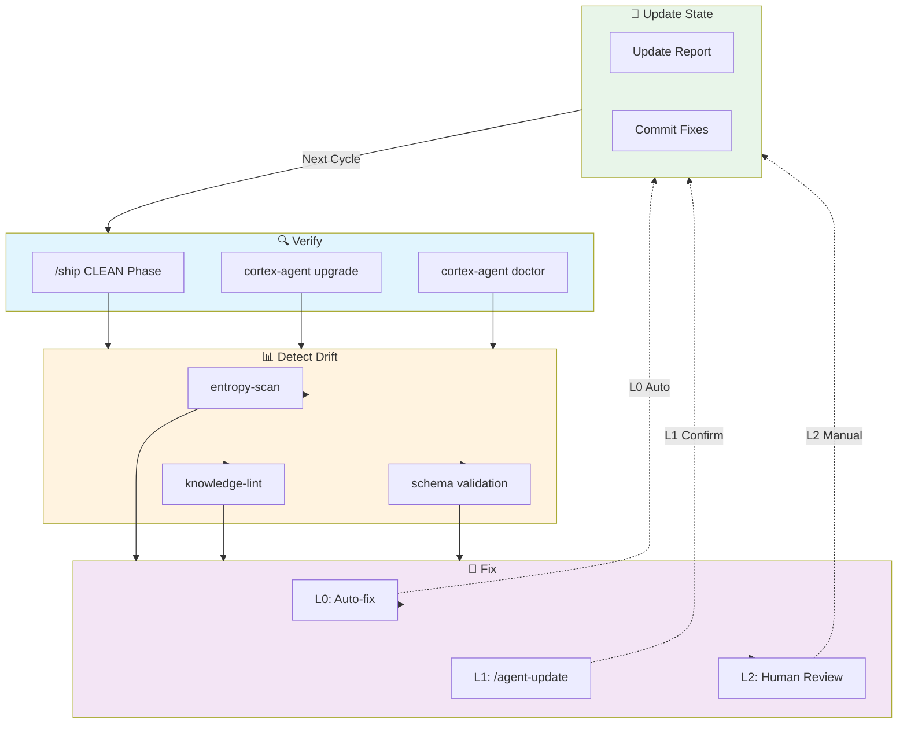

# Self-Bootstrapping Design

> 自举工作流：Cortex Agent 使用自身 `.agent` 的能力完成自我验证和实时更新

**状态**: 已实现（Implemented）
**版本**: 1.0.0
**最后更新**: 2026-06-12

---

## 1. 背景与问题

### 1.1 什么是自举？

**自举（Bootstrapping）**：一个系统使用自身的工具和能力来完成自我验证、自我修复和自我升级。

在 Cortex Agent 场景中：
- `.agent/` 目录包含完整的治理规则、工作流和扩展能力
- 这些能力理论上可以用来验证和更新 `.agent/` 自身
- 但之前缺少一个闭环的自举工作流

### 1.2 发现的问题

通过 T-C09 端到端验证，发现以下问题：

| 问题 ID | 描述 | 严重度 |
|---------|------|--------|
| TC9-F1 | Artifact wrapper 与 handoff schema 不匹配 | 高 |
| TC9-F2 | handoffs/ 和 artifacts/ 职责不清 | 中 |

这些问题在 T-B02 中已修复，但暴露了一个更大的问题：**框架缺乏自我验证能力**。

---

## 2. 设计目标

| 目标 | 描述 | 优先级 |
|------|------|--------|
| **自检** | 用框架自身验证框架自身的正确性 | P0 |
| **自愈** | L0 偏差自动修复，L1+ 偏差触发修复流程 | P0 |
| **增量更新** | 模板变更通过 `upgrade` 同步到已安装项目 | P1 |
| **可观测性** | `/briefing` 显示 `.agent` 健康状态 | P1 |

---

## 3. 自举循环

### 3.1 核心循环



### 3.2 触发条件

| 触发方式 | 场景 | 自动/手动 |
|----------|------|----------|
| `/ship` 完成 | 任何 `.agent` 相关任务交付后 | 自动 |
| `cortex-agent upgrade` | 升级前检查 drift，升级后验证 | 自动 |
| `cortex-agent doctor` | 健康检查包含自检 | 手动 |
| `/briefing` | 显示 `.agent` 自检状态 | 手动 |
| PostCommit Hook | 提交后检查 drift | 自动 |

---

## 4. 自检工作流

### 4.1 Self-Check Skill

创建 `skills/self-check/` 提供自检能力：

```
.agent/skills/self-check/
├── SKILL.md                    # Skill 定义
└── scripts/
    └── index.js               # 自检脚本
```

### 4.2 自检步骤

```
1. SCHEMA VALIDATION
   ├─> handoff-protocol.js validate --payload-file <handoffs/*.json>
   ├─> artifact-bus.js validate --task-id <task-id>
   └─> 检查 artifact wrapper vs handoff schema 一致性

2. KNOWLEDGE LINT
   ├─> node skills/knowledge-lint/scripts/index.js
   └─> 检查断链、缺失 README、plan 异常

3. ENTROPY SCAN
   ├─> entropy-scanner (L0 auto-fix)
   └─> entropy-scanner (L1 human review)

4. COORDINATOR HEALTH
   ├─> registry list-active
   ├─> locks list-held
   └─> artifacts state --task-id self-check

5. GIT HYGIENE
   ├─> 检查 .git/info/exclude vs .agent 追踪状态
   └─> 检查 untracked files vs ignored files
```

### 4.3 偏差分级处理

| 级别 | 名称 | 处理方式 | 自动化 |
|------|------|----------|--------|
| L0 | 自动修复 | entropy-scanner 自动修复 | ✅ 完全自动 |
| L1 | 需确认修复 | 提示 `/agent-update` 或 `/ship` | ⚠️ 半自动 |
| L2 | 需人工审查 | 生成修复提案，等待人工确认 | ❌ 手动 |

---

## 5. 与现有工作流的集成

### 5.1 `/ship` CLEAN 阶段

```
/ship 状态机:
  PLAN → EXECUTE → LINT → REVIEW → COMMIT → DONE
      → CONTEXT_CLEANUP → ENTROPY_SCAN → KNOWLEDGE_LINT
      → DOC_GARDENING → CLEAN
```

在 `CLEAN` 阶段增加自检步骤：

```yaml
### Phase 9: SELF_CHECK（新增）
ENTROPY_SCAN + KNOWLEDGE_LINT 完成后，执行自检：

**执行命令**:
node .agent/skills/self-check/scripts/index.js

**检查范围**:
- Schema 一致性（handoff, artifact）
- Knowledge lint 健康度
- Coordinator 健康度
- Git 追踪状态

**输出**:
- .agent/metrics/self-check-report.json
- 偏差分级处理建议

**状态流转**: SELF_CHECK → COMPLETE
```

### 5.2 `cortex-agent upgrade`

```
Before Upgrade:
1. 检查本地 drift（本地修改 vs 模板）
2. 生成 drift 报告
3. 提示用户确认是否继续

After Upgrade:
1. 运行自检
2. 如果 L0 偏差，应用自动修复
3. 如果 L1+ 偏差，提示运行 /ship 或 /agent-update
```

### 5.3 `/briefing` 健康度板块

在 briefing 中增加 `.agent` 自检状态：

```markdown
## 🏥 .agent Self-Check Status

### Schema Consistency
- ✅ handoff-protocol.js: artifact wrapper detection working
- ✅ T-C09 verification: PASS

### Knowledge Health
- ✅ knowledge-lint: 100/100
- ✅ doc-gardening: healthy

### Coordinator Health
- ✅ registry: 0 active agents
- ✅ locks: 0 held
- ✅ artifacts: self-check complete

### Last Self-Check
- 2026-06-12T05:45:00Z (T-B02 fix verification)
```

---

## 6. Artifact 与 Handoff 职责澄清

基于 TC9-F2 发现，明确文件职责：

### 6.1 职责定义

| 目录 | 职责 | 格式 | 生产者 |
|------|------|------|--------|
| `.agent/handoffs/` | 原始 handoff JSON（人可读 Markdown） | 原始 JSON payload | handoff-protocol.js (raw) |
| `.agent/artifacts/` | Artifact Bus 存储 | Artifact wrapper 格式 | artifact-bus.js (wrapped) |

### 6.2 读取优先级

```
对于 AGENT_RESUME:
1. 先尝试 .agent/artifacts/<task-id>/<seq>-handoff.json (wrapped)
2. 如果失败，回退到 .agent/handoffs/H-*.json (raw)

对于 HUMAN_RESUME:
1. 读取 .agent/handoffs/YYYYMMDD-*.md (human-readable)
```

### 6.3 Schema 兼容性

`handoff-protocol.js` 现在自动处理两种格式：

```javascript
function extractHandoffPayload(payload) {
  // 检测 artifact wrapper 并自动提取
  if (payload.artifact_id && payload.payload?.handoff_id) {
    return payload.payload;
  }
  return payload;
}
```

---

## 7. 实现任务

| 任务 ID | 描述 | 依赖 | 状态 |
|---------|------|------|------|
| T-B01 | 设计自举工作流文档 | - | ✅ 已完成 |
| T-B02 | 修复 handoff-protocol.js wrapper 检测 | T-C09 | ✅ 已完成 |
| T-B03 | 创建 self-check skill | T-B01 | ✅ 已完成 |
| T-B04 | 接入 `/ship` CLEAN 阶段 | T-B03 | ✅ 已完成 |
| T-B05 | 接入 `cortex-agent upgrade` | T-B03 | ✅ 已完成 |
| T-B06 | 创建 `/agent-update-self` 工作流 | T-B04 | ✅ 已完成 |

---

## 8. 附录

### 8.1 相关文档

- [Multi-Agent Coordinator](./multi-agent-coordinator.md)
- [Harness Optimization](./harness-optimization-design.md)
- [Mission Lite Design](./mission-lite-design.md)

### 8.2 相关工件

- `.agent/handoffs/scripts/handoff-protocol.js`
- `.agent/artifacts/scripts/artifact-bus.js`
- `.agent/skills/knowledge-lint/`
- `.agent/skills/entropy-scanner/`
- `.agent/sub-agents/coordinator.md`

### 8.1 版本历史

| 版本 | 日期 | 描述 |
|------|------|------|
| 1.0.0 | 2026-06-12 | 初始版本，基于 T-C09 验证发现设计 |
