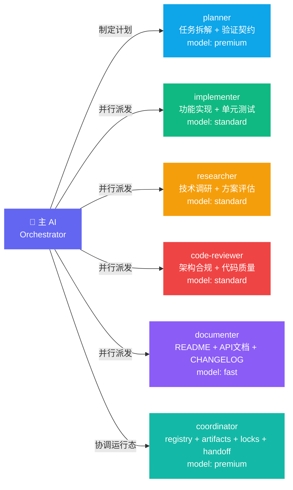
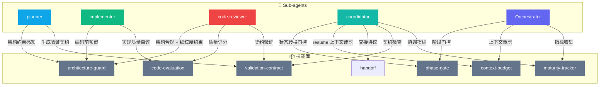

# Sub-agent 架构 (Sub-agents)

> Cortex Agent 通过 **5 个核心执行**子代理实现职责分离，另有 **coordinator**、**会话管理**、**熵治理**等治理/协调型子代理，每个代理有独立的模型、工具权限和上下文边界。

---

## 架构总览



模型别名（`premium` / `standard` / `fast`）可在 `.agent/config/reasoning-config.yml` 中统一配置，支持切换 Anthropic、OpenAI、Ollama 等提供商。

---

## 角色职责

| Sub-agent | 职责 | 默认模型 | 触发方式 |
| :--- | :--- | :--- | :--- |
| `planner` | 任务拆解、依赖分析、制定实施计划，输出 `plan_summary` 和可选 `validation_contract` JSON 契约 | premium | `/start-task`、`/parallel`、`/mission` 自动调用 |
| `implementer` | 独立完成功能编码，包含单元测试，输出 `execution_report` JSON 契约 | standard | `/ship`、`/parallel` 派发 |
| `researcher` | 技术调研、方案对比、可行性评估（只读，不写代码）| standard | `/start-task`、`/parallel` 派发 |
| `code-reviewer` | 架构合规、代码质量、性能检查，按 validation contract 验证证据，输出 `review_verdict` JSON 契约 | standard | `/ship`、`/code-review`、`/mission validate` 自动调用 |
| `documenter` | 同步 README、API 文档、注释、CHANGELOG | fast | `/ship`、`/parallel` 派发 |

多 agent / 多模型协调代理：

| Sub-agent | 职责 | 默认模型 | 触发方式 |
| :--- | :--- | :--- | :--- |
| `coordinator` | 维护或检查 agent registry、artifact bus、progress lock、handoff JSON、resume 决策和 coordinator health，输出 `coordination_report` JSON 契约 | premium | `/mission`、`/handoff`、`/parallel` preflight、`/briefing` health |

此外还有一个专用的熵治理代理：

| Sub-agent | 职责 | 默认模型 | 触发方式 |
| :--- | :--- | :--- | :--- |
| `entropy-scanner` | 扫描 `.agent/references/` 知识库漂移，按 L0-L3 分级自动修复或标记 | fast | PostCommit Hook（L0）、`/ship` ENTROPY_SCAN 阶段（L1）|

长时会话与上下文续接（可选）：

| Sub-agent | 职责 | 默认模型 | 触发方式 |
| :--- | :--- | :--- | :--- |
| `session-manager` | 评估长任务耗时、会话存档/恢复、时间状态、`warm` 预热提示 | fast | 用户显式调用或 `routing-defaults.yml` 中 `session_continuity` 约定 |

---

## 技能挂载

每个 Sub-agent 按职责挂载专项技能（Skills），实现精准的能力覆盖：



| 技能 | 作用 |
|------|------|
| `architecture-guard` | 合并了 architecture-audit + architecture-check，双层验证：确定性工具扫描 + AI 多维度审查 |
| `phase-gate` | `/ship` 状态机的阶段前置条件检查，硬性阻断不合规的阶段转换 |
| `context-budget` | 按 Tier 0-3 分级裁剪上下文，将每次任务的有效负载控制在窗口 40% 以内 |
| `code-evaluation` | 实现质量自评：可靠性、性能、可维护性三维评分 |
| `maturity-tracker` | 收集每次 `/ship` 的指标数据，驱动 harness 组件的渐进式退化决策 |
| `validation-contract` | 在实现前生成验证断言，并在审查时检查 blocking assertion 的证据 |
| `handoff` | 生成与消费跨 agent / 跨会话的结构化交接 |

---

## Sub-agent 防火墙（输出契约）

所有 Sub-agent 的输出都经过结构化 JSON 契约压缩，防止上下文污染在代理间传播：

```
planner      → plan_summary.json       (~2K tokens，含可选 validation_contract，代替完整规划过程的 ~10K tokens)
implementer  → execution_report.json   (files_changed / tests_passed / deviations / blocked_steps)
code-reviewer→ review_verdict.json     (score / blocking_issues / warnings / contract_results / verdict: PASS|FAIL)
coordinator → coordination_report.json (status / active_agents / locks / artifacts / next_agent / next_action)
```

`/ship` 完成后，这些中间产物归档到 `.agent/archive/T-xxx/`，主上下文清零（`CONTEXT_CLEANUP` 阶段）。

Coordinator 的 Agent Registry 状态保存在 `.agent/registry/agents.json`，可通过零依赖脚本读写：

```bash
node .agent/registry/scripts/agent-registry.js check-in --agent-id implementer-001 --role implementer --model codex --task-id T-C03
node .agent/registry/scripts/agent-registry.js list-active --task-id T-C03
node .agent/registry/scripts/agent-registry.js get-conflicts --task-id T-C03 --owned-files src/a.ts
```

Coordinator 的 Artifact Bus 保存在 `.agent/artifacts/<task-id>/`，可通过零依赖脚本读写：

```bash
node .agent/artifacts/scripts/artifact-bus.js append --task-id T-C04 --agent-id coordinator --kind plan --payload-json '{"steps":[]}'
node .agent/artifacts/scripts/artifact-bus.js list --task-id T-C04
node .agent/artifacts/scripts/artifact-bus.js state --task-id T-C04
```

Coordinator 的 Progress Lock 保存在 `.agent/locks/`，用于任务级、mission 级或文件级本地互斥：

```bash
node .agent/locks/scripts/progress-lock.js acquire --scope task:T-C05 --agent-id coordinator --ttl-seconds 300
node .agent/locks/scripts/progress-lock.js renew --scope task:T-C05 --agent-id coordinator
node .agent/locks/scripts/progress-lock.js release --scope task:T-C05 --agent-id coordinator
node .agent/locks/scripts/progress-lock.js inspect --scope task:T-C05
node .agent/locks/scripts/progress-lock.js list-held --agent-id coordinator
node .agent/locks/scripts/progress-lock.js sweep-expired
```

Coordinator 的 Handoff Protocol 使用 Markdown + JSON 双产物，JSON 可发布到 Artifact Bus 供 `AGENT_RESUME` 使用：

```bash
node .agent/handoffs/scripts/handoff-protocol.js validate --payload-file .agent/handoffs/H-001.json
node .agent/handoffs/scripts/handoff-protocol.js publish --payload-file .agent/handoffs/H-001.json --markdown-path .agent/handoffs/H-001.md --agent-id coordinator
node .agent/handoffs/scripts/handoff-protocol.js resume-prompt --payload-file .agent/handoffs/H-001.json
```

---

## 路由配置

默认路由规则定义在 `.agent/sub-agents/routing-defaults.yml`：

- **`/start-task` 流水线**：`researcher` → `planner`（顺序，调研先于规划）
- **`/ship` 流水线**：`implementer` → `code-reviewer` → `documenter`（顺序，有依赖）
- **快速模式**（`fast_mode: true`）：跳过 `code-reviewer`
- **轻量模式**（`lightweight_mode: true`）：跳过 `documenter`
- **`/mission` 协调点**：`coordinator` 在 ASSESS / DISPATCH / HANDOFF / RESUME 状态提供 agent 运行态判断
- **`/handoff` 协调点**：`coordinator` 负责 JSON handoff、Artifact Bus 引用和 `AGENT_RESUME` 决策
- **`/parallel` 预检**：`coordinator` 检查任务/文件 ownership 与可并行边界

---

## 模型配置

Sub-agent 的模型可通过 `/configure-model` 工作流统一配置，支持：
- 切换 AI 提供商（Anthropic / OpenAI / Azure / Ollama）
- 调整每个角色的模型别名（premium / standard / fast）
- 一键切换成本模式（conservative / balanced / quality）

> 详见 [模型与 API 配置](../templates/zh/.agent/config/reasoning-config.yml)。
