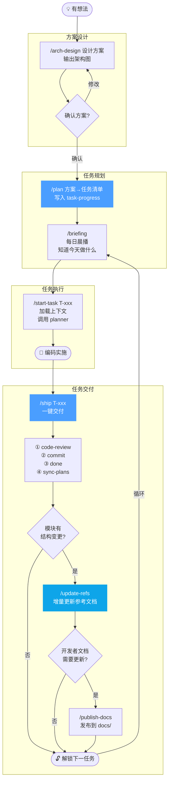

# 工作流命令参考 (Workflows)

> 全部斜杠命令（Slash Commands）说明，覆盖从方案设计到任务交付的完整开发链路。

---

## 完整开发链路



**每日节奏**：`/briefing` → `/start-task` → 编码 → `/ship` → （有变更）`/update-refs` → （需要开发者文档）`/publish-docs` → 次日循环。

---

## /ship 状态机

`/ship` 是核心交付命令，内部运行完整的 Phase Gate 状态机：

```
PLAN → EXECUTE → LINT → REVIEW → COMMIT → DONE → CONTEXT_CLEANUP → ENTROPY_SCAN → KNOWLEDGE_LINT → DOC_GARDENING → PUBLISH_DOCS → CLEAN
```

每个阶段转换前执行 `phase-gate` 硬性检查，`max_retry=2` 超限阻断，`review verdict` 必须 `PASS`（score≥7，blocking_issues=0）。`PUBLISH_DOCS` 是可选阶段，只在开发者文档受影响时发布到 `docs/`。

---

## 命令列表

### 🚀 接入阶段

| 工作流 | 描述 | 使用示例 |
| :--- | :--- | :--- |
| `/configure` | 交互式初始化：项目背景、技术栈、语言规则、架构模式 | `/configure` |
| `/configure-model` | 交互式配置 AI 提供商、模型 ID 和角色分配（支持 Anthropic / OpenAI / Azure / Ollama）| `/configure-model` |
| `/scan-project` | 扫描现有项目，为每个模块自动生成结构化架构参考文档到 `.agent/references/` | `/scan-project` |
| `/migrate-rules` | 将旧配置（如 `.cursorrules`）引导式迁移到新框架 | `/migrate-rules` |

### 📅 日常开发

| 工作流 | 描述 | 使用示例 |
| :--- | :--- | :--- |
| `/briefing` | 每日晨播：当前阶段、活跃任务、知识库健康度、成熟度看板 | `/briefing` |
| `/arch-design` | 引导完成新功能的架构设计，输出方案对比与 Mermaid 架构图 | `/arch-design "用户认证模块"` |
| `/plan` | 方案→任务清单：将确认方案拆解为带 ID/优先级/验收标准的任务条目，写入 `task-progress.md` | `/plan` |
| `/start-task` | 开始执行任务：加载上下文预算、架构预审、委托 planner 制定详细计划 | `/start-task T-001` |
| `/bug-fix` | Bug 分析、定位、修复完整流程 | `/bug-fix "登录按钮无响应"` |

### 📦 任务交付

| 工作流 | 描述 | 使用示例 |
| :--- | :--- | :--- |
| `/ship` | **一键交付**：code-review → commit → done → sync-plans → context-cleanup → entropy-scan 全链路 | `/ship T-001` |
| `/prototype` | 从需求描述生成文档型原型（Mermaid + Anime.js）或 UI 型原型（Pixso MCP），输出 validation-contract | `/prototype "用户登录流程"` |
| `/code-review` | 对当前改动进行代码审查，输出结构化评分和 verdict | `/code-review` |
| `/commit` | 遵循 Conventional Commits，AI 生成提交信息 | `/commit` |
| `/done` | 轻量版完成标记：更新路线图 `[ ]→[x]`，刷新进度百分比 | `/done T-001 T-002` |
| `/update-refs` | 检测变更模块，增量更新 `.agent/references/`，保持知识库与代码同步 | `/update-refs` |
| `/publish-docs` | 将 `.agent/references/` 和已完成架构提案中的知识脱敏发布到 `docs/` | `/publish-docs auth` |

> 对有特殊运行时、设备、桌面端或跨机器验证要求的项目，建议用 `.agent/resources/templates/domain-validation-skill.md` 创建 `.agent/skills/validate-<domain>/SKILL.md`，并在 `validation-contract` 中引用该领域验证证据。

### ⚙️ 高级 / 维护

| 工作流 | 描述 | 使用示例 |
| :--- | :--- | :--- |
| `/parallel` | 并行调度：分析依赖，将互不依赖的任务批量派发给专职 sub-agent | `/parallel T-001 T-002 T-003` |
| `/sync-plans` | 多任务并行时对齐冲突，更新关联任务状态 | `/sync-plans` |
| `/sync-master` | 与默认分支同步：`fetch` + `rebase`（stash 保护），日常同步避免随意 `merge` | `/sync-master` |
| `/agent-update` | 新增或修改 Agent 的规则、工作流或技能 | `/agent-update "新增规则..."` |
| `/weekly-report` | 基于 Git 记录生成周报（简化用法：`/briefing --weekly`）| `/weekly-report` |
| `/briefing --weekly` | 在标准晨播中追加周报内容 | `/briefing --weekly` |

---

## 工作流与 Sub-agent 的关系

大多数工作流由主 AI 编排，在关键节点自动调用专职 Sub-agent：

| 工作流 | 自动调用的 Sub-agent |
|--------|---------------------|
| `/start-task` | `researcher` → `planner` |
| `/ship` | `implementer` → `code-reviewer` → `documenter` |
| `/parallel` | 按依赖图派发到 `implementer` / `researcher` |
| `/code-review` | `code-reviewer` |

> 详见 [Sub-agent 架构](./sub-agents.md)。
