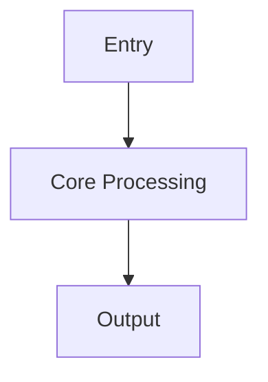

# {Title}

## Overview

{Explain the module, capability, or architecture decision covered by this document in 2-4 sentences.}

## Scope

- Covers: {scope covered by this document}
- Does not cover: {explicit exclusions}

## Key Conclusions

{Put the most important reader-facing conclusions first.}

## Architecture and Flow



## Key Code Paths

| Path | Purpose |
| :--- | :--- |
| `{path}` | {description} |

## Development and Validation

```bash
{command}
```

## Constraints and Notes

- {constraint 1}
- {constraint 2}

## Related Documents

- [{Document Name}](./README.md)
