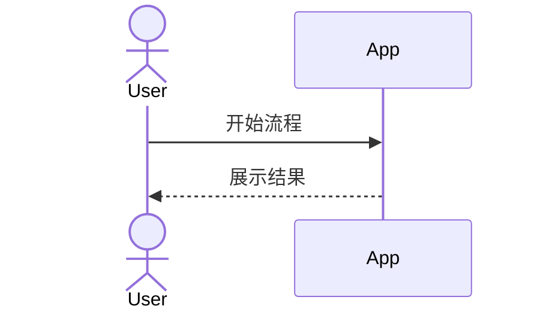
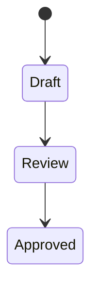

# 流程

## 主流程

```mermaid
sequenceDiagram
    actor User
    participant App
    User->>App: 开始流程
    App-->>User: 展示结果
```

## 状态流

```mermaid
stateDiagram-v2
    [*] --> Draft
    Draft --> Review
    Review --> Approved
```

