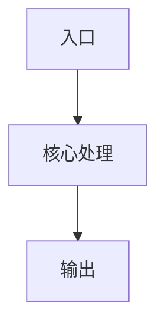

# {标题}

## 概述

{用 2-4 句话说明本文档覆盖的模块、能力或架构决策。}

## 适用范围

- 覆盖：{本文件说明的范围}
- 不覆盖：{明确排除的范围}

## 核心结论

{把读者最需要知道的结论放在前面。}

## 架构与流程



## 关键代码路径

| 路径 | 作用 |
| :--- | :--- |
| `{path}` | {说明} |

## 开发与验证

```bash
{command}
```

## 约束与注意事项

- {约束 1}
- {约束 2}

## 相关文档

- [{文档名称}](./README.md)
